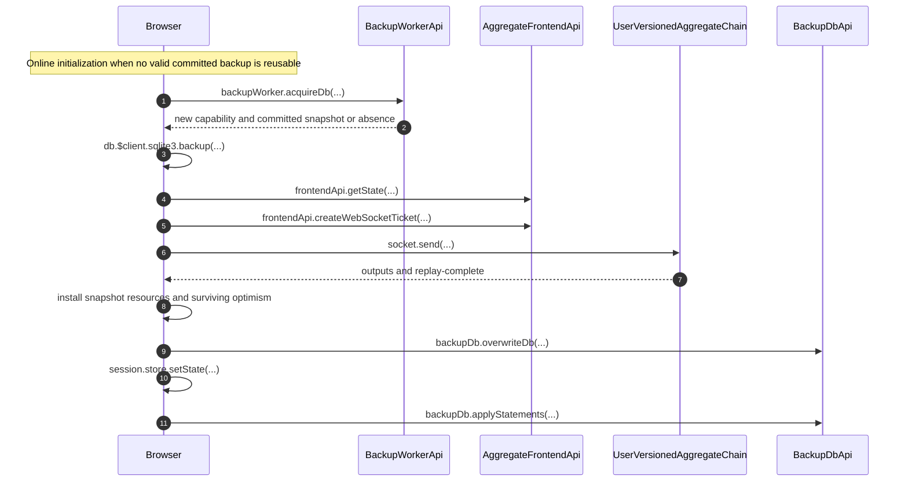

# Main-Thread Frontend Session Bootstrap and Recovery

Each selected frontend keeps one synchronous in-memory SQLite replica and one
mounted session/store. A scoped ownership period owns its revocable backup
capability, recovery loop, finalized-command WebSocket, and aggregate push lane.
The page shares one stable IndexedDB backup-worker connection across these
independent frontends. A real reacquisition restores committed persistence and
renews execution identity without replacing the mounted session.

A validated authentication locator selects existing local persistence before
any server request. Valid committed backup contents can become current locally;
network reconciliation follows asynchronously. The sequence below shows the
online initialization path used when no valid baseline can be reused.

- [`bootstrapAggregateFrontendSession.ts`](../../../packages/frontend/src/bootstrapAggregateFrontendSession.ts) — reads the authentication locator before selecting the backup and recovers online before first publication only when the acquired snapshot is absent or incompatible.
- [`bootstrapServiceFrontendSession.ts`](../../../packages/frontend/src/bootstrapServiceFrontendSession.ts) — restores a valid service baseline without waiting for network recovery.

## Trigger

1. `makeZerospinApp` accepts authored frontend controllers, warms the
   session runtime, and acquires the page backup connection before parallel
   aggregate/service bootstrap.
   - [`makeFrontendController.ts`](../../../packages/core/src/frontendController/makeFrontendController.ts) — retains exact contract/model definitions and requires the aggregate or service version on the controller.
   - [`makeZerospinApp.tsx`](../../../packages/react/src/makeZerospinApp.tsx) — validates configured frontend names and system names, then constructs selectors from the controllers.
   - [`makeZerospinApp.tsx`](../../../packages/react/src/makeZerospinApp.tsx) — retains Core/browser session objects and shares one `backupWorker` among the selected bootstrap procedures.
2. Visible startup, focus, and visible page restoration request ownership.
   Hiding an already current frontend retains ownership; hiding during startup
   prevents that acquisition from publishing current state.
   - [`bootstrapAggregateFrontendSession.ts`](../../../packages/frontend/src/bootstrapAggregateFrontendSession.ts) — installs scoped acquisition signals and waits for the first successful ownership period.
   - [`bootstrapServiceFrontendSession.ts`](../../../packages/frontend/src/bootstrapServiceFrontendSession.ts) — applies the equivalent lifecycle independently to each service frontend.

## Annotated workflow steps

1. The exact backup key is independent of execution ID and app build. The
   worker returns current-owner reuse without triggering a restore.
   - [`makeAggregateFrontendBackupKey.ts`](../../../packages/frontend/src/makeAggregateFrontendBackupKey.ts) — generates the aggregate route from system/user identity, caller-selected aggregate ID, authored names, and the full frontend lock hash.
   - [`acquireDb.ts`](../../../packages/backup-worker/src/BackupWorkerApi/acquireDb/acquireDb.ts) — distinguishes repeated current ownership from a new capability grant.
2. A new owner receives committed backup contents after the previous target is
   revoked and any in-flight SQLite work settles.
   - [`acquireDb.ts`](../../../packages/backup-worker/src/BackupWorkerApi/acquireDb/acquireDb.ts) — revokes before waiting for the serialized export and rechecks the successor before returning.
3. The browser restores into its existing live database, validates the exact
   persisted backup identity, and initializes the new execution metadata.
   Absent/incompatible contents require normal online initialization; offline
   startup fails explicitly when there is no valid backup. Online recovery
   failures retain their original code, message, and cause; a failed command-stream
   connection does not become a request to reset persistence.
   - [`bootstrapAggregateFrontendSession.ts`](../../../packages/frontend/src/bootstrapAggregateFrontendSession.ts) — deserializes committed pages into temporary SQLite and copies them into the retained live connection.
   - [`bootstrapServiceFrontendSession.ts`](../../../packages/frontend/src/bootstrapServiceFrontendSession.ts) — independently validates and restores service persistence.
   - [`frontendPrograms.node.spec.ts`](../../../packages/frontend/src/frontendPrograms.node.spec.ts) — verifies aggregate and service socket-open failures remain connection failures when no reusable backup exists.
4. Online aggregate recovery fetches a consistently captured, durably published
   snapshot containing both `aggregateIndex` and `userIndex`.
   - [`fetchAggregateFrontendState.ts`](../../../packages/frontend/src/fetchAggregateFrontendState.ts) — fetches current published state through a freshly authenticated frontend capability.
   - [`getState.ts`](../../../packages/system-worker/src/UserVersionedAggregateRepo/getState/getState.ts) — captures both indices and awaits publication through the captured frontend position.
5. The browser pins that snapshot's `aggregateVersion` in its WebSocket ticket.
   - [`createAggregateFrontendWebSocketTicket.ts`](../../../packages/frontend/src/createAggregateFrontendWebSocketTicket.ts) — forwards the selected aggregate version alongside the exact admitted frontend target.
6. The socket resumes strictly after the snapshot `userIndex`; this cursor
   is independent of the consumed aggregate watermark.
   - [`bootstrapAggregateFrontendSession.ts`](../../../packages/frontend/src/bootstrapAggregateFrontendSession.ts) — sends the captured frontend resume position and buffers outputs until replay completes.
7. The retained stream returns contiguous output plus its replay watermark.
   - [`onMessage.ts`](../../../packages/system-worker/src/UserVersionedAggregateChain/onMessage/onMessage.ts) — samples the retained tip and sends replay pages through that boundary.
8. The browser replaces authoritative resources and removes optimism only for
   requested complete command resolutions, then reapplies unresolved journal occurrences.
   - [`applyAggregateFrontendStateTx.ts`](../../../packages/core/src/session/applyAggregateFrontendStateTx.ts) — commits resource replacement and both indices together while preserving surviving optimism.
   - [`applyAggregateFrontendCommandTx.ts`](../../../packages/core/src/session/applyAggregateFrontendCommandTx.ts) — resolves optimism through the complete originating command rather than rewriting occurrence provenance.
9. Before publishing a first online baseline, the browser waits for the full
   live snapshot to replace the absent or incompatible shared backup.
   - [`bootstrapAggregateFrontendSession.ts`](../../../packages/frontend/src/bootstrapAggregateFrontendSession.ts) — awaits `repairBackup` before publishing an ownership period initialized without a reusable baseline.
   - [`overwriteDb.ts`](../../../packages/backup-worker/src/BackupDbApi/overwriteDb/overwriteDb.ts) — checks current ownership inside the SQLite semaphore and awaits the snapshot copy into persistent backup storage.
10. After restoration and persistence succeed, the bootstrap publishes the new
    execution ID and current state on the original store. Repeated current-owner
    signals preserve the existing ID, live contents, and pending backup FIFO.
    - [`bootstrapAggregateFrontendSession.ts`](../../../packages/frontend/src/bootstrapAggregateFrontendSession.ts) — publishes only a still-valid acquired period and invalidates restored live-query tables.
    - [`makeAggregateSession.ts`](../../../packages/core/src/session/makeAggregateSession.ts) — reads the current execution ID from state and captures it synchronously for command construction and journal metadata.
    - [`makeServiceSession.ts`](../../../packages/core/src/serviceSession/makeServiceSession.ts) — exposes the equivalent live service session ID getter.
11. New commits flow through the current capability's ordered backup queue.
    Reusable backups persist renewal metadata before publication, then accept
    subsequent commits through the same queue.
    - [`bootstrapAggregateFrontendSession.ts`](../../../packages/frontend/src/bootstrapAggregateFrontendSession.ts) — establishes initial backup persistence and then sends one committed SQL batch at a time.
    - [`applyStatements.ts`](../../../packages/backup-worker/src/BackupDbApi/applyStatements/applyStatements.ts) — checks ownership inside the serialized SQLite turn and rolls back unsuccessful batches.

## Revocation, repair, and resume

Revocation makes only the affected frontend non-current, closes its socket,
interrupts its ownership scope, and disposes the old capability. The mounted
session and live database remain available. Subsequent visible acquisition
restores shared persistence and starts a new period; old callbacks check their
period before publishing. Push controls read the current period when invoked.

- [`bootstrapAggregateFrontendSession.ts`](../../../packages/frontend/src/bootstrapAggregateFrontendSession.ts) — binds callbacks, push controls, socket cleanup, and backup capture to the active acquisition period.
- [`bootstrapServiceFrontendSession.ts`](../../../packages/frontend/src/bootstrapServiceFrontendSession.ts) — pauses and resumes the service independently of aggregate ownership.
- [`makeZerospinApp.tsx`](../../../packages/react/src/makeZerospinApp.tsx) — updates DevTools registrations on identity changes and removes the captured registered ID on teardown.

Typed mutation uncertainty repairs only a still-current backup capability:
later commits are diverted while a complete live snapshot replaces uncertain
backup state. Worker death instead invalidates the page connection and restores
the last committed IndexedDB baseline on reacquisition. Undelivered local work
may be lost; uncertain SQL is never replayed automatically.

- [`acquireBackupWorker.ts`](../../../packages/backup-worker/src/acquireBackupWorker/acquireBackupWorker.ts) — distinguishes connection generation loss from individual capability revocation.
- [`bootstrapAggregateFrontendSession.ts`](../../../packages/frontend/src/bootstrapAggregateFrontendSession.ts) — handles backup-only snapshot repair separately from worker-loss acquisition.

## Guard layer lifetime

Each mounted Provider creates one managed runtime from its application layer
and framework defaults. Sessions share application instances; frontend-local
layers initialize in session scopes using those services. Local overrides stay
within their session. Initialization completes before synchronous
`makeAggregateSession` construction and publication. The constructor borrows the
runtime and initialized guards; it owns no resource acquisition or disposal.

Backup reacquisition retains the same session and local services. Changing
aggregate targets releases the old sessions and initializes new local services
against the same Provider runtime. Cleanup marks each session released before
closing its local scope, then disposes the application runtime after session
cleanup. Failed initialization is never published. Mock Providers also clean up
partial acquisition, late completion after unmount, and normal unmount.

- [`initializeGuards.ts`](../../../packages/core/src/guards/initializeGuards.ts) — acquires and binds a fresh local context before exposing guard execution.
- [`makeAggregateSession.ts`](../../../packages/core/src/session/makeAggregateSession.ts) — uses the borrowed runtime and initialized guards, rejecting commands after release.
- [`makeZerospinApp.tsx`](../../../packages/react/src/makeZerospinApp.tsx) — retains a runtime per Provider and closes session scopes before runtime disposal.
- [`mock.ts`](../../../packages/react/src/mock.ts) — owns application, layer, and database resources for the mount.
- [`makeZerospinAppDevtools.react.spec.tsx`](../../../packages/react/src/makeZerospinAppDevtools.react.spec.tsx) — verifies sharing, remount isolation, publication gating, replacement, and cleanup after partial initialization failure.

## Service sessions

Service recovery retains its own published snapshot, version-pinned socket,
and `serviceIndex`. Its backup ownership follows the same contract and does
not introduce aggregate command optimism.

- [`bootstrapServiceFrontendSession.ts`](../../../packages/frontend/src/bootstrapServiceFrontendSession.ts) — owns service snapshot, replay, repair, revocation, and reacquisition.

## Verification

- [`makeAggregateSession.node.spec.ts`](../../../packages/core/src/session/makeAggregateSession.node.spec.ts) — verifies fresh execution indexing with unchanged earlier journal rows and rejection while superseded.
- [`makeWaSqliteDrizzle.node.spec.ts`](../../../packages/core/src/drizzle/makeWaSqliteDrizzle.node.spec.ts) — verifies explicit restored-table invalidation permits synchronous same-client reads without duplicate notifications.
- [`makeZerospinAppDevtools.react.spec.tsx`](../../../packages/react/src/makeZerospinAppDevtools.react.spec.tsx) — checks stable mounted sessions, renewed browser IDs, retained controls, and registration cleanup.
- [`frontendPrograms.node.spec.ts`](../../../packages/frontend/src/frontendPrograms.node.spec.ts) — exercises domain recovery against a real main-thread session database.

## Callers

- [Frontend WebSocket delivery](./FrontendWebSocket.md)
- [Aggregate submission](./PushSequence.md)
- [IndexedDB backup coordination](./IndexedDbBackupCoordination.md)
