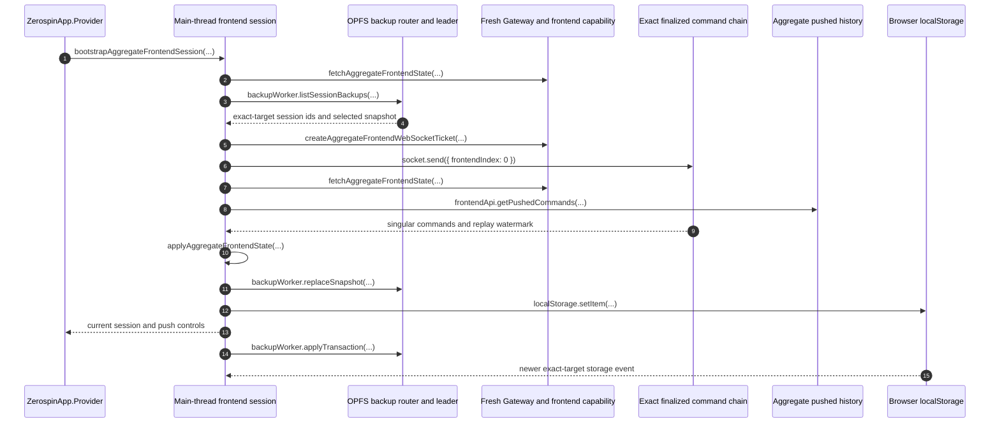

# Main-Thread Frontend Session Bootstrap and Recovery

Each selected frontend owns one in-memory wa-sqlite database, recovery loop,
finalized-command WebSocket, and aggregate push lane on the browser main
thread. The page owns one narrow OPFS SharedWorker connection used only to copy
SQLite baselines and committed SQL into per-session backup files. That
SharedWorker is a mediator; one Web-Lock-elected dedicated Worker owns
synchronous wa-sqlite and OPFS for the emitted worker graph.

- [`makeZerospinApp.tsx:245-389`](../../../packages/react/src/makeZerospinApp.tsx#L245-L389) — acquires one page backup port, initializes aggregate and service sessions in parallel, and publishes them only after both return.
- [`bootstrapAggregateFrontendSession.ts:72-115`](../../../packages/frontend/src/bootstrapAggregateFrontendSession.ts#L72-L115) — defines the aggregate bootstrap result and its main-thread dependencies.
- [`acquireOpfsBackupWorker.ts:16-42`](../../../packages/opfs-backup-worker/src/acquireOpfsBackupWorker/acquireOpfsBackupWorker.ts#L16-L42) — exposes only snapshot, committed-transaction, close, list, and delete operations.
- [`opfsBackupWorker.entry.ts:45-64`](../../../packages/opfs-backup-worker/src/opfsBackupWorker.entry.ts#L45-L64) — registers each page with the SharedWorker mediator and assigns its router target a numeric client ID.
- [`opfsBackupLeader.entry.ts:14-27`](../../../packages/opfs-backup-worker/src/opfsBackupLeader.entry.ts#L14-L27) — initializes synchronous wa-sqlite and `OPFSCoopSyncVFS` only in the elected dedicated Worker.

Aggregate recovery subscribes from `frontendIndex: 0`, fetches current state,
pulls complete pushed history over fresh HTTP-batch sessions, validates the
socket replay watermark, then installs authoritative state, unresolved pushes,
and surviving local `sessionIndex` occurrences. Service recovery uses the same
socket-first discipline without pushed or local command history.

## Trigger

1. `ZerospinApp.Provider` calls `bootstrapAggregateFrontendSession(...)` or
   `bootstrapServiceFrontendSession(...)` with one new Core session and the
   page-owned backup interface.
   - [`makeZerospinApp.tsx:292-313`](../../../packages/react/src/makeZerospinApp.tsx#L292-L313) — invokes aggregate bootstrap with the exact aggregate target.
   - [`makeZerospinApp.tsx:364-382`](../../../packages/react/src/makeZerospinApp.tsx#L364-L382) — invokes service bootstrap independently.

## Annotated workflow steps

1. Provider creates one main-thread Core session and invokes the matching
   bootstrap with the exact frontend target and one shared page backup port.
   - [`makeZerospinApp.tsx:247-313`](../../../packages/react/src/makeZerospinApp.tsx#L247-L313) — creates and bootstraps the aggregate session inside parallel initialization.
2. Bootstrap performs a fresh authenticated state fetch. A terminal failure
   aborts; a transient failure may continue only with a valid exact
   authentication locator and selected backup.
   - [`bootstrapAggregateFrontendSession.ts:193-281`](../../../packages/frontend/src/bootstrapAggregateFrontendSession.ts#L193-L281) — establishes online identity or validates the offline locator.
   - [`bootstrapServiceFrontendSession.ts:130-216`](../../../packages/frontend/src/bootstrapServiceFrontendSession.ts#L130-L216) — applies the same service identity rule.
3. The main thread lists backup files under the exact backup key and reads the
   locator-selected session id.
   - [`bootstrapAggregateFrontendSession.ts:282-320`](../../../packages/frontend/src/bootstrapAggregateFrontendSession.ts#L282-L320) — validates the selected aggregate session id and lists its exact namespace.
   - [`bootstrapServiceFrontendSession.ts:217-246`](../../../packages/frontend/src/bootstrapServiceFrontendSession.ts#L217-L246) — reads the service namespace.
4. The dedicated backup leader exports the selected snapshot through the
   mediator, and the main thread restores it into the new in-memory database.
   Aggregate bootstrap also opens non-selected files, retains their unresolved
   complete commands by old session, and refuses offline startup while any
   exist.
   - [`bootstrapAggregateFrontendSession.ts:321-471`](../../../packages/frontend/src/bootstrapAggregateFrontendSession.ts#L321-L471) — restores the selected file and inspects old aggregate journals.
   - [`bootstrapServiceFrontendSession.ts:247-306`](../../../packages/frontend/src/bootstrapServiceFrontendSession.ts#L247-L306) — restores the selected service snapshot.
   - [`exportSnapshot.ts:81-139`](../../../packages/opfs-backup-worker/src/OpfsBackupLeader/exportSnapshot/exportSnapshot.ts#L81-L139) — copies OPFS into temporary memory SQLite and serializes the memory database.
5. Online recovery obtains a fresh one-use ticket for the exact finalized
   chain.
   - [`bootstrapAggregateFrontendSession.ts:474-492`](../../../packages/frontend/src/bootstrapAggregateFrontendSession.ts#L474-L492) — starts the serialized aggregate recovery and requests its ticket.
   - [`bootstrapServiceFrontendSession.ts:308-323`](../../../packages/frontend/src/bootstrapServiceFrontendSession.ts#L308-L323) — starts service recovery equivalently.
6. The new per-session socket subscribes from zero before state or pushed
   history is fetched, buffering every singular finalized occurrence until the
   replay watermark arrives.
   - [`bootstrapAggregateFrontendSession.ts:493-540`](../../../packages/frontend/src/bootstrapAggregateFrontendSession.ts#L493-L540) — installs aggregate open, message, state-required, and premature-close handling.
   - [`bootstrapServiceFrontendSession.ts:324-373`](../../../packages/frontend/src/bootstrapServiceFrontendSession.ts#L324-L373) — installs the service replay buffer.
7. After any old aggregate commands are pushed, recovery performs a second
   fresh state fetch so its frontiers describe the same recovery attempt.
   - [`bootstrapAggregateFrontendSession.ts:542-569`](../../../packages/frontend/src/bootstrapAggregateFrontendSession.ts#L542-L569) — pushes old-session commands before refetching aggregate state.
   - [`bootstrapServiceFrontendSession.ts:374-383`](../../../packages/frontend/src/bootstrapServiceFrontendSession.ts#L374-L383) — refetches service state after subscription.
8. Aggregate recovery pulls complete pushed pages through the captured tip;
   the pushed chain remains an HTTP RPC source rather than a WebSocket.
   - [`bootstrapAggregateFrontendSession.ts:570-602`](../../../packages/frontend/src/bootstrapAggregateFrontendSession.ts#L570-L602) — pages pushed history and disposes every fresh RPC session.
   - [`getCommands.ts:11-75`](../../../packages/system-worker/src/AggregateFrontendPushedCommandChain/getCommands/getCommands.ts#L11-L75) — returns contiguous terminal pushed pages.
9. The socket replay must contain exactly contiguous commands `1..watermark`,
   reach at least the state frontier, and agree with resolved push membership.
   - [`bootstrapAggregateFrontendSession.ts:603-654`](../../../packages/frontend/src/bootstrapAggregateFrontendSession.ts#L603-L654) — decodes, sorts, and validates aggregate replay and resolved origins.
   - [`bootstrapServiceFrontendSession.ts:384-421`](../../../packages/frontend/src/bootstrapServiceFrontendSession.ts#L384-L421) — validates service replay and watermark.
10. Core replaces the aggregate database from authoritative resources and full
    pushed history, preserves surviving local session occurrences, then applies
    socket commands newer than the fetched state. Service installs its state
    and newer socket commands directly.
   - [`bootstrapAggregateFrontendSession.ts:655-677`](../../../packages/frontend/src/bootstrapAggregateFrontendSession.ts#L655-L677) — applies aggregate state and the buffered suffix.
    - [`applyAggregateFrontendState.ts:69-351`](../../../packages/core/src/session/applyAggregateFrontendState.ts#L69-L351) — validates and reconstructs authoritative, pushed, and local aggregate layers.
   - [`bootstrapServiceFrontendSession.ts:422-444`](../../../packages/frontend/src/bootstrapServiceFrontendSession.ts#L422-L444) — applies service state and buffered finalized commands.
11. Before publishing the session, the main thread serializes the full database
    and waits for OPFS `replaceSnapshot(...)` acknowledgement while committed
    transactions are already being queued.
    - [`bootstrapAggregateFrontendSession.ts:787-812`](../../../packages/frontend/src/bootstrapAggregateFrontendSession.ts#L787-L812) — enables capture before serializing and acknowledging the aggregate baseline through the mediator and dedicated leader.
    - [`bootstrapServiceFrontendSession.ts:543-568`](../../../packages/frontend/src/bootstrapServiceFrontendSession.ts#L543-L568) — applies the same baseline race boundary to service state.
12. Only after baseline acknowledgement does bootstrap publish the exact
    session locator and mark the store `current`; older acknowledged aggregate
    files and closed non-current service files are then removed.
    - [`bootstrapAggregateFrontendSession.ts:892-935`](../../../packages/frontend/src/bootstrapAggregateFrontendSession.ts#L892-L935) — publishes aggregate state and garbage-collects resolved old files.
    - [`bootstrapServiceFrontendSession.ts:650-683`](../../../packages/frontend/src/bootstrapServiceFrontendSession.ts#L650-L683) — publishes service state and removes non-current files.
13. Provider receives `{ systemId, userId }` plus aggregate push controls,
    verifies every selected session returned the same pair, then atomically
    publishes the registry.
    - [`makeZerospinApp.tsx:419-451`](../../../packages/react/src/makeZerospinApp.tsx#L419-L451) — checks exact identity equality and publishes all selected sessions together.
14. Each committed outer SQLite transaction is copied to OPFS in FIFO order.
    An apply failure diverts new commits, replaces a full current snapshot once,
    and then requeues every commit made during repair; backup failure does not
    stop the live session.
    - [`WaSqliteSession.ts:345-383`](../../../packages/core/src/drizzle/WaSqliteSession.ts#L345-L383) — reports only a successfully committed outer transaction.
    - [`bootstrapAggregateFrontendSession.ts:813-888`](../../../packages/frontend/src/bootstrapAggregateFrontendSession.ts#L813-L888) — routes aggregate apply through the mediator and rebaselines only this session after typed uncertainty or another apply failure.
    - [`bootstrapServiceFrontendSession.ts:569-648`](../../../packages/frontend/src/bootstrapServiceFrontendSession.ts#L569-L648) — performs the independent service backup lane.
15. A newer exact-target locator event marks the old session `superseded`,
    closes its socket, stops command admission, and reloads only a visible page;
    a hidden page reloads when shown. Transient socket close or browser `online`
    runs the same subscribe-before-state recovery and then rebaselines OPFS.
    - [`bootstrapAggregateFrontendSession.ts:1035-1160`](../../../packages/frontend/src/bootstrapAggregateFrontendSession.ts#L1035-L1160) — retries reconnect and rebaselines without losing concurrent commits.
    - [`bootstrapAggregateFrontendSession.ts:1165-1200`](../../../packages/frontend/src/bootstrapAggregateFrontendSession.ts#L1165-L1200) — enforces supersession and visibility reload.
    - [`bootstrapServiceFrontendSession.ts:685-852`](../../../packages/frontend/src/bootstrapServiceFrontendSession.ts#L685-L852) — applies the equivalent service reconnect, rebaseline, supersession, and visibility behavior.

Scope release closes the session socket and OPFS claim, closes in-memory
SQLite, and marks both session and backup state `released`.

- [`bootstrapAggregateFrontendSession.ts:155-190`](../../../packages/frontend/src/bootstrapAggregateFrontendSession.ts#L155-L190) — owns aggregate finalization ordering.
- [`bootstrapServiceFrontendSession.ts:97-128`](../../../packages/frontend/src/bootstrapServiceFrontendSession.ts#L97-L128) — owns service finalization ordering.

## Callers

- [Direct exact frontend authentication](./Authentication.md)
- [Frontend WebSocket](./FrontendWebSocket.md)
- [Aggregate frontend push](./PushSequence.md)
- [OPFS backup coordination](./OpfsBackupCoordination.md)
- [Architecture overview](../../overview.md)
