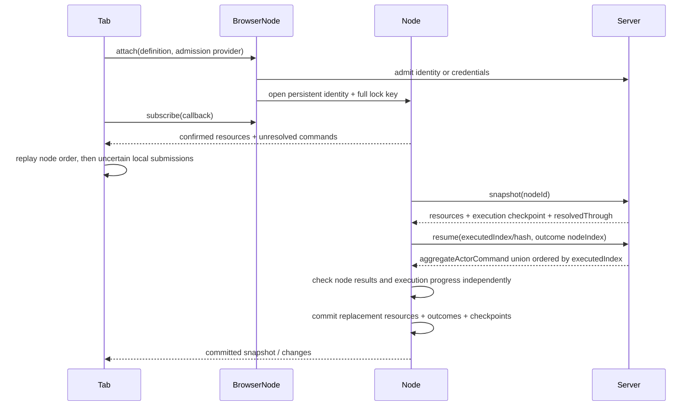

# Durable browser session bootstrap and recovery

Synchronized aggregate and service sessions attach to a durable `Node` in one
origin-relative SharedWorker. Each tab owns its application runtime, executable
contracts, synchronous SQLite view, and optimistic replay. Several tabs can
attach to the same node. A tab's disposal detaches its capability.

## Trigger

`makeSession` and `useInitializeSession` accept `{ identity }` for direct actors
or `{ getCredentials }` for verified actors. Applications serve `nodeWorkerPlugin()` from
`@zerospin/browser/vite`. Non-Vite hosts must serve the built worker and async
WASM at `/__zerospin/node-worker.js` and `/__zerospin/node-sqlite.wasm`.

- [`makeSession.ts`](../../../packages/browser/src/makeSession/makeSession.ts) owns the tab runtime and explicit `clearAuthentication()` operation.
- [`nodeWorkerPlugin.ts`](../../../packages/browser/src/nodeWorkerPlugin.ts) serves stable worker assets in development and production.

```mermaid
sequenceDiagram
  participant Tab
  participant BrowserNode
  participant Node
  participant Server
  Tab->>BrowserNode: attach(definition, admission provider)
  BrowserNode->>Server: admit identity or credentials
  BrowserNode->>Node: open persistent identity + full lock key
  Tab->>BrowserNode: subscribe(callback)
  Node-->>Tab: confirmed resources + unresolved commands
  Tab->>Tab: replay node order, then uncertain local submissions
  Node->>Server: snapshot(nodeId)
  Server-->>Node: resources + execution checkpoint + resolvedThrough
  Node->>Server: resume(executedIndex/hash, outcome nodeIndex)
  Server-->>Node: aggregateActorCommand union ordered by executedIndex
  Node->>Node: check node results and execution progress independently
  Node->>Node: commit replacement resources + outcomes + checkpoints
  Node-->>Tab: committed snapshot / changes
```

## Annotated workflow steps

1. Initial server admission selects a key containing backend, system, full
   encoded identity, target, and complete definition-lock hash. The catalog may
   reopen the last admitted node on a transient outage. Direct sessions must
   match the identity captured at initialization; explicit server rejection
   does not select an offline identity.
   - [`NodeHost.ts`](../../../packages/browser/src/Node/NodeHost.ts)
   - [`NodeCatalog.ts`](../../../packages/browser/src/Node/NodeCatalog.ts)
2. Snapshot capture and subscriber registration share one serialized database
   operation. Callback delivery happens outside that boundary. A slow subscriber
   receives a resnapshot signal when its bounded queue overflows.
   - [`Node.ts`](../../../packages/browser/src/Node/Node.ts)
   - [`subscribe.ts`](../../../packages/browser/src/BrowserNode/subscribe/subscribe.ts)
3. Tabs install confirmed resources and only unresolved commands. Local optimism
   replays by node order, followed by uncertain local submissions in submission
   order. Completed history stays in the node and is queried by page in DevTools.
   Unresolved journal rows set `actorDelta` to null and encode the complete row
   through `sessionRepoDbConfig.tables.commands`; staged data stays on `staging.stagedDelta`.
   - [`bootstrapAggregateSession.ts`](../../../packages/browser/src/bootstrapAggregateSession.ts)
   - [`bootstrapServiceSession.ts`](../../../packages/browser/src/bootstrapServiceSession.ts)
4. Recovery keeps the previous consistent state until outcomes through the
   snapshot watermark are retained. One transaction installs resources, outcomes,
   and checkpoints. Historical outcomes fill command history without reapplying
   `actorDelta`. The same `receiveCommand` handler validates owned duplicates and
   applies later executions with missing owned results atomically. It rejects
   execution beyond the snapshot while required results are missing. Native node JSON columns remain Drizzle-managed; the node does
   not use the session table codec.
   - [`Node.ts`](../../../packages/browser/src/Node/Node.ts)
   - [`NodeSynchronization.ts`](../../../packages/browser/src/Node/NodeSynchronization.ts)
5. Worker loss reconnects with a fresh local snapshot and retries uncertain IDs.
   Focus, visible restoration, and network restoration request synchronization.
   Background execution requires a live host; committed work survives its loss.
   - [`connectBrowserNode.ts`](../../../packages/browser/src/connectBrowserNode.ts)

Standalone sessions keep their separate [backup coordination](./IndexedDbBackupCoordination.md).
Changed fixed server and retained standalone journal schemas require empty
development storage. Nonempty node databases with a version before 3 fail with
`node-storage-reset-required` before renamed columns are read; neither the
catalog nor the node deletes that storage automatically.

## Retained command results and cutover

Only successful staging creates `ISessionCommand`. Failed staging returns its
structured error, rolls back local mutations, and consumes no session or node index.
A retained command owns successful `staging` plus `admission` and `execution` results.
Standalone and mock sessions use `skipped/local-only` for both server operations.

A durable admission rejection publishes a snapshot immediately. The tab rebuilds its
view from confirmed resources and replays the remaining unresolved commands; it does
not apply subscription events directly to its database. The receipt does not advance
resource or outcome checkpoints. Ordered actor output still resolves that position.
Complete tab journal rows use `sessionRepoDbConfig.tables.commands.encodeRow`; node
rows retain native Drizzle JSON values and their existing timestamp representation.

Node storage uses `user_version = 4`. Nonempty incompatible storage raises
`node-storage-reset-required` before reading changed columns. Catalog entries and node
identity remain intact. Changed server and standalone journal schemas require empty
storage; no automatic deletion or compatibility decoder is provided.

Server-side AAVR staging uses a separate derived optimistic database for actor
guards and automation reads. Browser snapshot resources and their execution cursor
come from authoritative AAVR rows; pending server operations are not included.
