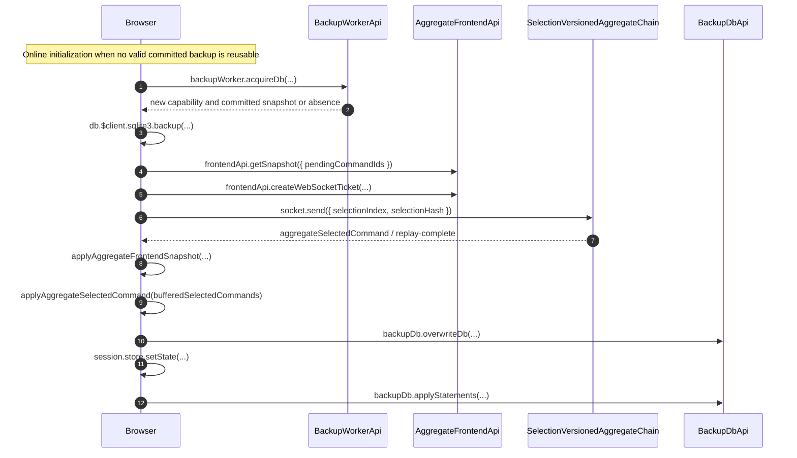

# Main-Thread Frontend Session Bootstrap and Recovery

Each selected frontend keeps one synchronous in-memory SQLite replica and one
mounted session/store. A scoped ownership period owns its revocable backup
capability, recovery loop, selected-command WebSocket, and aggregate push lane on that same live socket.
The application runtime shares one stable IndexedDB backup-worker connection
across these independent frontends. A real reacquisition restores committed persistence and
renews execution identity without replacing the mounted session.

A validated authentication locator selects existing local persistence before
any server request. Valid committed backup contents can become current locally;
network reconciliation follows asynchronously. The sequence below shows the
online initialization path used when no valid baseline can be reused.

- [`bootstrapAggregateFrontendSession.ts`](../../../packages/frontend/src/bootstrapAggregateFrontendSession.ts) — reads the authentication locator before selecting the backup and recovers online before first publication only when the acquired snapshot is absent or incompatible.
- [`bootstrapServiceFrontendSession.ts`](../../../packages/frontend/src/bootstrapServiceFrontendSession.ts) — restores a valid service baseline without waiting for network recovery.

## Trigger

1. `makeRuntime({ layer })` owns the shared application runtime and its
   `BrowserBackup` Layer. The first live or standalone session claim lazily
   acquires the SharedWorker connection in that runtime's scope.
   Unbound
   `makeAggregateFrontend(props)` and `makeServiceFrontend(props)` construct
   authored frontend definitions without Providers. `makeSession({ frontend,
   runtime, layer?, systemName })` creates a stable session
   synchronously; `session.initialize` / `useInitializeSession` acquire
   resources and gate children. Concurrent sessions share runtime and backup;
   each session owns its scoped backup-key claim, local layer, and bootstrap.
   Aggregate authentication supplies the aggregate ID.
   - [`makeAggregateFrontend.ts`](../../../packages/react/src/makeAggregateFrontend/makeAggregateFrontend.ts) — validates and constructs the aggregate frontend directly, retaining exact contract/model definitions and its selected version.
   - [`makeServiceFrontend.ts`](../../../packages/react/src/makeServiceFrontend/makeServiceFrontend.ts) — validates and constructs the service frontend directly, retaining authoritative models and its selected version.
   - [`makeRuntime.ts`](../../../packages/react/src/makeRuntime/makeRuntime.ts) — owns the caller-shared ManagedRuntime and installs its browser-backup Layer without a system binding.
   - [`BrowserBackup.ts`](../../../packages/react/src/BrowserBackup/BrowserBackup.ts) — caches lazy SharedWorker acquisition in the runtime scope and releases each key claim with its session scope.
   - [`makeSession.ts`](../../../packages/react/src/makeSession/makeSession.ts) — constructs the session store synchronously and initializes bootstrap under explicit ownership.
2. Visible startup, focus, and visible page restoration request ownership.
   Hiding an already current frontend retains ownership; hiding during startup
   prevents that acquisition from publishing current state.
   - [`bootstrapAggregateFrontendSession.ts`](../../../packages/frontend/src/bootstrapAggregateFrontendSession.ts) — installs scoped acquisition signals and waits for the first successful ownership period.
   - [`bootstrapServiceFrontendSession.ts`](../../../packages/frontend/src/bootstrapServiceFrontendSession.ts) — applies the equivalent lifecycle independently to each service frontend.

```mermaid
sequenceDiagram
  participant Browser
  participant BackupWorkerApi
  participant AggregateFrontendApi
  participant SelectionVersionedAggregateChain
  participant BackupDbApi
  Note over Browser: Online initialization when no valid committed backup is reusable
  autonumber 1
  Browser->>BackupWorkerApi: backupWorker.acquireDb(...)
  autonumber 2
  BackupWorkerApi-->>Browser: new capability and committed snapshot or absence
  autonumber 3
  Browser->>Browser: db.$client.sqlite3.backup(...)
  autonumber 4
  Browser->>AggregateFrontendApi: frontendApi.getSnapshot({ pendingCommandIds })
  autonumber 5
  Browser->>AggregateFrontendApi: frontendApi.createWebSocketTicket(...)
  autonumber 6
  Browser->>SelectionVersionedAggregateChain: socket.send({ selectionIndex, selectionHash })
  autonumber 7
  SelectionVersionedAggregateChain-->>Browser: aggregateSelectedCommand / replay-complete
  autonumber 8
  Browser->>Browser: applyAggregateFrontendSnapshot(...)
  autonumber 9
  Browser->>Browser: applyAggregateSelectedCommand(bufferedSelectedCommands)
  autonumber 10
  Browser->>BackupDbApi: backupDb.overwriteDb(...)
  autonumber 11
  Browser->>Browser: session.store.setState(...)
  autonumber 12
  Browser->>BackupDbApi: backupDb.applyStatements(...)
```

## Annotated workflow steps

1. The exact backup key is independent of execution ID and app build. The
   worker returns current-owner reuse without triggering a restore.
   - [`makeAggregateFrontendBackupKey.ts`](../../../packages/frontend/src/makeAggregateFrontendBackupKey.ts) — generates the aggregate route from the authentication hash, caller-selected aggregate ID, authored aggregate/version/frontend names, and the full frontend lock hash; `systemId` is not part of the browser backup identity.
   - [`acquireDb.ts`](../../../packages/backup-worker/src/BackupWorkerApi/acquireDb/acquireDb.ts) — distinguishes repeated current ownership from a new capability grant.
2. A new owner receives committed backup contents after the previous target is
   revoked and any in-flight SQLite work settles.
   - [`acquireDb.ts`](../../../packages/backup-worker/src/BackupWorkerApi/acquireDb/acquireDb.ts) — revokes before waiting for the serialized export and rechecks the successor before returning.
3. The browser restores into its existing live database, validates the exact
   persisted backup identity, and initializes the new execution metadata.
   Absent/incompatible contents require normal online initialization; offline
   startup fails explicitly when there is no valid backup. Online recovery
   failures retain their original code, message, and cause; a failed command-stream
   connection does not become a request to reset persistence.
   - [`bootstrapAggregateFrontendSession.ts`](../../../packages/frontend/src/bootstrapAggregateFrontendSession.ts) — deserializes committed pages into temporary SQLite and copies them into the retained live connection.
   - [`bootstrapServiceFrontendSession.ts`](../../../packages/frontend/src/bootstrapServiceFrontendSession.ts) — independently validates and restores service persistence.
   - [`frontendPrograms.node.spec.ts`](../../../packages/frontend/src/frontendPrograms.node.spec.ts) — verifies aggregate and service socket-open failures remain connection failures when no reusable backup exists.
4. Online aggregate recovery fetches a consistently captured, durably published
   snapshot containing both `aggregateIndex` and `selectionIndex`.
   The request supplies `pendingCommandIds` from locally restored commands that
   still own optimistic mutation rows.
   - [`fetchAggregateFrontendSnapshot.ts`](../../../packages/frontend/src/fetchAggregateFrontendSnapshot.ts) — fetches the published snapshot through a freshly authenticated frontend capability and sends `pendingCommandIds`.
   - [`getSnapshot.ts`](../../../packages/system-worker/src/SelectionVersionedAggregateRepo/getSnapshot/getSnapshot.ts) — captures both indices, awaits publication through the captured selection position, and returns exact-owner selected commands through that cursor.
5. The browser pins that snapshot's `aggregateVersion` in its WebSocket ticket.
   - [`createAggregateFrontendWebSocketTicket.ts`](../../../packages/frontend/src/createAggregateFrontendWebSocketTicket.ts) — forwards the selected aggregate version alongside the exact admitted frontend target.
6. The socket resumes strictly after the snapshot `selectionIndex`; this cursor
   is independent of the consumed aggregate watermark.
   - [`bootstrapAggregateFrontendSession.ts`](../../../packages/frontend/src/bootstrapAggregateFrontendSession.ts) — sends the captured frontend resume position and buffers outputs until replay completes.
7. The retained stream returns contiguous `aggregateSelectedCommand` envelopes
   and then `replay-complete`; the browser buffers every command until the replay
   watermark is validated.
   - [`onMessage.ts`](../../../packages/system-worker/src/SelectionVersionedAggregateChain/onMessage/onMessage.ts) — samples the retained tip and sends replay pages through that boundary.
8. The browser installs `snapshot.resources` and uses
   `snapshot.selectedCommands` only to complete matching journal rows, remove
   their optimism, and record their outcomes. Their deltas are not reapplied.
   - [`applyAggregateFrontendSnapshotTx.ts`](../../../packages/core/src/session/applyAggregateFrontendSnapshotTx.ts) — atomically replaces authoritative resources, records matching selected commands, and preserves unmatched optimism.
9. After snapshot installation, the browser applies
   `bufferedSelectedCommands` contiguously before switching the same socket to
   direct live delivery.
   - [`bootstrapAggregateFrontendSession.ts`](../../../packages/frontend/src/bootstrapAggregateFrontendSession.ts) — validates the buffered replay and applies each selected command strictly after the installed snapshot cursor.
   - [`applyAggregateSelectedCommandTx.ts`](../../../packages/core/src/session/applyAggregateSelectedCommandTx.ts) — completes a matching journal row by opaque command ID while applying only live/replayed selected deltas.
10. Before publishing a first online baseline, the browser waits for the full
   live snapshot to replace the absent or incompatible shared backup.
   - [`bootstrapAggregateFrontendSession.ts`](../../../packages/frontend/src/bootstrapAggregateFrontendSession.ts) — awaits `repairBackup` before publishing an ownership period initialized without a reusable baseline.
   - [`overwriteDb.ts`](../../../packages/backup-worker/src/BackupDbApi/overwriteDb/overwriteDb.ts) — checks current ownership inside the SQLite semaphore and awaits the snapshot copy into persistent backup storage.
11. After restoration and persistence succeed, the bootstrap publishes the new
    execution ID and current state on the original store. Repeated current-owner
    signals preserve the existing ID, live contents, and pending backup FIFO.
    - [`bootstrapAggregateFrontendSession.ts`](../../../packages/frontend/src/bootstrapAggregateFrontendSession.ts) — publishes only a still-valid acquired period and invalidates restored live-query tables.
    - [`makeAggregateSession.ts`](../../../packages/core/src/session/makeAggregateSession.ts) — reads the current execution ID from state and captures it synchronously for command construction and journal metadata.
    - [`makeServiceSession.ts`](../../../packages/core/src/serviceSession/makeServiceSession.ts) — exposes the equivalent live service session ID getter.
12. New commits flow through the current capability's ordered backup queue.
    Reusable backups persist renewal metadata before publication, then accept
    subsequent commits through the same queue.
    - [`bootstrapAggregateFrontendSession.ts`](../../../packages/frontend/src/bootstrapAggregateFrontendSession.ts) — establishes initial backup persistence and then sends one committed SQL batch at a time.
    - [`applyStatements.ts`](../../../packages/backup-worker/src/BackupDbApi/applyStatements/applyStatements.ts) — checks ownership inside the serialized SQLite turn and rolls back unsuccessful batches.

## Revocation, repair, and resume

Revocation makes only the affected frontend non-current, closes its socket,
interrupts its ownership scope, and disposes the old capability. The mounted
session and live database remain available. Subsequent visible acquisition
restores shared persistence and starts a new period; old callbacks check their
period before publishing. Push controls read the current period when invoked.

- [`bootstrapAggregateFrontendSession.ts`](../../../packages/frontend/src/bootstrapAggregateFrontendSession.ts) — binds callbacks, push controls, socket cleanup, and backup capture to the active acquisition period.
- [`bootstrapServiceFrontendSession.ts`](../../../packages/frontend/src/bootstrapServiceFrontendSession.ts) — pauses and resumes the service independently of aggregate ownership.
- [`makeSession.ts`](../../../packages/react/src/makeSession/makeSession.ts) — updates DevTools registrations on identity changes and removes the captured registered ID on teardown.

Typed mutation uncertainty repairs only a still-current backup capability:
later commits are diverted while a complete live snapshot replaces uncertain
backup state. Worker death instead invalidates the page connection and restores
the last committed IndexedDB baseline on reacquisition. Undelivered local work
may be lost; uncertain SQL is never replayed automatically.

- [`acquireBackupWorker.ts`](../../../packages/backup-worker/src/acquireBackupWorker/acquireBackupWorker.ts) — distinguishes connection generation loss from individual capability revocation.
- [`bootstrapAggregateFrontendSession.ts`](../../../packages/frontend/src/bootstrapAggregateFrontendSession.ts) — handles backup-only snapshot repair separately from worker-loss acquisition.

## Guard layer lifetime

`makeRuntime` creates one managed runtime from the application layer and
framework defaults. Sessions share that runtime; session-local layers
initialize in session scopes using those services. Local overrides stay
within their session. Guard and layer acquisition complete during
`session.initialize` before publishing readiness. `makeAggregateSession`
constructs the store synchronously without resources; execution bindings are
set before readiness and cleared during disposal.

Backup reacquisition retains the same session and local services. Changing
identity requires an explicit session dispose/reinitialize. Signer callback
refresh alone does not replace the session. Cleanup marks each session released
before closing its local scope; the caller disposes backup after sessions, then
runtime after session cleanup. Failed initialization is never published.
`makeMockSession` also cleans up partial acquisition, late completion, and
normal disposal.

- [`initializeGuards.ts`](../../../packages/core/src/guards/initializeGuards.ts) — acquires and binds a fresh local context before exposing guard execution.
- [`makeAggregateSession.ts`](../../../packages/core/src/session/makeAggregateSession.ts) — uses bound runtime and guards; `stageCommand` rejects while unbound or after release.
- [`makeRuntime.ts`](../../../packages/react/src/makeRuntime/makeRuntime.ts) — retains a caller-owned runtime independent of session lifetimes.
- [`makeMockSession.ts`](../../../packages/react/src/makeMockSession/makeMockSession.ts) — owns layer and database resources for the mock session lifetime.
- [`loadDevtools.react.spec.tsx`](../../../packages/react/src/loadDevtools.react.spec.tsx) — verifies DevTools load/open/dispose independent of sessions.
- [`makeMockSession.react.spec.tsx`](../../../packages/react/src/makeMockSession.react.spec.tsx) — verifies sharing, remount isolation, publication gating, replacement, and cleanup after partial initialization failure.

## Service sessions

Service recovery retains its own published snapshot, version-pinned socket,
and `serviceIndex`. Its backup ownership follows the same contract and does
not introduce aggregate command optimism.

- [`bootstrapServiceFrontendSession.ts`](../../../packages/frontend/src/bootstrapServiceFrontendSession.ts) — owns service snapshot, replay, repair, revocation, and reacquisition.

## Verification

- [`makeAggregateSession.node.spec.ts`](../../../packages/core/src/session/makeAggregateSession.node.spec.ts) — verifies fresh execution indexing with unchanged earlier journal rows and rejection while superseded.
- [`makeWaSqliteDrizzle.node.spec.ts`](../../../packages/core/src/drizzle/makeWaSqliteDrizzle.node.spec.ts) — verifies explicit restored-table invalidation permits synchronous same-client reads without duplicate notifications.
- [`loadDevtools.react.spec.tsx`](../../../packages/react/src/loadDevtools.react.spec.tsx) — checks DevTools load/open/dispose and registration cleanup.
- [`frontendPrograms.node.spec.ts`](../../../packages/frontend/src/frontendPrograms.node.spec.ts) — exercises domain recovery against a real main-thread session database.

## Callers

- [Frontend WebSocket delivery](./FrontendWebSocket.md)
- [Aggregate submission](./PushSequence.md)
- [IndexedDB backup coordination](./IndexedDbBackupCoordination.md)

Aggregate submission begins only after exact checkpoint validation, replay, and
live-handler installation. The retained live socket is the admission gate.
Socket close fails the pending receipt, stops the push lane, and queues serialized
recovery; a browser online event can request recovery but cannot permit a send.
Manual pause leaves selected delivery and an already pending receipt active.

- [`bootstrapAggregateFrontendSession.ts`](../../../packages/frontend/src/bootstrapAggregateFrontendSession.ts) — retains one live socket per ownership period and shares its handler between selected output and admission receipts.
