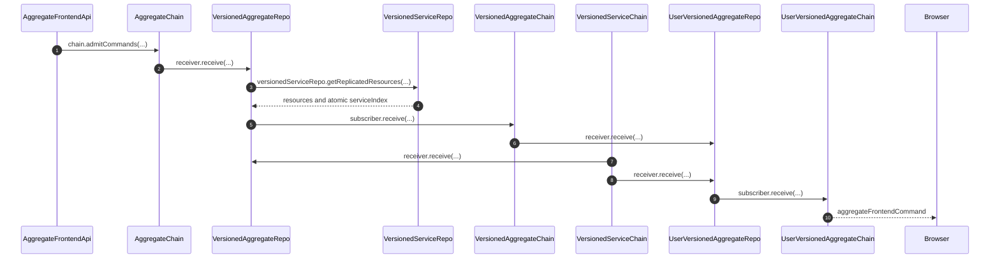
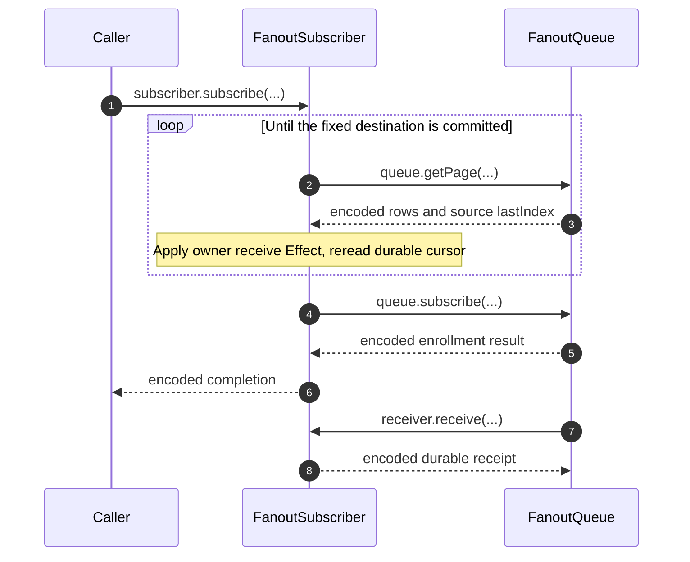

# Command Chains and Materialization

The aggregate path is AC → VAR → VAC → UVAR → UVAC → browser. VAR and UVAR also consume the service histories pinned by their aggregate definition. UVAR combines those sources into one user stream with its own output index.

## Trigger

1. The frontend capability submits the complete local occurrence. AC assigns an aggregate position and returns an admission receipt.
   - [`pushCommand.ts`](../../../packages/system-worker/src/AggregateFrontendApi/pushCommand/pushCommand.ts) — Validates the capability-bound input and returns the assigned index and command ID.

## Annotated workflow steps

1. The frontend capability submits the complete local occurrence. AC assigns an aggregate position and returns an admission receipt.
   - [`pushCommand.ts`](../../../packages/system-worker/src/AggregateFrontendApi/pushCommand/pushCommand.ts) — Validates the capability-bound input and returns the assigned index and command ID.
2. AC fanout delivers bounded aggregate admission pages to registered aggregate materializers.
   - [`AggregateChain.ts`](../../../packages/system-worker/src/AggregateChain/AggregateChain.ts) — Binds the VAR repo lookup and excludes invalidated subscribers.
   - [`makeFanoutQueue.ts`](../../../packages/system-worker/src/makeFanoutQueue/makeFanoutQueue.ts) — Resolves the named subscriber capability, sends complete rows, and persists the delivered page's last index after successful receipt.
3. VAR evaluates the contract mutations and reads requested replicas from the aggregate snapshot's pinned service materializer before opening a SQLite transaction.
   - [`getReplicatedResources.ts`](../../../packages/system-worker/src/VersionedAggregateRepo/getReplicatedResources/getReplicatedResources.ts) — Selects the authored service version, reads initial copies, and closes a new resource's gap to committed source progress using retained VSC history.
4. The source materializer returns resources and one position read under its execution permit. VAR installs effective copies and their source positions in the command savepoint before existing guards query that transaction; rejection rolls them back.
   - [`getReplicatedResources.ts`](../../../packages/system-worker/src/VersionedServiceRepo/getReplicatedResources/getReplicatedResources.ts) — Reads the resources and source position atomically after service catch-up.
   - [`executeCommandsTx.ts`](../../../packages/system-worker/src/VersionedAggregateRepo/executeCommands/executeCommandsTx.ts) — Retains a newer enrolled copy, runs guards against provisional replicas, and applies aggregate-owned mutations afterward.
5. VAR publishes complete terminal entries through its `executedCommands` outbox. Successful replication mutations include the effective resource, service version, and source position.
   - [`receiveExecutedCommands.ts`](../../../packages/system-worker/src/VersionedAggregateChain/receiveExecutedCommands/receiveExecutedCommands.ts) — Checks version, aggregate identity, duplicate bytes, contiguous position, and rolling disposition hash before retaining history.
6. VAC fans terminal aggregate entries to UVAR. Initial service copies come from these mutations; UVAR closes a new enrollment's missing retained suffix before committing if its source cursor is already ahead.
   - [`execute.ts`](../../../packages/system-worker/src/UserVersionedAggregateRepo/execute/execute.ts) and [`executeTx.ts`](../../../packages/system-worker/src/UserVersionedAggregateRepo/execute/executeTx.ts) — Prepares bounded late enrollment outside the transaction and replays successful aggregate mutations without programs or guards.
7. The pinned VSC independently sends complete service entries to VAR. Only enrolled resources change; failed and unrelated occurrences still advance the service cursor without creating VAC entries.
   - [`VersionedAggregateRepo.ts`](../../../packages/system-worker/src/VersionedAggregateRepo/VersionedAggregateRepo.ts) and [`receiveServiceCommandsTx.ts`](../../../packages/system-worker/src/VersionedAggregateRepo/receiveServiceCommandsTx.ts) — Validates and commits source delivery under the same execution permit used for aggregate commands.
8. VSC also sends complete entries to UVAR. It serializes both input streams and commits each occurrence's graph, source progress, and outgoing delta together.
   - [`UserVersionedAggregateRepo.ts`](../../../packages/system-worker/src/UserVersionedAggregateRepo/UserVersionedAggregateRepo.ts) — Binds the direct source subscriber and shared execution permit.
9. UVAR publishes one output per consumed occurrence, including empty deltas. `userIndex` advances; service-only outputs retain `aggregateIndex` and have no resolution.
   - [`executeTx.ts`](../../../packages/system-worker/src/UserVersionedAggregateRepo/execute/executeTx.ts) — Stores the graph and delta outbox row in the source application transaction.
10. UVAC retains each contiguous frontend output before broadcasting it. Reconnect replay uses the same durable output order.
    - [`receiveDeltas.ts`](../../../packages/system-worker/src/UserVersionedAggregateChain/receiveDeltas/receiveDeltas.ts) — Validates frontend positions and aggregate watermarks before exact-byte retention and broadcast.

## Atomic batch admission

AC validates each input's aggregate fields and encodes the complete occurrence before opening one synchronous transaction for the request. Inside that transaction, it compares duplicate bytes, assigns positions to new commands in input order, and returns one receipt per submitted input. Identical duplicates reuse their original receipt, including repeats within the same batch. Empty input returns immediately. Any conflict or insertion failure rolls back every new row from that batch; previously committed history remains intact.

- [`admitCommands.ts`](../../../packages/system-worker/src/AggregateChain/admitCommands/admitCommands.ts) and [`admitCommandsTx.ts`](../../../packages/system-worker/src/AggregateChain/admitCommands/admitCommandsTx.ts) — Separates whole-batch validation from the named `admitCommandsTx` program and preserves admission error codes.
- [`aggregateChainDbConfig.ts`](../../../packages/system-worker/src/AggregateChain/aggregateChainDbConfig.ts) — Declares the typed database service and its separate static `Tx` service beside the physical schema.
- [`makeTx.ts`](../../../packages/core/src/drizzle/makeTx.ts) — Provides the active transaction through the database-owned service and synchronously rolls back failed programs.
- [`admitCommands.node.spec.ts`](../../../packages/system-worker/src/AggregateChain/admitCommands/admitCommands.node.spec.ts) — Tests whole-batch rollback, invalid later inputs, identical and conflicting retries, and gap-free retry after rollback.

> CONTRADICTION: Earlier admission documentation described a committed prefix after a later input failed. Batch admission now commits all new rows together; only earlier successful requests remain deliverable after a failed batch.

## Identity and ownership

AC uses `{ systemId, aggregateId, aggregateName }`. Worker configuration supplies `systemId`; direct command callers supply the aggregate fields, while frontend APIs bind those fields after admission checks. VAR and VAC add `aggregateVersion`, selected explicitly for execution or from the deployed aggregate definitions for destination enrollment. UVAR and UVAC add `userId`, supplied by authentication. Their complete shared key is `{ systemId, aggregateId, aggregateName, aggregateVersion, userId }`. Frontend names and locks belong to admitted capabilities and connections. Snapshot tickets retain that exact versioned UVAC name.

- [`aggregateChainFixedDORepoConfig.ts`](../../../packages/system-worker/src/AggregateChain/aggregateChainFixedDORepoConfig.ts) — Defines the unversioned admitted-chain name.
- [`VersionedAggregateRepo.ts`](../../../packages/system-worker/src/VersionedAggregateRepo/VersionedAggregateRepo.ts) — Defines version-owned execution identity.
- [`userVersionedAggregateRepoFixedDORepoConfig.ts`](../../../packages/system-worker/src/UserVersionedAggregateRepo/userVersionedAggregateRepoFixedDORepoConfig.ts) — Defines the five-field shared user replica name.

AC retains inputs only. VAR keeps terminal entries pending publication; VAC owns retained execution history after outbox deletion. VAR and UVAR retain one `services.lastIndex` per declared service. Replica-model rows and tombstones establish resource membership and retain their own `serviceIndex`. UVAR also owns the preceding projected graph, both progress indices and pending output. UVAC owns browser output history. There is no downstream frontend materializer or server optimism.

- [`versionedAggregateRepoDbConfig.ts`](../../../packages/system-worker/src/VersionedAggregateRepo/versionedAggregateRepoDbConfig.ts) — Results are an outbox alongside resource state and the durable head.
- [`userVersionedAggregateRepoDbConfig.ts`](../../../packages/system-worker/src/UserVersionedAggregateRepo/userVersionedAggregateRepoDbConfig.ts) — Defines projection state, source cursors, and the delivery outbox.

## Deployed destination enrollment

AC activation reads its aggregate's versions from the executing bundle, retains
the command-delivery alarm, and atomically reconciles active VAR destinations.
Existing cursors and failures survive; versions missing from the bundle become
inactive. This requires no SystemRepo publication or subscription.

- [`onDOActivation.ts`](../../../packages/system-worker/src/AggregateChain/onDOActivation/onDOActivation.ts) — Reconciles deployed membership from `system.aggregates`.

Command delivery or direct calls activate VARs. Empty command histories leave
supported VARs unopened.

- [`aggregateMembership.workerd.spec.ts`](../../../packages/system-worker/src/aggregateMembership.workerd.spec.ts) — Exercises retained command delivery, cold activation, and unopened empty-history destinations.

## Cutover and retries

AC activation adopts `config.aggregates[aggregateName].canonical` as durable
`desiredBaseAggregateVersion`; a new chain also initializes `baseAggregateVersion`
to that value. Existing chains retain the applied base. A configuration-only deployment
leaves the authored System spec unchanged. The inherited alarm runs the local
cutover Effect; activation do not compare materializers or promote
existing chains. Service cutover remains manual.

- [`onDOActivation.ts`](../../../packages/system-worker/src/AggregateChain/onDOActivation/onDOActivation.ts) — holds recovery before atomically adopting intent and awaiting subscription.
- [`AggregateChain.ts`](../../../packages/system-worker/src/AggregateChain/AggregateChain.ts) — registers lazy cutover recovery with the common alarm dispatcher.
- [`makeSystemSpec.ts`](../../../packages/core/src/system/makeSystemSpec.ts) — serializes authored definitions independently of configuration settings.

Equal applied and desired versions settle locally. A destination that is not numerically
newer records a blocked diagnostic; an invalidated candidate retains its reason. These
branches release the cutover lease without materializer lookup, including
on repeated unrelated alarms. Eligible work rechecks intent,
and requires supported enrolled versions. Missing enrollment remains a recovery failure.

- [`cutover.ts`](../../../packages/system-worker/src/AggregateChain/cutover/cutover.ts) — conditionally writes serialized diagnostics against the sampled applied/desired pair.
- [`getCutoverSubscriberRows.ts`](../../../packages/system-worker/src/AggregateChain/cutover/getCutoverSubscriberRows.ts) — validates enrolled base and candidate versions.
- [`isSemVerOlder.ts`](../../../packages/core/src/utils/isSemVerOlder.ts) — compares numeric major/minor/patch, independently of discovery or configuration order.

An empty chain promotes after local candidate checks without resolving a VAR. Otherwise,
AC samples the last admitted index `n` and command ID and flushes base and desired VARs
concurrently. Both results must identify that exact occurrence; matching disposition hashes
allow promotion and divergence invalidates the candidate. Admissions continue during remote
comparison. Both commit transactions recheck applied and desired versions and candidate
existence/invalidation; superseded work changes neither candidate state nor diagnostics.
Skipped configurations require no intermediate promotions.

- [`cutover.ts`](../../../packages/system-worker/src/AggregateChain/cutover/cutover.ts) — samples retained admission history and compares exact durable checkpoints.
- [`commitPromotionTx.ts`](../../../packages/system-worker/src/AggregateChain/cutover/commitPromotionTx.ts) — atomically updates the applied base and clears the current-intent failure.
- [`commitInvalidatedCandidateTx.ts`](../../../packages/system-worker/src/AggregateChain/cutover/commitInvalidatedCandidateTx.ts) — atomically retains candidate invalidation and its chain diagnostic.

Transport, protocol, persistence failures, and interruption retain recovery. Diagnostic
persistence is conditional on both sampled versions; its own failure cannot replace the
operation failure. The lease releases only for applied, promoted, blocked, or invalidated
intent. Recovery after a promotion commit completes through equality. Direct execution and
frontend base selection continue reading only the applied base; direct retries recover that
version's committed result from VAR or VAC.

- [`cutover.node.spec.ts`](../../../packages/system-worker/src/AggregateChain/cutover/cutover.node.spec.ts) — exercises suspended flushes, conditional diagnostics, transaction rollback, interrupted recovery, and settled retries.
- [`executeAggregateCommand.ts`](../../../packages/system-worker/src/AggregateChain/executeAggregateCommand/executeAggregateCommand.ts) — selects the applied base for every request, including duplicate commands.
- [`getBaseAggregateVersion.ts`](../../../packages/system-worker/src/AggregateChain/getBaseAggregateVersion/getBaseAggregateVersion.ts) — returns the applied base without exposing desired intent as execution authority.

## Fanout scheduling and terminal failures

Owners supply explicit `db`, `schema`, subscriber and entries table names, and a numeric index column. The factory owns ascending 64-row paging: `afterIndex` is exclusive and optional `maxIndex` is inclusive. Each response preserves complete rows and reports the whole table's `lastIndex`, independently of the page bound. AC uses `aggregateIndex`, SAC uses `fanoutIndex`, and both finalized chains use `outboxIndex`. These four chains expose history through their queue capabilities; result recovery and resource repair use the same `getPage` contract.

- [`makeFanoutQueue.ts`](../../../packages/system-worker/src/makeFanoutQueue/makeFanoutQueue.ts) — Selects bounded complete rows and reads the whole-log maximum separately.
- [`makeFanoutQueue.node.spec.ts`](../../../packages/system-worker/src/makeFanoutQueue/makeFanoutQueue.node.spec.ts) — Verifies all three index column names, empty history, bounded pages, and the complete log tip.
- [`execute.ts`](../../../packages/system-worker/src/VersionedAggregateRepo/execute/execute.ts) — Recovers the exact terminal aggregate occurrence through the finalized chain's replica queue.
- [`getReplicatedResources.ts`](../../../packages/system-worker/src/VersionedAggregateRepo/getReplicatedResources/getReplicatedResources.ts) — Reads bounded replica history from the finalized service chain's replica queue.

Each local `drain(): Promise<void>` starts the queue's Effect immediately through `managedRuntime`, with `AsyncLive` supplied by the factory. The Effect reads the entries table's persisted tip and raises the queue's in-memory upper bound before acquiring the drain lock, so another call can extend delivery already in progress. The factory observes rejection internally and returns the original Promise: callers may ignore it without an unhandled rejection or await delivery completion and failure. AC admission uses `drainAfter(() => admitCommands(...))`: recovery is scheduled before synchronous admission, and delivery runs through the alarm. Service admission and aggregate finalized-command receipt use the same alarm-driven scheduling contract. Direct aggregate execution and service finalized-result publication retain their immediate drains. The fanout factory registers its internal drain Effect with the inherited alarm registry. The common Repo alarm dispatches registered recovery independently; neither owners nor the factory need `waitUntil` for fanout.

- [`makeFanoutQueue.ts`](../../../packages/system-worker/src/makeFanoutQueue/makeFanoutQueue.ts) — Reads the persisted entries tip before waiting for the shared drain permit.
- [`makeFanoutQueue.ts`](../../../packages/system-worker/src/makeFanoutQueue/makeFanoutQueue.ts) — Starts the Effect and observes background rejection without changing the returned Promise.
- [`makeFanoutQueue.node.spec.ts`](../../../packages/system-worker/src/makeFanoutQueue/makeFanoutQueue.node.spec.ts) — Lets ignored delivery fail without an unhandled rejection and then observes rejection by awaiting the original Promise.
- [`makeFanoutQueue.node.spec.ts`](../../../packages/system-worker/src/makeFanoutQueue/makeFanoutQueue.node.spec.ts) — Appends rows during blocked delivery and confirms another drain call extends the active attempt.
- [`AggregateChain.ts`](../../../packages/system-worker/src/AggregateChain/AggregateChain.ts) — Uses queue-owned drainAfter for admission; direct execution retains its pre-write alarm and immediate-drain finalizer.
- [`AggregateChain.node.spec.ts`](../../../packages/system-worker/src/AggregateChain/AggregateChain.node.spec.ts) — Tests nonblocking admission, no delivery of a rolled-back batch, and continued delivery of previously committed work after admission failure.
- [`makeAlarmRegistry.ts`](../../../packages/system-worker/src/makeAlarmRegistry/makeAlarmRegistry.ts) — Awaits all registered recovery Effects before reporting their combined failure causes.

Subscriber queries select the oldest unfailed rows behind that bound and exclude pending IDs before applying the caller's concurrency limit. Optional `subscribersWhere` supplies a tuple of additional AND predicates, with undefined entries ignored. AC and SAC use it to exclude invalidated materializers without advancing their cursors. Individual completions refill slots; a subscriber with another page may be selected again in the same drain.

- [`makeFanoutQueue.ts`](../../../packages/system-worker/src/makeFanoutQueue/makeFanoutQueue.ts) — Combines owner predicates with persisted failure, progress, and pending identity filters before ordering and limiting the query.
- [`AggregateChain.ts`](../../../packages/system-worker/src/AggregateChain/AggregateChain.ts) — Supplies `invalidatedAt IS NULL` as the aggregate materializer subscriber predicate.
- [`ServiceAdmittedChain.ts`](../../../packages/system-worker/src/ServiceAdmittedChain/ServiceAdmittedChain.ts) — Supplies the same invalidation predicate for service materializers.
- [`makeFanoutQueue.node.spec.ts`](../../../packages/system-worker/src/makeFanoutQueue/makeFanoutQueue.node.spec.ts) — Verifies multiple predicates and terminal failure exclusion before a one-subscriber page limit, leaving excluded cursors unchanged.
- [`makeFanoutQueue.ts`](../../../packages/system-worker/src/makeFanoutQueue/makeFanoutQueue.ts) — Refills scoped deliveries and reuses or refetches the suffix that covers each selected cursor.
- [`makeFanoutQueue.node.spec.ts`](../../../packages/system-worker/src/makeFanoutQueue/makeFanoutQueue.node.spec.ts) — Keeps one slow subscriber pending while another advances through complete pages.

Invalidation excludes pushed fanout. Explicit VAR execution can still pull
retained AC history, while its invalidated destination remains excluded from
pushes. Whether invalidation should also stop explicit pull execution remains
a separate policy question in `TODOS.md`.

- [`execute.ts`](../../../packages/system-worker/src/VersionedAggregateRepo/execute/execute.ts) — Performs explicit AC catch-up through the requested command index.
- [`makeFanoutSubscriber.ts`](../../../packages/system-worker/src/makeFanoutSubscriber/makeFanoutSubscriber.ts) — Performs catch-up before the source subscription call.
- [`TODOS.md`](../../../TODOS.md) — Tracks the future invalidation policy decision without changing cutover behavior here.

Each owner supplies the receiver class's inherited `Repo.getRepo` static as `getRepo`. The shared lookup captures its namespace binding and formats the supplied key when its Effect runs. The factory parses the persisted subscriber name, passes that receiver key unchanged to the lookup, and invokes `${name}Subscriber(sourceKey)` with the queue owner's key. `receive({ rows, lastIndex })` preserves every complete row. `lastIndex` reports the source's committed deliverable tip when the page was read; it can exceed the page tail and remains paired with the cached page. Encoded successful receipt acknowledges only the last delivered row's index. Receivers tolerate committed-prefix redelivery if interruption occurs before that cursor write.

- [`makeFanoutQueue.ts`](../../../packages/system-worker/src/makeFanoutQueue/makeFanoutQueue.ts) — Owns lookup, capability resolution, receipt decoding, and the complete-page cursor write inside the delivery failure boundary.

The queue persists lookup, delivery, decoding, and acknowledgement-write errors or defects as terminal `failure`. Failed subscribers remain excluded after cold activation and cannot be re-enrolled to clear the error. Outbox delivery retains its own retry policy. Interrupted attempts without a persisted failure resume from durable progress.

- [`makeFanoutQueue.ts`](../../../packages/system-worker/src/makeFanoutQueue/makeFanoutQueue.ts) — Persists terminal subscriber failure before settling delivery and aborts if that persistence fails.
- [`makeFanoutQueue.node.spec.ts`](../../../packages/system-worker/src/makeFanoutQueue/makeFanoutQueue.node.spec.ts) — Reconstructs a queue and verifies failure survives both another drain and rejected re-enrollment.

An empty suffix pauses source delivery until another drain call rereads the persisted tip. Enrollment holds the recovery alarm before committing and, on success, starts `drain()` after committing its independent local enrollment transaction. A cold subscription discovers retained rows immediately without waiting for an owner-supplied index or an alarm. Interrupting a caller waiting for drain completion does not cancel the queue-owned delivery; recovery after queue interruption still starts from durable progress.

- [`makeFanoutQueue.ts`](../../../packages/system-worker/src/makeFanoutQueue/makeFanoutQueue.ts) — Retains the alarm before enrollment and starts delivery after its local transaction, without acquiring the drain permit.
- [`makeFanoutQueue.node.spec.ts`](../../../packages/system-worker/src/makeFanoutQueue/makeFanoutQueue.node.spec.ts) — Starts delivery of retained rows from a cold subscription without an owner drain call.
- [`makeFanoutQueue.node.spec.ts`](../../../packages/system-worker/src/makeFanoutQueue/makeFanoutQueue.node.spec.ts) — Starts delivery before any caller awaits it, interrupts a waiting caller, and still commits the delivery cursor.

## Service delivery and failure boundaries

`SystemApi.admitServiceCommand` returns `{ commandId, serviceIndex }` after durable input retention, without waiting for execution. ServiceAdmittedChain uses drainAfter to schedule its materializer alarm before synchronous admission; delivery runs through the alarm. Identical retries recover the original receipt; conflicting input bytes fail admission.

- [`admitServiceCommand.ts`](../../../packages/system-worker/src/ServiceAdmittedChain/admitServiceCommand/admitServiceCommand.ts) — Retains or recovers the input position and returns its receipt.
- [`ServiceAdmittedChain.ts`](../../../packages/system-worker/src/ServiceAdmittedChain/ServiceAdmittedChain.ts) — Holds the durable alarm and schedules fanout independently of the admission response.
- [`serviceExecution.workerd.spec.ts`](../../../packages/system-worker/src/serviceExecution.workerd.spec.ts) — Observes fanout publication without directly executing the materializer and checks receipt recovery after cold activation.

ServiceAdmittedChain admits service commands and feeds registered service materializers. VAR and UVAR subscribe directly to the VSC selected by their aggregate service pins; changing SAC’s base does not switch those consumers. Standalone service frontend delivery retains FVSR. Aggregate domain rejection advances one position after rolling back that command; infrastructure failure aborts the execution page. No transaction spans an RPC. Internal fanout and outbox progress do not depend on browser connections.

- [`VersionedServiceChain.ts`](../../../packages/system-worker/src/VersionedServiceChain/VersionedServiceChain.ts) — Owns separate typed fanout queues for VAR, UVAR, and FVSR.
- [`VersionedServiceRepo.ts`](../../../packages/system-worker/src/VersionedServiceRepo/VersionedServiceRepo.ts) — Uses the bound subscriber to replay and enroll a pinned version during activation; resource reads catch up without re-enrollment.
- [`executeCommandsTx.ts`](../../../packages/system-worker/src/VersionedAggregateRepo/executeCommands/executeCommandsTx.ts) — Separates per-command savepoints from the page transaction.
- [`makeOutboxQueue.ts`](../../../packages/system-worker/src/makeOutboxQueue/makeOutboxQueue.ts) — Serializes bounded SQL delivery, exact-page acknowledgements, retry metadata, and queue-specific alarm leases.

## Subscription and snapshot recovery

Each subscriber target binds exactly one source queue and reads its receiver's durable cursor. `catchup(index?)` uses the caller's destination or captures the first page's `lastIndex`; later page tips cannot extend that destination. `subscribe(index?)` completes bounded catch-up before enrolling the resulting cursor for live delivery. Pulled and pushed pages execute the same owner receive Effect.

## Annotated workflow steps

1. The owner calls subscriber.subscribe() during activation and awaits bounded catch-up followed by enrollment. A supplied destination already covered by durable progress needs no page request.
   - [`makeFanoutSubscriber.ts`](../../../packages/system-worker/src/makeFanoutSubscriber/makeFanoutSubscriber.ts) — Validates the destination and reads the receiver's committed cursor before resolving the source queue.
2. Pages begin after the committed cursor and carry a fixed `maxIndex` once a destination is known. Paging takes no source drain lock.
   - [`makeFanoutSubscriber.ts`](../../../packages/system-worker/src/makeFanoutSubscriber/makeFanoutSubscriber.ts) — Supplies the existing cursor and optional fixed destination to `queue.getPage`.
   - [`makeFanoutQueue.ts`](../../../packages/system-worker/src/makeFanoutQueue/makeFanoutQueue.ts) — Runs the factory's bounded table reader without acquiring the drain lock.
3. The first response fixes an omitted destination; the owner receive Effect commits each page, and a fresh cursor read accounts for overlapping push delivery. Empty history at zero succeeds. Invalid tips, missing pages below the destination, and a receipt that makes no progress fail.
   - [`makeFanoutSubscriber.ts`](../../../packages/system-worker/src/makeFanoutSubscriber/makeFanoutSubscriber.ts) — Validates the source tip, applies rows, and checks durable progress before another request.
4. After catch-up, the subscriber rereads durable progress and submits its enrollment key and cursor to the source. No receiver execution permit spans this request.
   - [`makeFanoutSubscriber.ts`](../../../packages/system-worker/src/makeFanoutSubscriber/makeFanoutSubscriber.ts) — Calls the existing source enrollment RPC after catch-up and a final cursor read.
5. The source atomically enrolls independently of the drain semaphore, preserves terminal failures, and advances cursors monotonically. It holds the queue alarm before commit and starts a drain without awaiting delivery. This permits a cold receiver to subscribe back while source delivery awaits its activation.
   - [`makeFanoutQueue.ts`](../../../packages/system-worker/src/makeFanoutQueue/makeFanoutQueue.ts) — Commits enrollment without the delivery semaphore, then starts the drain and returns its encoded result.
6. The subscriber completes only after the enrollment response succeeds.
   - [`makeFanoutSubscriber.ts`](../../../packages/system-worker/src/makeFanoutSubscriber/makeFanoutSubscriber.ts) — Decodes source enrollment before encoding successful subscription completion.
7. Retained rows appended between catch-up and enrollment remain eligible after the registered cursor. The source invokes the source-bound accessor and delivers a complete envelope.
   - [`makeFanoutQueue.ts`](../../../packages/system-worker/src/makeFanoutQueue/makeFanoutQueue.ts) — Resolves the receiver using its persisted key, binds the queue owner key, and sends that delivery's rows and tip.
8. Successful receipt advances source acknowledgement to the delivered row tail. A failure leaves delivery progress unchanged and enters the queue's existing terminal failure path.
   - [`makeFanoutQueue.ts`](../../../packages/system-worker/src/makeFanoutQueue/makeFanoutQueue.ts) — Decodes receipt, persists the delivered cursor, and records delivery failures.

VAR and UVAR initialize every declared service source during activation. Each target binds `{ systemId, serviceName, serviceVersion }`: `systemId` comes from the physical Repo key; the service name/version come from `aggregate.services` on the snapshot selected by `aggregateName` and `aggregateVersion`. Missing source rows start at cursor zero; existing cursors survive reactivation. Activation catches up and subscribes each source without an execution permit or database transaction spanning RPCs. Later commands enroll resources, not services, and do not rewind feed cursors.

- [`onDOActivation.ts`](../../../packages/system-worker/src/VersionedAggregateRepo/onDOActivation/onDOActivation.ts) — Declares all pinned VAR sources before catch-up and enrollment.
- [`onDOActivation.ts`](../../../packages/system-worker/src/UserVersionedAggregateRepo/onDOActivation/onDOActivation.ts) — Declares service sources, subscribes finalized aggregate history, then subscribes the service feeds.
- [`sourceReplay.node.spec.ts`](../../../packages/system-worker/src/UserVersionedAggregateRepo/execute/sourceReplay.node.spec.ts) — Preserves late-resource replay behind an already advanced source cursor.

Snapshots capture the graph and both indices under execution exclusivity. After releasing that permit they await UVAC publication through the captured user position, then reconcile only requested outstanding command IDs from retained UVAC entries through that position. Full resolutions are restricted to the requesting frontend.

- [`getState.ts`](../../../packages/system-worker/src/UserVersionedAggregateRepo/getState/getState.ts) — Captures a coherent view and waits for its captured delta publication before returning.

## Verification

- [`onDOActivation.node.spec.ts`](../../../packages/system-worker/src/AggregateChain/onDOActivation/onDOActivation.node.spec.ts) — Exercises deployed destination reconciliation during activation.
- [`onDOActivation.node.spec.ts`](../../../packages/system-worker/src/VersionedAggregateRepo/onDOActivation/onDOActivation.node.spec.ts) — Declares all service dependencies before resource enrollment and resumes subscription from committed cursors.
- [`getState.node.spec.ts`](../../../packages/system-worker/src/UserVersionedAggregateRepo/getState/getState.node.spec.ts) — Catches up both aggregate and service feeds without resubscribing and waits for the captured output position.

- [`makeFanoutSubscriber.node.spec.ts`](../../../packages/system-worker/src/makeFanoutSubscriber/makeFanoutSubscriber.node.spec.ts) — Exercises fixed destinations, source paging failures, overlapping delivery, subscription handoff, and independent source cursors.
- [`makeFanoutQueue.node.spec.ts`](../../../packages/system-worker/src/makeFanoutQueue/makeFanoutQueue.node.spec.ts) — Verifies bounded pages during a held drain, complete source-key routing, cached envelope tips, and acknowledgement of the row tail.
- [`preparedExecution.workerd.spec.ts`](../../../packages/system-worker/src/preparedExecution.workerd.spec.ts) — Exercises API admission, both guards, publication, snapshots, and cold retry.
- [`pinnedServiceReplicas.workerd.spec.ts`](../../../packages/system-worker/src/pinnedServiceReplicas.workerd.spec.ts) — Exercises authoritative replicas before guards, historical subscription without prior registration, rejection rollback, independent pinned updates, tombstones, and cold recovery.
- [`serviceReplication.node.spec.ts`](../../../packages/system-worker/src/serviceReplication.node.spec.ts) — Uses actual VAR executions to show that different replica observations under the same guard invalidate aggregate cutover.
- [`sourceReplay.node.spec.ts`](../../../packages/system-worker/src/UserVersionedAggregateRepo/execute/sourceReplay.node.spec.ts) — Covers late enrollment, duplicate and invalid source delivery, future copies, tombstones, and transaction rollback.

## Prepared execution payloads

VAR decodes and adapts each command during preparation. The payload returned by
mutation generation is retained in memory and passed directly to aggregate and
contract guards inside the command transaction. Frontend-originated commands use the same authoritative contract path. Guard
execution does not decode or adapt the prepared payload again. Provisional replicas remain visible
to guards, and guard rejection retains the existing savepoint rollback behavior.

- [`executeCommands.ts`](../../../packages/system-worker/src/VersionedAggregateRepo/executeCommands/executeCommands.ts) — Prepares authoritative contract payloads outside the transaction.
- [`executeCommandsTx.ts`](../../../packages/system-worker/src/VersionedAggregateRepo/executeCommands/executeCommandsTx.ts) — Uses the prepared values for transaction-time guards.

Execution inputs are attempt-local and do not prove guard approval. Terminal
entries preserve the original command and contain no serialized guard payloads.
Rollback may require preparation again; committed retries skip executed commands.

- [`CommandSchema.ts`](../../../packages/core/src/contracts/CommandSchema.ts) — Defines retained execution entries without prepared guard payloads.
- [`preparedPayload.node.spec.ts`](../../../packages/system-worker/src/preparedPayload.node.spec.ts) — Verifies adapter counts, guard payload identity, rejection, rollback retries, and retained command bytes.
