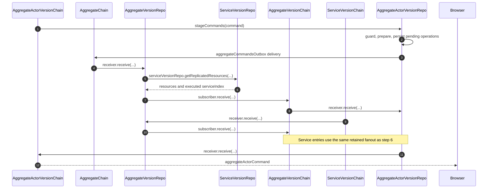
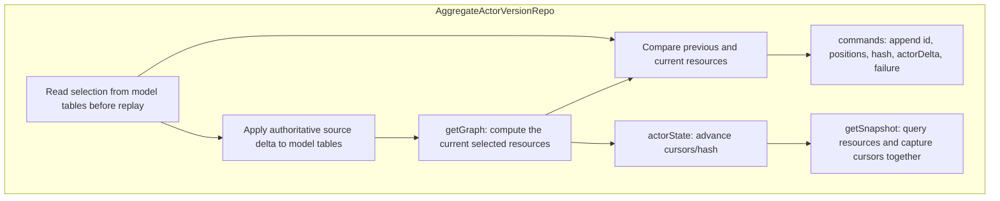
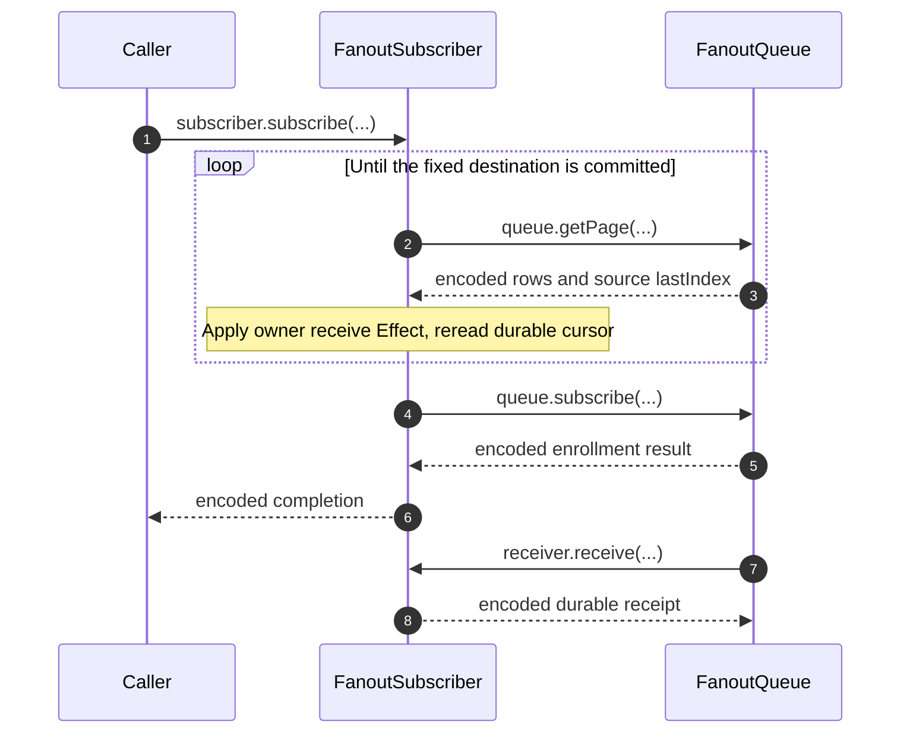

# Command Chains and Materialization

The aggregate path is AC → AVR → AVC → AAVR → AAVC → browser. AVR alone consumes pinned service histories and orders their effective changes with aggregate results. AAVR projects that single immutable stream.

## Trigger

1. A validated session connection submits an aggregate command to AAVR staging. AAVR runs contract and actor guards against derived optimism, then submits saved work to AC. AC retains identity, authorization, payload, and duplicate checks; AVR runs aggregate guards during authoritative execution.

```mermaid
sequenceDiagram
  participant AAVC as AggregateActorVersionChain
  participant AC as AggregateChain
  participant AVR as AggregateVersionRepo
  participant SVR as ServiceVersionRepo
  participant AVC as AggregateVersionChain
  participant SVC as ServiceVersionChain
  participant AAVR as AggregateActorVersionRepo
  participant Browser
  autonumber
  AAVC->>AAVR: stageCommands(command)
  AAVR->>AAVR: guard, prepare, persist pending operations
  AAVR->>AC: aggregateCommandsOutbox delivery
  AC->>AVR: receiver.receive(...)
  AVR->>SVR: serviceVersionRepo.getReplicatedResources(...)
  SVR-->>AVR: resources and executed serviceIndex
  AVR->>AVC: subscriber.receive(...)
  AVC->>AAVR: receiver.receive(...)
  SVC->>AVR: receiver.receive(...)
  AVR->>AVC: subscriber.receive(...)
  Note over AVC,AAVR: Service entries use the same retained fanout as step 6
  AAVR->>AAVC: receiver.receive(...)
  AAVC-->>Browser: aggregateActorCommand
```

## Annotated workflow steps

1. AC validates and retains the original aggregate command, assigns its aggregate position, and acknowledges admission.
   - [`admitCommands.ts:34-39`](../../../packages/system-worker/src/AggregateChain/admitCommands/admitCommands.ts#L34-L39) — Validates original inputs before atomic retention. (`packages/system-worker/src/AggregateChain/admitCommands/admitCommands.ts:34-39`)
2. AC fans admitted commands to the version-owned AVR.
   - [`AggregateVersionRepo.ts:215-220`](../../../packages/system-worker/src/AggregateVersionRepo/AggregateVersionRepo.ts#L215-L220) — Binds AC receipt to the durable aggregate cursor. (`packages/system-worker/src/AggregateVersionRepo/AggregateVersionRepo.ts:215-220`)
3. AVR runs its version-specific synchronous program, then fetches replica resources from pinned VSRs while holding its execution permit.
   - [`executeCommands.ts:170-175`](../../../packages/system-worker/src/AggregateVersionRepo/executeCommands/executeCommands.ts#L170-L175) — Captures replica inputs after evaluating the program. (`packages/system-worker/src/AggregateVersionRepo/executeCommands/executeCommands.ts:170-175`)
4. SVR returns resource copies with its executed service position. AVR closes any missing suffix to its retained source cursor before enrollment.
   - [`getReplicatedResources.ts:182-187`](../../../packages/system-worker/src/AggregateVersionRepo/getReplicatedResources/getReplicatedResources.ts#L182-L187) — Compares the snapshot frontier with durable source progress. (`packages/system-worker/src/AggregateVersionRepo/getReplicatedResources/getReplicatedResources.ts:182-187`)
5. AVR runs aggregate guards inside the command transaction, then commits mutations, aggregate disposition, materialization position, and outbox row together. The outbox publishes to AVC.
   - [`executeCommandsTx.ts:131-136`](../../../packages/system-worker/src/AggregateVersionRepo/executeCommands/executeCommandsTx.ts#L131-L136) — Runs the prepared state guard against the transaction database. (`packages/system-worker/src/AggregateVersionRepo/executeCommands/executeCommandsTx.ts:131-136`)
6. AVC fans contiguous materialization entries to the selected replica.
   - [`AggregateVersionChain.ts:42-47`](../../../packages/system-worker/src/AggregateVersionChain/AggregateVersionChain.ts#L42-L47) — Pages and acknowledges the combined output order. (`packages/system-worker/src/AggregateVersionChain/AggregateVersionChain.ts:42-47`)
7. The pinned SVC sends each service occurrence to AVR. AVR applies only effective changes to enrolled replicas and emits one service entry, including failed, unrelated, and already-covered occurrences.
   - [`receiveServiceCommandsTx.ts:179-184`](../../../packages/system-worker/src/AggregateVersionRepo/receiveServiceCommandsTx.ts#L179-L184) — Allocates service output with source progress inside the transaction. (`packages/system-worker/src/AggregateVersionRepo/receiveServiceCommandsTx.ts:179-184`)
8. The same AVR outbox publishes those service entries into AVC; their positions follow local commit order.
   - [`AggregateVersionRepo.ts:193-198`](../../../packages/system-worker/src/AggregateVersionRepo/AggregateVersionRepo.ts#L193-L198) — Both input paths share the materialization outbox. (`packages/system-worker/src/AggregateVersionRepo/AggregateVersionRepo.ts:193-198`)
9. The selected replica applies both entry kinds locally, checkpoints materialization progress, and publishes one actor command. Service entries have no aggregate completion owner.
   - [`applyExecutedCommandsTx.ts:154-159`](../../../packages/system-worker/src/AggregateActorVersionRepo/applyExecutedCommands/applyExecutedCommandsTx.ts#L154-L159) — Commits graph changes and selection progress together. (`packages/system-worker/src/AggregateActorVersionRepo/applyExecutedCommands/applyExecutedCommandsTx.ts:154-159`)
10. AAVC delivers the selected stream to the browser by executedIndex.

- [`onMessage.ts:49-54`](../../../packages/system-worker/src/AggregateActorVersionChain/onMessage/onMessage.ts#L49-L54) — Replays selected history to the session. (`packages/system-worker/src/AggregateActorVersionChain/onMessage/onMessage.ts:49-54`)

## Atomic batch admission

AC validates each input's aggregate fields and encodes the complete occurrence before opening one synchronous transaction for the request. Inside that transaction, it compares duplicate bytes, assigns positions to new commands in input order, and returns one receipt per submitted input. Identical duplicates reuse their original receipt, including repeats within the same batch. Empty input returns immediately. Any conflict or insertion failure rolls back every new row from that batch; previously committed history remains intact.

- [`admitCommands.ts`](../../../packages/system-worker/src/AggregateChain/admitCommands/admitCommands.ts) and [`admitCommandsTx.ts`](../../../packages/system-worker/src/AggregateChain/admitCommands/admitCommandsTx.ts) — Separates whole-batch validation from the named `admitCommandsTx` program and preserves admission error codes.
- [`aggregateChainDbConfig.ts`](../../../packages/system-worker/src/AggregateChain/aggregateChainDbConfig.ts) — Declares the physical schema used to type the database and transaction handles.
- [`makeTx.ts`](../../../packages/core/src/drizzle/make/makeTx.ts) — Accepts the database directly, passes the active transaction to the generator, and synchronously rolls back failed programs.
- [`admitCommands.node.spec.ts`](../../../packages/system-worker/src/AggregateChain/admitCommands/admitCommands.node.spec.ts) — Tests whole-batch rollback, invalid later inputs, identical and conflicting retries, and gap-free retry after rollback.

> CONTRADICTION: Earlier admission documentation described a committed prefix after a later input failed. Batch admission now commits all new rows together; only earlier successful requests remain deliverable after a failed batch.

## Identity and ownership

AC uses `{ systemId, aggregateId, aggregateName }`. Worker configuration supplies `systemId`; direct command callers supply the aggregate fields, while session APIs bind those fields after admission checks. AVR and AVC add `aggregateVersion`, selected explicitly for execution or from the deployed aggregate definitions for destination enrollment. AggregateActorVersionRepo and AggregateActorVersionChain add `actorName`, `actorVersion`, and `actorPath`, formatted from validated selection claims. Their complete shared key is `{ systemId, aggregateId, aggregateName, aggregateVersion, actorName, actorVersion, actorPath }`. Session names and locks belong to admitted capabilities and connections. Snapshot tickets retain that exact versioned AAVC name.

- [`aggregateChainFixedDORepoConfig.ts`](../../../packages/system-worker/src/AggregateChain/aggregateChainFixedDORepoConfig.ts) — Defines the unversioned admitted-chain name.
- [`AggregateVersionRepo.ts`](../../../packages/system-worker/src/AggregateVersionRepo/AggregateVersionRepo.ts) — Defines version-owned execution identity.
- [`aggregateActorVersionRepoFixedDORepoConfig.ts`](../../../packages/system-worker/src/AggregateActorVersionRepo/aggregateActorVersionRepoFixedDORepoConfig.ts) — Defines the five-field shared user replica name.

AC retains inputs only. AVR keeps terminal entries pending publication; AVC owns retained execution history after outbox deletion. AVR retains one `services.lastIndex` per declared service. Replica-model rows and tombstones establish resource membership and retain their own `serviceIndex`. AAVR checkpoints `executedIndex` and retains complete source-scoped commands, pending replay operations by command-row reference, automation groups, and confirmed output. Its resource tables are authoritative; unresolved prepared operations replay into a disposable optimistic database for actor guards and automation selection. AAVC retains complete confirmed commands and projects selected browser output at delivery. Browser snapshots and publications exclude pending optimism. A recognized AC admission refusal resolves its AAVR pending row and returns a retained failure to the caller without assigning an aggregate index or advancing the confirmed actor cursor.

- [`aggregateVersionRepoDbConfig.ts`](../../../packages/system-worker/src/AggregateVersionRepo/aggregateVersionRepoDbConfig.ts) — Results are an outbox alongside resource state and the durable head.
- [`aggregateActorVersionRepoDbConfig.ts`](../../../packages/system-worker/src/AggregateActorVersionRepo/aggregateActorVersionRepoDbConfig.ts) — Defines projection state, source cursors, and the delivery outbox.

## Projection state and command rows

`actorState` is a singleton cursor/hash checkpoint in each AAVR and
SAVR database. Resource tables are the only stored current state. Replay reads
the selected resources before applying a page, then compares them with the selection
after each source command. The previous selection exists only in memory within that
transaction. Snapshots query the same tables in one synchronous transaction,
capturing resources and cursor together.

AAVR computes membership using Drizzle SQL and row mappings captured during actor
construction against its pinned resource models. It binds parameters from the
decoded selection path, then reads matching complete rows through Drizzle so dates,
booleans, and JSON retain their existing mappings. Query execution and row reads use
the same resource transaction as the source update and actor-command commit. Correlated
existence predicates avoid multiplying root rows and preserve independent role branches.
The graph column has been removed. This fixed-schema change requires empty storage;
there is no migration or compatibility decoder. The shared SVSR/SVSC cutover remains
separate work.

```mermaid
flowchart TD
  subgraph AggregateActorVersionRepo
    Previous["Read selection from model tables before replay"] --> Source[Apply authoritative source delta to model tables] --> Select["getGraph: compute the current selected resources"]
    Previous --> Diff[Compare previous and current resources]
    Select --> Diff
    Diff --> Commands["commands: append id, positions, hash, actorDelta, failure"]
    Select --> State["actorState: advance cursors/hash"]
    State --> Snapshot["getSnapshot: query resources and capture cursors together"]
  end
```

Source updates, the actor command, and the cursor/hash checkpoint commit in the
same transaction. A resource newly entering the selection is upserted; one
leaving it emits a deletion even if it still exists in the source model tables.
Both entry kinds advance AAVR’s `executedIndex` and `executedIndex`. Only aggregate entries advance its aggregate watermark.
SAVR uses the analogous before/after comparison and a single `serviceIndex`.
Neither projection checkpoint retains serialized command bytes or a replacement
command fingerprint. Already-consumed positions are skipped; the source chains
validate duplicate publication against their retained immutable command fields.

- [`commitActorCommandTx.ts`](../../../packages/system-worker/src/AggregateActorVersionRepo/commitActorCommandTx/commitActorCommandTx.ts) — computes the next graph, differences it against the previous graph, and writes the actor command and checkpoint.
- [`executeTx.ts`](../../../packages/system-worker/src/ServiceActorVersionRepo/execute/executeTx.ts) — applies the same projection lifecycle to service resources.
- [`getSnapshot.ts`](../../../packages/system-worker/src/AggregateActorVersionRepo/getSnapshot/getSnapshot.ts) — captures selected resources and progress together before awaiting bounded publication.

All command-owning tables are named `commands`, from admission through execution,
selection, delivery history, and the browser journal. Each row stores its command
fields directly. `payload` retains its existing encoded text; structured field
values such as `executionDelta`, `actorDelta`, `identity`, and `failure` remain JSON columns, and
timestamps are date columns. Delivery state uses separate operational columns. A repeated command id returns the command already stored. Undeclared browser lifecycle fields
are not retained at the server admission boundary.

- Each `makeTable` instance owns `decodeRow` and `encodeRow` for its complete SQL row. `dbConfig.tables` retains those typed instances alongside Drizzle schema and relations. Domain command schemas validate command invariants after row decoding. Partial updates, such as delivery metadata and actor results, still use field codecs.
- Actor `commands` rows and domain commands both use `actorDelta`; local optimistic rows use `stagedDelta`, and authoritative execution rows use `executionDelta`. Actor-chain receivers decode incoming rows once, validate the public command, then copy selected encoded fields without delivery bookkeeping in a synchronous `makeTx` transaction. They broadcast only after commit. Aggregate replay reads one ordered union of missing execution and owned results, with independent cursors and explicit public field selection.

## Deployed destination enrollment

AC activation reads its aggregate's versions from the executing bundle, retains
the command-delivery alarm, and atomically reconciles active AVR destinations.
Existing cursors and failures survive; versions missing from the bundle become
inactive. This requires no SystemRepo publication or subscription.

- [`onDOActivation.ts`](../../../packages/system-worker/src/AggregateChain/onDOActivation/onDOActivation.ts) — Reconciles deployed membership from `system.aggregates`.

Command delivery or direct calls activate VARs. Empty command histories leave
supported VARs unopened.

- [`aggregateMembership.workerd.spec.ts`](../../../packages/system-worker/src/aggregateMembership.workerd.spec.ts) — Exercises retained command delivery, cold activation, and unopened empty-history destinations.

## Cutover and retries

AC activation adopts `config.aggregates[aggregateName].canonical` as durable
`desiredBaseAggregateVersion`; a new chain also initializes `baseAggregateVersion`
to that value. Existing chains retain the applied base. A configuration-only deployment
leaves the authored System spec unchanged. The inherited alarm runs the local
cutover Effect; activation do not compare materializers or promote
existing chains. Service cutover remains manual.

- [`onDOActivation.ts`](../../../packages/system-worker/src/AggregateChain/onDOActivation/onDOActivation.ts) — holds recovery before atomically adopting intent and awaiting subscription.
- [`AggregateChain.ts`](../../../packages/system-worker/src/AggregateChain/AggregateChain.ts) — registers lazy cutover recovery with the common alarm dispatcher.
- [`makeSystemSpec.ts`](../../../packages/core/src/system/make/makeSystemSpec.ts) — serializes authored definitions independently of configuration settings.

Equal applied and desired versions settle locally. A destination that is not numerically
newer records a blocked diagnostic; an invalidated candidate retains its reason. These
branches release the cutover lease without materializer lookup, including
on repeated unrelated alarms. Eligible work rechecks intent,
and requires supported enrolled versions. Missing enrollment remains a recovery failure.

- [`cutover.ts`](../../../packages/system-worker/src/AggregateChain/cutover/cutover.ts) — conditionally writes serialized diagnostics against the sampled applied/desired pair.
- [`getCutoverSubscriberRows.ts`](../../../packages/system-worker/src/AggregateChain/cutover/getCutoverSubscriberRows.ts) — validates enrolled base and candidate versions.
  An empty chain promotes after local candidate checks without resolving a AVR. Otherwise,
  AC samples the last admitted index `n` and command ID and flushes base and desired VARs
  concurrently. Both results must identify that exact occurrence; matching disposition hashes
  allow promotion and divergence invalidates the candidate. Admissions continue during remote
  comparison. Both commit transactions recheck applied and desired versions and candidate
  existence/invalidation; superseded work changes neither candidate state nor diagnostics.
  Skipped configurations require no intermediate promotions.

- [`cutover.ts`](../../../packages/system-worker/src/AggregateChain/cutover/cutover.ts) — samples retained admission history and compares exact durable checkpoints.
- [`commitPromotionTx.ts`](../../../packages/system-worker/src/AggregateChain/cutover/commitPromotionTx.ts) — atomically updates the applied base and clears the current-intent failure.
- [`commitInvalidatedCandidateTx.ts`](../../../packages/system-worker/src/AggregateChain/cutover/commitInvalidatedCandidateTx.ts) — atomically retains candidate invalidation and its chain diagnostic.

Transport, protocol, persistence failures, and interruption retain recovery. Diagnostic
persistence is conditional on both sampled versions; its own failure cannot replace the
operation failure. The lease releases only for applied, promoted, blocked, or invalidated
intent. Recovery after a promotion commit completes through equality. Direct execution and
session base selection continue reading only the applied base; direct retries recover that
version's committed result from AVR or AVC.

- [`cutover.node.spec.ts`](../../../packages/system-worker/src/AggregateChain/cutover/cutover.node.spec.ts) — exercises suspended flushes, conditional diagnostics, transaction rollback, interrupted recovery, and settled retries.
- [`executeAggregateCommand.ts`](../../../packages/system-worker/src/AggregateChain/executeAggregateCommand/executeAggregateCommand.ts) — selects the applied base for every request, including duplicate commands.
- [`getBaseAggregateVersion.ts`](../../../packages/system-worker/src/AggregateChain/getBaseAggregateVersion/getBaseAggregateVersion.ts) — returns the applied base without exposing desired intent as execution authority.

## Fanout scheduling and terminal failures

Owners supply explicit `db`, `schema`, subscriber and entries table names, and a numeric index column. The factory owns ascending 64-row paging: `afterIndex` is exclusive and optional `maxIndex` is inclusive. Each response preserves complete rows and reports the whole table's `lastIndex`, independently of the page bound. AC uses `aggregateIndex`; AVR and AVC use `executedIndex`; SC and SVC use `serviceIndex`. The selected aggregate chain uses `executedIndex`, while the session service chain uses `serviceIndex`. Outboxes use the same domain positions through their explicit `indexColumnName` option, including bounded delivery and exact-page acknowledgement; no separate queue-position column is stored. These four chains expose history through their queue capabilities; resource repair uses `getPage`; aggregate result recovery uses AVC’s exact `getAggregateResult(aggregateIndex)` lookup.

- [`makeFanoutQueue.ts`](../../../packages/system-worker/src/makeFanoutQueue/makeFanoutQueue.ts) — Selects bounded complete rows and reads the whole-log maximum separately.
- [`makeFanoutQueue.node.spec.ts`](../../../packages/system-worker/src/makeFanoutQueue/makeFanoutQueue.node.spec.ts) — Verifies all three index column names, empty history, bounded pages, and the complete log tip.
- [`execute.ts`](../../../packages/system-worker/src/AggregateVersionRepo/execute/execute.ts) — Recovers the exact terminal aggregate occurrence through the finalized chain's replica queue.
- [`getReplicatedResources.ts`](../../../packages/system-worker/src/AggregateVersionRepo/getReplicatedResources/getReplicatedResources.ts) — Reads bounded replica history from the finalized service chain's replica queue.

Each local `drain(): Promise<void>` starts the queue's Effect immediately through `managedRuntime`, with `AsyncLive` supplied by the factory. The Effect reads the entries table's persisted tip and raises the queue's in-memory upper bound before acquiring the drain lock, so another call can extend delivery already in progress. The factory observes rejection internally and returns the original Promise: callers may ignore it without an unhandled rejection or await delivery completion and failure. AC admission uses `drainAfter(() => admitCommands(...))`: recovery is scheduled before synchronous admission, then delivery starts when the producer settles without waiting for receivers. Service admission and aggregate finalized-command receipt use the same immediate scheduling contract. The fanout factory registers its internal drain Effect with the inherited alarm registry. The common Repo alarm dispatches registered recovery independently; neither owners nor the factory need `waitUntil` for fanout.

- [`makeFanoutQueue.ts`](../../../packages/system-worker/src/makeFanoutQueue/makeFanoutQueue.ts) — Reads the persisted entries tip before waiting for the shared drain permit.
- [`makeFanoutQueue.ts`](../../../packages/system-worker/src/makeFanoutQueue/makeFanoutQueue.ts) — Starts the Effect and observes background rejection without changing the returned Promise.
- [`makeFanoutQueue.node.spec.ts`](../../../packages/system-worker/src/makeFanoutQueue/makeFanoutQueue.node.spec.ts) — Lets ignored delivery fail without an unhandled rejection and then observes rejection by awaiting the original Promise.
- [`makeFanoutQueue.node.spec.ts`](../../../packages/system-worker/src/makeFanoutQueue/makeFanoutQueue.node.spec.ts) — Appends rows during blocked delivery and confirms another drain call extends the active attempt.
- [`AggregateChain.ts`](../../../packages/system-worker/src/AggregateChain/AggregateChain.ts) — Uses queue-owned drainAfter for admission; direct execution retains its pre-write alarm and immediate-drain finalizer.
- [`AggregateChain.node.spec.ts`](../../../packages/system-worker/src/AggregateChain/AggregateChain.node.spec.ts) — Tests nonblocking admission, no delivery of a rolled-back batch, and continued delivery of previously committed work after admission failure.
- [`makeAlarmRegistry.ts`](../../../packages/system-worker/src/makeAlarmRegistry/makeAlarmRegistry.ts) — Awaits all registered recovery Effects before reporting their combined failure causes.

Subscriber queries select the oldest unfailed rows behind that bound and exclude pending IDs before applying the caller's concurrency limit. Optional `subscribersWhere` supplies a tuple of additional AND predicates, with undefined entries ignored. AC and SC use it to exclude invalidated materializers without advancing their cursors. Individual completions refill slots; a subscriber with another page may be selected again in the same drain.

- [`makeFanoutQueue.ts`](../../../packages/system-worker/src/makeFanoutQueue/makeFanoutQueue.ts) — Combines owner predicates with persisted failure, progress, and pending identity filters before ordering and limiting the query.
- [`AggregateChain.ts`](../../../packages/system-worker/src/AggregateChain/AggregateChain.ts) — Supplies `invalidatedAt IS NULL` as the aggregate materializer subscriber predicate.
- [`ServiceChain.ts`](../../../packages/system-worker/src/ServiceChain/ServiceChain.ts) — Supplies the same invalidation predicate for service materializers.
- [`makeFanoutQueue.node.spec.ts`](../../../packages/system-worker/src/makeFanoutQueue/makeFanoutQueue.node.spec.ts) — Verifies multiple predicates and terminal failure exclusion before a one-subscriber page limit, leaving excluded cursors unchanged.
- [`makeFanoutQueue.ts`](../../../packages/system-worker/src/makeFanoutQueue/makeFanoutQueue.ts) — Refills scoped deliveries and reuses or refetches the suffix that covers each selected cursor.
- [`makeFanoutQueue.node.spec.ts`](../../../packages/system-worker/src/makeFanoutQueue/makeFanoutQueue.node.spec.ts) — Keeps one slow subscriber pending while another advances through complete pages.

Invalidation excludes pushed fanout. Explicit AVR execution can still pull
retained AC history, while its invalidated destination remains excluded from
pushes. Whether invalidation should also stop explicit pull execution remains
a separate policy question in `TODOS.md`.

- [`execute.ts`](../../../packages/system-worker/src/AggregateVersionRepo/execute/execute.ts) — Performs explicit AC catch-up through the requested command index.
- [`makeFanoutSubscriber.ts`](../../../packages/system-worker/src/makeFanoutSubscriber/makeFanoutSubscriber.ts) — Performs catch-up before the source subscription call.
- [`TODOS.md`](../../../TODOS.md) — Tracks the future invalidation policy decision without changing cutover behavior here.

Each owner supplies the receiver class's inherited `Repo.getRepo` static as `getRepo`. The shared lookup captures its namespace binding and formats the supplied key when its Effect runs. The factory parses the persisted subscriber name, passes that receiver key unchanged to the lookup, and invokes `${name}Subscriber(sourceKey)` with the queue owner's key. `receive({ rows, lastIndex })` preserves every complete row. `lastIndex` reports the source's committed deliverable tip when the page was read; it can exceed the page tail and remains paired with the cached page. Encoded successful receipt acknowledges only the last delivered row's index. Receivers tolerate committed-prefix redelivery if interruption occurs before that cursor write.

- [`makeFanoutQueue.ts`](../../../packages/system-worker/src/makeFanoutQueue/makeFanoutQueue.ts) — Owns lookup, capability resolution, receipt decoding, and the complete-page cursor write inside the delivery failure boundary.

Outbox producers use `drainAfter(() => producerEffect)` to schedule recovery before
writing pending rows and start delivery after the producer settles. It returns the
producer result without awaiting receivers. Unlike fanout's synchronous
admission callback, outbox producers may prepare asynchronously. The queue preserves
its alarm lease across overlapping producers and empty drains, including producer
failure or interruption. Registered alarm recovery reads pending rows after cold
activation; producers remain responsible for retry-safe durable writes.

The queue persists lookup, delivery, decoding, and acknowledgement-write errors or defects as terminal `failure`. Failed subscribers remain excluded after cold activation and cannot be re-enrolled to clear the error. Outbox delivery retains its own retry policy. Interrupted attempts without a persisted failure resume from durable progress.

- [`makeFanoutQueue.ts`](../../../packages/system-worker/src/makeFanoutQueue/makeFanoutQueue.ts) — Persists terminal subscriber failure before settling delivery and aborts if that persistence fails.
- [`makeFanoutQueue.node.spec.ts`](../../../packages/system-worker/src/makeFanoutQueue/makeFanoutQueue.node.spec.ts) — Reconstructs a queue and verifies failure survives both another drain and rejected re-enrollment.

An empty suffix pauses source delivery until another drain call rereads the persisted tip. Enrollment holds the recovery alarm before committing and, on success, starts `drain()` after committing its independent local enrollment transaction. A cold subscription discovers retained rows immediately without waiting for an owner-supplied index or an alarm. Interrupting a caller waiting for drain completion does not cancel the queue-owned delivery; recovery after queue interruption still starts from durable progress.

- [`makeFanoutQueue.ts`](../../../packages/system-worker/src/makeFanoutQueue/makeFanoutQueue.ts) — Retains the alarm before enrollment and starts delivery after its local transaction, without acquiring the drain permit.
- [`makeFanoutQueue.node.spec.ts`](../../../packages/system-worker/src/makeFanoutQueue/makeFanoutQueue.node.spec.ts) — Starts delivery of retained rows from a cold subscription without an owner drain call.
- [`makeFanoutQueue.node.spec.ts`](../../../packages/system-worker/src/makeFanoutQueue/makeFanoutQueue.node.spec.ts) — Starts delivery before any caller awaits it, interrupts a waiting caller, and still commits the delivery cursor.

## Service delivery and failure boundaries

`SystemApi.admitServiceCommand` returns `{ commandId, serviceIndex }` after durable input retention, without waiting for execution. ServiceChain uses drainAfter to schedule recovery before synchronous admission and starts background delivery afterward. Identical retries recover the original receipt; conflicting input bytes fail admission.

- [`admitServiceCommand.ts`](../../../packages/system-worker/src/ServiceChain/admitServiceCommand/admitServiceCommand.ts) — Retains or recovers the input position and returns its receipt.
- [`ServiceChain.ts`](../../../packages/system-worker/src/ServiceChain/ServiceChain.ts) — Holds the durable alarm and schedules fanout independently of the admission response.
- [`serviceExecution.workerd.spec.ts`](../../../packages/system-worker/src/serviceExecution.workerd.spec.ts) — Observes fanout publication without directly executing the materializer and checks receipt recovery after cold activation.

ServiceChain admits service commands and feeds registered service materializers. AVR subscribes directly to the SVC selected by their aggregate service pins; changing SC’s base does not switch those consumers. Standalone service session delivery retains SAVR. Aggregate domain rejection advances one position after rolling back that command; infrastructure failure aborts the execution page. No transaction spans an RPC. Internal fanout and outbox progress do not depend on browser connections.

- [`ServiceVersionChain.ts`](../../../packages/system-worker/src/ServiceVersionChain/ServiceVersionChain.ts) — Owns separate typed fanout queues for AVR and SAVR.
- [`ServiceVersionRepo.ts`](../../../packages/system-worker/src/ServiceVersionRepo/ServiceVersionRepo.ts) — Uses the bound subscriber to replay and enroll a pinned version during activation; resource reads catch up without re-enrollment.
- [`executeCommandsTx.ts`](../../../packages/system-worker/src/AggregateVersionRepo/executeCommands/executeCommandsTx.ts) — Separates per-command savepoints from the page transaction.
- [`makeOutboxQueue.ts`](../../../packages/system-worker/src/makeOutboxQueue/makeOutboxQueue.ts) — Serializes bounded SQL delivery, exact-page acknowledgements, retry metadata, and queue-specific alarm leases.

## Subscription and snapshot recovery

Each subscriber target binds exactly one source queue and reads its receiver's durable cursor. `catchup(index?)` uses the caller's destination or captures the first page's `lastIndex`; later page tips cannot extend that destination. `subscribe(index?)` completes bounded catch-up before enrolling the resulting cursor for live delivery. Pulled and pushed pages execute the same owner receive Effect.

```mermaid
sequenceDiagram
  participant Caller
  participant FanoutSubscriber
  participant FanoutQueue
  autonumber 1
  Caller->>FanoutSubscriber: subscriber.subscribe(...)
  loop Until the fixed destination is committed
    autonumber 2
    FanoutSubscriber->>FanoutQueue: queue.getPage(...)
    autonumber 3
    FanoutQueue-->>FanoutSubscriber: encoded rows and source lastIndex
    Note over FanoutSubscriber: Apply owner receive Effect, reread durable cursor
  end
  autonumber 4
  FanoutSubscriber->>FanoutQueue: queue.subscribe(...)
  autonumber 5
  FanoutQueue-->>FanoutSubscriber: encoded enrollment result
  autonumber 6
  FanoutSubscriber-->>Caller: encoded completion
  autonumber 7
  FanoutQueue->>FanoutSubscriber: receiver.receive(...)
  autonumber 8
  FanoutSubscriber-->>FanoutQueue: encoded durable receipt
```

## Annotated workflow steps

1. The owner calls subscriber.subscribe() during activation and awaits bounded catch-up followed by enrollment. A supplied destination already covered by durable progress needs no page request.
   - [`makeFanoutSubscriber.ts`](../../../packages/system-worker/src/makeFanoutSubscriber/makeFanoutSubscriber.ts) — Validates the destination and reads the receiver's committed cursor before resolving the source queue.
2. Pages begin after the committed cursor and carry a fixed `maxIndex` once a destination is known. Paging takes no source drain lock.
   - [`makeFanoutSubscriber.ts`](../../../packages/system-worker/src/makeFanoutSubscriber/makeFanoutSubscriber.ts) — Supplies the existing cursor and optional fixed destination to `queue.getPage`.
   - [`makeFanoutQueue.ts`](../../../packages/system-worker/src/makeFanoutQueue/makeFanoutQueue.ts) — Runs the factory's bounded table reader without acquiring the drain lock.
3. The first response fixes an omitted destination; the owner receive Effect commits each page, and a fresh cursor read accounts for overlapping push delivery. Empty history at zero succeeds. Invalid tips, missing pages below the destination, and a receipt that makes no progress fail.
   - [`makeFanoutSubscriber.ts`](../../../packages/system-worker/src/makeFanoutSubscriber/makeFanoutSubscriber.ts) — Validates the source tip, applies rows, and checks durable progress before another request.
4. After catch-up, the subscriber rereads durable progress and submits its enrollment key and cursor to the source. No receiver execution permit spans this request.
   - [`makeFanoutSubscriber.ts`](../../../packages/system-worker/src/makeFanoutSubscriber/makeFanoutSubscriber.ts) — Calls the existing source enrollment RPC after catch-up and a final cursor read.
5. The source atomically enrolls independently of the drain semaphore, preserves terminal failures, and advances cursors monotonically. It holds the queue alarm before commit and starts a drain without awaiting delivery. This permits a cold receiver to subscribe back while source delivery awaits its activation.
   - [`makeFanoutQueue.ts`](../../../packages/system-worker/src/makeFanoutQueue/makeFanoutQueue.ts) — Commits enrollment without the delivery semaphore, then starts the drain and returns its encoded result.
6. The subscriber completes only after the enrollment response succeeds.
   - [`makeFanoutSubscriber.ts`](../../../packages/system-worker/src/makeFanoutSubscriber/makeFanoutSubscriber.ts) — Decodes source enrollment before encoding successful subscription completion.
7. Retained rows appended between catch-up and enrollment remain eligible after the registered cursor. The source invokes the source-bound accessor and delivers a complete envelope.
   - [`makeFanoutQueue.ts`](../../../packages/system-worker/src/makeFanoutQueue/makeFanoutQueue.ts) — Resolves the receiver using its persisted key, binds the queue owner key, and sends that delivery's rows and tip.
8. Successful receipt advances source acknowledgement to the delivered row tail. A failure leaves delivery progress unchanged and enters the queue's existing terminal failure path.
   - [`makeFanoutQueue.ts`](../../../packages/system-worker/src/makeFanoutQueue/makeFanoutQueue.ts) — Decodes receipt, persists the delivered cursor, and records delivery failures.

AVR initializes every declared service source during activation. Each target binds `{ systemId, serviceName, serviceVersion }`: `systemId` comes from the physical Repo key; the service name/version come from `aggregate.services` on the snapshot selected by `aggregateName` and `aggregateVersion`. Missing source rows start at cursor zero; existing cursors survive reactivation. Activation catches up and subscribes each source without an execution permit or database transaction spanning RPCs. Later commands enroll resources, not services, and do not rewind feed cursors.

- [`onDOActivation.ts`](../../../packages/system-worker/src/AggregateVersionRepo/onDOActivation/onDOActivation.ts) — Declares all pinned AVR sources before catch-up and enrollment.
- [`onDOActivation.ts`](../../../packages/system-worker/src/AggregateActorVersionRepo/onDOActivation/onDOActivation.ts) — Declares service sources, subscribes finalized aggregate history, then subscribes the service feeds.

Snapshots capture selected resources and both indices in one synchronous transaction. After
completing that transaction they await AAVC publication through the captured
selection position, then reconcile requested `pendingCommandIds` from retained
AAVC entries through that position. Only entries whose private
identity and session name exactly match the requesting capability are
returned in `actorCommands`; the server never exposes source command bytes
or execution metadata at this seam. Aggregate and service RPC replies,
WebSocket live/replay messages, and session snapshots explicitly select their
public fields rather than spreading retained objects. Aggregate delivery applies
the session model lock to reconciliation deltas as well as normal delivery.
Completed operation results retain one public structured failure envelope in `admission.failure` or `execution.failure`. Admission rejection records skipped execution. Receiving runtimes may recognize a failure against their current contract; unfamiliar valid errors remain usable and never block reconciliation.

- [`deliverActorCommand.ts`](../../../packages/system-worker/src/deliverActorCommand/deliverActorCommand.ts) — constructs the aggregate delivery view and filters delta models.
- [`filterServiceActorCommand.ts`](../../../packages/core/src/serviceSession/filterServiceActorCommand.ts) — selects service delivery fields and filters delta models.
- [`actorCommandDelivery.ts`](../../../packages/core/src/aggregateSession/actorCommandDelivery.ts) — reconstructs the retained command from the RPC delivery view.

- [`getSnapshot.ts`](../../../packages/system-worker/src/AggregateActorVersionRepo/getSnapshot/getSnapshot.ts) — captures a coherent snapshot and waits for its actor-command publication before returning.

## Verification

- [`onDOActivation.node.spec.ts`](../../../packages/system-worker/src/AggregateChain/onDOActivation/onDOActivation.node.spec.ts) — Exercises deployed destination reconciliation during activation.
- [`onDOActivation.node.spec.ts`](../../../packages/system-worker/src/AggregateVersionRepo/onDOActivation/onDOActivation.node.spec.ts) — Declares all service dependencies before resource enrollment and resumes subscription from committed cursors.
- [`getSnapshot.node.spec.ts`](../../../packages/system-worker/src/AggregateActorVersionRepo/getSnapshot/getSnapshot.node.spec.ts) — catches up both aggregate and service feeds without resubscribing and waits for the captured actor-command position.

- [`makeFanoutSubscriber.node.spec.ts`](../../../packages/system-worker/src/makeFanoutSubscriber/makeFanoutSubscriber.node.spec.ts) — Exercises fixed destinations, source paging failures, overlapping delivery, subscription handoff, and independent source cursors.
- [`makeFanoutQueue.node.spec.ts`](../../../packages/system-worker/src/makeFanoutQueue/makeFanoutQueue.node.spec.ts) — Verifies bounded pages during a held drain, complete source-key routing, cached envelope tips, and acknowledgement of the row tail.
- [`preparedExecution.workerd.spec.ts`](../../../packages/system-worker/src/preparedExecution.workerd.spec.ts) — Exercises API admission, admission and program checks, publication, snapshots, and cold retry.
- [`pinnedServiceReplicas.workerd.spec.ts`](../../../packages/system-worker/src/pinnedServiceReplicas.workerd.spec.ts) — Exercises read-before-mutation replica checks, historical subscription without prior registration, rejection rollback, independent pinned updates, tombstones, and cold recovery.
- [`serviceReplication.node.spec.ts`](../../../packages/system-worker/src/serviceReplication.node.spec.ts) — Uses actual AVR executions to show that different replica observations under the same program invalidate aggregate cutover.

## Program preparation and execution guards

AAVR stages actor commands against a derived optimistic database: contract and actor guards precede each candidate’s prepared mutations. AVR resolves the recorded actor and runs its version-specific program. Its execution permit spans program evaluation, pinned resource fetching, and commit. Aggregate guards run inside the authoritative command transaction before mutations. Rejection records a failed aggregate result with an empty delta. Infrastructure interruption preserves earlier commits and leaves unfinished input retryable.

AVR and AVC retain separate `aggregateCommands` and `serviceCommands` tables. Each row keeps its complete source occurrence; neither table has a `kind` column or nullable fields for the other command family. AVR's head allocates one `executedIndex` across both tables. Its outbox merges undelivered rows by that index; AVC retains the matching rows and `executionResultsFanout` delivers a page of fanout rows in the same order. Pages contain at most 64 rows and report the maximum committed index across both tables. Acknowledgement follows durable receipt of the page's last row.

`executedIndex` counts every committed aggregate result and service application. `aggregateIndex` remains AC progress and never advances for a service entry. A snapshot ahead of the service cursor protects that resource from regression, but does not skip intervening service occurrences. Each is consumed and emitted in order, with an empty effective delta when already covered. Aggregate disposition hashing includes aggregate results only.

- [`executeCommandsTx.ts`](../../../packages/system-worker/src/AggregateVersionRepo/executeCommands/executeCommandsTx.ts) — guards and commits one aggregate result.
- [`receiveServiceCommandsTx.ts`](../../../packages/system-worker/src/AggregateVersionRepo/receiveServiceCommandsTx.ts) — commits service progress and effective output atomically.
- [`executionGuards.node.spec.ts`](../../../packages/system-worker/src/executionGuards.node.spec.ts) — verifies admission, version-owned guards, rejection recovery, and committed-prefix reads.
- [`materialization.node.spec.ts`](../../../packages/system-worker/src/AggregateVersionRepo/materialization.node.spec.ts) — verifies every-occurrence output, retries, gaps, and aggregate disposition isolation.

Snapshot freshness goes through AVR: catch up to bounded source positions, capture the executed checkpoint, publish through it, then catch AAVR up to that checkpoint. AAVR stores the same `executedIndex` with `executedHash` in `actorState`, captures its selected graph and checkpoint transactionally before awaiting AAVC publication.

The affected fixed schemas require empty storage. There is no conversion migration or fallback decoder.

## Recorded selection provenance

Authenticated inputs retain `actorName` and `actorVersion`. Resolve their
exact definition across the aggregate's supported versions before decoding claims.
Capabilities come from the shared system runtime. Identity and read-only
queries are explicit callback arguments. Execution guards run inside the command
transaction; portable programs and guards must complete synchronously. Trusted
sessionless commands retain explicit actor identity and validated claims.
Declared refusals follow retained failure
publication and optimistic reconciliation.

- [`getAggregateActorVersion.ts`](../../../packages/core/src/aggregateActor/getAggregateActorVersion.ts) — rejects unsupported or conflicting actor versions.
- [`makeSystem.ts`](../../../packages/core/src/system/make/makeSystem/makeSystem.ts) — supplies shared runtime capabilities across invocations.
- [Deferred verification](../../../TODOS.md#versioned-actors--deferred-verification) — cutover coverage intentionally not run.

## Command lifecycle results

Admission retains the stable command, provenance, aggregate index, and a completed
`admission` result. The version repo retains `execution`; rejected admission produces
`{ status: 'skipped', reason: 'admission-failed' }` and still advances the ordered
result log and disposition hash. No mutations run for that result. Attempted phases
retain `startedAt` and `completedAt` together; retries recover those original values.
An execution success owns `executionDelta`. Actor selection retains permitted
`actorDelta` and private admission/execution summaries without the full execution delta.
Both private summaries are absent for recipients without completion ownership.

Complete SQL rows use `dbConfig.tables.<table>.decodeRow/encodeRow`, followed by domain
validation at command interfaces. Phase replacements use field codecs. Transfers
between stores copy the original encoded columns, excluding delivery bookkeeping.
Named `makeTx` programs own synchronous transactions; node SQLite remains asynchronous.

The routes are `admissionResultsFanout`, `executionResultsOutbox`,
`executionResultsFanout`, `serviceResultsToAggregatesFanout`, and `actorCommandsOutbox`.
AAVR uses one `aggregateCommandsOutbox` for saved caller and automation commands. A confirmed occurrence’s automation group finishes staging before the next confirmed occurrence is projected. Each immediate receiver acknowledgement
sets `acknowledgedAt`. Outbox retry diagnostics clear after acknowledgement; a fanout
subscriber's structured `failure` keeps that subscriber blocked. Command rejection is
a successfully delivered result, not a queue error.
