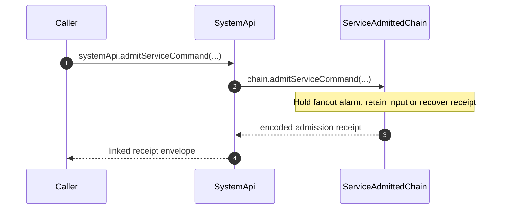

# Service Command Admission

`SystemApi.admitServiceCommand` retains one encoded service command and returns
`{ commandId, serviceIndex }`. The receipt acknowledges durable admission and
ordering; execution proceeds independently through the materializer fanout.

## Trigger

1. A secret-key caller submits a complete encoded service command through SystemApi.
   - [`admitServiceCommand.ts:13-44`](../../../packages/system-worker/src/SystemApi/admitServiceCommand/admitServiceCommand.ts#L13-L44) — Validates the command with `EncodedServiceCommandSchema` through the linked RPC handler.

## Annotated workflow steps

1. SystemApi validates the submitted command and resolves the owner by `{ systemId, serviceName }`. The granted capability supplies `systemId`; the caller's command supplies `serviceName`.
   - [`admitServiceCommand.ts:42-58`](../../../packages/system-worker/src/SystemApi/admitServiceCommand/admitServiceCommand.ts#L42-L58) — Combines capability-bound deployment identity with the decoded service name.
2. After its constructor activation gate opens, ServiceAdmittedChain uses `serviceFanoutQueue.drainAfter` to schedule recovery before admitting the command in a synchronous database transaction.
   - [`ServiceAdmittedChain.ts:78-85`](../../../packages/system-worker/src/ServiceAdmittedChain/ServiceAdmittedChain.ts#L78-L85) — Schedules the alarm before synchronous admission; delivery runs through alarm recovery.
   - [`admitServiceCommand.ts:13-24`](../../../packages/system-worker/src/ServiceAdmittedChain/admitServiceCommand/admitServiceCommand.ts#L13-L24) — Checks the service name, compares retained canonical bytes, and allocates a position only for a new command.
3. The chain returns `{ commandId, serviceIndex }` after retention or exact retry recovery, without awaiting materialization.
   - [`admitServiceCommand.ts:15-25`](../../../packages/system-worker/src/ServiceAdmittedChain/admitServiceCommand/admitServiceCommand.ts#L15-L25) — Reuses the retained index on identical input and constructs the receipt after the transaction.
4. SystemApi decodes the chain response and returns it through the linked RPC handler.
   - [`admitServiceCommand.ts:60-62`](../../../packages/system-worker/src/SystemApi/admitServiceCommand/admitServiceCommand.ts#L60-L62) — Forwards the command and decodes the encoded owner result under the granted capability.

## Asynchronous execution and recovery

The materializer fanout sends each complete admitted page to the registered
materializer's `serviceFanoutQueueSubscriber(sourceKey)` target,
where `sourceKey` is SAC's bound `{ systemId, serviceName }`. Delivery is
`receive({ rows, lastIndex })`; `lastIndex` describes the source's whole committed
deliverable tip, independently of the bounded page.
It excludes invalidated and terminally failed subscribers before pagination and
keeps fetching pages until caught up or awaiting source work. Successful receipt
advances delivery to the last received row's position, never to the envelope tip; the submitting caller does not
receive that execution outcome. Background work can overlap receipt delivery.

- [`ServiceAdmittedChain.ts:36-53`](../../../packages/system-worker/src/ServiceAdmittedChain/ServiceAdmittedChain.ts#L36-L53) — Binds the commands table and fanoutIndex column, materializer lookup, and invalidation predicate to the queue.
- [`makeFanoutQueue.ts:466-488`](../../../packages/system-worker/src/makeFanoutQueue/makeFanoutQueue.ts#L466-L488) — Resolves the persisted subscriber's named capability and writes the whole-page cursor only after successful receipt.
- [`VersionedServiceRepo.ts:70-124`](../../../packages/system-worker/src/VersionedServiceRepo/VersionedServiceRepo.ts#L70-L124) — Executes supplied rows under the execution permit and schedules durable result publication on exit.
- [`ServiceAdmittedChain.ts`](../../../packages/system-worker/src/ServiceAdmittedChain/ServiceAdmittedChain.ts) — Returns the admission receipt after drainAfter schedules recovery and commits input, without starting immediate delivery.

A service materializer calls its source-bound subscriber's `subscribe()` during
activation. Resource, authorization, query, and snapshot reads use `catchup()`
without re-enrollment. Activation catches up through one fixed destination
and then enrolls the materializer's bound
`{ systemId, serviceName, serviceVersion }` and committed cursor, including when
that historical version was never the authored current version. The owner supplies
all three fields; the source queue checks `systemId` and `serviceName` against its
own identity. Paging and enrollment run outside the receiver execution permit.

- [`VersionedServiceRepo.ts:182-284`](../../../packages/system-worker/src/VersionedServiceRepo/VersionedServiceRepo.ts#L182-L284) — Subscribes during activation; resource reads catch up before taking the execution permit.
- [`ServiceAdmittedChain.ts:36-47`](../../../packages/system-worker/src/ServiceAdmittedChain/ServiceAdmittedChain.ts#L36-L47) — Binds the admitted source identity and version-bearing materializer name parser to generic fanout enrollment.
- [`makeFanoutQueue.ts:315-375`](../../../packages/system-worker/src/makeFanoutQueue/makeFanoutQueue.ts#L315-L375) — Checks shared owner fields, preserves terminal failure, and inserts the version and cursor from the subscriber key.
- [`makeFanoutSubscriber.ts:79-128`](../../../packages/system-worker/src/makeFanoutSubscriber/makeFanoutSubscriber.ts#L79-L128) — Captures one destination and applies pages until durable progress covers it.
- [`makeFanoutSubscriber.ts:153-169`](../../../packages/system-worker/src/makeFanoutSubscriber/makeFanoutSubscriber.ts#L153-L169) — Enrolls the completed cursor only after bounded catch-up succeeds.

The Durable Object alarm awaits the materializer queue's drain, which reads the persisted admitted tip itself. Every successful subscription retains the recovery alarm and starts delivery after committing its independent enrollment transaction, including on a cold queue.
Execution history remains available separately from the admission receipt.

- [`makeDORepo.ts`](../../../packages/system-worker/src/makeDORepo/makeDORepo.ts) — Runs the registered materializer drain through the shared registry without an owner-side tip query.
- [`makeFanoutQueue.ts:564-577`](../../../packages/system-worker/src/makeFanoutQueue/makeFanoutQueue.ts#L564-L577) — Retains recovery before enrollment and starts delivery without taking the drain permit.
- [`VersionedServiceChain.ts`](../../../packages/system-worker/src/VersionedServiceChain/VersionedServiceChain.ts) — Exposes retained terminal service history through `replicaFanoutQueue.getPage`.

See [fanout scheduling and terminal failures](./admitCommands.md#fanout-scheduling-and-terminal-failures) for permanent subscriber failures and queue-owned persisted-tip discovery.

## Admission failures and retries

A mismatched service name, invalid encoding, or conflicting input for a retained
command ID fails admission. An identical retry returns the original index.
Execution success or rejection is a later outcome, not a field in the receipt.

- [`admitServiceCommand.ts:13-25`](../../../packages/system-worker/src/ServiceAdmittedChain/admitServiceCommand/admitServiceCommand.ts#L13-L25) — Separates admission checks and database failure handling from receipt construction.
- [`admitServiceCommand.node.spec.ts:10-30`](../../../packages/system-worker/src/ServiceAdmittedChain/admitServiceCommand/admitServiceCommand.node.spec.ts#L10-L30) — Verifies unprepared input retention, exact retry receipts, and rejected inputs without consumed positions.
- [`serviceExecution.workerd.spec.ts:17-103`](../../../packages/system-worker/src/serviceExecution.workerd.spec.ts#L17-L103) — Observes asynchronous execution and publication without directly executing the materializer, then recovers the same admission receipt after cold activation.

## Callers

- [`seedFn.ts:126-153`](../../../packages/cli/src/seed/seedFn.ts#L126-L153) — Submits service seeds and reports submitted command counts.
- [Aggregate command admission](./admitCommands.md)
