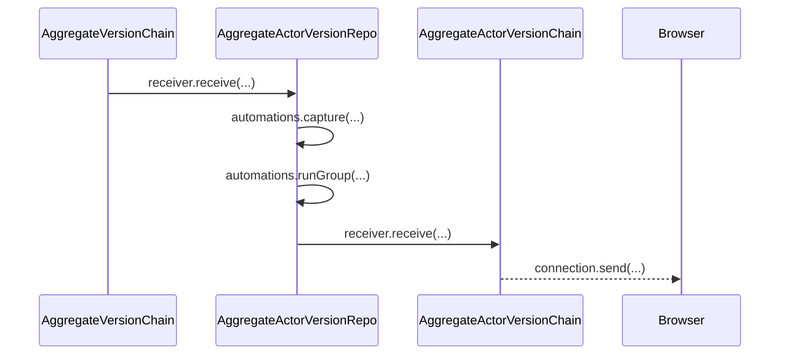
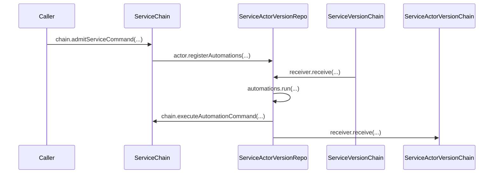

# Domain Automations and Selected Publication

Domain factories return ordinary models, contracts, and automations. The aggregate or service version owns persistence and authoritative execution. An automation observes a confirmed occurrence, saves its outcome, stages any returned command against derived optimistic state, and leaves source admission and materialization to the existing chains. Fixed-schema changes require empty storage.

## Trigger

1. An aggregate actor stages a caller command in AAVR; its pending row references the complete retained command and prepared replay mutations.
2. An admitted aggregate occurrence moves through AC, AVR, and AVC. AAVR consumes its confirmed actor occurrence.
3. A service caller addresses one installed service version through ServiceChain. The chain registers that version's internal automation actor before retaining the first input.

## Aggregate actor workflow

## Annotated workflow steps

1. AVC delivers one confirmed occurrence to AAVR.
   - [`AggregateActorVersionRepo.ts:290-315`](../../../packages/system-worker/src/AggregateActorVersionRepo/AggregateActorVersionRepo.ts#L290-L315) — the receiver serializes projection and skips an already projected occurrence. (`packages/system-worker/src/AggregateActorVersionRepo/AggregateActorVersionRepo.ts:290-315`)
2. AAVR captures the selected graph while holding its actor write permit, then marks pending runs started.
   - [`makeActorAutomations.ts:127-169`](../../../packages/system-worker/src/AggregateActorVersionRepo/automations/makeActorAutomations.ts#L127-L169) — reconstructs optimism, selects resources, and saves start markers. (`packages/system-worker/src/AggregateActorVersionRepo/automations/makeActorAutomations.ts:127-169`)
3. AAVR runs siblings concurrently from isolated copies of that capture, saves each outcome, and stages saved commands before the next group.
   - [`makeActorAutomations.ts:391-402`](../../../packages/system-worker/src/AggregateActorVersionRepo/automations/makeActorAutomations.ts#L391-L402) — runs the pending siblings with unbounded concurrency and finishes the group. (`packages/system-worker/src/AggregateActorVersionRepo/automations/makeActorAutomations.ts:391-402`)
4. AAVR transfers the complete confirmed source row and a separate private completion recipient to AAVC.
   - [`AggregateActorVersionRepo.ts:187-235`](../../../packages/system-worker/src/AggregateActorVersionRepo/AggregateActorVersionRepo.ts#L187-L235) — retains the original input and result fields while setting recipient fields for owned completions. (`packages/system-worker/src/AggregateActorVersionRepo/AggregateActorVersionRepo.ts:187-235`)
5. AAVC sends only selected resources and owned phase summaries to the browser.
   - [`AggregateActorVersionChain.ts:154-195`](../../../packages/system-worker/src/AggregateActorVersionChain/AggregateActorVersionChain.ts#L154-L195) — filters by identity, session, and node before sending the public command. (`packages/system-worker/src/AggregateActorVersionChain/AggregateActorVersionChain.ts:154-195`)

## Service automation workflow

## Annotated workflow steps

1. The caller submits a complete encoded command to its addressed service composition.
   - [`ServiceChain.ts:68-76`](../../../packages/system-worker/src/ServiceChain/ServiceChain.ts#L68-L76) — `admitServiceCommand` enters serialized admission and returns its receipt. (`packages/system-worker/src/ServiceChain/ServiceChain.ts:68-76`)
2. ServiceChain registers the internal `__service` actor at the current frontier before retaining that first input.
   - [`ServiceChain.ts:126-149`](../../../packages/system-worker/src/ServiceChain/ServiceChain.ts#L126-L149) — registers the selected version's internal actor inside the admission permit. (`packages/system-worker/src/ServiceChain/ServiceChain.ts:126-149`)
3. SVC delivers a confirmed service occurrence to SAVR, which advances its actor cursor even for failed or skipped source outcomes.
   - [`ServiceActorVersionRepo.ts:229-251`](../../../packages/system-worker/src/ServiceActorVersionRepo/ServiceActorVersionRepo.ts#L229-L251) — receives one position at a time, executes its projection, and starts automation processing. (`packages/system-worker/src/ServiceActorVersionRepo/ServiceActorVersionRepo.ts:229-251`)
4. SAVR captures one selected view for eligible siblings, saves start markers, runs the programs concurrently, and records output or failure independently.
   - [`makeServiceAutomations.ts:42-170`](../../../packages/system-worker/src/ServiceActorVersionRepo/automations/makeServiceAutomations.ts#L42-L170) — captures, invokes, and saves service runs before staging. (`packages/system-worker/src/ServiceActorVersionRepo/automations/makeServiceAutomations.ts:42-170`)
5. The service output outbox submits a saved run reference. ServiceChain fetches the retained output from its internal actor and admits the saved bytes with automation authority.
   - [`ServiceActorVersionRepo.ts:62-89`](../../../packages/system-worker/src/ServiceActorVersionRepo/ServiceActorVersionRepo.ts#L62-L89) — sends the run reference from pending output delivery. (`packages/system-worker/src/ServiceActorVersionRepo/ServiceActorVersionRepo.ts:62-89`)
   - [`ServiceChain.ts:79-111`](../../../packages/system-worker/src/ServiceChain/ServiceChain.ts#L79-L111) — resolves the saved command and validates its addressed service version. (`packages/system-worker/src/ServiceChain/ServiceChain.ts:79-111`)
6. SAVR transfers the complete confirmed service row to its actor chain; browser replay projects only `id`, cursor, hash, and selected delta.
   - [`ServiceActorVersionRepo.ts:156-189`](../../../packages/system-worker/src/ServiceActorVersionRepo/ServiceActorVersionRepo.ts#L156-L189) — copies the complete source row to the retained actor stream. (`packages/system-worker/src/ServiceActorVersionRepo/ServiceActorVersionRepo.ts:156-189`)
   - [`getActorCommands.ts:38-86`](../../../packages/system-worker/src/ServiceActorVersionChain/getActorCommands/getActorCommands.ts#L38-L86) — projects the selected public service command at replay. (`packages/system-worker/src/ServiceActorVersionChain/getActorCommands/getActorCommands.ts:38-86`)

The AAVR and SAVR command tables use an internal `rowId` to link saved outputs and pending operations. Original command IDs remain unchanged and are scoped by their aggregate or service source. Registration frontiers and saved run states survive activation; a started run without a saved outcome becomes interrupted on recovery.

- [`aggregateActorVersionRepoDbConfig.ts`](../../../packages/system-worker/src/AggregateActorVersionRepo/aggregateActorVersionRepoDbConfig.ts) — declares retained commands, pending references, groups, and runs.
- [`serviceActorVersionRepoDbConfig.ts`](../../../packages/system-worker/src/ServiceActorVersionRepo/serviceActorVersionRepoDbConfig.ts) — declares the corresponding service state.

## Shopping purchase and manual fulfillment

Shopping composes the purchase and fulfillment modules on its V2 aggregate and browser session. The purchase frontend owns checkout/payment/promotion models and public commands; the server module reuses them and adds guarded receipt contracts and provider-backed automations. Acceptance snapshots the quote, promotion commitment precedes purchase creation, and payment success marks the purchase paid before fulfillment is requested.

The fulfillment module enrolls the authoritative service row using a stable purchase-based request ID. Each Pack or Ship request creates a persisted operation. Trusted service admission and completion determine its recorded outcome; uncertain transport leaves it requested. Replica subscriptions carry fulfillment status and tracking updates. The fulfillment service uses manual contracts without its automatic shipping recipe. Purchase status remains paid.

- [Purchase module](../../../packages/purchase/src/makePurchaseModule.ts) — acceptance, collection, and promotion receipt workflows.
- [Fulfillment module](../../../packages/fulfillment/src/makeFulfillmentModule.ts) — enrollment and operation outcomes.
- [Shopping composition](../../../examples/shopping/src/zerospin/aggregates/shopper/shopperAggregateV2.ts) — literal host declarations and final module bindings.
- [Trusted service transport](../../../examples/shopping/src/zerospin/services/trustedService.ts) — authored payload encoding, admission, execution completion, and queries.
