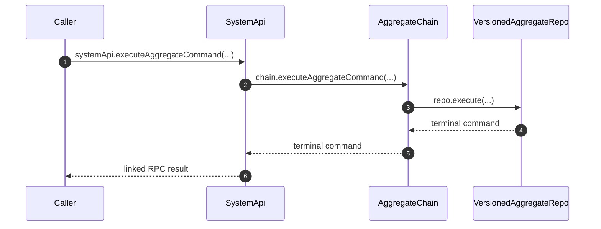

# Aggregate Command Execution

Direct requests return a terminal result from the applied `baseAggregateVersion` VAR. Configured `desiredBaseAggregateVersion` becomes executable only after AC alarm reconciliation promotes it. Frontend push requests return admission receipts instead. Publication proceeds through the durable topology described in [Command Chains](./admitCommands.md).

## Trigger

1. A secret-key caller submits one full aggregate command.
   - [`executeAggregateCommand.ts:34-44`](../../../packages/system-worker/src/SystemApi/executeAggregateCommand/executeAggregateCommand.ts#L34-L44) — Validates the command envelope and obtains the capability-bound systemId.

## Annotated workflow steps

1. A secret-key caller submits one full aggregate command.
   - [`executeAggregateCommand.ts:34-44`](../../../packages/system-worker/src/SystemApi/executeAggregateCommand/executeAggregateCommand.ts#L34-L44) — Validates the command envelope and obtains the capability-bound systemId.
2. AC admits the occurrence idempotently and selects the current base.
   - [`admitCommands.ts`](../../../packages/system-worker/src/AggregateChain/admitCommands/admitCommands.ts) and [`admitCommandsTx.ts`](../../../packages/system-worker/src/AggregateChain/admitCommands/admitCommandsTx.ts) — Validates the complete input before `admitCommandsTx` compares canonical bytes and atomically allocates and retains the command.
3. AC executes the admitted index on the current base, including on retries after cutover.
   - [`executeAggregateCommand.ts:1-30`](../../../packages/system-worker/src/AggregateChain/executeAggregateCommand/executeAggregateCommand.ts#L1-L30) — Resolves the base VAR after admission and requests its committed result.
4. VAR returns the exact terminal occurrence after resource state, disposition, and output commit. A committed retry uses its pending result or VAC.
   - [`execute.ts:1-105`](../../../packages/system-worker/src/VersionedAggregateRepo/execute/execute.ts#L1-L105) — Skips execution through the durable head and recovers the exact requested position.
5. AC returns that version-owned result without waiting for frontend publication.
   - [`AggregateChain.ts`](../../../packages/system-worker/src/AggregateChain/AggregateChain.ts) — Encodes the terminal result and schedules fanout independently.
6. SystemApi returns the traced encoded result.
   - [`executeAggregateCommand.ts:69-80`](../../../packages/system-worker/src/SystemApi/executeAggregateCommand/executeAggregateCommand.ts#L69-L80) — Decodes the chain result within the linked RPC handler.

## Publication and recovery

Direct execution and page receipt start executedCommands outbox delivery on exit.
Service-source subscriptions complete during activation; alarms drain pending output. AC owns
VAR destination enrollment; direct execution retains explicit AC catch-up.

- [`VersionedAggregateRepo.ts:262-274`](../../../packages/system-worker/src/VersionedAggregateRepo/VersionedAggregateRepo.ts#L262-L274) — Schedules output-only delivery after receive.
- [`VersionedAggregateRepo.ts:329-341`](../../../packages/system-worker/src/VersionedAggregateRepo/VersionedAggregateRepo.ts#L329-L341) — Schedules the same executedCommands drain after direct execution.
- [`onDOActivation.ts`](../../../packages/system-worker/src/VersionedAggregateRepo/onDOActivation/onDOActivation.ts) — Initializes and subscribes all declared services before execution begins.
- [`onDOActivation.workerd.spec.ts`](../../../packages/system-worker/src/VersionedAggregateRepo/onDOActivation/onDOActivation.workerd.spec.ts) — Verifies failed receipt and alarm recovery never self-enroll with AC.
- [`flush.ts:1-100`](../../../packages/system-worker/src/VersionedAggregateRepo/flush/flush.ts#L1-L100) — Cutover additionally waits for VAC durability through a fixed index.
- [`preparedExecution.workerd.spec.ts:1-281`](../../../packages/system-worker/src/preparedExecution.workerd.spec.ts#L1-L281) — Verifies exact terminal recovery after executedCommands outbox deletion and cold activation.
