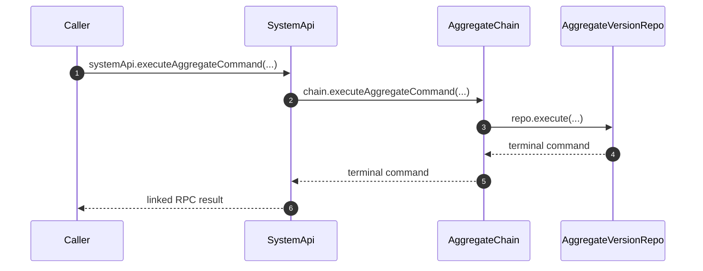

# Aggregate Command Execution

Secret-key and provisioning requests stage in the selected AAVR before direct AC execution. Direct requests return a terminal result from the applied `baseAggregateVersion` AVR. Configured `desiredBaseAggregateVersion` becomes executable only after AC alarm reconciliation promotes it. Session push requests return admission receipts instead. Publication proceeds through the durable topology described in [Command Chains](./admitCommands.md).

## Trigger

1. A secret-key caller submits one full aggregate command.
   - [`executeAggregateCommand.ts:34-44`](../../../packages/system-worker/src/SystemApi/executeAggregateCommand/executeAggregateCommand.ts#L34-L44) — Validates the command envelope and obtains the capability-bound systemId.

```mermaid
sequenceDiagram
  participant Caller
  participant SystemApi
  participant AggregateChain
  participant AggregateVersionRepo
  autonumber 1
  Caller->>SystemApi: systemApi.executeAggregateCommand(...)
  autonumber 2
  SystemApi->>AggregateChain: chain.executeAggregateCommand(...)
  autonumber 3
  AggregateChain->>AggregateVersionRepo: repo.execute(...)
  autonumber 4
  AggregateVersionRepo-->>AggregateChain: terminal command
  autonumber 5
  AggregateChain-->>SystemApi: terminal command
  autonumber 6
  SystemApi-->>Caller: linked RPC result
```

## Annotated workflow steps

1. A secret-key caller submits one full aggregate command.
   - [`executeAggregateCommand.ts:34-44`](../../../packages/system-worker/src/SystemApi/executeAggregateCommand/executeAggregateCommand.ts#L34-L44) — Validates the command envelope and obtains the capability-bound systemId.
2. AC admits the occurrence idempotently and selects the current base.
   - [`admitCommands.ts`](../../../packages/system-worker/src/AggregateChain/admitCommands/admitCommands.ts) and [`admitCommandsTx.ts`](../../../packages/system-worker/src/AggregateChain/admitCommands/admitCommandsTx.ts) — Validates the complete input before `admitCommandsTx` compares canonical bytes and atomically allocates and retains the command.
3. AC executes the admitted index on the current base, including on retries after cutover.
   - [`executeAggregateCommand.ts:1-30`](../../../packages/system-worker/src/AggregateChain/executeAggregateCommand/executeAggregateCommand.ts#L1-L30) — Resolves the base AVR after admission and requests its committed result.
4. AVR returns the exact terminal occurrence after resource state, disposition, and output commit. A committed retry uses its pending result or AVC.
   - [`execute.ts:1-105`](../../../packages/system-worker/src/AggregateVersionRepo/execute/execute.ts#L1-L105) — Skips execution through the durable head and recovers the exact requested position.
5. AC returns that version-owned result without waiting for session publication.
   - [`AggregateChain.ts`](../../../packages/system-worker/src/AggregateChain/AggregateChain.ts) — Encodes the terminal result and schedules fanout independently.
6. SystemApi returns the traced encoded result.
   - [`executeAggregateCommand.ts:69-80`](../../../packages/system-worker/src/SystemApi/executeAggregateCommand/executeAggregateCommand.ts#L69-L80) — Decodes the chain result within the linked RPC handler.

## Publication and recovery

Direct execution and page receipt start `executionResultsOutbox` delivery on exit.
Service-source subscriptions complete during activation; alarms drain pending output. AC owns
AVR destination enrollment; direct execution retains explicit AC catch-up.

- [`AggregateVersionRepo.ts:262-274`](../../../packages/system-worker/src/AggregateVersionRepo/AggregateVersionRepo.ts#L262-L274) — Schedules output-only delivery after receive.
- [`AggregateVersionRepo.ts:329-341`](../../../packages/system-worker/src/AggregateVersionRepo/AggregateVersionRepo.ts#L329-L341) — Schedules the same `executionResultsOutbox` drain after direct execution.
- [`onDOActivation.ts`](../../../packages/system-worker/src/AggregateVersionRepo/onDOActivation/onDOActivation.ts) — Initializes and subscribes all declared services before execution begins.
- [`onDOActivation.workerd.spec.ts`](../../../packages/system-worker/src/AggregateVersionRepo/onDOActivation/onDOActivation.workerd.spec.ts) — Verifies failed receipt and alarm recovery never self-enroll with AC.
- [`flush.ts:1-100`](../../../packages/system-worker/src/AggregateVersionRepo/flush/flush.ts#L1-L100) — Cutover additionally waits for AVC durability through a fixed index.
- [`preparedExecution.workerd.spec.ts:1-281`](../../../packages/system-worker/src/preparedExecution.workerd.spec.ts#L1-L281) — Verifies exact terminal recovery after `executionResultsOutbox` deletion and cold activation.

## Recorded selection provenance

Authenticated inputs retain `actorName` and `actorVersion`. Their actor path is derived from validated selection claims before AAVR staging. Resolve their
exact definition across the aggregate's supported versions before decoding claims.
Capabilities come from the shared system runtime. Identity and read-only
queries are explicit callback arguments. Actor-scoped contract and actor guards
run during AAVR staging; AVR runs aggregate guards inside the authoritative
command transaction. Portable programs and aggregate guards complete synchronously. Trusted
sessionless commands retain explicit actor identity and validated claims.
Declared refusals follow retained failure
publication and optimistic reconciliation.

- [`getAggregateActorVersion.ts`](../../../packages/core/src/aggregateActor/getAggregateActorVersion.ts) — rejects unsupported or conflicting actor versions.
- [`makeSystem.ts`](../../../packages/core/src/system/make/makeSystem/makeSystem.ts) — supplies shared runtime capabilities across invocations.
- [Deferred verification](../../../TODOS.md#versioned-actors--deferred-verification) — cutover coverage intentionally not run.

## Operation results

The returned command has completed `admission` and `execution` results. Admission
rejection retains its failure and skips execution with reason `admission-failed`.
A declared execution rejection lives in `execution.failure`. Infrastructure failures
abort the attempt and remain RPC failures. Resource timestamps use execution's
`startedAt`; `completedAt` records completion of that operation. Delivery retries
return the retained result without changing either timestamp.
