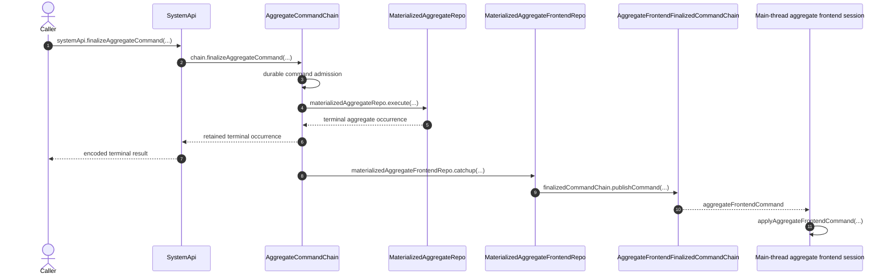

# `finalizeAggregateCommand` Lifecycle

A direct aggregate command has one authoritative source occurrence. SystemApi
derives `{ systemId, aggregateId, aggregateName }` from authenticated
`systemId` plus the complete encoded command, then AggregateCommandChain owns
admission, execution ordering, terminal history, and downstream notification.

- [`finalizeAggregateCommand.ts:24-38`](../../../packages/system-worker/src/SystemApi/finalizeAggregateCommand/finalizeAggregateCommand.ts#L24-L38) — derives the three-field chain key and forwards the unchanged command.
- [`AggregateCommandChain.ts:55-86`](../../../packages/system-worker/src/AggregateCommandChain/AggregateCommandChain.ts#L55-L86) — binds singular finalization to the chain's durable work loop.

## Trigger

1. A secret-key caller invokes
   `systemApi.finalizeAggregateCommand(command)` with one complete encoded
   aggregate command.
   - [`SystemApi.ts:119-134`](../../../packages/system-worker/src/SystemApi/SystemApi.ts#L119-L134) — declares the exact singular request and terminal result.
   - [`executeRpc.ts:20-50`](../../../packages/core/src/utils/executeRpc.ts#L20-L50) — turns a root capability getter into the traceable child API used directly by the callback and retains its batch session through completion.
   - [`makeTraceableApiTarget.ts:35-68`](../../../packages/logger/src/makeTraceableApiTarget.ts#L35-L68) — exposes the request tuple as direct method arguments and injects caller trace context into the wire envelope.

## Annotated workflow steps

1. The caller submits one complete command through the singular SystemApi
   method.
   - [`SystemApi.ts:119-134`](../../../packages/system-worker/src/SystemApi/SystemApi.ts#L119-L134) — immediately delegates to the same-named Effect and returns its linked result.
2. SystemApi resolves the exact AggregateCommandChain and forwards
   `{ command }` without rebuilding its payload.
   - [`finalizeAggregateCommand.ts:24-38`](../../../packages/system-worker/src/SystemApi/finalizeAggregateCommand/finalizeAggregateCommand.ts#L24-L38) — derives the chain identity and calls `chain.finalizeAggregateCommand({ command })`.
3. Under its admission semaphore, AggregateCommandChain returns an exact
   retained command, rejects changed canonical bytes, or durably appends the
   next `aggregateIndex` with the complete command and materializer name.
   - [`finalizeAggregateCommand.ts:64-177`](../../../packages/system-worker/src/AggregateCommandChain/finalizeAggregateCommand/finalizeAggregateCommand.ts#L64-L177) — owns canonical-byte idempotency and the aggregate-indexed admission transaction.
4. The chain's scheduled lane selects only the lowest pending
   `aggregateIndex` and invokes the retained MaterializedAggregateRepo.
   - [`runScheduledWork.ts:51-117`](../../../packages/system-worker/src/AggregateCommandChain/runScheduledWork/runScheduledWork.ts#L51-L117) — restores the pending structural occurrence and executes its retained materializer.
5. MaterializedAggregateRepo returns a terminal occurrence. An execution claim
   with no retained result becomes in-doubt and halts the chain rather than
   rerunning authored code; otherwise the chain validates the returned identity
   and durably commits exact terminal bytes plus subscriber tips.
   - [`runScheduledWork.ts:118-228`](../../../packages/system-worker/src/AggregateCommandChain/runScheduledWork/runScheduledWork.ts#L118-L228) — halts on execution-in-doubt or commits the validated terminal occurrence and queued tips.
6. AggregateCommandChain returns the retained terminal occurrence to SystemApi;
   a still-pending row remains an infrastructure error.
   - [`finalizeAggregateCommand.ts:184-214`](../../../packages/system-worker/src/AggregateCommandChain/finalizeAggregateCommand/finalizeAggregateCommand.ts#L184-L214) — decodes only the retained result after scheduled work.
7. SystemApi encodes the terminal domain occurrence for the caller independently
   of later projection delivery.
   - [`finalizeAggregateCommand.ts:20-44`](../../../packages/system-worker/src/SystemApi/finalizeAggregateCommand/finalizeAggregateCommand.ts#L20-L44) — wraps the chain call in the traced API handler.
8. AggregateCommandChain notifies each subscribed MaterializedAggregateFrontendRepo
   by latest terminal tip; the frontend pulls every missing aggregate
   occurrence and checks its durable execution claim before authored projection.
   An exact completed claim reuses its retained terminal bytes without rerunning;
   an unfinished `{ completedAt: null, result: null }` claim halts in-doubt; a
   new claim commits before projection begins.
   - [`runScheduledWork.ts:346-425`](../../../packages/system-worker/src/AggregateCommandChain/runScheduledWork/runScheduledWork.ts#L346-L425) — queues aggregate-frontend catch-up by subscriber source frontier.
   - [`catchup.ts:215-283`](../../../packages/system-worker/src/MaterializedAggregateFrontendRepo/catchup/catchup.ts#L215-L283) — pages through contiguous source history and rejects incomplete, gapped, or pending input.
   - [`catchup.ts:284-390`](../../../packages/system-worker/src/MaterializedAggregateFrontendRepo/catchup/catchup.ts#L284-L390) — validates or reuses an exact completed claim, halts an unfinished claim, and persists a new null-result claim before entering the projection transaction.
   - [`execute.ts:60-113`](../../../packages/system-worker/src/MaterializedAggregateFrontendRepo/execute/execute.ts#L60-L113) — catches up through the notified index, then requires the exact completed claim and validates any retained terminal result.
9. In one transaction the materialized frontend applies its authoritative base
   update, captures a known projection failure as a completed failed finalized
   occurrence with empty delta, replays optimism, and commits the finalized
   outbox when one exists, claim completion and result, and both frontiers.
   Pending outbox rows then publish in `frontendIndex` order.
   - [`catchup.ts:392-917`](../../../packages/system-worker/src/MaterializedAggregateFrontendRepo/catchup/catchup.ts#L392-L917) — encloses materialized state changes, authored projection, terminal construction, outbox insertion, claim completion, and frontier advancement in one `makeTx`.
   - [`catchup.ts:821-915`](../../../packages/system-worker/src/MaterializedAggregateFrontendRepo/catchup/catchup.ts#L821-L915) — emits empty-delta failed finalized bytes for a known projection failure and stores the outbox, completed claim result, and new aggregate/frontend frontiers.
   - [`runScheduledWork.ts:38-106`](../../../packages/system-worker/src/MaterializedAggregateFrontendRepo/runScheduledWork/runScheduledWork.ts#L38-L106) — publishes ordered outbox rows and records acknowledgement or failure.
10. AggregateFrontendFinalizedCommandChain persists a contiguous occurrence and
    broadcasts one `aggregateFrontendCommand` message to each live connection.
    - [`publishCommand.ts:22-123`](../../../packages/system-worker/src/AggregateFrontendFinalizedCommandChain/publishCommand/publishCommand.ts#L22-L123) — enforces canonical-byte idempotency and contiguous `frontendIndex` before broadcast.
    - [`AggregateFrontendFinalizedCommandChain.ts:58-98`](../../../packages/system-worker/src/AggregateFrontendFinalizedCommandChain/AggregateFrontendFinalizedCommandChain.ts#L58-L98) — sends exactly one singular command message and closes replay races.
11. Each main-thread aggregate frontend session validates and applies the
    finalized occurrence directly to its in-memory SQLite database, resolves
    the exact originating push when present, replays unresolved optimism, and
    updates its visible frontiers after commit.
    - [`applyAggregateFrontendCommand.ts:152-420`](../../../packages/core/src/session/applyAggregateFrontendCommand.ts#L152-L420) — validates source order, applies the authoritative delta, resolves the exact push, and replays surviving optimism atomically.
    - [`bootstrapAggregateFrontendSession.ts:649-700`](../../../packages/frontend/src/bootstrapAggregateFrontendSession.ts#L649-L700) — applies each live socket occurrence and refreshes the session frontiers.

## Recovery and retry boundaries

The source API can complete after the terminal aggregate occurrence is
retained; frontend materialization and socket delivery remain durable
downstream work. Exact duplicates are byte-idempotent, changed duplicates and
index gaps fail, and scheduled lanes keep pending output discoverable.

- [`runScheduledWork.ts:427-445`](../../../packages/system-worker/src/AggregateCommandChain/runScheduledWork/runScheduledWork.ts#L427-L445) — reschedules pending source or subscriber lanes and clears the alarm only when all are drained.
- [`runScheduledWork.ts:127-140`](../../../packages/system-worker/src/MaterializedAggregateFrontendRepo/runScheduledWork/runScheduledWork.ts#L127-L140) — retains an alarm while finalized output remains unpublished.
- [`getCommands.ts:11-70`](../../../packages/system-worker/src/AggregateFrontendFinalizedCommandChain/getCommands/getCommands.ts#L11-L70) — supports paginated contiguous repair from any retained `frontendIndex`.

## Callers

- [Command chains and materialization](../CommandChains.md)
- [Aggregate frontend push](../browser/PushSequence.md)
- [Frontend WebSocket](../browser/FrontendWebSocket.md)
