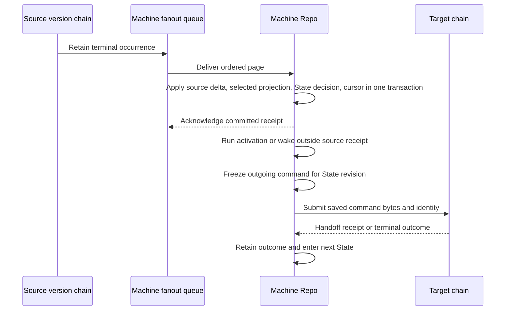

# Durable Machine Actors

A System registers named machines bound to a concrete aggregate or service version. Aggregate instances use `(systemId, aggregateName, aggregateId, machineName)` as their owner key; service instances use `(systemId, serviceName, machineName)`. The source version is a persisted pin and can change without changing the instance key. A changed fixed schema requires empty storage in pre-release.

## Trigger

1. `makeSystem` validates the machine registry and its source membership. The Worker exports aggregate and service machine Repo classes.
2. Before the first external aggregate command is admitted, AggregateChain opens matching machines so their bootstrap frontier precedes that command. System initialization opens service machines.
3. AggregateVersionChain and ServiceVersionChain retain terminal occurrence history and independently fan it out to machine subscribers. Browser actor projection remains a separate recipient.

## Source receipt and State work

## Annotated workflow steps

1. On first creation, the machine captures a bounded source frontier, replays it into its disposable projection without calling `onCommand`, and enters `onBootstrap` once. On restart it catches up unseen occurrences; a changed pin rebuilds the projection and invokes `onVersionChange` once.
   - [Machine preparation](../../../packages/system-worker/src/makeMachineRepo/makeMachineRepo.ts) and [machine tables](../../../packages/system-worker/src/makeMachineRepo/machineDbConfig.ts).
2. Each terminal occurrence advances one contiguous cursor position. The local transaction applies successful source mutations, refreshes only declared selections, calls `onCommand` with the updated selected database, validates any returned State, and rolls back all of that on failure.
   - [Receipt transaction](../../../packages/system-worker/src/makeMachineRepo/machineStateTx.ts) and [fanout subscriber](../../../packages/system-worker/src/makeFanoutSubscriber/makeFanoutSubscriber.ts).
3. A State revision has at most one automatic work form: absolute `wakeAt`/`onWake`, `onActivation`, or frozen `command`/`onResult`. An activation runs outside the local gate; a newer revision interrupts it and rejects any late completion. Unhandled activation failure stays recorded.
   - [State declaration](../../../packages/core/src/machine/makeState/makeState.ts) and [machine runtime](../../../packages/system-worker/src/makeMachineRepo/makeMachineRepo.ts).
4. State entry freezes command payload, target pin, mode, claims, and identity. Aggregate and service chains verify the saved command against the owner and the target version's contract; normal guards still run. Recovery reuses the same bytes and command ID. `push` returns a durable handoff receipt; `execute` returns a terminal outcome.
   - [Frozen command proof](../../../packages/system-worker/src/verifyMachineFrozenCommand.ts), [aggregate admission](../../../packages/system-worker/src/AggregateChain/admitCommands/admitCommands.ts), and [service admission](../../../packages/system-worker/src/ServiceChain/admitServiceCommand/admitServiceCommand.ts).

## Shopping purchase and fulfillment

Shopping registers machines for purchase acceptance, payment, promotion, paid fulfillment enrollment, and fulfillment operations. They observe the shopper aggregate's selected rows, keep accepted provider inputs in private State, and submit guarded receipt contracts. A separate service machine can automatically ship packed fulfillment rows when that recipe is registered. Browser actors and sessions expose only their declared public commands.

- [Purchase machines](../../../packages/purchase/src/makeAcceptPurchaseMachine.ts) and [purchase contracts](../../../packages/purchase/src/makePurchaseModule.ts).
- [Fulfillment machines](../../../packages/fulfillment/src/makePaidFulfillmentMachine.ts) and [fulfillment contracts](../../../packages/fulfillment/src/makeFulfillmentModule.ts).
- [Shopping registration](../../../examples/shopping/src/zerospin/system.ts) and [Workerd lifecycle test](../../../packages/system-worker/src/AggregateActorVersionRepo/machinePurchase.workerd.spec.ts).
