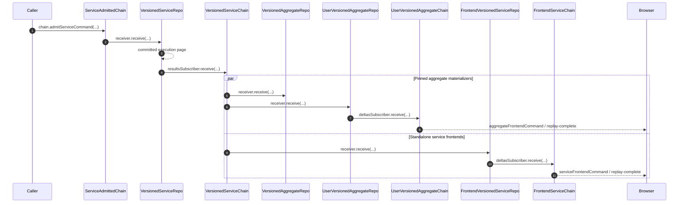

# Versioned Service Execution and Delivery

Service admission, execution, retained outcomes, frontend projection, and browser delivery have separate durable owners. Service model versions remain attached to source resources until aggregate mutation adaptation prepares their destination representation.

## Trigger

1. SystemApi admits a complete service command under its configured systemId and the caller-supplied serviceName.
   - [`admitServiceCommand.ts`](../../../packages/system-worker/src/SystemApi/admitServiceCommand/admitServiceCommand.ts) — Validation stays at the SystemApi boundary and admission returns commandId and serviceIndex.

## Annotated workflow steps

1. SAC commits complete input bytes and a contiguous serviceIndex; the public call returns an admission receipt.
   - [`admitServiceCommand.ts`](../../../packages/system-worker/src/ServiceAdmittedChain/admitServiceCommand/admitServiceCommand.ts) — Exact-byte retries reuse the retained index and conflicting command IDs fail.
2. Durable SAC fanout drains admitted pages to registered service materializers, including older pinned versions after a base cutover.
   - [`ServiceAdmittedChain.ts`](../../../packages/system-worker/src/ServiceAdmittedChain/ServiceAdmittedChain.ts) — Supplies the VSR lookup and filters invalidated materializers before subscriber pagination.
   - [`makeFanoutQueue.ts`](../../../packages/system-worker/src/makeFanoutQueue/makeFanoutQueue.ts) — Parses the retained subscriber name, sends full admitted rows to its named receiver, and acknowledges the page after receipt succeeds.
3. VSR prepares a bounded page before its transaction and commits mutations, terminal outcomes, disposition hash, head, and result outbox together.
   - [`VersionedServiceRepo.ts`](../../../packages/system-worker/src/VersionedServiceRepo/VersionedServiceRepo.ts) — The subscriber holds the results alarm, applies supplied rows under the shared execution permit, and schedules results drain on exit.
   - [`executeCommands.ts`](../../../packages/system-worker/src/VersionedServiceRepo/executeCommands/executeCommands.ts) — Skips committed positions and validates the remaining contiguous input suffix before preparation.
   - [`executeCommandsTx.ts`](../../../packages/system-worker/src/VersionedServiceRepo/executeCommands/executeCommandsTx.ts) — Applies command savepoints and commits terminal outcomes, resource changes, disposition hash, and head inside one transaction.
4. The results outbox delivers complete execution entries into VSC; VSC holds alarm leases for all three consumer queues before committing retained results.
   - [`receiveResults.ts`](../../../packages/system-worker/src/VersionedServiceChain/receiveResults/receiveResults.ts) — Validates contiguous indices, duplicate bytes, and the extending disposition hash.
   - [`VersionedServiceChain.ts`](../../../packages/system-worker/src/VersionedServiceChain/VersionedServiceChain.ts) — Holds each fanout alarm lease and schedules delivery after retained-result processing, including duplicate retries.
5. The pinned VSC delivers complete service execution entries directly to VAR.
   - [`VersionedServiceChain.ts`](../../../packages/system-worker/src/VersionedServiceChain/VersionedServiceChain.ts) — Binds a separate typed queue to VAR subscribers and forwards retained suffix rows.
   - [`receiveServiceCommandsTx.ts`](../../../packages/system-worker/src/VersionedAggregateRepo/receiveServiceCommandsTx.ts) — Applies service changes only to enrolled resources and advances the service source cursor without producing an aggregate result.
6. The same pinned VSC independently delivers complete entries to UVAR.
   - [`VersionedServiceChain.ts`](../../../packages/system-worker/src/VersionedServiceChain/VersionedServiceChain.ts) — Binds a separate typed queue to UVAR subscribers.
   - [`executeTx.ts`](../../../packages/system-worker/src/UserVersionedAggregateRepo/execute/executeTx.ts) — Validates source order and applies newer service mutations to enrolled copies while retaining aggregate progress.
7. UVAR projects its combined resource state and publishes one output into UVAC for every consumed source occurrence.
   - [`executeTx.ts`](../../../packages/system-worker/src/UserVersionedAggregateRepo/execute/executeTx.ts) — Increments `userIndex` independently, derives the projected delta, and uses `resolution: null` for service-only output.
8. The aggregate browser resumes one combined frontend stream by `userIndex`.
   - [`onMessage.ts`](../../../packages/system-worker/src/UserVersionedAggregateChain/onMessage/onMessage.ts) — Replays the contiguous frontend suffix and reports its frontend completion position.
9. The existing VSC replica fanout separately feeds pinned FVSR instances for standalone service frontends.
   - [`VersionedServiceChain.ts`](../../../packages/system-worker/src/VersionedServiceChain/VersionedServiceChain.ts) — Retains the FVSR queue and subscriber identity.
   - [`executeTx.ts`](../../../packages/system-worker/src/FrontendVersionedServiceRepo/execute/executeTx.ts) — Replays successful mutations without service programs and commits projected progress for failed and empty positions too.
10. FVSR publishes through its delta outbox into FSC.
    - [`receiveDeltas.ts`](../../../packages/system-worker/src/FrontendServiceChain/receiveDeltas/receiveDeltas.ts) — Retains exact contiguous outputs before acknowledgment and live broadcast.
11. A standalone service browser resumes its pinned stream strictly after the captured serviceIndex.
    - [`onMessage.ts`](../../../packages/system-worker/src/FrontendServiceChain/onMessage/onMessage.ts) — Replays a contiguous suffix before transitioning the connection to live delivery.

## Durable identities and version selection

| Owner        | Exact identity                                                    |
| ------------ | ----------------------------------------------------------------- |
| SAC          | `{ systemId, serviceName }`                                       |
| VSR and VSC  | `{ systemId, serviceName, serviceVersion }`                       |
| FVSR and FSC | `{ systemId, serviceName, serviceVersion, userId, frontendName }` |

Worker configuration supplies systemId; the admitted command or capability supplies serviceName. SAC registration/base selection supplies serviceVersion for standalone service frontends; an aggregate definition supplies the serviceVersion used by its replica fetches and direct VSC subscriptions. Authentication supplies userId and the admitted frontend capability supplies frontendName. An existing browser session retains its selected version until rebootstrap.

- [`serviceAdmittedChainFixedDORepoConfig.ts`](../../../packages/system-worker/src/ServiceAdmittedChain/serviceAdmittedChainFixedDORepoConfig.ts) — SAC physical identity is independent of service version.
- [`versionedServiceRepoFixedDORepoConfig.ts`](../../../packages/system-worker/src/VersionedServiceRepo/versionedServiceRepoFixedDORepoConfig.ts) — The materializer selects its fixed resource schema from the bound service slice.
- [`frontendVersionedServiceRepoFixedDORepoConfig.ts`](../../../packages/system-worker/src/FrontendVersionedServiceRepo/frontendVersionedServiceRepoFixedDORepoConfig.ts) — The frontend replica adds its pinned service version, user, and frontend.
- [`getState.ts`](../../../packages/system-worker/src/ServiceFrontendApi/getState/getState.ts) — Snapshot requests select the base once, flush admitted progress, and resolve that versioned projection.

## Promotion and pinned aggregate delivery

SystemApi.cutoverServiceVersion requires a registered candidate whose numeric major/minor/patch version is newer than the current base and compares parallel base/candidate flushes at a sampled service position. Flush zero returns the genesis checkpoint. A disposition mismatch invalidates the candidate; matching histories permit a compare-and-swap of the base. Admissions continue while remote flushes run, without a database transaction spanning those calls. The cutover leaves registered pinned materializers and their retained histories available. Exact-base retries return already-promoted; suffix-only differences and numerically older versions cannot be promoted. Historical pins enroll through their subscriber capability without an initialization RPC.

- [`isSemVerOlder.ts`](../../../packages/core/src/utils/isSemVerOlder.ts) — Compares numeric major/minor/patch components without using prerelease or build suffixes for precedence.
- [`VersionedServiceRepo.ts`](../../../packages/system-worker/src/VersionedServiceRepo/VersionedServiceRepo.ts) — Establishes historical-version subscription during activation; resource reads use catchup without re-enrollment.
- [`cutover.ts`](../../../packages/system-worker/src/ServiceAdmittedChain/cutover/cutover.ts) — Validates numeric version order and flushes base and candidate concurrently at the sampled admitted position.
- [`cutover.ts`](../../../packages/system-worker/src/ServiceAdmittedChain/cutover/cutover.ts) — Rechecks the base, records divergent candidates, and updates only the selected base on promotion.
- [`flush.ts`](../../../packages/system-worker/src/VersionedServiceRepo/flush/flush.ts) — Returns commandId and dispositionHash only after retained result publication.

Each aggregate snapshot declares one service version per service name. Its replicas select explicit source model versions that must exactly match the models exposed by those pinned service snapshots. A later service-base promotion does not change these authored pins. AC admits aggregate commands only; VAR and UVAR own independent subscriptions to the pinned VSC histories.

- [`makeReplica.ts`](../../../packages/core/src/models/makeReplica.ts) — Requires an explicit modelVersion while retaining canonical source-model provenance.
- [`resolveSystemAggregate.ts`](../../../packages/core/src/system/resolveSystemAggregate.ts) — Validates aggregate service pins, service snapshot availability, and exact replica model-version agreement.
- [`aggregateChainDbConfig.ts`](../../../packages/system-worker/src/AggregateChain/aggregateChainDbConfig.ts) — Stores only encoded aggregate command inputs in admitted history.
- [`onDOActivation.ts`](../../../packages/system-worker/src/VersionedAggregateRepo/onDOActivation/onDOActivation.ts) — Initializes every selected aggregate service pin before catching up and subscribing during activation.
- [`onDOActivation.ts`](../../../packages/system-worker/src/UserVersionedAggregateRepo/onDOActivation/onDOActivation.ts) — Initializes UVAR's declared sources, then subscribes its aggregate and service feeds without an execution permit.

VAR fetches the authoritative initial copy from the pinned VSR and retains serviceName, serviceVersion, serviceIndex, and resource on the prepared replication mutation. Within the command savepoint it installs effective copies and their source positions before guards. A newer enrolled copy wins over an older fetch, and rejection rolls provisional changes back. Successful VAC entries carry the effective initial copies to UVAR.

- [`getReplicatedResources.ts`](../../../packages/system-worker/src/VersionedAggregateRepo/getReplicatedResources/getReplicatedResources.ts) — Selects the authored service pin, captures the source materializer's resource position, and prepares any missing retained suffix before initial enrollment.
- [`executeCommandsTx.ts`](../../../packages/system-worker/src/VersionedAggregateRepo/executeCommands/executeCommandsTx.ts) — Installs initial replicas before guards, retains newer enrolled copies, and publishes successful prepared mutations with their effective source positions.

Each service target binds `{ systemId, serviceName, serviceVersion }`: the aggregate Repo supplies `systemId`, and the selected authored aggregate snapshot supplies the pinned name and version. Activation creates a `services` row keyed by `serviceName` with only `lastIndex`; the version is read from the selected definition. The accessor rejects an owner mismatch, a version outside the selected definition, or an absent service cursor before returning the capability. `subscriber.subscribe(index?)` uses the same receive operation for pull catch-up and live delivery, captures one destination when none is supplied, and enrolls its committed cursor afterward. Activation establishes all declared subscriptions; explicit reads use catchup without re-enrollment.

- [`VersionedAggregateRepo.ts`](../../../packages/system-worker/src/VersionedAggregateRepo/VersionedAggregateRepo.ts) — Validates the requested owner, selected service version, and committed service cursor before exposing its source-bound subscriber.
- [`UserVersionedAggregateRepo.ts`](../../../packages/system-worker/src/UserVersionedAggregateRepo/UserVersionedAggregateRepo.ts) — Applies the same source capability check for aggregate frontend replicas.

- [`makeFanoutSubscriber.ts`](../../../packages/system-worker/src/makeFanoutSubscriber/makeFanoutSubscriber.ts) — Uses the first page's tip as a fixed destination and rereads durable progress after receipt.
- [`makeFanoutSubscriber.ts`](../../../packages/system-worker/src/makeFanoutSubscriber/makeFanoutSubscriber.ts) — Performs source enrollment after catch-up without a receiver permit.
- [`onDOActivation.ts`](../../../packages/system-worker/src/UserVersionedAggregateRepo/onDOActivation/onDOActivation.ts) — Declares sources before resource enrollment and awaits their subscriptions during activation.

Both aggregate materializers track service progress in `services.lastIndex`, independently from aggregate progress. Each replica-model row retains its own `serviceIndex` beside `deletedAt`; row existence, including a tombstone, establishes resource membership. Browser-only provisional copies have a null `serviceIndex` until authoritative source progress is known. Server replay requires a numeric position for committed copies. Service replay skips already consumed indices and rejects gaps; the service cursor does not retain duplicate bytes. Service delivery changes only enrolled resources; failed or unrelated occurrences still advance the source cursor. When a new resource's initial copy predates an already consumed service cursor, its missing VSC suffix is read before enrollment commits. This bounded preparation preserves the existing source cursor and closes the late-enrollment gap. Resource enrollment never creates service subscriptions or rewinds source progress. Failed activation propagates; a subsequent activation resumes committed catch-up. Queue alarms recover output delivery.

- [`userVersionedAggregateRepoDbConfig.ts`](../../../packages/system-worker/src/UserVersionedAggregateRepo/userVersionedAggregateRepoDbConfig.ts) — Persists only the last consumed index for each declared service.
- [`makeReplica.ts`](../../../packages/core/src/models/makeReplica.ts) — Adds per-copy source position and deletion state to the exact source model schema.
- [`sourceReplay.node.spec.ts`](../../../packages/system-worker/src/UserVersionedAggregateRepo/execute/sourceReplay.node.spec.ts) — Verifies newer-copy retention, late tombstones, and source-position rollback with failed projection.
- [`execute.ts`](../../../packages/system-worker/src/UserVersionedAggregateRepo/execute/execute.ts) — Reads retained history through committed service progress before preparing a late resource's initial copy.
- [`executeTx.ts`](../../../packages/system-worker/src/UserVersionedAggregateRepo/execute/executeTx.ts) — Ignores unenrolled service changes and prevents older copies from overwriting an enrolled resource.
- [`onDOActivation.ts`](../../../packages/system-worker/src/UserVersionedAggregateRepo/onDOActivation/onDOActivation.ts) — Preserves declared source cursors across activation; output queues register their delivery independently.

## Snapshot and failure boundaries

FVSR subscribes its pinned finalized service feed during activation. It maintains service source tables and the preceding projected graph; snapshot reads catch up without re-enrollment. Successful prepared mutations update source state; failed and empty positions still produce one output. Projection failure rolls back the replay page; when returned to fanout, it terminally fails that subscriber. Snapshot resources and serviceIndex are captured together under the execution semaphore, then FSC publication is awaited after releasing it. Tickets carry the snapshot's serviceVersion, and reconnect uses serviceIndex as its only cursor.

- [`onDOActivation.ts`](../../../packages/system-worker/src/FrontendVersionedServiceRepo/onDOActivation/onDOActivation.ts) — Awaits upstream catch-up and enrollment before serving the replica.
- [`getState.ts`](../../../packages/system-worker/src/FrontendVersionedServiceRepo/getState/getState.ts) — Captures the graph and cursor together and waits for bounded output publication outside execution exclusivity.
- [`createWebSocketTicket.ts`](../../../packages/system-worker/src/ServiceFrontendApi/createWebSocketTicket/createWebSocketTicket.ts) — Requires the matching versioned projection registration and persists the pinned finalized-chain name.

The service subscriber commits supplied admitted envelopes through `executeCommands`. The index-driven `execute` path delegates paging to `subscriber.catchup(serviceIndex)`, then recovers the requested terminal result from the local outbox or retained VSC history. Pulled and pushed rows use the same receive Effect under the owner's execution semaphore; source page requests hold no receiver permit. Empty and fully committed pages succeed, while an uncommitted suffix must begin at `head + 1` and remain contiguous. Input validation precedes writes, domain rejection rolls back one command, and infrastructure failure aborts the complete page transaction.

- [`VersionedServiceRepo.ts`](../../../packages/system-worker/src/VersionedServiceRepo/VersionedServiceRepo.ts) — Runs subscriber execution under the permit and schedules the result outbox on every execution outcome.
- [`execute.ts`](../../../packages/system-worker/src/VersionedServiceRepo/execute/execute.ts) — Delegates bounded admissions to the subscriber and recovers the requested terminal result from the local outbox or retained finalized history.
- [`executeCommands.ts`](../../../packages/system-worker/src/VersionedServiceRepo/executeCommands/executeCommands.ts) — Validates only the uncommitted suffix's inputs and prepares each command before the page transaction.
- [`executeCommandsTx.ts`](../../../packages/system-worker/src/VersionedServiceRepo/executeCommands/executeCommandsTx.ts) — Separates command savepoint rejection from infrastructure failure and atomically retains result rows with execution progress.

See [fanout scheduling and terminal failures](./admitCommands.md#fanout-scheduling-and-terminal-failures) for pending delivery exclusion and row-tail acknowledgement, and [activation subscriptions and snapshot catch-up](./admitCommands.md#subscription-and-snapshot-recovery) for the bounded pull-to-push handoff.

## Verification

- [`serviceExecution.workerd.spec.ts`](../../../packages/system-worker/src/serviceExecution.workerd.spec.ts) — Exercises admission, durable execution, published state, cold recovery, and duplicate retained-result publication.
- [`executeCommands.node.spec.ts`](../../../packages/system-worker/src/VersionedServiceRepo/executeCommands/executeCommands.node.spec.ts) — Exercises supplied rows without history lookup, duplicate and overlapping pages, input failures, domain rejection, and atomic rollback followed by retry.
- [`serviceExecution.workerd.spec.ts`](../../../packages/system-worker/src/serviceExecution.workerd.spec.ts) — Receives concurrent overlapping pages while SAC has no retained inputs, observes publication, and retries after cold activation.
- [`serviceReplication.node.spec.ts`](../../../packages/system-worker/src/serviceReplication.node.spec.ts) — Exercises pinned initial copies, source positions, missing resources and pins, and strict candidate invalidation when replicas change a guard outcome.
- [`sourceReplay.node.spec.ts`](../../../packages/system-worker/src/UserVersionedAggregateRepo/execute/sourceReplay.node.spec.ts) — Exercises independent output order, late enrollment, newer copies, and tombstones in UVAR.
- [`UserVersionedAggregateRepo.workerd.spec.ts`](../../../packages/system-worker/src/UserVersionedAggregateRepo/UserVersionedAggregateRepo.workerd.spec.ts) — Verifies activation-declared sources before resource enrollment and source validation across cold activation.
- [`cutover.node.spec.ts`](../../../packages/system-worker/src/ServiceAdmittedChain/cutover/cutover.node.spec.ts) — Exercises numeric version precedence independently of discovery order, suffix-only rejection, invalidation, concurrent base changes, and retry after a failed promotion commit.
- [`pinnedServiceReplicas.workerd.spec.ts`](../../../packages/system-worker/src/pinnedServiceReplicas.workerd.spec.ts) — Enrolls a never-current historical service version, rejects backward cutover, and observes its later pushed publication without requesting another catch-up.
- [`execute.node.spec.ts`](../../../packages/system-worker/src/FrontendVersionedServiceRepo/execute/execute.node.spec.ts) — Exercises gap rejection and projection rollback with whole-page retry.
- [`FrontendServiceChain.workerd.spec.ts`](../../../packages/system-worker/src/FrontendServiceChain/FrontendServiceChain.workerd.spec.ts) — Exercises retained output duplicates, gaps, and nonzero version-pinned WebSocket replay.

## Prepared service payloads

Service execution decodes and adapts an incoming command once per attempt, then
retains the payload used by its program alongside the prepared mutations. The
transaction passes that payload directly to the contract guard, without another
decode or adaptation. Guards still run inside the command savepoint, and rejection
rolls back command changes. A rolled-back attempt prepares again; committed retries
skip the retained command. Prepared payloads are not serialized into results.

- [`executeCommands.ts`](../../../packages/system-worker/src/VersionedServiceRepo/executeCommands/executeCommands.ts) — Captures the validated program payload in the successful preparation result.
- [`executeCommandsTx.ts`](../../../packages/system-worker/src/VersionedServiceRepo/executeCommands/executeCommandsTx.ts) — Runs the guard with the prepared payload and retains the original command.
- [`preparedPayload.node.spec.ts`](../../../packages/system-worker/src/preparedPayload.node.spec.ts) — Tests upward/downward adapters, payload reuse, rejection, and retries.
