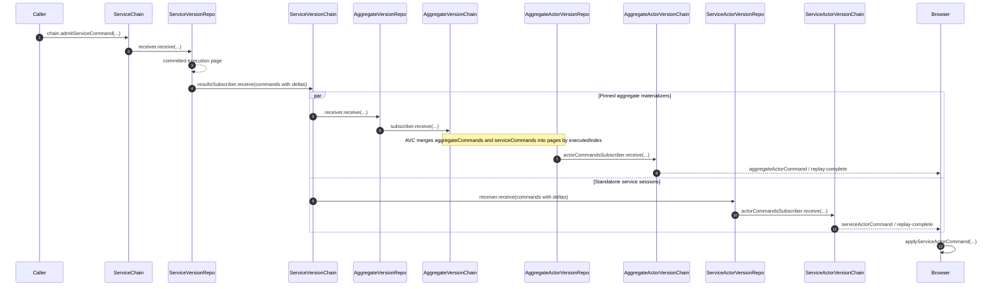

# Versioned Service Execution and Delivery

Service admission, execution, retained outcomes, session projection, and browser delivery have separate durable owners. Service model versions remain attached to source resources until aggregate mutation adaptation prepares their destination representation.

## Trigger

1. SystemApi admits a complete service command under its configured systemId and the caller-supplied serviceName.
   - [`admitServiceCommand.ts`](../../../packages/system-worker/src/SystemApi/admitServiceCommand/admitServiceCommand.ts) — Validation stays at the SystemApi boundary and admission returns commandId and serviceIndex.

```mermaid
sequenceDiagram
  participant Caller
  participant SC as ServiceChain
  participant SVR as ServiceVersionRepo
  participant SVC as ServiceVersionChain
  participant AVR as AggregateVersionRepo
  participant AVC as AggregateVersionChain
  participant AAVR as AggregateActorVersionRepo
  participant AAVC as AggregateActorVersionChain
  participant SAVR as ServiceActorVersionRepo
  participant SAVC as ServiceActorVersionChain
  participant Browser
  autonumber 1
  Caller->>SC: chain.admitServiceCommand(...)
  autonumber 2
  SC->>SVR: receiver.receive(...)
  autonumber 3
  SVR-->>SVR: committed execution page
  autonumber 4
  SVR->>SVC: resultsSubscriber.receive(commands with deltas)
  par Pinned aggregate materializers
    autonumber 5
    SVC->>AVR: receiver.receive(...)
    autonumber 6
    AVR->>AVC: subscriber.receive(...)
    Note over AVC,AAVR: AVC merges aggregateCommands and serviceCommands into pages by executedIndex
    autonumber 7
    AAVR->>AAVC: actorCommandsSubscriber.receive(...)
    autonumber 8
    AAVC-->>Browser: aggregateActorCommand / replay-complete
  and Standalone service sessions
    autonumber 9
    SVC->>SAVR: receiver.receive(commands with deltas)
    autonumber 10
    SAVR->>SAVC: actorCommandsSubscriber.receive(...)
    autonumber 11
    SAVC-->>Browser: serviceActorCommand / replay-complete
  end
  autonumber 12
  Browser->>Browser: applyServiceActorCommand(...)
```

## Annotated workflow steps

1. SC commits complete input bytes and a contiguous serviceIndex; the public call returns an admission receipt.
   - [`admitServiceCommand.ts`](../../../packages/system-worker/src/ServiceChain/admitServiceCommand/admitServiceCommand.ts) — Exact-byte retries reuse the retained index and conflicting command IDs fail.
2. Durable SC fanout drains admitted pages to registered service materializers, including older pinned versions after a base cutover.
   - [`ServiceChain.ts`](../../../packages/system-worker/src/ServiceChain/ServiceChain.ts) — Supplies the SVR lookup and filters invalidated materializers before subscriber pagination.
   - [`makeFanoutQueue.ts`](../../../packages/system-worker/src/makeFanoutQueue/makeFanoutQueue.ts) — Parses the retained subscriber name, sends full admitted rows to its named receiver, and acknowledges the page after receipt succeeds.
3. SVR prepares a bounded page before its transaction and commits mutations, terminal outcomes, disposition hash, head, and result outbox together.
   - [`ServiceVersionRepo.ts`](../../../packages/system-worker/src/ServiceVersionRepo/ServiceVersionRepo.ts) — The subscriber holds the results alarm, applies supplied rows under the shared execution permit, and schedules results drain on exit.
   - [`executeCommands.ts`](../../../packages/system-worker/src/ServiceVersionRepo/executeCommands/executeCommands.ts) — Skips committed positions and validates the remaining contiguous input suffix before preparation.
   - [`executeCommandsTx.ts`](../../../packages/system-worker/src/ServiceVersionRepo/executeCommands/executeCommandsTx.ts) — Applies command savepoints and commits terminal outcomes, resource changes, disposition hash, and head inside one transaction.
4. The results outbox delivers executed commands, authoritative deltas, and applied mutation rows into SVC; SVC retains each command and its forward/inverse operations atomically before acknowledgement.
   - [`receiveResults.ts`](../../../packages/system-worker/src/ServiceVersionChain/receiveResults/receiveResults.ts) — Validates contiguous indices, duplicate bytes, and the extending disposition hash.
   - [`ServiceVersionChain.ts`](../../../packages/system-worker/src/ServiceVersionChain/ServiceVersionChain.ts) — Holds each fanout alarm lease and schedules delivery after retained-result processing, including duplicate retries.
5. The pinned SVC delivers executed service commands with authoritative deltas directly to AVR.
   - [`ServiceVersionChain.ts`](../../../packages/system-worker/src/ServiceVersionChain/ServiceVersionChain.ts) — Binds a separate typed queue to AVR subscribers and forwards retained suffix rows.
   - [`receiveServiceCommandsTx.ts`](../../../packages/system-worker/src/AggregateVersionRepo/receiveServiceCommandsTx.ts) — Applies service changes only to enrolled resources and atomically advances source and materialization progress with one effective service-application output.
6. AVR publishes service applications through the same outbox and AVC materialization order as aggregate results. AVC retains local applied replica operations with the command occurrence and fans the existing delta stream to AAVR.
   - [`ServiceVersionChain.ts`](../../../packages/system-worker/src/ServiceVersionChain/ServiceVersionChain.ts) — Binds the AVR source subscription.
7. AAVR projects its combined resource state and transfers the complete confirmed command into AAVC for every consumed source occurrence. AAVC derives the public actor command at delivery.
   - [`AggregateActorVersionRepo.ts`](../../../packages/system-worker/src/AggregateActorVersionRepo/AggregateActorVersionRepo.ts) — copies retained input and results with separate completion-recipient fields.
8. The aggregate browser resumes one combined session stream by `executedIndex`.
   - [`onMessage.ts`](../../../packages/system-worker/src/AggregateActorVersionChain/onMessage/onMessage.ts) — Replays the contiguous session suffix and reports its session completion position.
9. The existing SVC replica fanout separately feeds pinned SAVR instances for standalone service sessions. SAVR holds its output alarm before replay; one synchronous transaction validates the cursor and commits projection, progress, and output without an execution semaphore.
   - [`ServiceVersionChain.ts`](../../../packages/system-worker/src/ServiceVersionChain/ServiceVersionChain.ts) — Retains the SAVR queue and subscriber identity.
   - [`executeTx.ts`](../../../packages/system-worker/src/ServiceActorVersionRepo/execute/executeTx.ts) — Replays successful mutations without service programs and commits projected progress for failed and empty positions too.
10. SAVR evaluates its service actor selections and transfers complete confirmed service commands through its `commands` outbox into SAVC. SAVC projects the small browser command at delivery.
    - [`serviceActorVersionChainDbConfig.ts`](../../../packages/system-worker/src/ServiceActorVersionChain/serviceActorVersionChainDbConfig.ts) — retains the complete source command shape and its actor publication position.
    - [`receiveActorCommands.ts`](../../../packages/system-worker/src/ServiceActorVersionChain/receiveActorCommands/receiveActorCommands.ts) — validates exact duplicate bytes and contiguous service positions, inserts actor commands before acknowledgment, and then broadcasts live.
11. A standalone service browser resumes its pinned stream strictly after the captured serviceIndex.
    - [`onMessage.ts`](../../../packages/system-worker/src/ServiceActorVersionChain/onMessage/onMessage.ts) — Replays a contiguous suffix before transitioning the connection to live delivery.
12. The browser applies each `IServiceActorCommand` in order: resource upserts
    and deletions commit atomically with the new `serviceIndex` and `serviceHash`.
    Duplicate positions are ignored, while a gap fails recovery instead of
    skipping session history.
    - [`applyServiceActorCommandTx.ts`](../../../packages/core/src/serviceSession/applyServiceActorCommand/applyServiceActorCommandTx/applyServiceActorCommandTx.ts) — enforces exact-next application and atomically advances the service checkpoint.

AVR appends service applications to `serviceCommands` and aggregate results to `aggregateCommands`, sharing `head.executedIndex`. AVR and SVR also store each actually applied operation, its inverse, and its original mutation index in executor `mutations` delivery tables. Their outboxes deliver complete mutation arrays, including `[]`, with each occurrence. AVC and SVC retain those rows in their own `mutations` tables before acknowledging delivery; executor delivery copies are deleted with the acknowledged command page. Failed and skipped operations create no mutation rows. Chain rows are retained without pruning. The existing execution deltas remain the source for replication and fanout. AVR's outbox and AVC fanout merge both command tables into ordered pages of fanout rows. ActorVAR emits one actor command at each source `executedIndex`; service entries advance the shared history hash without granting aggregate definition completion ownership. ActorVAR's `actorState` stores this single executed position and the aggregate watermark. Standalone service actor `actorState` retains its separate `serviceIndex` and `serviceHash` semantics.

## Durable identities and version selection

`ServiceChain` (SC) uses the `SERVICE_CHAIN` Worker binding and physical names
`sc_{systemId}/{serviceName}`. This is a hard identity cutover: use empty storage
when adopting it; existing chain history and dependent cursors are not migrated.

| Owner         | Exact identity                                                                  |
| ------------- | ------------------------------------------------------------------------------- |
| SC            | `{ systemId, serviceName }`                                                     |
| SVR and SVC   | `{ systemId, serviceName, serviceVersion }`                                     |
| SAVR and SAVC | `{ systemId, serviceName, serviceVersion, actorName, actorVersion, actorPath }` |

Worker configuration supplies systemId; the admitted command or capability supplies serviceName. SC registration/base selection supplies serviceVersion for standalone service sessions; an aggregate definition supplies the serviceVersion used by its replica fetches and direct SVC subscriptions. Identity derives actorPath from the selected owner schema and route pattern and the admitted session capability supplies sessionName. An existing browser session retains its selected version until rebootstrap.

- [`serviceChainFixedDORepoConfig.ts`](../../../packages/system-worker/src/ServiceChain/serviceChainFixedDORepoConfig.ts) — SC physical identity is independent of service version.
- [`serviceVersionRepoFixedDORepoConfig.ts`](../../../packages/system-worker/src/ServiceVersionRepo/serviceVersionRepoFixedDORepoConfig.ts) — The materializer selects its fixed resource schema from the bound service slice.
- [`serviceActorVersionRepoFixedDORepoConfig.ts`](../../../packages/system-worker/src/ServiceActorVersionRepo/serviceActorVersionRepoFixedDORepoConfig.ts) — The session replica adds its pinned service version, user, and session.
- [`getSnapshot.ts`](../../../packages/system-worker/src/ServiceSessionApi/getSnapshot/getSnapshot.ts) — snapshot requests select the base once, flush admitted progress, and resolve that versioned projection.

## Promotion and pinned aggregate delivery

SystemApi.cutoverServiceVersion requires a registered candidate whose numeric major/minor/patch version is newer than the current base and compares parallel base/candidate flushes at a sampled service position. Flush zero returns the genesis checkpoint. A disposition mismatch invalidates the candidate; matching histories permit a compare-and-swap of the base. Admissions continue while remote flushes run, without a database transaction spanning those calls. The cutover leaves registered pinned materializers and their retained histories available. Exact-base retries return already-promoted; suffix-only differences and numerically older versions cannot be promoted. Historical pins enroll through their subscriber capability without an initialization RPC.

- [`ServiceVersionRepo.ts`](../../../packages/system-worker/src/ServiceVersionRepo/ServiceVersionRepo.ts) — Establishes historical-version subscription during activation; resource reads use catchup without re-enrollment.
- [`cutover.ts`](../../../packages/system-worker/src/ServiceChain/cutover/cutover.ts) — Validates numeric version order and flushes base and candidate concurrently at the sampled admitted position.
- [`cutover.ts`](../../../packages/system-worker/src/ServiceChain/cutover/cutover.ts) — Rechecks the base, records divergent candidates, and updates only the selected base on promotion.
- [`flush.ts`](../../../packages/system-worker/src/ServiceVersionRepo/flush/flush.ts) — Returns commandId and dispositionHash only after retained result publication.

Each aggregate snapshot declares one service version per service name. Its replicas select explicit source model versions that must exactly match the models exposed by those pinned service snapshots. A later service-base promotion does not change these authored pins. AC admits aggregate commands only; AVR owns subscriptions to pinned SVC histories. AAVR subscribes only to AVC.

- [`makeReplica.ts`](../../../packages/core/src/models/make/makeReplica.ts) — Requires an explicit modelVersion while retaining canonical source-model provenance.
- [`resolveSystemAggregate.ts`](../../../packages/core/src/system/make/makeSystem/resolveSystemAggregate/resolveSystemAggregate.ts) — Validates aggregate service pins, service snapshot availability, and exact replica model-version agreement.
- [`aggregateChainDbConfig.ts`](../../../packages/system-worker/src/AggregateChain/aggregateChainDbConfig.ts) — Stores only encoded aggregate command inputs in admitted history.
- [`onDOActivation.ts`](../../../packages/system-worker/src/AggregateVersionRepo/onDOActivation/onDOActivation.ts) — Initializes every selected aggregate service pin before catching up and subscribing during activation.
- [`onDOActivation.ts`](../../../packages/system-worker/src/AggregateActorVersionRepo/onDOActivation/onDOActivation.ts) — Initializes AAVR's declared sources, then subscribes its aggregate and service feeds without an execution permit.

AVR fetches the authoritative initial copy from the pinned SVR and retains serviceName, serviceVersion, serviceIndex, and resource on the prepared replication mutation. The synchronous program has already finished before copies and their source positions are installed in the command savepoint. Mutations apply in program result order, including replica installation. Programs must place replication before writes that require a missing replica; a foreign-key failure rolls back all writes in the command. A newer enrolled copy wins over an older fetch, and rejection rolls provisional changes back. Successful AVC commands carry the effective initial copies in their execution deltas to AAVR.

- [`getReplicatedResources.ts`](../../../packages/system-worker/src/AggregateVersionRepo/getReplicatedResources/getReplicatedResources.ts) — Selects the authored service pin, captures the source materializer's resource position, and prepares any missing retained suffix before initial enrollment.
- [`executeCommandsTx.ts`](../../../packages/system-worker/src/AggregateVersionRepo/executeCommands/executeCommandsTx.ts) — Installs initial replicas after program checks, retains newer enrolled copies, and publishes authoritative execution deltas with their effective source positions.

Each service target binds `{ systemId, serviceName, serviceVersion }`: the aggregate Repo supplies `systemId`, and the selected authored aggregate snapshot supplies the pinned name and version. Activation creates a `services` row keyed by `serviceName` with only `lastIndex`; the version is read from the selected definition. The accessor rejects an owner mismatch, a version outside the selected definition, or an absent service cursor before returning the capability. `subscriber.subscribe(index?)` uses the same receive operation for pull catch-up and live delivery, captures one destination when none is supplied, and enrolls its committed cursor afterward. Activation establishes all declared subscriptions; explicit reads use catchup without re-enrollment.

- [`AggregateVersionRepo.ts`](../../../packages/system-worker/src/AggregateVersionRepo/AggregateVersionRepo.ts) — Validates the requested owner, selected service version, and committed service cursor before exposing its source-bound subscriber.

- [`makeFanoutSubscriber.ts`](../../../packages/system-worker/src/makeFanoutSubscriber/makeFanoutSubscriber.ts) — Uses the first page's tip as a fixed destination and rereads durable progress after receipt.
- [`makeFanoutSubscriber.ts`](../../../packages/system-worker/src/makeFanoutSubscriber/makeFanoutSubscriber.ts) — Performs source enrollment after catch-up without a receiver permit.

After catch-up, SVR resolves all requested models before reading resources and its head cursor in one non-yielding synchronous block. These reads use the database directly without an execution semaphore or read-only transaction.

AVR tracks `services.lastIndex` independently from AC progress. Each enrolled replica row retains `serviceIndex` and deletion state. New snapshots retain the SVR executed position, even if their resource last changed earlier. When a snapshot precedes AVR’s consumed source cursor, AVR replays the bounded missing suffix before enrollment. When a snapshot is ahead, later consumption emits every intervening occurrence without regressing the resource. Committed duplicate occurrences allocate no output; gaps fail.

Each newly consumed service occurrence atomically commits effective resource changes, source progress, a new `executedIndex`, and the outbox row. Failed, unrelated, and already-covered occurrences have empty deltas. Service entries retain source command identity and service name, version, and position. They never advance aggregate command progress or its disposition hash.

AAVR applies aggregate and service entries through one local projection transaction, with no service cursors, remote preparation, or preparation semaphore. Its checkpoint is `executedIndex`; the browser still consumes `executedIndex`. Service-derived selected output has no aggregate completion owner.

- [`getReplicatedResources.ts`](../../../packages/system-worker/src/AggregateVersionRepo/getReplicatedResources/getReplicatedResources.ts) — closes initial resource gaps before enrollment.
- [`receiveServiceCommandsTx.ts`](../../../packages/system-worker/src/AggregateVersionRepo/receiveServiceCommandsTx.ts) — preserves newer copies and tombstones and records every consumed occurrence.
- [`applyExecutedCommandsTx.ts`](../../../packages/system-worker/src/AggregateActorVersionRepo/applyExecutedCommands/applyExecutedCommandsTx.ts) — projects both materialization kinds.

## Snapshot and failure boundaries

SAVR subscribes its pinned finalized service feed during activation. It maintains service source tables and a singleton `actorState` cursor/hash checkpoint; replay and snapshots read resources from those tables; snapshot reads catch up without re-enrollment. See [domain automations](./domainAutomations.md) for its internal service actor and saved-output path. Authoritative command deltas update source state; failed and empty positions still produce one actor command. The actor chain retains complete rows, while each public service actor command exposes only `id`, `serviceIndex`, `actorDelta`, and `serviceHash`; payload, failure, mutation journal, and repeated service identity/version do not cross the session seam. Projection failure rolls back the replay page; when returned to fanout, it terminally fails that subscriber. Snapshot resources and serviceIndex are captured together in one synchronous transaction, then SAVC publication is awaited after it completes. Tickets carry the snapshot's serviceVersion, and reconnect uses the persisted `serviceIndex`/`serviceHash` checkpoint.

- [`onDOActivation.ts`](../../../packages/system-worker/src/ServiceActorVersionRepo/onDOActivation/onDOActivation.ts) — Awaits upstream catch-up and enrollment before serving the replica.
- [`getSnapshot.ts`](../../../packages/system-worker/src/ServiceActorVersionRepo/getSnapshot/getSnapshot.ts) — captures the graph and cursor together and waits for bounded actor-command publication after the capture transaction.
- [`createWebSocketTicket.ts`](../../../packages/system-worker/src/ServiceSessionApi/createWebSocketTicket/createWebSocketTicket.ts) — Requires the matching versioned projection registration and persists the pinned finalized-chain name.

The service subscriber commits supplied admitted command rows through `executeCommands`. The index-driven `execute` path delegates paging to `subscriber.catchup(serviceIndex)`, then recovers the requested terminal result from the local outbox or retained SVC history. Pulled and pushed rows use the same receive Effect under the owner's execution semaphore; source page requests hold no receiver permit. Empty and fully committed pages succeed, while an uncommitted suffix must begin at `head + 1` and remain contiguous. Input validation precedes writes, domain rejection rolls back one command, and infrastructure failure aborts the complete page transaction.

- [`ServiceVersionRepo.ts`](../../../packages/system-worker/src/ServiceVersionRepo/ServiceVersionRepo.ts) — Runs subscriber execution under the permit and schedules the result outbox on every execution outcome.
- [`execute.ts`](../../../packages/system-worker/src/ServiceVersionRepo/execute/execute.ts) — Delegates bounded admissions to the subscriber and recovers the requested terminal result from the local outbox or retained finalized history.
- [`executeCommands.ts`](../../../packages/system-worker/src/ServiceVersionRepo/executeCommands/executeCommands.ts) — Validates only the uncommitted suffix's inputs and prepares each command before the page transaction.
- [`executeCommandsTx.ts`](../../../packages/system-worker/src/ServiceVersionRepo/executeCommands/executeCommandsTx.ts) — Separates command savepoint rejection from infrastructure failure and atomically retains result rows with execution progress.

See [fanout scheduling and terminal failures](./admitCommands.md#fanout-scheduling-and-terminal-failures) for pending delivery exclusion and row-tail acknowledgement, and [activation subscriptions and snapshot catch-up](./admitCommands.md#subscription-and-snapshot-recovery) for the bounded pull-to-push handoff.

## Verification

- [`serviceExecution.workerd.spec.ts`](../../../packages/system-worker/src/serviceExecution.workerd.spec.ts) — Exercises admission, durable execution, published state, cold recovery, and duplicate retained-result publication.
- [`executeCommands.node.spec.ts`](../../../packages/system-worker/src/ServiceVersionRepo/executeCommands/executeCommands.node.spec.ts) — Exercises supplied rows without history lookup, duplicate and overlapping pages, input failures, domain rejection, and atomic rollback followed by retry.
- [`serviceExecution.workerd.spec.ts`](../../../packages/system-worker/src/serviceExecution.workerd.spec.ts) — Receives concurrent overlapping pages while SC has no retained inputs, observes publication, and retries after cold activation.
- [`serviceReplication.node.spec.ts`](../../../packages/system-worker/src/serviceReplication.node.spec.ts) — Exercises pinned initial copies, source positions, missing resources and pins, and strict candidate invalidation when existing replicas change a program outcome.
- [`materialization.node.spec.ts`](../../../packages/system-worker/src/AggregateVersionRepo/materialization.node.spec.ts) — Exercises combined AVR output order, newer copies, tombstones, publication retry, and selected completion ownership.
- [`AggregateActorVersionRepo.workerd.spec.ts`](../../../packages/system-worker/src/AggregateActorVersionRepo/AggregateActorVersionRepo.workerd.spec.ts) — Verifies activation-declared sources before resource enrollment and source validation across cold activation.
- [`cutover.node.spec.ts`](../../../packages/system-worker/src/ServiceChain/cutover/cutover.node.spec.ts) — Exercises numeric version precedence independently of discovery order, suffix-only rejection, invalidation, concurrent base changes, and retry after a failed promotion commit.
- [`pinnedServiceReplicas.workerd.spec.ts`](../../../packages/system-worker/src/pinnedServiceReplicas.workerd.spec.ts) — Enrolls a never-current historical service version, rejects backward cutover, and observes its later pushed publication without requesting another catch-up.
- [`execute.node.spec.ts`](../../../packages/system-worker/src/ServiceActorVersionRepo/execute/execute.node.spec.ts) — Exercises gap rejection and projection rollback with whole-page retry.
- [`ServiceActorVersionChain.workerd.spec.ts`](../../../packages/system-worker/src/ServiceActorVersionChain/ServiceActorVersionChain.workerd.spec.ts) — Exercises retained output duplicates, gaps, and nonzero version-pinned WebSocket replay.

## Prepared service payloads

Service admission validates the submitted payload and identity and retains the original input. SVR adapts the payload to the executing version and runs its portable, database-independent program. Inside the mutation transaction, that contract version's shared guard receives the decoded payload and identity. The guard can query the current transaction state synchronously; rejection produces a retained failed result before any command mutations are applied.

SVR prepares and commits each command before starting the next. Guards observe earlier commits, and infrastructure failure preserves that prefix for retry. Prepared payloads are not serialized into results, and committed retries do not rerun programs or guards.

- [`executeCommands.ts`](../../../packages/system-worker/src/ServiceVersionRepo/executeCommands/executeCommands.ts) — prepares and commits one command at a time.
- [`executeCommandsTx.ts`](../../../packages/system-worker/src/ServiceVersionRepo/executeCommands/executeCommandsTx.ts) — commits mutations and terminal history together.
- [`preparedPayload.node.spec.ts`](../../../packages/system-worker/src/preparedPayload.node.spec.ts) — covers adaptation, program checks, and replay.

## Command persistence cutover

AVR and SVR retain the executed command directly, including its execution delta, failure, disposition hash, and execution timestamp. Outboxes and AVC/SVC history store its fields directly in their `commands` rows; AVR/AVC rows add the materialization kind and position; there is no original-command copy or preparation version. AAVR applies authoritative aggregate deltas and pinned service deltas before computing its selected graph. It also retains staged pending commands by internal command-row reference and replays their prepared operations into a disposable optimistic database without changing authoritative resources.

- [`CommandSchema.ts`](../../../packages/core/src/contracts/CommandSchema.ts) — defines extended executed command schemas.
- [`applyExecutionDeltaTx.ts`](../../../packages/core/src/contracts/applyExecutionDeltaTx.ts) — installs authoritative execution deltas without authored execution.

This is a fixed-schema hard cutover. Changed server command-table schemas, including AAVR, SAVR, and both actor chains, require empty storage. Their derived projections, selected histories, and browser replicas must be rebuilt consistently with that reset. No row translation or legacy decoder is provided; implementation does not delete local storage automatically.
