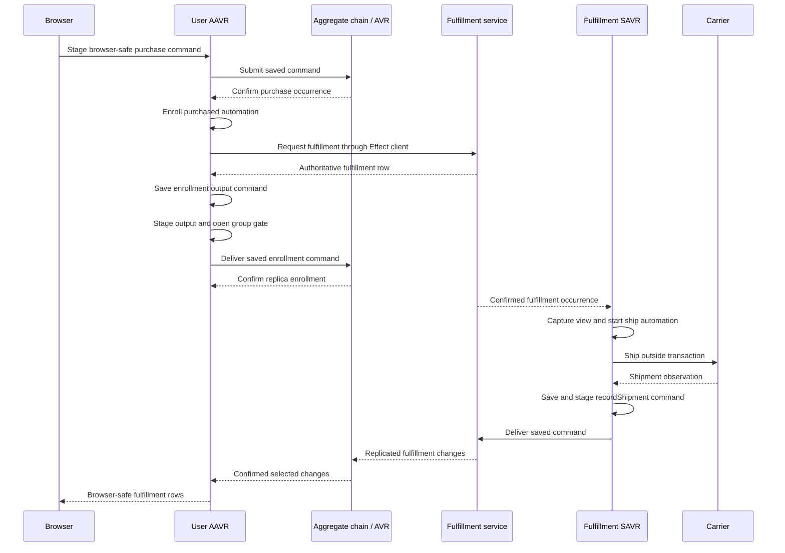

# 013 — Domain modules and automations

**Date:** 2026-09-26\
**Status:** Implemented and verified\
**Document:** Plan 013 retains its number through implementation and archive.

**Implementation checkpoint:** Plain aggregate, service, and browser bundles; automation declarations; AAVR and SAVR retained command rows and recovery state; private actor-chain projection; and the purchase, fulfillment, and tic-tac-toe examples are implemented. The [domain-modules browser fixture](../../../examples/domain-modules/src/userSession.ts) typechecks a real `makeSession` attachment with the safe purchase contract and read-only fulfillment replica. Fulfillment's typechecked consumer examples require a `Carrier` provider and reject a missing provider. A real-worker fixture confirms that only the addressed service version enrolls and runs its automation. Another confirms older fulfillment commands materialize in both service versions, the newer composition initializes `warehouseCode`, and `ship` calls the supplied carrier. The purchase-to-fulfillment worker fixture verifies service creation, saved enrollment output, purchase completion, replicated fulfillment rows, and subsequent service updates.

Recovery tests cover every interruption boundary in §5.3 across AAVR, SAVR, actor publication, and the outbox. Scoped Nx typechecks, node tests, real-worker tests, browser integration tests, browser bundle, example checks, and lint pass. Nx Cloud reports an access warning (`401`) while local tasks succeed. Changed fixed schemas require empty storage.

## 1. Outcome and settled decisions

### 1.1 What we are building

Build a library interface where applications install complete domain functionality and customize only the parts they need.

A domain factory constructs its final declarations and returns:

```ts
return { models, contracts, automations };
```

1. `models` contains ordinary model declarations.
2. `contracts` contains ordinary contract declarations.
3. `automations` contains the renamed and restored listener declarations.
4. Each domain factory defines its own customization options.
5. The aggregate or service remains responsible for persistence, ordering, authoritative execution, and transactions.
6. Aggregate automations run in AAVR.
7. Service automations run in SAVR, using the same durable execution lifecycle.
8. Effect providers supply runtime dependencies such as carriers, payment integrations, and service clients.
9. Browser factories expose actual browser-safe declarations and executable programs.
10. Fulfillment information exposed to a user aggregate consists of replicated fulfillment rows.

Modules are ordinary factory results. Their construction introduces no runtime owner, installation identity, database, ownership group, or separate version axis.

### 1.2 Authoring responsibilities

| Concern                                          | Responsibility                                  |
| ------------------------------------------------ | ----------------------------------------------- |
| Construct final models and contracts             | Domain factory                                  |
| Apply model additions and initialization         | Domain factory                                  |
| Extend or replace a contract program             | Domain factory                                  |
| Bind automation handlers to final declarations   | Domain factory                                  |
| Select callable contracts and visible data       | Actor declaration                               |
| Enforce authoritative aggregate invariants       | Existing aggregate guards                       |
| Supply external implementations                  | Effect layers                                   |
| Validate composed declaration references         | Existing host, system, and session construction |
| Persist and execute commands                     | Existing repositories                           |
| Persist automation invocation and delivery state | AAVR or SAVR                                    |

### 1.3 Decisions carried into implementation

1. Preserve the approved `models`, `contracts`, and `automations` customization spelling.
2. Use explicit `extend` and `replace` contract options with different meanings.
3. Keep `makeService({ name, module: { version: bundle } })` as the service authoring shape.
4. Each service version entry is a complete composition.
5. Use `module` on aggregate versions and sessions to supply their declarations.
6. Keep actors independently registered.
7. Actor and frontend helper factories prepare ordinary declaration inputs. They introduce no additional runtime module kind.
8. Supply authoritative purchase checks through an explicit package helper used in the aggregate’s existing `guards` property.
9. Preserve the actor staging and gated execution foundation described in [Plan 011](../plans/011-plan-actor-staging-and-gated-listener-execution.md).
10. Retain complete commands through server-side storage and delivery. Project them into browser-safe output at the client boundary.
11. Apply the repository’s pre-release hard cutover policy. Changed fixed schemas require empty storage.
12. Preserve unrelated WIP.

### 1.4 Boundaries

1. Implement the framework changes, private purchase and fulfillment proof packages, the purchase fixture, and tic-tac-toe adoption.
2. Update other affected callers sufficiently to use the new declaration interfaces.
3. Preserve Shopping’s checkout behavior. Its required declaration syntax changes are in scope; a checkout workflow redesign is not.
4. Keep the initial automation trigger model based on confirmed command occurrences and actor selection changes.
5. Retain one returned follow-up command or explicit `null` per automation invocation.
6. Keep remote service calls and carrier operations inside automation programs as ordinary external effects.
7. Do not add a general cross-owner transaction protocol, workflow language, timer system, automatic invocation retry policy, or automatic version-retirement coordinator.

## 2. Public APIs and agreed examples

The snippets in this section are target APIs. Implement them as checked examples and fixtures so they become supported, verified library usage.

### 2.1 Install defaults and customize a complete service version

Preserve this consumer-facing example:

```ts
const fulfillment = makeService({
  name: 'fulfillment',

  module: {
    '1.0.0': makeFulfillmentServiceModuleV1(),

    '1.0.1': makeFulfillmentServiceModuleV1({
      models: {
        fulfillment: {
          version: '1.1.0',

          fields: {
            warehouseCode: primitives.text(),
          },

          defaults: {
            warehouseCode: 'aus-01',
          },
        },
      },

      contracts: {
        markPacked: {
          version: '1.1.0',

          payload: {
            warehouseCode: primitives.text(),
          },

          extend: ({ models, payload, fulfillmentId }) =>
            models.fulfillment.update({
              resourceId: fulfillmentId,
              attributes: {
                warehouseCode: payload.warehouseCode,
              },
            }),
        },
      },
    }),
  },
});
```

Implement the following semantics:

1. The default factory returns a functioning fulfillment declaration bundle.
2. The customized factory adds `warehouseCode` to the final fulfillment model.
3. Its creation contracts apply the configured default when creating rows.
4. Defaults are applied through model creation behavior. They must not depend on SQL defaults filling attributes omitted from a validated mutation.
5. The customized `markPacked` payload includes the added warehouse field.
6. Its normal packing mutations remain part of the command.
7. The `extend` callback contributes additional mutations after the normal program’s mutations.
8. All mutations belong to the same command and authoritative transaction.
9. The callback’s `models` contains mutation helpers for the final customized models.
10. `fulfillmentId` is a convenience value supplied by this particular domain factory from its normal command input.
11. Unchanged automations remain included and reference the final contracts.
12. Both complete service compositions remain available.

Expose a selected service snapshot through:

```ts
const fulfillmentTarget = fulfillment.versions['1.0.1'];
```

The selected snapshot has precise model and contract types. Passing the whole versioned service where a single snapshot is required must fail typechecking.

### 2.2 Explicit contract replacement

Preserve the distinction between adding work and replacing the program:

```ts
const fulfillmentModule = makeFulfillmentServiceModuleV1({
  contracts: {
    markPacked: {
      version: '1.1.0',
      replace: myMarkPackedProgram,
    },
  },
});
```

1. `extend` executes the normal program and appends the supplied mutations.
2. `replace` supplies the complete mutation program for that contract.
3. `extend` and `replace` are mutually exclusive.
4. Neither option bypasses payload validation, model membership checks, applicable guards, or authoritative transaction handling.
5. An extension or replacement failure rejects the command’s complete mutation set.
6. Contract programs continue producing mutations. External work belongs in automations.
7. The final contract is constructed once. Actor selections, automation triggers, and output declarations must reference that final value.
8. A behavior or payload change requires an explicit contract version.

### 2.3 Connect purchase to fulfillment

Preserve the purchase automation seam:

```ts
const purchase = makePurchaseModuleV2({
  automations: {
    purchased: requestFulfillmentForPurchase,
  },
});
```

1. The purchase package defines the trigger and selected input for `purchased`.
2. The supplied handler receives the selected purchase data and the package’s typed follow-up command constructors.
3. The handler requests fulfillment through the ordinary service command path.
4. Its fulfillment client is supplied as an Effect dependency and bound to an explicit service version.
5. The request carries stable purchase, user, aggregate, and fulfillment-request identifiers.
6. After obtaining the authoritative fulfillment row, the handler returns the user aggregate’s enrollment or completion command.
7. The AAVR saves that returned command before staging or delivery.
8. A failure after remote acceptance but before saving the local result remains an interrupted or failed invocation according to the existing lifecycle. The framework does not reinvoke it automatically.
9. The fulfillment service deduplicates the domain request identifier so an explicitly retried request can return the same fulfillment.

The proof implementation must make this handler concrete. Its operations are:

```text
read captured purchase
  → call the pinned fulfillment service
  → obtain its authoritative fulfillment row
  → return the local enrollment/completion command
```

The service call occurs outside the actor write permit and outside SQL transactions.

### 2.4 Replace a fulfillment automation handler

Preserve this independent customization seam:

```ts
const fulfillmentModule = makeFulfillmentServiceModuleV1({
  automations: {
    ship: shipFromAssignedWarehouse,
  },
});
```

1. `ship` is a named implementation point offered by the fulfillment package.
2. Supplying it replaces that automation handler.
3. The package retains its normal trigger, input selection, and declared output contracts.
4. Handler inputs use the final fulfillment model, including added fields such as `warehouseCode`.
5. An omitted handler uses the package’s default implementation.
6. The handler returns one declared follow-up command or `null` through Effect.
7. Framework validation rejects a returned contract outside that automation’s declared output set.

### 2.5 Supply integrations through Effect

Preserve the provider example:

```ts
const system = makeSystem({
  // Other system declarations.

  layer: Layer.succeed(Carrier, fedExCarrier),
});
```

1. The default fulfillment shipping automation obtains `Carrier` from its Effect environment.
2. A carrier replacement does not require reconstructing the automation.
3. A different shipping policy can use the named automation replacement seam.
4. Infer the requirements of the final automation programs into host and system construction.
5. Test missing dependency reporting.
6. Keep model shapes, contract payload shapes, defaults, and version choices in typed declaration configuration.
7. Bind service clients to explicit target versions.
8. Use the existing system runtime. Do not construct a runtime for each module.
9. When concurrently supported versions need different implementations, use explicit handler binding or distinct domain service tags. Avoid silently changing every version through an accidental global override.

### 2.6 Factory implementation shape

Preserve the simple factory result:

```ts
export function makeFulfillmentServiceModuleV1(options = {}) {
  // Construct the final models.
  // Construct contracts using those models and the supplied extensions.
  // Construct automations using those contracts and supplied handlers.

  return { models, contracts, automations };
}
```

Implement construction in this order:

1. Validate domain factory options.
2. Construct the final models and their deliberate version history.
3. Construct final contract payloads and programs against those models.
4. Apply supported program extension or replacement.
5. Construct automations against the final trigger and output contracts.
6. Return the ordinary declaration collections.

Factory implementation requirements:

1. Infer field and payload additions before typing callbacks that consume them.
2. Use `NoInfer` where necessary to prevent callback arguments from widening the declarations being inferred.
3. Preserve the exact inferred return type.
4. Do not annotate the public result with a broad erased module type.
5. Do not introduce `ALLOWED_CAST`.
6. Validate defaults against the added fields.
7. Require initialization for added required fields.
8. Fail clearly for unsupported customization.
9. Keep the customization protocol local to the package. The framework does not interpret `fields`, `defaults`, `extend`, or `replace`.

### 2.7 The automation declaration

Restore the listener declaration under the automation name:

```ts
const purchased = makeAutomation({
  name: 'purchased',
  on: contracts.submitPurchase,

  contracts: {
    enrollFulfillment: contracts.enrollFulfillment,
  },

  program: context => runPurchasedAutomation(context, purchasedHandler),
});
```

`runPurchasedAutomation` is package implementation code. It selects and validates the purchase input from the captured actor view, then invokes the configured handler.

Retain the existing listener declaration capabilities:

1. `on` is a canonical trigger contract.
2. Matching supports the trigger’s declared contract history.
3. `contracts` contains canonical permitted output contracts.
4. `program` receives a read-only captured query database, the triggering command input, and typed output constructors.
5. The result is a declared output contract plus payload, or `null`.
6. Effect requirements flow through the declaration.
7. Automation declarations are server-only.
8. A program cannot directly mutate the captured snapshot.
9. Creating an output value does not execute its contract.

The initial trigger condition remains:

```text
confirmed successful occurrence
  + supported trigger contract
  + relevant identity-selected graph change
  + occurrence after the registration frontier
```

Optimistic staging and replay do not enroll automations.

### 2.8 Aggregate composition

The aggregate receives one complete declaration bundle:

```ts
const userFulfillment = makeUserAggregateModuleV1({
  source: fulfillmentTarget,
});

const userModule = makeShopUserModule({
  purchase,
  fulfillment: userFulfillment,
  cart: cartV1,
});

const user = makeAggregateVersion(userIdentity, {
  version: '1.0.1',
  module: userModule,
  actors: { shopper },

  guards: {
    shopper: makePurchaseAggregateGuardsV2({
      purchase,
      fulfillment: userFulfillment,
    }),
  },
});
```

`makeShopUserModule` is an ordinary application composition function. It returns the same plain triple.

1. Compose the module collections with checked key merges.
2. Reject duplicate model, contract, and automation keys before combining them.
3. Do not resolve collisions by attachment order.
4. Put directly authored application declarations, such as `cartV1`, into the application’s resulting bundle.
5. Derive `aggregate.models`, its effective contract inventory, and automations from that bundle.
6. Allow empty model, contract, or automation collections.
7. Actors select canonical contracts from the assembled declarations.
8. Ordinary aggregate command resolution still follows recorded actor lineage.
9. Automation output resolution follows the verified automation declaration and saved run.
10. Validate contract model dependencies against the host’s final model inventory.
11. Remove the experimental module-specific mutation ownership map.
12. Existing host/model membership checks remain authoritative.

On aggregate upgrades:

1. Recompute from the newly authored bundle.
2. Replacing or removing a package also replaces or removes its contributions.
3. Validate remaining actors, queries, guards, contracts, and automations against the new inventory.
4. Reject stale references.
5. Do not merge a previous aggregate’s already-derived inventory into the new version.

### 2.9 Authoritative aggregate guards

Use the explicitly selected guard helper approach:

```ts
guards: {
  shopper: makePurchaseAggregateGuardsV2({
    purchase,
    fulfillment: userFulfillment,
  }),
}
```

1. The helper returns the existing aggregate guard map.
2. It references the final canonical declarations supplied by the application.
3. It enforces domain state, ownership-by-user, request correlation, and stale completion checks that must hold at authoritative commit.
4. Its dependencies are explicit registered models.
5. Contract and actor guards continue running at AAVR staging.
6. Aggregate guards continue running in AVR’s authoritative savepoint.
7. Do not move all contract guards back into AVR.
8. A contract guard alone must not be documented as providing authoritative stale-output protection.
9. Use ordinary domain attempt or request identifiers when repeated entry into the same state must invalidate older work.
10. Keep those identifiers in ordinary domain models and payloads.

A state-machine-style package is therefore assembled from ordinary state fields, contracts, automations, and the existing authoritative guard seam.

### 2.10 Actor and frontend factories

Provide the discussed fulfillment package factories:

```ts
makeFulfillmentServiceModuleV1(...)
makeUserAggregateModuleV1(...)
makeUserActorModuleV1(...)
makeUserFrontendModuleV1(...)
```

Their responsibilities are:

| Factory                | Result                                                                  |
| ---------------------- | ----------------------------------------------------------------------- |
| Service factory        | Authoritative fulfillment models, contracts, and automations            |
| User aggregate factory | Fulfillment replica models and required enrollment/completion contracts |
| User actor factory     | Existing actor selection inputs bound to the final replica declarations |
| User frontend factory  | Browser-safe replica declarations and selected executable contracts     |

Actor helper rules:

1. Return ordinary inputs for the existing actor constructor: its database declaration, queries, selected contracts, and selected automations.
2. Keep authentication and identity configuration on the actor constructor.
3. Bind queries to the actor’s authenticated identity.
4. Bind to the selected module’s final model and contract objects.
5. Application actor assembly combines purchase and fulfillment selections into one final actor database.
6. Reuse unchanged canonical actor declarations across host versions.
7. Assign a new actor declaration version when its bound models, queries, or contracts change.
8. A factory’s `V1` suffix does not force the actor declaration’s version to remain `1.0.0`.

Frontend attachment:

```ts
export const userSession = makeSession({
  // Existing owner, actor, identity, and lifecycle configuration.

  module: makeShopUserFrontendModule({
    purchase: makePurchaseFrontendModuleV2(purchaseClientOptions),
    fulfillment: makeUserFrontendModuleV1(fulfillmentReadOptions),
  }),
});
```

1. `makeShopUserFrontendModule` is ordinary application composition.
2. The session derives its existing model and contract declarations from the result.
3. Frontend automations are empty.
4. Preserve direct named sessions and one file per session.
5. The fulfillment frontend exposes replicated rows.
6. The purchase frontend supplies browser-safe initiation contracts.
7. Server-only service requests and completion contracts are excluded from ordinary browser invocation grants.
8. Session compatibility checks compare the actual selected declaration versions and schemas.

### 2.11 Browser and server package boundaries

Use separate package entrypoints:

```text
packages/purchase/
  server
  browser
  portable implementation helpers, where needed

packages/fulfillment/
  server
  browser
  portable implementation helpers, where needed
```

1. Server entrypoints enforce the existing server-only import boundary.
2. Browser entrypoints contain actual executable browser-safe programs.
3. Share portable model options or safe declaration helpers where the same runtime declarations are required in both environments.
4. Keep server-private declarations and integrations in the server import graph.
5. Type-only imports may improve inference, but cannot replace runtime declarations needed by browser execution.
6. Do not force every server declaration into a shared browser-safe package.
7. Do not infer browser safety from a string label alone.
8. Validate server-only exclusion with a real browser bundle.
9. Preserve current full-model schema compatibility requirements. Do not imply that an arbitrary subset of fields is automatically a compatible model.
10. Use separate private supporting models when data must remain server-only.

### 2.12 Versioning and compatibility

Keep these version concepts distinct:

| Concept                      | Example                          | Meaning                                   |
| ---------------------------- | -------------------------------- | ----------------------------------------- |
| Factory recipe               | `makeFulfillmentServiceModuleV1` | Package author’s construction API         |
| Complete service composition | `'1.0.1'`                        | One installed host definition             |
| Model declaration            | `fulfillment@1.1.0`              | Model schema version                      |
| Contract declaration         | `markPacked@1.1.0`               | Contract payload and behavior version     |
| Actor declaration            | `shopper@1.0.1`                  | Actor selection and invocation definition |

1. Compile each service version independently.
2. Expose literal version keys and exact snapshot types through `.versions`.
3. Normalize services into the existing name/version lookup during system construction.
4. Preserve canonical objects; system assembly must not reconstruct them.
5. Keep authored service actors and queries scoped by service composition version.
6. Omitted actor/query entries are empty; unknown composition keys are rejected.
7. Validate concrete dependencies through `makeSystem` and session construction.
8. Do not introduce a system module or package-recipe compatibility registry.
9. A V1 actor or frontend factory can target a newer host when it produces matching supported declarations.
10. Recipe names alone do not establish compatibility.

For the approved warehouse example:

1. The customized fulfillment recipe constructs explicit forward contract history.
2. `markPacked@1.1.0` supports its authored `1.0.0` predecessor.
3. Its domain-authored payload upgrade supplies `warehouseCode` from the configured warehouse default when reading a 1.0 command.
4. Other built-in contracts that create or modify the changed model receive deliberate updated declarations and use the final model.
5. Unchanged payloads can use an explicit identity payload upgrade.
6. Each factory invocation owns its declaration history. Do not mutate a shared global predecessor chain or add a global factory cache.
7. The old composition may reject unsupported future contract versions.
8. Such a known unsupported-version outcome must become a terminal materialization rejection that advances the cursor, applies no mutations, and enrolls no automation.
9. Infrastructure failures remain failures requiring recovery; do not broadly catch them as materialization rejections.
10. Arbitrary new required payload fields need behavior explicitly supported by their domain factory.

These are normal supported declaration versions. Fixed-schema storage cutover still requires empty storage.

### 2.13 Replica enrollment and visibility

1. Pin each replica to a concrete source service name, service version, and source model.
2. Derive the model version from the source model.
3. Derive aggregate service pins from the replica declarations.
4. Retain one selected source version per service name within an aggregate composition.
5. Reject conflicting pins.
6. Multiple deployed service versions remain available; they need not all be replicated into one aggregate database.
7. A newer fulfillment materialization can expose older work when its authored contract history supports that work.
8. Preserve explicit enrollment of newly created fulfillment rows.
9. Declaring a replica does not discover future rows automatically.
10. The purchase automation requests fulfillment, obtains the source row, and returns the local enrollment command.
11. Enrollment uses the existing replica mutation and source snapshot/cursor handling.
12. If fulfillment advances before enrollment finishes, install the current authoritative source row and continue receiving later changes without a gap.
13. Authoritative aggregate guards validate the expected purchase/request/user correlation.
14. Server actor queries enforce identity isolation.
15. Browser configuration cannot widen that selection.

## 3. Runtime, database, and recovery design

### 3.1 Runtime ownership

| Work                                                                 | Owner                                     |
| -------------------------------------------------------------------- | ----------------------------------------- |
| Aggregate command staging and optimistic view                        | AAVR                                      |
| Aggregate automation invocation and result storage                   | AAVR                                      |
| Aggregate command admission                                          | AggregateChain                            |
| Authoritative aggregate mutations and aggregate guards               | AVR                                       |
| Service automation staging and optimistic view                       | SAVR                                      |
| Service automation invocation and result storage                     | SAVR                                      |
| Service command admission                                            | ServiceChain                              |
| Authoritative service mutations and existing service contract guards | SVR                                       |
| Browser publication                                                  | Existing actor chains and client boundary |

Restore aggregate listener behavior under automation names. Extend SAVR to use the equivalent lifecycle.

### 3.2 Service automation binding and activation

A service composition containing automations produces one internal service actor using the existing SAVR repository type.

1. Reserve the internal actor name `__service`.
2. Use the service composition version as its actor version.
3. Use empty identity and actor path `/`.
4. Bind its model and contract inventory to that complete service composition.
5. Select the service data required by its automations.
6. Prevent browser sessions from authenticating as this internal actor.
7. Do not attach its automations to ordinary read actors.
8. Include its definition in normal system validation.
9. Do not require a browser session to instantiate or keep its work progressing.

Registration must precede the first command that should trigger work:

1. ServiceChain serializes first registration with admission for the addressed service version.
2. Capture the current service-chain tip `N`.
3. Idempotently persist that internal SAVR’s registration frontier as `N`.
4. Durably establish its subscription/recovery work.
5. Retain the new command after registration succeeds.
6. Materialize historical rows through `N` without invoking automations.
7. Process eligible later rows normally.
8. Preserve the original frontier on restart.
9. Registration must not wait for automation execution, output admission, or catch-up that calls back into the held admission operation.
10. Use existing alarms and retained history to close interruptions between registration and subscription completion.

For service automations, enrollment requires:

```ts
serviceIndex > automationState.startIndex &&
  command.serviceVersion === repo.key.serviceVersion &&
  command.execution.status === 'succeeded' &&
  selectedStateChanged &&
  automationMatches(command);
```

The original command’s addressed service version chooses which service composition performs external work. Other versions may materialize the same history without running that automation.

Aggregate automations retain their existing per-actor-identity semantics. Do not apply a naive aggregate-version comparison to browser commands, whose origin is recorded through node and actor lineage.

### 3.3 AAVR database overview

Preserve the agreed logical layout:

| Table               | What it stores                                                                    |
| ------------------- | --------------------------------------------------------------------------------- |
| Domain model tables | Confirmed rows, including replicated rows                                         |
| `actorState`        | Confirmed checkpoint and hash                                                     |
| `commands`          | Complete retained commands, provenance, and lifecycle results                     |
| `pendingCommands`   | Command references, staging order, prepared mutations, and submission bookkeeping |
| `automationState`   | Registration frontier                                                             |
| `automationGroups`  | Gate for each triggering confirmed occurrence                                     |
| `automationRuns`    | Each automation invocation and its outcome                                        |

The agreed logical automation shape is:

```text
automationState
  id                    primary key; singleton
  startIndex            registration frontier


automationGroups
  executedIndex         primary key; triggering confirmed occurrence
  status                open | staged


automationRuns
  executedIndex         references automationGroups
  automationName
  programStatus         pending | started | succeeded
                        | empty | failed | interrupted
  outputCommandId       nullable; references its saved aggregate command
  programFailure        nullable; structured failure
  stagingFailure        nullable; structured failure

  identity (executedIndex, automationName)
```

Use the existing schema library’s composite unique index for the run identity. A new run sequence is unnecessary.

### 3.4 Physical command identity and storage

The physical schema must account for two facts:

1. An automation output exists before it receives an execution position.
2. Commands from independent services can have identical command IDs.

Use an internal `commands.rowId` as the foreign-key target. It has no ordering meaning. Preserve the original command’s `id` unchanged.

The physical run field is `outputCommandRowId`. The logical `outputCommandId` displayed in examples is obtained by joining the referenced command.

#### `commands`

| Columns                                           | Meaning                                                              |
| ------------------------------------------------- | -------------------------------------------------------------------- |
| `rowId`                                           | Internal primary key                                                 |
| `id`, `commandName`, `contractVersion`, `payload` | Original encoded command input                                       |
| Aggregate identity and target columns             | Original aggregate/system/actor/node/session identity and provenance |
| Service identity and target columns               | Original service name and addressed service version                  |
| `automationName`, where applicable                | Automation-origin provenance                                         |
| `aggregateIndex` or `serviceIndex`                | Applicable source position, when known                               |
| `admission`, `execution`, `dispositionHash`       | Complete saved lifecycle results                                     |
| `executedIndex`, `executedHash`                   | Confirmed AAVR occurrence and hash, absent before confirmation       |
| `actorDelta`                                      | This actor’s selected graph change                                   |
| `acknowledgedAt`, `lastDeliveryFailure`           | This owner’s publication bookkeeping                                 |

Constraints:

```text
unique (aggregateName, aggregateId, id)
unique (serviceName, id)
unique (aggregateIndex)
unique (serviceName, serviceIndex)
unique (executedIndex)
```

1. Inactive aggregate/service branch fields are `NULL`.
2. Validate the branch shape through the command row codec.
3. Save complete execution results, including execution deltas.
4. Preserve original encoded payload and identity fields.
5. Do not store a second serialization of the entire command.
6. Keep `actorDelta`, which represents a distinct identity-selected graph change.
7. Keep unconfirmed output position/result fields absent until those phases occur.
8. Confirmation fills the existing source-scoped command row.
9. Delivery acknowledgement retains the row.

#### `pendingCommands`

```text
stageIndex               primary key
commandRowId             unique reference to commands.rowId
stagedAt
mutations                saved prepared replay operations
resolvedAt
acknowledgedAt
lastDeliveryFailure
```

1. Store successful staging order here.
2. Store prepared operations, including captured IDs, timestamps, and replica inputs needed for replay.
3. Read command payload, identity, admission, and source position through the command reference.
4. Do not repeat them in this table.
5. A rejected automation staging attempt records its failure on the run and allocates no successful `stageIndex`.

#### `automationRuns`

```text
executedIndex            reference to automationGroups
automationName
programStatus
programFailure
stagingFailure
outputCommandRowId       nullable unique reference to commands.rowId

unique (executedIndex, automationName)
```

Retain commands, runs, groups, and required resolved staging records for the owner’s lifetime in this implementation. Do not add pruning or TTL behavior.

### 3.5 The agreed database example

Confirmed occurrence **42** triggers two automations.

**Automation runs:**

| executedIndex | automationName       | programStatus | outputCommandId            | programFailure             |
| ------------: | -------------------- | ------------- | -------------------------- | -------------------------- |
|            42 | `requestFulfillment` | `succeeded`   | `cmd_fulfillmentRequested` | —                          |
|            42 | `sendReceipt`        | `failed`      | —                          | Email provider unavailable |

The successful output is a complete row in `commands`.

After successful staging:

| stageIndex | commandId                  | prepared mutations      | resolvedAt |
| ---------: | -------------------------- | ----------------------- | ---------- |
|          8 | `cmd_fulfillmentRequested` | Saved replay operations | —          |

The group becomes:

| executedIndex | status   |
| ------------: | -------- |
|            42 | `staged` |

The output may still be awaiting admission or execution. The next confirmed occurrence can proceed and its automations can observe the accepted optimistic changes.

### 3.6 Optimistic state and snapshot capture

Preserve the agreed snapshot:

```text
confirmed AAVR rows
  + unresolved staged/pushed commands’ prepared mutations
```

1. Persist confirmed resource rows and their matching checkpoint.
2. Derive optimism in a disposable database.
3. Replay saved operations in `stageIndex` order.
4. Preserve relationship-driven selection entry and exit.
5. Do not regenerate IDs or timestamps, refetch service resources, or rerun contract preparation during replay.
6. Do not overwrite newer confirmed rows with stale post-staging snapshots.
7. Capture the selected graph under the actor write permit.
8. Commit sibling start markers before entering any program.
9. Give every sibling an isolated view of that same captured graph.
10. Release the write permit before running programs or external I/O.
11. Allow later caller staging while programs run; it must not alter their captured views.
12. Persist no separate automation snapshot blob.

A pending group can reconstruct its view before invocation. Once invocation starts, an unsaved result becomes interrupted on recovery, so its old in-memory snapshot is not needed to reinvoke the program.

### 3.7 Transaction boundaries and group progression

Implement the lifecycle as follows:

1. **Confirmed reconciliation:** apply authoritative changes, resolve matching pending optimism, save the complete confirmed command and actor projection, advance the checkpoint, and enroll the group in one transaction.
2. **Capture/start:** reconstruct optimism, capture the selected graph under the write permit, and persist start markers.
3. **Invocation:** run siblings concurrently outside transactions.
4. **Individual result save:** persist each terminal result independently.
5. **Successful output save:** insert the complete output command and link the run in one transaction.
6. **Batch staging:** once every invocation has a terminal result, stage saved outputs in stable automation-name order.
7. **Per-output staging result:** retain accepted outputs; record individual business rejections without discarding successful siblings.
8. **Gate completion:** mark the group `staged` after every output has a durable staging outcome.
9. **Submission:** deliver saved commands independently in `stageIndex` order.
10. **Confirmation or rejection:** reconcile the authoritative outcome and rebuild optimism.

The gate waits for staging outcomes. It does not wait for remote admission or execution.

### 3.8 Invocation and failure semantics

| Situation                                      | Durable behavior                                                          |
| ---------------------------------------------- | ------------------------------------------------------------------------- |
| No invocation has started                      | Recover the pending group and capture its view                            |
| Program returns a command                      | Save command and mark run `succeeded`                                     |
| Program returns `null`                         | Mark run `empty`                                                          |
| Program fails                                  | Save `programFailure`; mark `failed`                                      |
| Process stops after start without saved result | Mark `interrupted`; do not reinvoke                                       |
| Output fails a staging guard                   | Save `stagingFailure`; allocate no staging position                       |
| Infrastructure fails during saving or staging  | Keep recoverable work and the gate open                                   |
| Submission result is uncertain                 | Retry the saved command                                                   |
| Admission rejects                              | Save the terminal admission result and remove its optimistic contribution |
| Execution rejects                              | Save the execution result and remove its optimistic contribution          |

Additional rules:

1. One failed sibling does not cancel successful siblings.
2. Authors own program timeouts and deliberate in-program retries.
3. A late result cannot overwrite an interrupted or otherwise terminal run.
4. Conditional result writes must enforce the expected run state.
5. Repeated saving or staging of an already retained result is idempotent.
6. Delivery retries cannot enter an automation program or repeat mutation preparation.

### 3.9 Guard placement and atomicity

For aggregates:

1. AAVR checks contract and actor guards against optimism before staging.
2. AggregateChain checks admission identity, provenance, payload support, and deduplication.
3. AggregateChain does not call AAVR for stateful validation.
4. AVR checks aggregate guards against authoritative state inside the savepoint.
5. A failed authoritative guard rolls back all mutations from the command.
6. The resulting failed occurrence enrolls no automation.
7. Completion commands carry domain request/attempt correlation needed by the authoritative guard helper.

For services:

1. SAVR checks candidates before optimistic staging.
2. ServiceChain resolves the explicitly addressed service version.
3. Preserve SVR’s existing authoritative service contract guards.
4. A rejected service command advances terminal history without changing domain rows or enrolling automations.
5. Fix SAVR processing of failed or skipped terminal service occurrences so one rejection cannot block the stream.

### 3.10 Saved-command delivery and server retention

1. Preserve separate submission and confirmed-publication responsibilities.
2. AAVR’s `aggregateCommandsOutbox` submits staged commands.
3. Its `actorCommandsOutbox` publishes confirmed actor output.
4. SAVR has the equivalent service submission and confirmed-publication paths.
5. Queue callbacks load saved commands through references.
6. Queue bookkeeping remains local to the queue owner.
7. Preserve original input and provenance across server owners.
8. Verify automation provenance through the saved run/output relationship.
9. Ordinary callers cannot obtain automation authority by supplying its name or copying provenance fields.

Update downstream actor-chain storage as part of the cutover:

1. Retain complete confirmed commands in AAVC and the corresponding service actor chain.
2. Remove the assumption that a bare command ID is unique across independent sources.
3. Keep executed occurrence ordering unchanged.
4. Produce the browser’s selected representation at WebSocket/replay delivery.
5. Expose private completion summaries only to the owning actor identity, node, and session.
6. Do not repurpose the command’s original identity fields as recipient-routing fields.
7. Preserve confirmed snapshots and their matching cursors.
8. Do not include optimistic rows in browser snapshots.

### 3.11 SAVR database adaptation

Apply the same table responsibilities to SAVR:

1. Use its existing `serviceIndex` as the confirmed occurrence position.
2. Key service automation groups and runs by that position.
3. Preserve `stageIndex` as local successful staging order.
4. Retain complete service commands and saved outputs.
5. Add pending replay operations and derive service optimism.
6. Retain service actor checkpoint/hash ownership.
7. Use the same invocation states and recovery rules.
8. Keep internal service processing and user-facing read actors separate.
9. Reuse lifecycle utilities where the behavior is identical, with explicit owner-specific command, position, and delivery adapters.
10. Avoid introducing a general scheduler framework.

### 3.12 End-to-end proof flow



Each owner commits independently. Domain identifiers and saved command identities support deduplication and correlation across the handoff.

## 4. Implementation sequence and adoption

### Phase 1 — Replace the obsolete plan assumptions

1. Replace the saved 013 draft with this design.
2. Preserve its number and topic.
3. Mark the archived module specification and Spec 012 as historical where their module ownership or activation placement conflicts with this plan.
4. Keep the relevant Plan 011 staging and recovery decisions explicit.
5. Record the two settled additions: SAVR service automations and the explicit aggregate guard helper.
6. Preserve unrelated working-tree changes.

### Phase 2 — Restore the automation declaration

1. Recover the existing listener declaration and tests from repository history.
2. Rename the supported public declaration to `makeAutomation`.
3. Rename listener-specific types, provenance, metadata, and diagnostics consistently.
4. Preserve command-trigger matching, permitted outputs, captured reads, and Effect requirements.
5. Remove superseded state-machine declaration/runtime branches.
6. Remove machine-specific command fields, entry mutation variants, ownership metadata, and activation tables.
7. Replace affected callers directly.
8. Keep state-machine-style behavior in ordinary domain factories.

### Phase 3 — Implement plain bundle attachment

1. Add module-derived declarations to aggregate construction.
2. Implement the complete service version map and typed `.versions` access.
3. Normalize service snapshots in `makeSystem`.
4. Keep canonical model and contract objects intact.
5. Add final-reference validation for actors, queries, automations, and replica sources.
6. Implement session attachment from frontend bundles.
7. Keep actor helper outputs as existing actor constructor inputs.
8. Remove duplicate authored model/contract registration paths in affected APIs.
9. Update aggregate upgrade construction to rebuild from authored inputs.
10. Update generated system metadata without adding module identities or ownership tables.

### Phase 4 — Cut over command storage

1. Implement the complete source-scoped command rows and internal foreign-key identity.
2. Change pending commands to reference retained commands.
3. Replace listener output storage with command references from automation runs.
4. Remove duplicated triggering-command fields.
5. Preserve full original identities and results through actor-chain retention.
6. Move thinning and completion visibility decisions to client projection.
7. Retain acknowledged command rows.
8. Require empty storage for affected fixed schemas.
9. Provide no legacy decoder or translation migration.

### Phase 5 — Restore AAVR gated execution

1. Restore the existing actor write serialization and per-occurrence gate.
2. Implement the approved automation tables and run states.
3. Reconcile one confirmed occurrence at a time.
4. Capture isolated sibling views.
5. Save independent results and complete outputs.
6. Stage saved output batches before advancing the next group.
7. Restore saved-command submission with provenance verification.
8. Implement interruption and infrastructure-failure recovery.
9. Preserve authoritative browser snapshots and actor selection changes.

### Phase 6 — Extend SAVR

1. Add the internal service actor binding.
2. Implement registration before the first triggering admission.
3. Add service staging, pending replay, automation groups, and saved output delivery.
4. Preserve service authoritative guards.
5. Process failed/skipped service occurrences without blocking the cursor.
6. Enforce addressed-service-version automation enrollment.
7. Resolve service admission against the selected version.
8. Handle known unsupported contract versions as terminal materialization outcomes.
9. Verify that no browser session is required.

### Phase 7 — Implement the domain proof packages

1. Use the repository’s Nx generation and workspace dependency-linking workflows.
2. Create private purchase and fulfillment packages with server/browser entrypoints.
3. Implement the approved factory options.
4. Implement fulfillment request deduplication and request correlation.
5. Implement the warehouse field/default and `markPacked` extension.
6. Implement explicit replacement and named automation handler customization.
7. Supply carrier and fulfillment-client implementations through Effect.
8. Implement user aggregate replica declarations and enrollment.
9. Implement actor visibility and frontend declaration factories.
10. Implement the aggregate guard helper.
11. Turn every agreed consumer snippet into a checked fixture or example.
12. Keep unsupported customization failures explicit.

### Phase 8 — Adopt and document

1. Convert the existing purchase fixture to the plain factory result.
2. Demonstrate supporting-model mutations alongside a state transition.
3. Convert tic-tac-toe to ordinary models, contracts, and automations.
4. Preserve its injected computer-move behavior.
5. Exercise stale move rejection through the existing authoritative aggregate guard seam.
6. Update affected service, aggregate, actor, session, and system callers.
7. Keep Shopping’s business workflow unchanged.
8. Update architecture diagrams for staging, execution, service automation, replication, and browser publication.
9. Update the glossary for module, automation, automation run, automation group, and version terminology.
10. Replace the local state-machine-module pattern with the supported plain-factory composition pattern.
11. Update repository/module READMEs and examples.
12. Archive the plan only after implementation and verification are complete.

## 5. Verification and completion criteria

### 5.1 Declaration and inference tests

| Scenario                                            | Required result                                           |
| --------------------------------------------------- | --------------------------------------------------------- |
| Default fulfillment factory                         | Complete valid bundle                                     |
| Added warehouse field                               | Inferred in final model and handler inputs                |
| Wrong default type                                  | Typecheck or declaration failure                          |
| Missing required initialization                     | Clear declaration failure                                 |
| Added contract payload                              | Inferred by extension callback and callers                |
| `extend` and `replace` together                     | Rejected                                                  |
| Replacement contract                                | Every trigger/output/actor reference uses the replacement |
| Two complete service versions                       | Both resolve independently                                |
| Removed module contribution                         | Absent from the new effective inventory                   |
| Stale actor/query reference                         | Rejected                                                  |
| Duplicate composed declaration key                  | Rejected before overwrite                                 |
| Missing Effect dependency                           | Reported by supported construction/type validation        |
| Older recipe with matching declarations             | Accepted                                                  |
| Matching recipe name with incompatible declarations | Rejected                                                  |

### 5.2 Contract and authoritative behavior

1. The normal `markPacked` mutation and warehouse update commit together.
2. An extension can create supporting rows in the same command.
3. An extension failure leaves no partial model mutations.
4. An authoritative aggregate guard rejection rolls back the complete command.
5. Rejected commands enroll no automations.
6. Same-host contracts retain the ordinary explicit model-dependency rules.
7. Mutations against models outside the host inventory are rejected.
8. Direct execution paths preserve authoritative validation.
9. Stale completion after cancellation, another attempt, or same-state re-entry is rejected by the aggregate guard helper.
10. Service completion guards retain authoritative protection in SVR.

### 5.3 Automation execution and recovery

1. Only eligible confirmed occurrences trigger.
2. Optimistic staging and replay never trigger.
3. Two siblings run concurrently from identical isolated selected state.
4. Later writes do not alter their captured views.
5. One failed sibling does not discard another’s successful output.
6. Explicit `null` produces a durable `empty` result.
7. The next group waits until all output staging outcomes are durable.
8. The next group sees accepted earlier optimistic output before admission completes.
9. A staging rejection records its failure without consuming a successful staging position.
10. Registration excludes earlier history.
11. Recovery preserves the registration frontier.

Test interruption at each boundary:

| Boundary                                               | Expected recovery                                    |
| ------------------------------------------------------ | ---------------------------------------------------- |
| After group enrollment, before capture                 | Capture and start pending work                       |
| After start markers, before invocation                 | Mark unsaved runs interrupted                        |
| During invocation                                      | Mark unsaved runs interrupted                        |
| After one sibling result                               | Preserve it; interrupt only unsaved started siblings |
| After output save, before staging                      | Stage the saved command                              |
| During staging infrastructure failure                  | Recover without invoking programs                    |
| After staging, before gate completion                  | Reuse staging results and complete the gate          |
| After uncertain submission                             | Retry the same saved command                         |
| After confirmation, before publication acknowledgement | Republish retained confirmed output                  |

### 5.4 Command storage and publication

1. An output is retained before it has an `executedIndex`.
2. Confirmation fills the same source-scoped command row.
3. Run and pending references still resolve after confirmation.
4. Pending rows contain replay operations and bookkeeping without duplicate payloads.
5. Original encoded payload, actor identity, node/session provenance, and results survive server transfers.
6. Same command IDs from two services and an aggregate coexist correctly.
7. Retry within one source scope remains one retained command.
8. A conflicting retry is rejected.
9. Publication acknowledgement retains referenced command rows.
10. Browser output contains only permitted resources and completion summaries.
11. Another identity or session receives no private completion.
12. Browser snapshots remain confirmed and cursor-consistent.

### 5.5 Service automation and version coexistence

1. A default service automation runs without a browser connection.
2. The first request after registration is not skipped.
3. Restart does not reset the frontier.
4. Historical catch-up does not invoke new automations.
5. Registration and first admission cannot deadlock.
6. Failed or skipped service occurrences advance the stream.
7. Only the addressed service version performs the relevant external automation.
8. Other supported versions can materialize compatible history.
9. Newer warehouse declarations handle their authored older command history.
10. Unsupported future versions become explicit terminal outcomes without blocking later commands.
11. Saved outputs retain their selected target version.
12. The carrier is called through the supplied provider.
13. The internal service actor cannot be selected by a browser session.

### 5.6 Fulfillment visibility and browser boundary

1. Purchase requests fulfillment after confirmation.
2. Duplicate domain requests resolve to the same fulfillment.
3. The user aggregate enrolls the authoritative source row.
4. Fulfillment changes before enrollment are not lost.
5. Subsequent updates arrive through existing replication.
6. Actor selection isolates users.
7. The frontend receives replicated fulfillment rows.
8. Its safe contract programs execute locally.
9. Browser imports contain no service implementations or credentials.
10. Browser callers cannot invoke automation-only completion contracts.
11. Client declaration checks use actual versions and schemas.
12. Selecting a read model does not grant invocation access.

### 5.7 Test seams and Nx checks

Prefer the existing seams:

1. Core declaration/type fixtures for inference and canonical references.
2. AAVR optimistic staging node tests.
3. Recovered automation node tests derived from the existing listener suites.
4. Authoritative command savepoint tests.
5. Actor-chain publication and replay tests.
6. Corresponding SAVR node tests.
7. Real-worker automation tests for activation, registration, delivery, and recovery.
8. A browser bundle check for the server-only boundary.
9. Tic-tac-toe’s focused behavioral tests.

Verified existing project targets:

| Project             | Relevant targets                               |
| ------------------- | ---------------------------------------------- |
| `@zerospin/core`    | `lib`, `ts`, `lint`, `test`                    |
| `system-worker`     | `lib`, `ts`, `lint`, `test`, `test:workerd`    |
| `@zerospin/browser` | `lib`, `ts`, `lint`, `test`, `test:playwright` |
| `@zerospin/sdk`     | `lib`, `test`                                  |
| `tic-tac-toe`       | `build`, `ts`, `lint`, `test`                  |

1. Run focused tests while implementing each subsystem.
2. Use Nx for the final scoped project checks and preserve dependency execution and caching.
3. Include the new proof packages after inspecting their generated targets.
4. Run real-worker checks for the changed actor lifecycle.
5. Build the browser example to verify import boundaries.
6. Use browser integration tests only for the affected session visibility/delivery cases.
7. Report unrelated blockers separately.
8. Do not claim implementation or verification from this planning pass.

### 5.8 Completion criteria

The work is complete when:

1. Every agreed API snippet is represented by a working, typechecked example.
2. Factories return plain declaration collections.
3. Model, contract, and automation customization retains precise inference.
4. Aggregate and service composition derives declarations without duplicate authoring.
5. AAVR and SAVR execute the agreed automation lifecycle.
6. Complete command retention replaces duplicated output/pending payload storage.
7. Optimistic state reconstructs entirely from confirmed rows and saved operations.
8. Recovery never reinvokes a started automation without a saved result.
9. Service automations start and progress without browser sessions.
10. Version coexistence, actor binding, and browser safety are verified.
11. Purchase, fulfillment, and tic-tac-toe demonstrate the supported design.
12. Superseded machine/listener paths are removed from the affected implementation and docs.
13. Fixed-schema cutover instructions require empty storage.
14. Scoped checks pass, or any remaining unrelated blockers are explicitly documented.
15. Unrelated WIP remains preserved.

## 6. Main integration and review — 2026-09-26

1. Merged the implementation onto local `main`, preserving the existing unrelated CI changes. Removed the superseded machine runtime and retained the older specification as historical.
2. Reviewed declaration bundles, canonical references, typed service snapshots, provider inference, browser boundaries, command retention, both automation lifecycles, and the proof packages against this plan and the local/shared pattern indexes.
3. Corrected SAVR capture to replay unresolved saved operations before selecting a group snapshot. Confirmed processing and recovery now share one owner-local gate; concurrent catch-up cannot mark a live invocation interrupted. Recovery skips durable staging rejections.
4. Isolated thrown automation defects as invocation failures so sibling results survive. The runtime still never reinvokes a started invocation without a saved result.
5. Corrected replacement-handler Effect requirement inference, including dependency-free overrides and custom providers. The automation input type now distinguishes aggregate and service command origins. Fulfillment validates unsupported customization and mutually exclusive extension/replacement at construction.
6. Added authoritative packing and shipment state guards. Retained the purchase package's authoritative request/user/attempt correlation checks.
7. Removed `examples/durable-machines`. Tic-tac-toe now supplies the browser recovery fixture and demonstrates confirmed human moves producing server computer replies. Its declarations use the local casing/session conventions.
8. Added Shopping's five-second mock payment automations, private completion commands, authoritative stale-intent/customer checks, and final references for its V2/V3 declarations. Added `/fulfillment` for paid orders with local mock packing/shipping controls. Shopping was verified through unit/contract tests, typechecks, lint, and build; no browser verification was used.
9. Recorded the group-capture/recovery convention in `wiki/patterns/system-worker/automation-group-recovery.md` and clarified that domain recipes may construct mutually bound declarations together.

The supported customization surface remains deliberately package-specific: the fulfillment proof supports the approved warehouse field/default/payload extension and explicit packing replacement. It is not a generic arbitrary-field extension framework. Changed fixed schemas require empty storage; no compatibility decoder or migration was added.

Final review verification: scoped Nx build/typecheck/lint/unit tasks passed for core, system-worker, purchase, fulfillment, Shopping, tic-tac-toe, and the domain-modules fixture (where each target exists). Results include 33 core tests, 44 worker node tests, six fulfillment tests, one purchase test, five Shopping tests, two tic-tac-toe tests, 15 real-worker tests, and four browser integration tests. The purchase browser bundle check passed. Nx Cloud's `401` warning did not prevent local task success.
