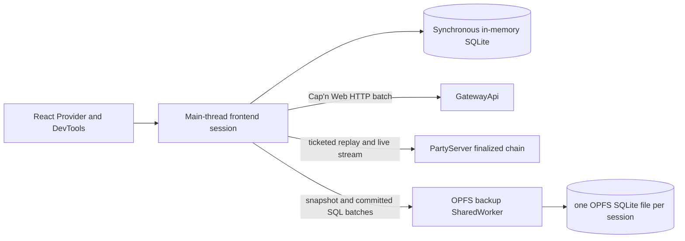

# Main-thread frontend replicas and OPFS backups

**Date:** 2026-09-01
**Status:** Approved for planning

## Problem Statement

Plan 065 made every command chain singular and moved browser recovery to full
command occurrences, but its existing browser implementation still gives one
SharedWorker all of these unrelated jobs:

1. Owning the live SQLite replica.
2. Authenticating and retaining Gateway capabilities.
3. Reconstructing authoritative and optimistic state.
4. Owning finalized-command WebSockets and aggregate push.
5. Coordinating tabs and delivering replica changes back to the UI.
6. Persisting browser state.

That boundary makes synchronous authored command execution cross a worker
protocol and couples live behavior to persistence coordination. It also leaves
the main thread and SharedWorker maintaining separate materialized databases.

The replacement keeps the live frontend replica in the main thread and reduces
the worker to one narrow concern: copying committed SQLite state into and out
of OPFS.

## Target Topology



The main-thread session is the only live materialized replica. The OPFS file is
a durability copy and never executes authored frontend logic.

## Package Ownership

1. `@zerospin/core` owns synchronous in-memory wa-sqlite/Drizzle databases,
   aggregate and service materialization, authored command execution, session
   tables and state, and committed-SQL capture.
2. `@zerospin/frontend` owns framework-neutral browser authentication,
   restoration, authoritative recovery, finalized sockets, aggregate push,
   supersession, old-session recovery, and backup orchestration.
3. `@zerospin/opfs-backup-worker` is a standalone package. It owns its
   SharedWorker entrypoint, bundled Asyncify wa-sqlite and WASM assets,
   `OPFSAnyContextVFS`, OPFS handles and claims, snapshot replacement/export,
   committed-SQL application, and file listing/close/delete.
4. `@zerospin/react` owns Provider scoping, hooks, the existing one-root owner
   guard, store publication, and DevTools adaptation. It does not own recovery
   or persistence procedures.
5. Delete `@zerospin/shared-worker`, `AggregateFrontendReplicaRepo`,
   `ServiceFrontendReplicaRepo`, their sink RPC targets, registration/fanout
   machinery, IndexedDB user locator, and obsolete worker diagnostics.

## Live Main-thread Sessions

The approved frontend procedures are:

1. `bootstrapAggregateFrontendSession(props)`
2. `bootstrapServiceFrontendSession(props)`

Both are scoped Effects. Cleanup closes the finalized socket, interrupts
network and push fibers, stops backup delivery, closes the in-memory database,
and releases the page's backup-worker claim.

The aggregate result contains:

1. `systemId`
2. `userId`
3. `aggregateFrontendLockKey`
4. `executeAggregateFrontendCommand`
5. local Effect controls `getPushPaused`, `setPushPaused`, and `pushNow`

The service result contains `systemId`, `userId`, and
`serviceFrontendLockKey`. React converts the aggregate push controls to
encoded Promises only at the DevTools RPC boundary.

Every live session carries this local lifecycle property:

```ts
sessionStatus:
  | 'bootstrapping'
  | 'current'
  | 'superseded'
  | 'failed'
  | 'released'
```

It also carries persistence state independently:

```ts
backupState: Readonly<{
  status: 'pending' | 'ready' | 'repairing' | 'failed' | 'released';
  failure: IAnyErrorJson | null;
}>;
```

`executeCommand()` reads only `sessionStatus`. `current` admits synchronous
execution; every other status rejects it. It does not read `localStorage`,
acquire a lock, or wait for persistence on every command.

## Browser Replica Index Cut

Delete browser `replicaIndex` from aggregate and service session types, SQLite
tables, runtime state, command application, tests, DevTools, and browser
architecture documentation.

Preserve:

1. `sessionIndex` as the per-session command order and server idempotency key.
2. All server-owned `aggregateIndex`, `serviceIndex`, `frontendIndex`,
   `serviceFrontendIndex`, and `pushIndex` values.
3. Complete encoded command occurrences, including their original
   `sessionId` and `sessionIndex`.

The main thread already serializes synchronous commits. The backup lane keeps
one request in flight, so a second browser-only replica frontier is unnecessary.

## Exact Backup Identity

`@zerospin/frontend` exports these two approved identity types:

```ts
type IAggregateFrontendBackupIdentity = Readonly<{
  systemId: ISystemId;
  userId: string;
  aggregateId: IAggregateId;
  aggregateName: string;
  frontendName: string;
  aggregateFrontendLockKey: string;
}>;

type IServiceFrontendBackupIdentity = Readonly<{
  systemId: ISystemId;
  userId: string;
  serviceName: string;
  frontendName: string;
  serviceFrontendLockKey: string;
}>;
```

The authentication/admission result supplies `systemId` and `userId` online.
The offline authentication locator supplies those two fields offline. The
caller-selected aggregate supplies `aggregateId`; authored frontend definitions
supply aggregate/service name, frontend name, and the lock whose existing Core
function derives the corresponding lock key.

`makeAggregateFrontendBackupKey(identity)` and
`makeServiceFrontendBackupKey(identity)` canonicalize every listed field plus
an aggregate/service discriminator and return its SHA-256 digest. The digest is
the exact frontend namespace for:

1. The OPFS directory.
2. The current-session locator.
3. Cross-deployment file locks.
4. DevTools persistence identity.

An exact backup is the pair `{ backupKey, sessionId }`. Different session files
are never merged and their SQL streams are never interleaved.

## Local Locators

The main thread replaces the SharedWorker IndexedDB user store with two
`localStorage` responsibilities.

### Authentication locator

The key is the canonical tuple:

```ts
{
  (apiUrl, publishableKey, systemName, authenticationLock);
}
```

The value is exactly:

```ts
{
  (systemId, userId);
}
```

An online authentication success writes the value. Only transport/readiness
failure may fall back to it. Authentication, authorization, target, or lock
rejection is terminal and never falls back. Missing offline data fails with
`offline-user-locator-unavailable`; invalid persisted data fails with
`browser-persistence-reset-required`.

The locator stores no signature, token, ticket, capability, command, or
database content.

### Current frontend-session locator

Each `backupKey` maps to one `sessionId`. A fresh session writes the locator
only after its full baseline has been acknowledged by the backup worker. The
last successful locator write wins.

Two tabs may finish concurrent baselines. Each briefly regards its own session
as current; the later locator write supersedes the earlier session. Their
session IDs, session indexes, files, and command streams remain distinct.

## Supersession and Page Reload

1. A `storage` event for a mounted `backupKey` whose locator names another
   `sessionId` changes the local session to `superseded`.
2. Supersession closes the finalized socket and interrupts its reconnect loop.
3. It clears DevTools push pause and continues draining already committed
   aggregate commands with their original `sessionId` and `sessionIndex`.
4. A visible superseded page reloads. A hidden page waits until
   `visibilitychange` makes it visible or `pageshow` restores it, rereads every
   mounted locator, and reloads if any locator points elsewhere.
5. `visibilitychange` and `pageshow` perform the locator reread even if a
   `storage` event was missed.
6. Do not use `blur`, `focus`, per-command locator reads, background
   rebootstrap, or authored-command re-execution.

A command that committed before the supersession event remains an old-session
command and drains safely. Once local status is `superseded`, new execution is
rejected until the page reloads into the newer backup.

## Online and Offline Bootstrap

Admission remains closed throughout bootstrap.

### Shared opening

1. Set `sessionStatus` to `bootstrapping` and `backupState.status` to
   `pending`.
2. Derive the authored frontend lock key and local authentication-locator key.
3. Attempt an HTTP-batch exact authentication/authorization request. Its state
   result establishes the online `systemId` and `userId`; it is not yet the
   recovery snapshot.
4. On a retryable transport/readiness failure only, read the offline
   authentication locator instead.
5. Construct the exact backup identity and `backupKey`.
6. Read its current-session locator and ask the backup worker for that snapshot.
7. Deserialize a present snapshot into the main in-memory database. Rebind
   only current-session metadata:
   `sessionMetadata.sessionId` and `sessionResolvedPush.sessionId` for
   aggregate sessions, or `serviceSessionMetadata.sessionId` for service
   sessions. Historical aggregate `commandJournal.sessionId` values remain
   unchanged.

### Online authoritative recovery

1. Enumerate non-current session files for the same `backupKey` and inspect
   them for unresolved complete aggregate commands.
2. Open a freshly ticketed finalized-command socket and send resume index `0`
   before requesting the recovery state.
3. Buffer every singular finalized occurrence from the socket.
4. Push recoverable old-session commands one at a time over HTTP using their
   original complete occurrence, `sessionId`, and `sessionIndex`.
5. Fetch the authoritative state and, for aggregate sessions, contiguous
   pushed-command history through its exact `pushIndex`, using Cap'n Web HTTP
   batches.
6. Wait until socket replay has supplied a contiguous finalized history through
   the state's `frontendIndex` or `serviceFrontendIndex`. The socket's
   `replay-complete` watermark and buffered indices must not regress or contain
   gaps.
7. In one main-database transaction, reconstruct aggregate state in this
   order: finalized authoritative history through the captured state tip,
   unresolved successful pushed occurrences in `pushIndex` order, then
   unresolved local journal occurrences in `sessionIndex` order. Service state
   applies the finalized history only.
8. Drain any already-buffered finalized occurrences after the captured state
   tip in index order. Finalized messages arriving before a push response and
   push responses arriving first resolve the same complete command by stable
   identity and retained bytes, never by arrival order.
9. Serialize the fully recovered database and wait for
   `replaceSnapshot({ backupKey, sessionId, snapshot })` to acknowledge.
10. Write the current-session locator, install committed-SQL capture, set
    `backupState.status` to `ready`, set `sessionStatus` to `current`, open
    admission, and start aggregate push.

`getFinalizedCommands()` is not part of browser bootstrap or repair. The
PartyServer socket is the sole browser source for both finalized replay and
live finalized delivery. HTTP remains the request/response transport for state,
pushed history, push, queries, and ticket creation.

### Offline recovery

1. A current snapshot is required. Missing snapshot fails rather than creating
   an empty replica.
2. If any non-current aggregate file contains unresolved commands, fail
   offline bootstrap; do not merge files or guess their order.
3. Restore and rebind the current snapshot without network authority.
4. Write a fresh full baseline for the new session and then publish its locator.
5. Open admission with no finalized socket, then start the same current-session
   connectivity loop used after an online socket closes.

An online missing snapshot rebuilds from server history. An offline missing
snapshot is terminal for that bootstrap.

### Offline-to-online promotion

An offline session does not require a reload to become online.

1. While it remains current, retry fresh ticket acquisition only for transient
   transport/readiness failures.
2. Once a ticket succeeds, subscribe the finalized socket at index `0`, buffer
   replay, and perform the same state and pushed-history recovery used during
   online bootstrap.
3. Keep authored command admission open during network fetch and replay. The
   final main-database replacement is a synchronous SQLite transaction, so it
   reads and replays every local journal occurrence committed before that
   transaction. Commands committed after it apply to the reconstructed state.
4. At the replacement boundary, synchronously disable SQL capture, commit the
   reconstruction, serialize the new baseline, and install a fresh capture
   queue before yielding back to the browser event loop. Send that baseline
   first, followed by every subsequently captured transaction.
5. After the baseline acknowledges and buffered finalized commands drain, mark
   the socket online and start or resume aggregate push.
6. If the session becomes superseded, failed, or released before promotion
   commits, discard the attempted authority and socket without changing the
   restored local database.

This admits local commands during slow network recovery without a global
Promise-tail serializer and without losing writes around the full-baseline
cutover.

## HTTP Capability Sessions

Use the existing Cap'n Web HTTP-batch boundary for request/response work. Each
operation creates one short-lived batch, pipelines
`GatewayApi.getAggregateFrontendApi(...)` or
`GatewayApi.getServiceFrontendApi(...)` into the exact leaf call, decodes the
encoded result, and disposes the exact child with the batch.

Every batch repeats signature generation, authentication, exact authorization,
and lock validation. Do not introduce a browser cookie, bearer token, retained
Gateway WebSocket, page-scoped capability registry, or custom transport.

## Finalized-command WebSockets

There is exactly one network WebSocket per current main-thread frontend
session. A page with two aggregate sessions and one service session therefore
has three finalized-command sockets. There is no general Gateway socket and no
pushed-command socket.

The public Worker routes the upgrade through `SystemRepo`, which consumes a
one-time ticket and forwards the socket to the exact hibernating PartyServer:

1. `AggregateFrontendFinalizedCommandChain` is keyed by
   `{ systemId, aggregateId, aggregateName, userId, frontendName }`.
2. `ServiceFrontendFinalizedCommandChain` is keyed by
   `{ systemId, serviceName, userId, frontendName }`.

The ticket is still required even though the HTTP request creating it carries
a signature. Browser WebSocket construction cannot attach the existing Cap'n
Web authentication call or arbitrary authorization headers to the upgrade.
Putting the authored signature in the query would expose a potentially large,
secret, replayable unknown value and would still force the upgrade route to
repeat authored authentication. The short opaque, persisted, single-use ticket
transfers the exact HTTP authentication and authorization result to the socket
route.

For a current session, transport close leaves admission open, obtains a fresh
HTTP-authenticated one-time ticket, and reconnects with exponential delays of
250 ms, 500 ms, 1 s, and so on, capped at 30 seconds. Retry continues while the
session remains current. Authentication, authorization, and lock rejection are
terminal; transport and deployment-readiness failures are retryable.

The socket resumes from the main database's committed frontend index after
bootstrap. It becomes online only after contiguous replay and the
`replay-complete` watermark. Superseded, failed, and released sessions close it.

## Aggregate Push

1. Push one unresolved complete command at a time in `sessionIndex` order.
2. Preserve every field of the encoded command occurrence.
3. A lost HTTP response is safely retryable because the server's
   `{ sessionId, sessionIndex }` idempotency boundary retains the exact result.
4. Use the approved `frontendPushRetrySchedule`: exponential delay starting at
   250 ms, capped at 30 seconds, and unbounded only while the failure is a
   transient transport/readiness failure.
5. Implement retry through Effect `Schedule` and `Effect.retry`, not
   `setTimeout` or a Promise loop.
6. Interrupt the retry fiber when the session releases or when a current
   session is paused. `pushNow` restarts the lane immediately.
7. Supersession clears pause and continues draining the old session while its
   tab remains alive.
8. Authentication, authorization, target, and lock failures stop that drain
   and retain its backup for a later Provider bootstrap.
9. A successful pushed occurrence remains unresolved until its corresponding
   finalized occurrence is observed. A terminal failed pushed occurrence is
   resolved immediately.

## Committed SQL Capture

Incremental backup uses committed SQLite statements, not domain events,
changesets, generic SQLite file backup, or raw database-file mutation. The main
thread already has the exact materialized writes; the backup worker replays
those writes without rerunning authored commands.

`@zerospin/core` exports:

```ts
type ISqliteStatementParameter = number | string | Uint8Array | bigint | null;

type ICommittedSqlStatement = Readonly<{
  sql: string;
  parameters: readonly ISqliteStatementParameter[];
}>;
```

The existing wa-sqlite client accepts:

```ts
onCommittedTransaction:
  | ((statements: readonly ICommittedSqlStatement[]) => void)
  | null
```

Capture obeys these rules:

1. Capture every Drizzle insert, update, and delete regardless of whether the
   terminal method is `.run()`, `.get()`, `.all()`, or `.values()`, including
   writes using `RETURNING`.
2. Preserve exact statement order, SQL text, and normalized bound parameters.
   Normalize `Array<number>` blob bindings to `Uint8Array` before capture.
3. Capture the known raw statement `PRAGMA defer_foreign_keys = ON` when it is
   part of a committed transaction.
4. Exclude reads and generated `BEGIN`, `COMMIT`, `ROLLBACK`, `SAVEPOINT`, and
   release controls.
5. An outer commit emits one ordered batch. An outer rollback emits nothing.
   A nested release merges into its parent; rollback-to discards that nested
   segment. An autocommit write emits a one-statement batch.
6. Reject unknown raw SQL while capture is active instead of silently making
   the backup diverge.
7. Do not incrementally replay DDL. Schema creation, restore, metadata rebind,
   and authoritative bootstrap run with the callback `null`; a schema or lock
   change establishes a new full baseline.
8. After readiness, all committed database mutations use the same capture path:
   local command execution, push-journal updates, finalized application,
   optimistic rewind/replay, and metadata changes.

The capture stack remains private inside the existing `WaSqliteSession`; do not
add a separate capture service or one-call wrapper.

## Snapshot Mechanics

A full main-to-worker replacement is:

```text
main in-memory SQLite
  -> sqlite serialize()
  -> transferable Uint8Array
backup-worker temporary in-memory SQLite
  -> deserialize()
  -> SQLite backup API into destination OPFS database
```

Worker export is the inverse coherent copy: SQLite backup from the OPFS source
into a temporary in-memory database, then `serialize()` that temporary database.
No code reads or overwrites a live OPFS database file directly.

The main thread keeps exactly one backup request in flight for each session.
Worker acknowledgement is the durability boundary. Incremental apply wraps the
captured statements in one worker-side `BEGIN IMMEDIATE`/`COMMIT` transaction.

## Backup SharedWorker API

`@zerospin/opfs-backup-worker` has one public runtime export:

```ts
acquireOpfsBackupWorker();
```

It is a scoped Effect returning the exported `IOpfsBackupWorker` type with these
Effect methods:

```ts
listSessionBackups({ backupKey })
  -> readonly ISessionId[]

exportSnapshot({ backupKey, sessionId })
  -> Uint8Array | null

replaceSnapshot({ backupKey, sessionId, snapshot })
  -> void

applyTransaction({ backupKey, sessionId, statements })
  -> void

closeSessionBackup({ backupKey, sessionId })
  -> void

deleteSessionBackup({ backupKey, sessionId })
  -> 'deleted' | 'missing' | 'in-use'
```

The browser connects Cap'n Web directly over `SharedWorker.port`. The worker
uses `newMessagePortRpcSession(port, new OpfsBackupWorkerApi(...))`; there is no
raw `MessageChannel` handshake, `RpcTransport`, or custom protocol union.

Every public RPC method returns
`Promise<IEncodedResult<T, IAnyErrorJson>>`. The browser decodes the envelope
immediately into the Effect interface. `OpfsBackupWorkerApi extends RpcTarget`
is internal production code and follows the same-named method-folder convention
for all six methods.

## Worker Coordination and File Claims

One SharedWorker process exists per origin and emitted worker-script URL. Every
Provider opens one Cap'n Web port. The worker runs all Asyncify SQLite operations
through one FIFO because the installed Asyncify runtime is not reentrant.

For `{ backupKey, sessionId }`:

1. `replaceSnapshot` claims or reclaims the file for the calling Provider port,
   closes a stale handle, and transfers the claim to that port.
2. `applyTransaction` accepts only the current claimant.
3. `exportSnapshot` is read-only and never claims the file.
4. `closeSessionBackup` releases only the caller's claim.
5. A port close releases every claim still owned by that port.
6. `deleteSessionBackup` returns `in-use` while any current claim holds the
   file.

The claim map handles ordinary same-build coordination. A per-file Web Lock is
only a cross-deployment safeguard for an older and newer emitted SharedWorker
URL that coexist temporarily. A worker holds the shared lifetime lock while a
file is open; deletion requests an exclusive `ifAvailable` lock. This lock does
not choose the current browser session, admit commands, serialize main-thread
execution, or replace the localStorage locator.

## Backup Failure and Repair

An incremental apply failure is independent of live session correctness.
`sessionStatus` remains `current` or `superseded`; command execution,
finalized application, and push continue.

1. Never retry an uncertain SQL batch. It may already have committed.
2. On database-apply failure, lost acknowledgement, or malformed response, set
   backup state to `repairing` and perform one full snapshot replacement from
   the current in-memory database.
3. On Cap'n Web port or SharedWorker failure, the Provider reconnects once and
   rebaselines every current page session through the new port. Other tabs are
   independent; one page never terminates the shared process.
4. If that full repair/reconnect fails, set backup state to `failed`, stop
   incremental delivery, retain the live session, and expose the failure.
5. Retry persistence again only on the next Provider bootstrap.

A baseline failure before the current-session locator is written fails
bootstrap because the new session has no durable restore point. A later
incremental failure explicitly degrades crash durability without stopping the
live replica.

## Old-session Recovery and Garbage Collection

The locator-selected current backup is retained after its tab closes so a
future online or offline session can restore it.

For every non-current aggregate backup of the same exact identity:

1. Export it into a temporary main-thread in-memory database.
2. Read unresolved complete command occurrences without changing their
   historical `sessionId` or `sessionIndex`.
3. Push each occurrence through the normal exact HTTP path.
4. A failed pushed occurrence resolves immediately. A successful push remains
   retained until the current session observes the matching finalized
   occurrence.
5. If the page closes, transport becomes terminal, or finalization has not yet
   arrived, retain the file for the next online bootstrap.
6. Delete it only after its claimant has closed, its backup queue was fully
   acknowledged, and no unresolved command remains.

Non-current service backups have no local commands and may be deleted after
their claimant closes. `in-use` is not an error; a later bootstrap may retry
garbage collection.

Never merge old databases, replay their SQL into the current file, renumber
their commands, or choose between sessions by timestamp.

## Hard Cutover and Documentation

1. Delete the old SharedWorker package and all in-scope imports, assets, Nx
   targets, package dependencies, test fixtures, and worker terminology.
2. Remove persistent Gateway WebSocket acquisition and replace frontend helper
   inputs with the short-lived HTTP-batch authentication and exact-target
   inputs they actually need.
3. Keep the existing server finalized PartyServer chains and one-time ticket
   tables; only browser ownership and request/response transport change.
4. Remove `workerState`, `mode: 'shared-worker'`, database names, registration
   IDs, sink gates, `replicaIndex`, and SharedWorker controls from React and
   DevTools. Publish the approved `sessionStatus`, `backupState`, authoritative
   frontiers, and local aggregate push controls instead.
5. Update browser architecture pages for main-thread ownership, HTTP batches,
   finalized replay, backup persistence, supersession, and old-session recovery.
6. Rebuild disposable browser, test, Shopping, and local OPFS state. Do not add
   compatibility decoders, old IndexedDB fallbacks, legacy fields, aliases, or
   migration shims.
7. Do not reset shared, remote, or production-like state without separate
   explicit approval.

## Testing Decisions

1. Core SQL capture tests prove all write terminal methods, `RETURNING`, raw
   deferred-foreign-key PRAGMA, parameter normalization, autocommit, outer
   commit/rollback, nested release/rollback-to, unknown raw SQL rejection, and
   capture-disabled bootstrap phases.
2. Backup-worker tests use the real Asyncify wa-sqlite/OPFS path where the
   runtime permits it and prove snapshot replace/export equality, transactional
   SQL apply, claim transfer, claimant rejection, close, in-use deletion,
   port-close cleanup, and global FIFO behavior.
3. Failure tests prove uncertain batches are repaired only by a full snapshot,
   one port reconnect rebaselines all sessions in that page, a second failure
   marks only backup state failed, and another tab remains unaffected.
4. Aggregate frontend tests prove synchronous execution, full command
   preservation, one-at-a-time push, finalized-before-push and push-before-
   finalized races, unbounded transient Effect retry with the capped schedule,
   pause interruption, superseded drain, terminal retention, and release.
5. Recovery tests prove socket subscription before authoritative state,
   socket-only finalized history, replay watermark/gap checks, finalized then
   pushed then local reconstruction, buffered live drain, missing online
   rebuild, missing offline failure, and metadata-only session rebind.
6. Multi-tab browser tests prove last successful locator wins, visible and
   restored hidden-page reload, no blur dependency, old-session command drain,
   offline refusal with unresolved old commands, safe service cleanup, and
   `in-use` garbage-collection retry.
7. Network tests prove each HTTP operation repeats exact auth/authz, exact child
   stubs do not survive the batch, the WebSocket uses one-time ticket query
   routing, a session has only one finalized socket, reconnect obtains a fresh
   ticket, and terminal auth/lock failure does not retry.
8. React/DevTools tests prove one Provider backup port, parallel frontend
   bootstrap, all returned `{ systemId, userId }` pairs still match, local
   Effect push controls are encoded only at DevTools, and obsolete worker state
   is absent.
9. Run the affected package tests, typechecks, lints, and builds through Nx,
   then the complete Core, frontend, React, system-worker/workerd, Shopping
   browser, Shopping system e2e, formatting, and `git diff --check` matrix.

## Out of Scope

1. Domain-event replication, SQLite session changesets, generic SQLite backup
   streaming, raw OPFS file replacement, and SQL query proxying.
2. Shared live replicas, cross-tab state fanout, Web Locks for session election,
   lease/heartbeat ownership, BroadcastChannel delivery, or command merging.
3. A pushed-command WebSocket, retained Gateway WebSocket, cookie/bearer session
   protocol, or signed WebSocket query capability replacing the one-time ticket.
4. Rerunning authored command programs in the backup worker.
5. Server command-chain, materializer, outbox, ticket, or PartyServer redesign
   beyond the client transport changes named here.
6. Compatibility with the deleted SharedWorker/IndexedDB/`replicaIndex`
   browser persistence format.

## Relationship to Plan 065

This spec incorporates and replaces the browser-runtime proposal in
`065-handoff-singular-command-chains.md`, especially its dedicated-worker,
focus-owner, replica-index, and persistent-Gateway assumptions. It does not
replace Plan 065's already implemented singular server chains or their pending
verification.

The implementation plan must be
`066-plan-main-thread-frontend-replicas-and-opfs-backups.md`. Once that plan is
written, archive this spec unchanged under `wiki/dev/archived/`.
