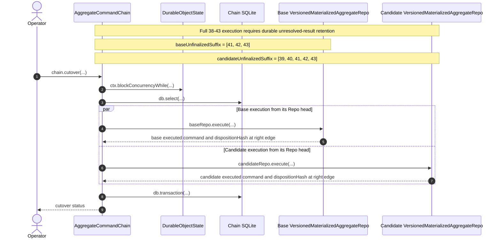

# Aggregate version cutover

**Date:** 2026-09-02
**Status:** Archived design record. [Plan 068](../plans/068-plan-aggregate-version-cutover.md)
selects the singleton-`head`, final-command-only contract: a Repo suffix may
contain finalized history followed by at most the lowest Chain-unresolved
command.

## Decision

`AggregateCommandChain` remains the canonical, unversioned history for one
`{ systemId, aggregateId, aggregateName }`. It owns command admission,
replicated-resource capture, ordering, finalization, and delivery.

Each `VersionedMaterializedAggregateRepo` adds `aggregateVersion` to that identity and
owns only the materialized state produced by that version:

```text
AggregateCommandChain:
  { systemId, aggregateId, aggregateName }

VersionedMaterializedAggregateRepo:
  { systemId, aggregateId, aggregateName, aggregateVersion }
```

For a direct command, the authenticated SystemApi binding supplies `systemId`
and the decoded command target supplies `aggregateId` and `aggregateName`.
Aggregate-version registration supplies `aggregateVersion`; it is not an
authenticated field.

- [`executeAggregateCommand.ts:27-42`](../../../packages/system-worker/src/SystemApi/executeAggregateCommand/executeAggregateCommand.ts#L27-L42) — current direct admission combines authenticated `systemId` with the command-owned aggregate target to resolve the Chain.

The Chain sends a Repo a nonempty, exact, contiguous command suffix together
with the replicated-resource inputs captured for those command occurrences.
The Repo neither calls back into the Chain nor fetches those resources from a
service Repo. It executes the entire suffix and advances its `head` atomically
in one SQLite transaction.

This is a target design, not a description of HEAD. Today the aggregate Chain
dispatches one lowest pending command, and the current materializer can call
back into the Chain to fill a gap or establish a service subscription.

- [`runScheduledWork.ts:51-117`](../../../packages/system-worker/src/AggregateCommandChain/runScheduledWork/runScheduledWork.ts#L51-L117) — current scheduled work selects and dispatches one lowest pending occurrence.
- [`execute.ts`](../../../packages/system-worker/src/VersionedAggregateRepo/execute/execute.ts) — current execution calls catch-up when it observes a gap.
- [`execute.ts`](../../../packages/system-worker/src/VersionedAggregateRepo/execute/execute.ts) — current replicated-resource handling can subscribe back through the Chain.

## State vocabulary

| State     | Meaning                                                                                                                |
| --------- | ---------------------------------------------------------------------------------------------------------------------- |
| finalized | Chain retained that command's canonical terminal occurrence.                                                           |
| executed  | That Repo applied the command and advanced its `head`. Use this instead of "terminal occurrence" for Repo-local state. |
| validated | Chain compared equal hashes against the base at the same occurrence.                                                   |

These states are not synonyms. In particular, a candidate `head` identifies
its last **executed** command. It does not identify a validated command merely
because the candidate executed it successfully or failed it deterministically.

`disposition` means only `success | failure`. It does not mean the returned
delta, failure payload, timestamp, or complete finalized occurrence.

## Validation ancestry and ownership

Version control belongs to `AggregateCommandChain`, beside the history whose
interpretation it selects. It does not belong to SystemRepo.

The Chain extends its singleton state and materializer-subscriber rows rather
than creating a separate `versionControl` table:

```yaml
chainState:
  id: 1
  baseAggregateVersion:
  haltedAt:
  haltFailure:

versionedMaterializedAggregateRepos:
  versionedMaterializedAggregateRepoName:
  aggregateVersion:
  validatedAgainstAggregateVersion:
  currentAggregateIndex:
  queuedAggregateIndex:
  lastDeliveryFailure:
  invalidatedAt:
  invalidatedAggregateIndex:
  invalidationFailure:
```

For a candidate row, `currentAggregateIndex` advances only after the Chain has
compared equal hashes at that occurrence; it is the contiguous **validated**
cursor. The Repo's independently persisted `head` is its **executed** position.

`chainState` has exactly one initialized row. `haltFailure` explains why the
entire Chain halted after execution became uncertain; it is neither an authored
command failure, a candidate mismatch, nor a delivery retry failure.

- [`aggregateCommandChainDbConfig.ts:12-20`](../../../packages/system-worker/src/AggregateCommandChain/aggregateCommandChainDbConfig.ts#L12-L20) — current `chainState` is keyed by one integer and retains only halt state and its failure.
- [`runScheduledWork.ts:118-135`](../../../packages/system-worker/src/AggregateCommandChain/runScheduledWork/runScheduledWork.ts#L118-L135) — current scheduled work writes that failure only when materializer execution is in doubt.

The base is the subscriber row whose `aggregateVersion` equals
`chainState.baseAggregateVersion`. Under the approved single-candidate
assumption, the candidate is the latest subscriber row whose
`validatedAgainstAggregateVersion` equals that base version. Candidate
eligibility additionally requires `invalidatedAt` to be null. `active`, `role`,
`isBase`, and `isValid` are therefore derived rather than persisted columns.

```text
v1  validatedAgainst=null  <- current base
v2  validatedAgainst=v1    <- invalid candidate retained as evidence
v3  validatedAgainst=v1    <- latest row and replacement candidate
```

A hash mismatch records `invalidatedAt`, `invalidatedAggregateIndex`, and
`invalidationFailure` on the candidate's subscriber row. A transient delivery
failure updates only `lastDeliveryFailure` and does not invalidate the
candidate.

This is Git-like only in two narrow senses: `baseAggregateVersion` is a mutable
ref, and `validatedAgainstAggregateVersion` is one parent-shaped validation
edge. It is not materialized-state ancestry. Every version rebuilds
independently from the same linear command history, so there is no commit DAG.
Promotion atomically moves the base pointer to the candidate.

## Repo head

Each versioned VersionedMaterializedAggregateRepo has one singleton `head` table. No row
means that Repo has executed nothing and uses the fixed genesis disposition
hash. The sole row is the complete last executed chained command:

```yaml
head:
  singletonId: 1
  aggregateIndex:
  serviceIndex?:
  commandId:
  chainedAt:
  command:
  delta:
  failedAt:
  failure:
  dispositionHash:
```

`head` replaces `materializationState`; there is no nested `lastResult` and no
`executionClaims` table. Applying every command in the supplied suffix,
materializing its resource changes, and replacing `head` all commit in the
same transaction. After a crash, either the complete suffix committed or none
of it did.

- [`versionedAggregateRepoDbConfig.ts:12-40`](../../../packages/system-worker/src/VersionedAggregateRepo/versionedAggregateRepoDbConfig.ts#L12-L40) — current persistence separates per-command execution claims from the singleton materialization index; the target replaces both with the atomic suffix transaction and `head`.

Ordering is strict:

1. An exact retry of the current `head` returns the stored head without
   executing authored code again.
2. Otherwise, the first supplied index is `head.aggregateIndex + 1`.
3. Every later index is contiguous.
4. A future gap is rejected.

## Suffix model and the 38-43 example

A [suffix](../../glossary.md#suffix) is always relative to a particular durable
boundary. Do not collapse the following two meanings:

1. The Chain's `unresolvedSuffix` is the contiguous trailing run of admitted
   commands for which the Chain has not retained a canonical finalized
   occurrence.
2. A Repo's execution suffix is every command strictly after that Repo's
   executed `head` through one shared right edge.

Multiple commands may be admitted before earlier execution RPCs settle, so the
Chain's `unresolvedSuffix` can contain more than one command. For example:

```text
Chain history:                   38  39  40  41  42  43
Chain finalized through:                 40
Chain unresolvedSuffix:                     [41, 42, 43]

Base Repo head:                          40
Candidate Repo head:             38

baseUnfinalizedSuffix:                       [41, 42, 43]
candidateUnfinalizedSuffix:          [39, 40, 41, 42, 43]
Shared right edge:                                      43
```

This is the requested full-suffix shape. Under the currently retained
singleton-`head` and final-command-only return contract, it is also a
counterexample rather than an executable cutover plan: advancing the base
through 43 would lose the exact finalized outputs for 41 and 42. The full shape
becomes executable only if the first contract in
[Exact canonical-result pressure](#exact-canonical-result-pressure) is chosen.

The two `*UnfinalizedSuffix` labels are retained from the discussion, but their
left edges are Repo-relative: they mean commands not yet **executed by that
Repo**. They do not mean that every included command is unfinalized in the
Chain; candidate entries 39 and 40 are already Chain-finalized.

Commands 39 and 40 are finalized by the Chain but not yet executed by the
candidate. Commands 41 through 43 are not finalized by the Chain and have not
been executed by either Repo. The two Repo suffixes therefore have different
left edges but the same right edge. Calling the candidate's position
"validated through 38" would be unjustified unless the Chain had already
compared its hash with the base at occurrence 38.

Current admission already permits the Chain table to contain several such
unresolved rows: admission stores `result: null` under its semaphore, then
scheduled execution occurs after that semaphore is released.

- [`aggregateCommandChainDbConfig.ts:21-40`](../../../packages/system-worker/src/AggregateCommandChain/aggregateCommandChainDbConfig.ts#L21-L40) — each retained command has its own index and nullable canonical result.
- [`executeAggregateCommand.ts:64-177`](../../../packages/system-worker/src/AggregateCommandChain/executeAggregateCommand/executeAggregateCommand.ts#L64-L177) — admission assigns an index and persists `result: null` while holding only the admission semaphore.
- [`executeAggregateCommand.ts:184-214`](../../../packages/system-worker/src/AggregateCommandChain/executeAggregateCommand/executeAggregateCommand.ts#L184-L214) — scheduled execution and the final result read occur after admission releases that semaphore.

## Rolling disposition validation

Every executed command advances a rolling hash:

```text
H(previousHash, aggregateIndex, commandId, disposition)
```

Both Repos begin from the same fixed genesis hash and preserve the hash at
every `head`. Equal hashes at the same occurrence prove that every disposition
through that occurrence matched. They do not prove equality of deltas, failure
payloads, or other materialized state.

While the derived candidate remains eligible, the Chain normally sends
identical captured inputs to base and candidate in parallel. Once both have
executed through the same occurrence:

1. A hash mismatch invalidates the candidate.
2. Equal hashes validate the candidate through that occurrence.

The Chain compares the returned `aggregateIndex`, `commandId`, and final
`dispositionHash`; comparing bare hashes at different occurrences is invalid.

## Manual production cutover

Cutover is one Chain event gated by `blockConcurrencyWhile`. There is no loop
that chases a moving Chain tip inside the gate: because the Chain cannot process
another event while the callback is running, one Chain-local snapshot fixes the
unresolved rows and shared right edge. The gate does not freeze either remote
Repo or make a Chain database query capable of reading a Repo-local `head`.

The sequence below is the intended rendezvous. Executing the complete 38-43
suffix is conditional on choosing durable retention of every newly executed
unresolved occurrence. If singleton `head` plus final-command-only return is
preserved, the same sequence uses right edge 41 instead.



## Annotated workflow steps

1. The operator explicitly requests promotion of one destination
   `aggregateVersion`; production never promotes merely because new worker code
   was deployed.
2. The Chain enters its own event gate before initiating either Repo RPC. Repo
   execution must have no reverse callback into this Chain.
3. The Chain reads its admitted command rows and retained subscriber cursors
   once. It fixes one Chain-local right edge and derives a distinct contiguous
   suffix for each Repo. A cursor can lag a Repo whose earlier response was
   lost or is currently gated, so the execution contract must reconcile that
   overlap; `blockConcurrencyWhile` does not solve it.
4. If the base is behind that right edge, the Chain asks it to execute the
   suffix after the base's head. This includes 41-43 only under the durable
   unresolved-result contract; the head-only contract stops at 41.
5. The base returns its last executed chained command at the shared right edge.
   The return is Repo execution state, not yet Chain finalization.
6. In parallel, the Chain asks the candidate to execute the full suffix after
   the candidate's head, using the same captured input for every occurrence
   shared with the base.
7. The candidate returns the same identity fields and its rolling disposition
   hash at that edge.
8. The Chain compares both identities and hashes. A mismatch records candidate
   invalidation. Equality validates through the shared occurrence, but
   promotion is legal only after the Chain can retain every newly finalized
   canonical result described below.
9. The call reports promotion, invalidation, or execution failure. An
   unsupported multi-unresolved suffix is rejected before either Repo is
   advanced; it is not discovered as a status after execution.

The base and candidate RPCs are initiated inside the gate and awaited in
parallel. Continuous shadow execution should keep each final suffix short,
because the gate holds every other Chain event and has a bounded runtime. A
failure before the Chain's promotion transaction leaves the base pointer
unchanged, although either Repo may already have advanced.

## Exact canonical-result pressure

The 38-43 example exposes a contract that a final-only Repo return and a
singleton `head` cannot satisfy by themselves.

If the base atomically executes `[41, 42, 43]` but returns and retains only
command 43, the Chain still lacks the exact canonical finalized occurrences
for 41 and 42. The final `dispositionHash` proves their success/failure sequence
but cannot reconstruct either command's delta, failure details, or timestamps.
A committed execution followed by a lost RPC response makes the same loss
unrecoverable from the singleton head.

- [`CommandSchema.ts:169-224`](../../../packages/core/src/contracts/CommandSchema.ts#L169-L224) — every aggregate occurrence carries its own pending, successful, or failed `delta`, `failedAt`, and `failure` fields, so an intermediate finalized occurrence cannot be reconstructed from a later hash.

The implementation-planning fork was between two contracts that do not
preserve the same prior decisions:

1. **Preserve the full 41-43 suffix.** Revise the singleton-head,
   final-command-only contract so the Repo returns **and durably retains until
   Chain acknowledgement** every newly executed occurrence that was unresolved
   by the Chain.
2. **Preserve singleton head and final-command-only return.** A Repo may
   execute any finalized historical prefix in a batch, but at most one
   Chain-unresolved command at its tail. The Chain finalizes that occurrence
   before dispatching the next.

[Plan 068](../plans/068-plan-aggregate-version-cutover.md) selects the second
contract. This does not deny that the Chain has three unresolved rows. It
chooses an earlier execution boundary:

```text
Chain unresolvedSuffix:       [41, 42, 43]
baseUnfinalizedSuffix:        [41]
candidateUnfinalizedSuffix:   [39, 40, 41]
Shared right edge:            41
Still admitted/unresolved:    [42, 43]
```

Returning an array without durable retention is insufficient after a committed
transaction whose response is lost. Under the contract selected by Plan 068,
cutover must not execute the full 41-43 base suffix. Hash equality would
establish that the base and candidate disposition sequences match; it cannot
finalize the three exact canonical occurrences or reveal the individual
dispositions.

For every occurrence finalized before promotion, the Chain retains the base
Repo's complete executed result as canonical. The candidate result supplies
validation evidence only; equal disposition hashes do not select the
candidate's delta, failure payload, or timestamps.

A mismatch detected only from the final rolling hash records the compared
right edge as `invalidatedAggregateIndex`; it does not identify the first
differing occurrence. Locating that earlier occurrence would require per-index
comparison evidence.

## Retry and overlapping execution

`blockConcurrencyWhile` stabilizes Chain-local state, not Repo state. A Repo
RPC initiated by an earlier Chain event can commit while delivery of its
response to the Chain remains gated. The implementation contract must therefore
choose an idempotent overlap rule before constructing a suffix from a retained
subscriber cursor:

1. Preserve strict `head + 1` ordering: first retry the lowest outstanding
   command exactly, retain its returned result in the Chain, and then rebuild
   the suffix after the newly known head. This can require sequential recovery.
2. Add an explicit Repo-head read before deriving each suffix.
3. Revise `execute` to accept an overlapping prefix only when the supplied
   immutable occurrence at the Repo's current head matches exactly; it skips
   that verified prefix and applies the remaining contiguous tail.

Plan 068 selects the third rule. The Repo retains
`canonicalExecutionBytes` in its singleton `head`, accepts an exact overlap,
and rejects a changed occurrence or captured input.

For a lost response to the **same atomic batch**, a final-command probe is also
sufficient: an exact-head response proves the batch committed, while a
distinguishable future-gap response tells the Chain to resend the original
reconstructible suffix. That probe does not by itself reconcile a shorter RPC
that committed immediately before a longer cutover suffix was constructed.

"Exact" compares immutable execution identity—not output fields that authored
execution produces. It includes at least `aggregateIndex`, `commandId`,
`chainedAt`, canonical authored command bytes, and the identity of the captured
replicated-resource input. The selected plan stores the exact canonical
execution encoding in `head` so a retry with changed captured input is
rejected.

An unambiguous failure before the Chain's promotion transaction leaves the old
base selected. An externally observed timeout or lost response can occur after
that transaction committed, so a retry first rereads `baseAggregateVersion`
and reports an already-completed promotion idempotently.

## Development and production

Development does not preserve aggregate-version cutover state: disposable
storage may start directly on the current aggregate code. Production retains
the base pointer, validation ancestry, candidate invalidation, captured inputs,
Repo heads, and disposition hashes across worker deployments. Deploying worker
code may begin or resume candidate shadow execution; only explicit manual
cutover moves `baseAggregateVersion`.

## Non-goals

1. SystemRepo does not choose, promote, or roll back aggregate versions.
2. Worker deployment does not automatically promote a candidate.
3. `active` is not persisted as an independent candidate status.
4. Hash equality does not assert equal deltas or byte-identical materialized
   state.
5. `blockConcurrencyWhile` does not make reverse Chain callbacks safe.
