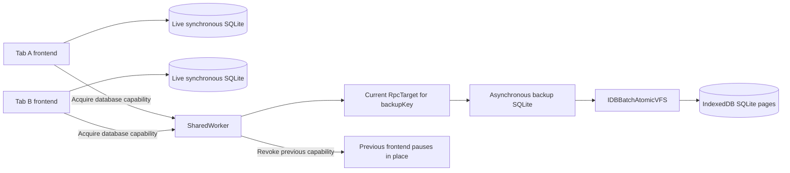

# Shared IndexedDB backups and frontend handoff

**Date:** 2026-09-07
**Status:** Draft for review

## Problem Statement

Browser frontend sessions already own their live synchronous SQLite replicas,
authored execution, recovery, sockets, and aggregate command submission on the
main thread. Persistence is an asynchronous copy of that state.

The current backup design adds several responsibilities that complicate that
boundary:

1. Every execution session gets a separate OPFS database. A localStorage locator
   selects a session, and startup must inspect and clean predecessor databases.
2. A SharedWorker routes each storage call to a dedicated Worker hosted by an
   elected page. Build-qualified leader election and numeric `backupClientId`
   bookkeeping coordinate access to retained file handles.
3. Changing the selected session supersedes another tab and can reload it on
   visibility changes.
4. Requiring an old page to flush and release ownership can hold up the active
   tab when the old page is suspended or unresponsive.

The replacement must give every exact frontend backup identity one logical
database, support ownership changes across app builds, and let a visible tab
take over without waiting for the old page. Changes which have not reached
backup storage may be lost during takeover. That loss must not permit stale
writes into the successor's database.

## Solution

Keep the live replicas on the main thread. Put backup SQLite directly inside
one SharedWorker, using the asynchronous wa-sqlite build and
`IDBBatchAtomicVFS` to persist SQLite pages in IndexedDB.

The SharedWorker returns a database-bound RPC capability for one ownership
period. It owns the current target for each `backupKey` and permanently revokes
the previous target when another frontend takes over. A returned capability
replaces the per-method router-to-leader forwarding layer.



IndexedDB is the filesystem for backup SQLite. Application tables, SQL,
Drizzle, command journals, and authored frontend execution remain SQLite
concerns. This design adds no separate durable outbox for backup delivery.

## User Stories

1. As a user opening the same frontend in several tabs, I want one backup for
   its exact identity instead of an accumulating database per session.
2. As a user switching tabs or windows, I want the newly active frontend to
   restore the latest committed backup and resume without reloading the page.
3. As a user whose previous tab is frozen, I want the active tab to take
   ownership without requiring the previous tab to respond or reach the server.
4. As a user returning to an old tab, I want its stale local state replaced
   before it resumes submission and backup writes.
5. As a user running two app builds, I want matching backup identities to share
   ownership and persistence, while different frontend locks remain isolated.
6. As a user working offline, I want already-backed-up state and unresolved
   command occurrences to survive reopening, without a server round trip being
   required merely to transfer ownership.
7. As a developer, I want `overwriteDb` and `applyStatements` on a capability
   already bound to the database, without repeatedly passing session and client
   identity through two RPC targets.
8. As a developer changing an incompatible backup format, I want disposable
   state rebuilt, with no backup migrations or legacy compatibility paths.

## Implementation Decisions

### Runtime and SharedWorker identity

1. The main thread remains the live replica and owns authentication, authored
   programs, optimistic state, sockets, recovery, and command submission.
   The SharedWorker only restores and persists backup SQLite state.
2. Use `IDBBatchAtomicVFS` with the asynchronous wa-sqlite build in the
   SharedWorker. Do not select `IDBMirrorVFS` initially: its additional complete
   in-memory database copy is unnecessary for this backup workload.
3. All app builds participating in handoff on an origin must connect to the
   same stable SharedWorker script URL and worker name. The script URL used in
   `new SharedWorker` must not contain an app build hash. Serving this stable
   entrypoint in development, preview, and production is part of the cutover.
4. A new app bundle connects to the running backup worker. That worker uses a
   generic SQLite backup API and does not load authored frontend definitions or
   derive ownership from the frontend bundle that first connected.
5. An existing worker keeps its implementation for its lifetime. A later
   worker loads the then-current entrypoint. An incompatible backup RPC change
   requires a deliberate hard cutover; do not introduce dual protocols or use
   a different build URL to create competing authorities for the same backup.
6. Return the database RpcTarget through Cap'n Web. The earlier forwarded-target
   proposal becomes direct capability return because backup SQLite now lives
   in the SharedWorker itself. There is no dedicated leader target to forward
   through and no custom RPC bridge or port-tunneling protocol.
7. Serialize access to each asynchronous SQLite runtime. Its operation turn
   must cover all suspended SQLite/VFS work, including snapshot copy and
   transaction completion. No page response or network request belongs inside
   that turn.
8. Delete dedicated backup-worker hosting, page leader election, graph-qualified
   routing identity, and `backupClientId`. VFS transaction locks still provide
   storage exclusion; they are not page ownership leases.
9. Retain the useful worker-death detection behavior of the current termination
   lock, scoped to the stable storage worker identity. It observes the storage
   worker's lifetime; it does not require an old page to release a leadership
   or per-database lifetime lock before another page can take over.

### Exact backup identity and readable names

1. Preserve the aggregate identity fields exactly:
   `{ systemId, userId, aggregateId, aggregateName, frontendName,
aggregateFrontendLockKey }`.
2. Preserve the service identity fields exactly:
   `{ systemId, userId, serviceName, frontendName, serviceFrontendLockKey }`.
3. Online authentication/admission supplies `systemId` and `userId`; the
   existing offline authentication locator supplies them during offline
   restoration. The caller selects `aggregateId`. Authored frontend definitions
   supply aggregate/service name, frontend name, and the frontend lock. The
   existing Core lock-key functions hash the complete canonical frontend lock
   with SHA-256. The key itself grants no new authentication authority.
4. Replace the opaque digest of the entire backup identity with a readable key
   generated by Remix `RoutePattern` and `createHref`, using these patterns:

   ```text
   /zerospin/:systemId/:userId/aggregate/:aggregateName/:aggregateId/:frontendName/:aggregateFrontendLockKey/backup.sqlite3
   /zerospin/:systemId/:userId/service/:serviceName/:frontendName/:serviceFrontendLockKey/backup.sqlite3
   ```

5. Encode each parameter without collisions or path traversal. The lock segment
   remains the complete SHA-256 digest, not a shortened hash or the lock's raw
   JSON. Different identity fields must never select the same logical database.
6. The resulting `backupKey` is the logical SQLite filename within the VFS.
   It is not an HTTP endpoint or a physical OPFS file. IndexedDB can hold many
   logical SQLite databases within the VFS's fixed page-storage layout.
7. There is exactly one current logical database per `backupKey`. Neither
   `sessionId`, app bundle URL, nor app build hash participates in that key.
   Matching keys share persistence across builds; different frontend-lock
   hashes select different databases.
8. Keep the offline authentication locator's independent purpose. Remove the
   localStorage current-session locator and storage-event ownership mechanism.

### Database capability and revocation

1. Acquisition selects a `backupKey` once and returns a capability bound to
   that database and one ownership period. Successful acquisition also supplies
   a snapshot of its last committed state, or explicit absence for a new backup.
   Capability binding, owner selection, and snapshot selection share one
   serialized storage operation.
2. The approved mutation methods are `overwriteDb({ snapshot })` and
   `applyStatements({ statements })`. They receive no `backupKey`, `sessionId`,
   or numeric client ID. Snapshot export is likewise bound to that capability.
3. `overwriteDb` replaces the complete SQLite contents. `applyStatements`
   applies the ordered statement batch in one SQLite transaction and rolls the
   whole batch back on failure. Snapshot copy must use async-aware SQLite calls
   and complete all VFS persistence before acknowledgement; the current raw
   synchronous backup-step assumptions must not carry over unchanged.
4. The storage owner keeps the current target instance for each key. Every
   operation checks that its target is still current when its storage operation
   begins, after waiting for any earlier SQLite operation.
5. A superseded target remains revoked permanently. All its outstanding
   duplicates refer to the same revoked target. It cannot call `overwriteDb` to
   reclaim the database or reclassify revocation as a repairable transport error.
6. Disposal releases the caller's capability and any resources it still owns.
   Disposal of a stale target must not close, delete, or release its successor's
   database. Reference disposal alone is not the ownership check.
7. Notify the previous page that its capability was revoked, using the existing
   RPC transport's capability mechanisms. Delivery of that notification is
   best effort and is never a prerequisite for granting the new owner.
8. Repeated acquisition signals from the current frontend reuse its ownership
   period. They do not restore over its live replica, reset its execution
   session, or discard pending commits. A real reacquisition after revocation
   gets a new target, even if it comes from the same mounted page.

### Visibility, focus, and forced handoff

1. A frontend requests ownership on visible startup, on transition to visible,
   on window focus while visible, and on visible page restoration. Hidden
   startup does not preempt the existing owner. Coalesce duplicate local
   triggers and ignore replies from canceled or obsolete acquisition attempts.
2. Merely hiding or blurring the owner does not force a handoff. Another
   eligible frontend's acquisition causes it. Two visible windows do not
   continually steal from each other: only acquisition-triggering events do so.
3. Once a takeover reaches the SharedWorker, invalidate the old target for
   operations that have not begun. Finish the already-running SQLite operation
   to commit or rollback, then select the successor and its committed snapshot.
   There is no concurrent mutation of the same backup.
4. Do not await the old page's queued SQL, main-thread snapshot, command push,
   network connectivity, or server finalization. Do not implement a cooperative
   flush timeout followed by Web Lock stealing. Normal and unresponsive-page
   takeovers use the same storage-owned revocation rule.
5. The previous frontend pauses in place when it learns of revocation. Stop
   new execution/submission and close or suspend its socket/recovery activity.
   Fence delayed async callbacks and backup acknowledgements by the local
   ownership period so they cannot reactivate or mutate the replacement session.
6. A frozen page might learn about revocation only when it resumes. Its old
   storage capability is already invalid. It may have produced additional local
   work before observing revocation; that work has no right to overwrite the
   successor's backup.
7. Before the successor becomes current, restore the snapshot selected during
   acquisition into its main-thread replica and reestablish its runtime metadata
   and ordered capture. Revalidate its acquisition if revocation arrived during
   asynchronous restoration. A superseded attempt never publishes itself current.
8. A real reacquisition starts a fresh command execution `sessionId`, while
   keeping the frontend mounted. Preserve complete restored command occurrences
   with their original `sessionId`, `sessionIndex`, payload, and provenance.
   The new execution session prevents reused command positions after discarding
   local changes absent from the backup. Session IDs do not create backup files.
9. An existing valid backup is restored, not overwritten with the incoming
   tab's stale memory. Initialize an absent backup from the normal bootstrap
   state. Full overwrite otherwise belongs to initialization or repair/recovery,
   not every focus event.
10. Changes confined to the old page's memory or undelivered backup queue may be
    discarded. Already-admitted server commands can still execute; handoff does
    not cancel or undo them. Preserve existing server command identity and
    authoritative reconciliation behavior.
11. Ownership is independent for each `backupKey`. A page can request its
    selected frontends together without making unrelated keys one transaction
    or one failure domain. Do not reload the document to implement handoff.

### Backup delivery, acknowledgements, and recovery

1. Keep each frontend's existing in-memory committed-SQL queue with one request
   in flight. There is no additional persistent backup outbox. The aggregate
   command journal and its server submission loop remain separate concerns.
2. Normal local command completion does not wait for IndexedDB. A backup
   acknowledgement does wait for the chosen storage commit. Start with
   `IDBBatchAtomicVFS` full synchronization and strict IndexedDB durability;
   accepting loss before backup is not an instruction to weaken acknowledged
   backup durability.
3. A dispatched incremental request whose result is lost has an uncertain
   outcome. Never blindly replay it. If the session still owns the database,
   discard queued incremental batches, capture its current live snapshot,
   overwrite the backup, and then deliver commits captured after that snapshot.
4. A complete snapshot replacement may be retried once after typed transport
   uncertainty only while the same ownership period remains valid. Revocation
   always ends that repair. An old owner may not repair over its successor.
5. A lost SharedWorker ends all capabilities from that worker. Reconnect to the
   stable worker identity. Resumed ownership starts from committed persistence;
   a page with an obsolete capability does not automatically publish its old
   memory as the new baseline. Accepted loss of undelivered changes also applies
   at this ownership boundary.
6. Preserve separate session and backup states. Storage failure alone must not
   turn ordinary execution in an already-current live replica into a synchronous
   storage wait. A newly acquiring frontend cannot claim successful ownership
   or restoration until those operations actually succeed.
7. This guarantees takeover without a response from the previous page. It does
   not promise that a hung browser storage engine or a hung SharedWorker can
   complete a storage operation. Surface storage failure or pending recovery
   honestly; do not infer success from a timer or permit concurrent writers.
8. Restore unresolved command journal entries that actually reached the backup.
   Recover online through the existing authoritative paths. With no valid
   backup and no network, report that offline restoration is unavailable rather
   than presenting a fabricated empty replica.
9. Preserve snapshot failure semantics: an interrupted overwrite yields a
   complete prior or replacement database after recovery, never an acknowledged
   partial database. Asyncify/VFS behavior must be verified with actual storage.

### Disposable storage and hard cutover

1. Never migrate a backup database. Do not convert OPFS files to IndexedDB,
   replay old session databases into the new format, or maintain dual persistence
   paths. Backups incompatible with the selected frontend identity or storage
   format are disposable and rebuilt through the normal bootstrap path.
2. Creating the VFS's IndexedDB object stores in an empty database is permitted.
   Upgrading an existing backup store is not. A future incompatible VFS storage
   layout uses a fresh storage namespace and rebuilds its backups; app builds
   and SQLite frontend schema changes do not bump IndexedDB's database version.
3. Do not restore a backup under a different frontend-lock hash or translate
   its schema. Preserve the existing identity checks before restoring bytes.
4. Remove obsolete per-session backup listing, predecessor draining, and
   session-file cleanup. Releasing a frontend releases ownership; it does not
   delete the one shared backup needed for the next restoration.
5. Update the backup package, its consumers, tests, diagnostics, and architecture
   documentation to IndexedDB and the new method names in the implementation
   cutover. Do not keep OPFS names or old APIs as compatibility aliases.
6. A changed app build does not by itself invalidate a backup. The full frontend
   identity and frontend-lock hash determine whether that backup can be reused.
7. Storage quotas, site-data clearing, and browser eviction remain ordinary
   browser persistence concerns. Switching storage backend does not make the
   local copy a permanent server archive.

## Testing Decisions

The user approved the existing Shopping browser acceptance seam, supplemented
only by focused key-encoding and RPC capability-disposal tests where necessary.

1. Evolve the current main-thread frontend and OPFS adverse browser suites to
   use real SharedWorkers, Cap'n Web capabilities, asynchronous wa-sqlite,
   `IDBBatchAtomicVFS`, and isolated IndexedDB storage. Replace obsolete locator
   and dedicated-leader expectations instead of preserving the old design.
2. Prove two independently emitted frontend builds use one stable SharedWorker
   identity and one logical database for the same key. Prove different users,
   systems, aggregate IDs, frontend names, and frontend-lock hashes are isolated.
3. Exercise visible startup, tab visibility changes, window focus with both
   windows visible, page restoration, duplicate triggers, and rapid alternating
   requests. The current owner is reused; an obsolete acquisition cannot publish
   current state; handoff never reloads the page.
4. Freeze the old page with its local backup queue intentionally undelivered.
   Let another page acquire, restore, and write. Verify takeover needs no old-page
   response, excludes the unbacked changes, and permits new command execution.
   Resume the old page and verify both its old mutation methods are rejected.
5. Hold a real storage transaction at a controlled boundary and request takeover.
   Verify that operation commits or rolls back before successor restoration and
   that queued old-target operations are rejected. Include failed statements,
   failed overwrites, revoked repair attempts, and successor-safe stale disposal.
6. Restore pending backed-up command occurrences after handoff, preserving their
   complete bytes. Verify fresh execution session IDs prevent reused command
   positions after losing unbacked commands. Already-admitted commands still
   reconcile through normal server finalization.
7. Terminate the SharedWorker before dispatch, during mutation, and after commit
   before acknowledgement. Verify truthful uncertainty, no incremental replay,
   capability invalidation, reconnect, and restoration from committed storage.
8. Round-trip actual SQLite snapshots through IndexedDB, including initialization,
   full overwrite, incremental batches, and cold restart. Check atomic failure
   recovery and acknowledgement ordering with strict persistence configured.
9. Test offline restoration, missing backups, incompatible backup identities,
   storage errors, and independent aggregate/service recovery. Prove no OPFS
   migration or in-place IndexedDB schema upgrade is attempted.
10. Keep focused key tests for escaping, separator collisions, Unicode, and
    exact frontend-lock hashing. Exercise real RPC stub duplication/disposal
    where the browser scenarios cannot isolate those semantics economically.
11. During implementation, run the relevant Nx browser tests and affected build,
    typecheck, lint, and formatting targets. Do not claim browser guarantees
    from Node mocks alone. No numerical performance gate is invented here;
    investigate backlog, restore latency, or memory only if measurements expose
    a practical concern.

## Out of Scope

1. Moving live replicas, authored execution, authentication, sockets, or command
   submission into the SharedWorker.
2. Guaranteeing preservation of commands or state that never reached backup
   storage, adding write-through command acknowledgements, or waiting for the
   old page to flush before handoff.
3. Multiple simultaneous logical writers for one key, merging divergent tab
   snapshots, or canceling commands already admitted by the server.
4. OPFS fallback, a SharedWorker-owned dedicated Worker, `IDBMirrorVFS`, new
   durable outboxes, or a custom IndexedDB VFS.
5. Backup migrations, legacy RPC aliases, cross-origin sharing, server schema
   changes, production storage resets, or implementing this spec in this pass.

## Further Notes

1. This replaces the persistence and tab-supersession portions of
   [Spec 066](../archived/066-spec-main-thread-frontend-replicas-and-opfs-backups.md).
   Its main-thread replica boundary remains. The current behavior is described
   in [browser bootstrap](../../architecture/browser/bootstrapBrowserSession.md)
   and [OPFS coordination](../../architecture/browser/OpfsBackupCoordination.md);
   those reference pages change with implementation, not with this proposal.
2. An isolated probe in this conversation found `typeof Worker === 'undefined'`
   inside a SharedWorker in Playwright Chromium 147.0.7727.15 and installed Chrome
   152.0.7977.82. Consequently, the proposed nested dedicated-worker topology was
   rejected. The probe did not reach freeze/close checks for that topology and
   did not test Firefox or WebKit. IndexedDB handoff behavior remains to be
   verified at the approved browser seam.
3. [wa-sqlite VFS documentation](https://github.com/rhashimoto/wa-sqlite/blob/master/src/examples/README.md)
   describes IndexedDB support in SharedWorkers, asynchronous-build requirements,
   and the VFS tradeoffs. Its example VFS status makes testing the selected
   implementation important; selecting it here is not a completed verification.
4. [Cap'n Web](https://github.com/cloudflare/capnweb#rpcstubt) supports returned
   and forwarded capabilities. Forwarding through another connection proxies
   calls through that intermediary; it does not establish a direct third-party
   transport. This design needs returned capabilities, not an extra intermediary.
5. [IndexedDB's upgrade rules](https://w3c.github.io/IndexedDB/#versionchange-transaction)
   explain why changing its object-store layout can wait for old connections.
   That is distinct from changing SQLite data or selecting a new `backupKey`.
   This design never upgrades an existing backup store.
