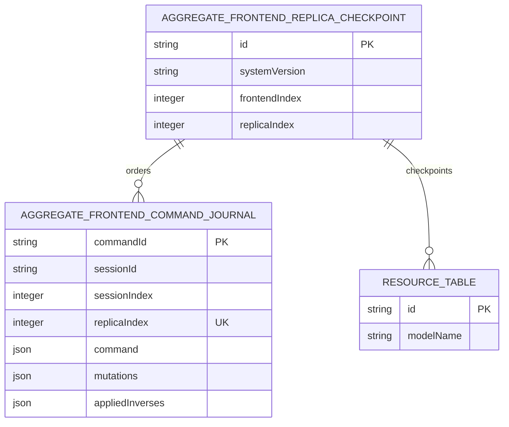
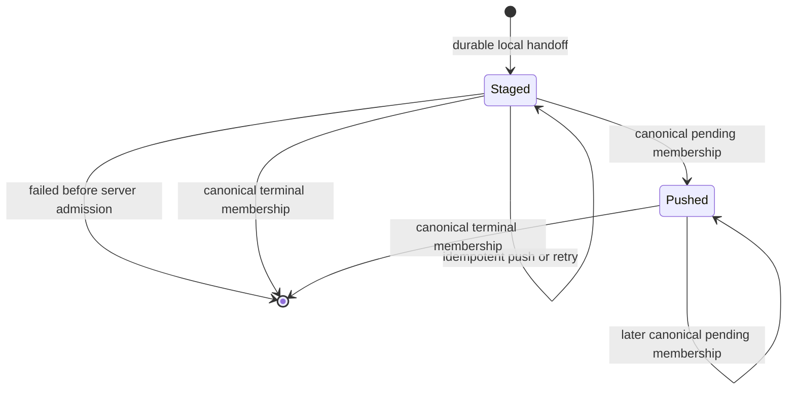
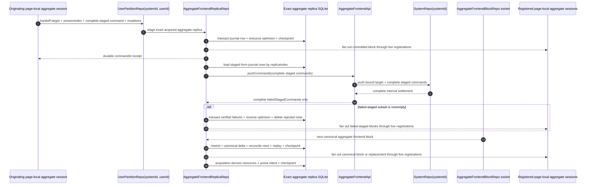

# RFC: Active SharedWorker Command Journal

**Status:** Archived historical input; reconciled by
[`Spec 056`](./056-spec-shared-worker-port-authentication-and-exact-repo-authority.md).

> This RFC contains only the proposed architecture. It does not describe
> behavior at HEAD and does not authorize implementation.

## Problem and goal

The SharedWorker currently persists the same exact-replica view in resource
tables, command-journal lifecycle columns, metadata, and one complete JSON
snapshot. Both the direct push response and the canonical frontend block stream
rewrite those overlapping representations. The resulting code must maintain a
large product state, reject structurally valid but semantically impossible
rows, and keep two competing convergence reducers consistent.

The goal is one durable owner for each fact: resource tables own the visible
projection, one active command journal owns unaccounted local intent, and one
checkpoint row owns ordering frontiers. Canonical frontend blocks must be the
sole authority that accounts admitted commands. The complete replica JSON
snapshot, previous-block JSON, pushed-cursor watermark, browser command outcome
history, and parallel push-response convergence reducer are deleted.

## Context

The server already resolves a repeated staged command by command ID or by its
`{ sessionId, stagedCursor }` identity before attempting new admission. An
identical retry reuses the stored pushed, executed, failed-staged, or
failed-pushed result; conflicting bytes fail. This makes resending every active
browser journal row safe
([`pushCommands.ts:99-318`](../../../packages/system-worker/src/AggregateFrontendRepo/pushCommands/pushCommands.ts#L99-L318)).

The separate generation-drain proposal may retain the complete internal push
settlement in SystemRepo. This RFC changes only the browser-facing result of
`AggregateFrontendApi.pushCommands`: the API projects the complete internal
result to its complete `failedStagedCommands` array before returning to the
SharedWorker
([`SystemLifecycle.md`](../../architecture/SystemLifecycle.md)).

## Proposed architecture

1. The exact aggregate replica database owns generated resource tables, one
   active command journal, and one checkpoint row. It does not own a complete
   replica-state JSON row.
2. Resource tables are the sole persisted materialized projection. They contain
   the current canonical resources plus every currently applied optimistic
   journal mutation.
3. Journal row presence means only: “this locally committed command has not yet
   been accounted for by the canonical aggregate frontend stream.” A row holds
   the complete staged or pushed command, immutable encoded mutations, and the
   currently applied inverses required to rewind the visible projection.
4. A durable handoff inserts the complete staged command and mutations, applies
   optimism, stores the resulting inverses, and advances the checkpoint's
   `replicaIndex` in one exact-database transaction.
5. Every automatic retry, manual push, reconnect wake, and restart may safely
   resend every staged-form journal command in `replicaIndex` order. Server-side
   command-ID and `{ sessionId, stagedCursor }` idempotency resolves commands
   already admitted or terminal. Canonically promoted pushed-form rows remain
   active but are not resent.
6. The browser-facing `AggregateFrontendApi.pushCommands` success contains only
   complete failed-staged commands. In one transaction the SharedWorker verifies
   each rejected command, applies its stored inverses, deletes its journal row,
   and advances `replicaIndex`. It does not retain failed-command history for a
   later acquisition.
7. A push result that reports an admitted, pending, executed, or failed-pushed
   command does not change the local projection or account the row. In
   particular, there is no `executed-unaccounted` or
   `failed-pushed-unaccounted` persisted state. The row remains active until a
   canonical block accounts it.
8. Each ordered canonical block exhaustively identifies its pending, executed,
   and failed-pushed commands. Its one transaction rewinds all active journal
   rows, applies the canonical resource delta, promotes matching pending rows to
   their complete pushed command, deletes matching terminal rows, reapplies all
   remaining mutations in `replicaIndex` order, replaces their applied
   inverses, and advances `frontendIndex` and `replicaIndex`.
9. Repair installs complete canonical resources and reconciles every active
   journal row against exhaustive pending, executed, and failed-pushed command
   identities from the same authoritative snapshot. It then replays only the
   remaining local intent. Repair never uses an implicit pushed-cursor
   watermark.
10. Acquisition derives the browser replacement value from one consistent read
    of the exact-replica catalog, checkpoint, resource tables, and active
    journal. The replacement contains current resources and unaccounted local
    intent, not historical command outcomes.
11. `frontendIndex` orders canonical projection blocks and `replicaIndex` orders
    exact-replica commits. No persisted `lastRebasedPushedCursor` or
    `previousBlock` is required. A duplicate authoritative block at or below the
    committed `frontendIndex` is an idempotent no-op; a gap triggers repair.
12. Effect Schema validates complete commands, mutation and inverse arrays,
    failed-staged results, canonical blocks, repair snapshots, and derived
    acquisition values at their trust or persistence boundaries. It does not
    validate a second persisted projection.
13. Push transport selection, registration fencing, reauthentication, retry,
    pause, and manual wake remain runtime concerns. They may determine whether
    and when the active batch is sent, but they cannot account admitted work.

### Runtime terminology

1. The **exact replica** is the single `AggregateFrontendReplicaRepo` keyed by
   exact `{ systemId, userId, aggregateName, aggregateId, frontendName,
aggregateFrontendLockKey }`.
2. A **page-local aggregate session** is one browser page's UI-facing session
   for that aggregate frontend. It owns its unique `sessionId`, synchronous
   command boundary, SQLite database, React-facing store, and session sink. Its
   target fields come from authenticated bootstrap `{ systemId, userId }`, the
   Provider-selected `aggregateId`, and the authored `{ aggregateName,
frontendName, aggregateFrontendLockKey }` frontend definition.
3. A **replica registration** is the SharedWorker-side runtime attachment of
   one page-local aggregate session to the exact replica. It owns its distinct
   registration ID, MessagePort `ownerToken`, authorization capability,
   delivery gate, buffering, and reference to that session's sink. A live
   registration is one that has not been released.
4. A **session sink** is the main-thread RPC endpoint stored in a replica
   registration. It receives replica blocks, replacement state, and terminal
   failure for its page-local aggregate session.
5. The page-local aggregate session and replica registration are the two sides
   of one attachment, not the same runtime object. `sessionId` identifies the
   command-producing page session; the registration ID identifies its
   SharedWorker attachment. Multiple page-local sessions may share one exact
   replica through separate live registrations.

## Proposed Drizzle schemas

### Exact aggregate replica database: `aggregateFrontendCommandJournal`

| Column            | Proposed Drizzle shape                                                                | Constraints                          | Purpose                                                                                                    |
| ----------------- | ------------------------------------------------------------------------------------- | ------------------------------------ | ---------------------------------------------------------------------------------------------------------- |
| `commandId`       | `primitives.primaryKey({ abbreviation: coreAbbreviations.command })`                  | Primary key                          | Existing complete command identity; no second generated journal identity.                                  |
| `sessionId`       | `primitives.opaqueId({ abbreviation: coreAbbreviations.session })`                    | Non-null; unique with `sessionIndex` | Correlates commands committed by one page-local aggregate session.                                         |
| `sessionIndex`    | `primitives.integer()`                                                                | Non-null; unique with `sessionId`    | Handoff order assigned after successful local commits; it is not server ledger order.                      |
| `replicaIndex`    | `primitives.integer()`                                                                | Non-null; unique and indexed         | Exact-replica insertion order and journal push/replay order.                                               |
| `command`         | `primitives.json({ schema: Schema.Union(StagedCommandSchema, PushedCommandSchema) })` | Non-null                             | Complete active command. A canonical pending block may replace staged bytes with the complete pushed form. |
| `mutations`       | `primitives.json({ schema: Schema.Array(EncodedAggregateFrontendMutationSchema) })`   | Non-null; immutable                  | Complete encoded optimistic mutation input replayed over each new canonical base.                          |
| `appliedInverses` | `primitives.json({ schema: Schema.Array(EncodedAppliedMutationSchema) })`             | Non-null                             | Current applied inverses. Replaced whenever optimism is replayed; used to rewind the resource projection.  |

The table intentionally has no generated `id`, lifecycle enum,
`pushProvenance`, `terminalOutcome`, `updatedAt`, or state-discriminant index.
The complete command itself distinguishes staged from pushed without parallel
nullable provenance. `appliedInverses` is derived projection machinery, not
command outcome history.

### Exact aggregate replica database: `aggregateFrontendReplicaCheckpoint`

| Column          | Proposed Drizzle shape                            | Constraints                   | Purpose                                                        |
| --------------- | ------------------------------------------------- | ----------------------------- | -------------------------------------------------------------- |
| `id`            | `primitives.primaryKey({ abbreviation: 'arpc' })` | Singleton `arpc_current`      | Stable checkpoint row identity.                                |
| `systemVersion` | `primitives.text()`                               | Non-null                      | System version used to validate the acquired frontend program. |
| `frontendIndex` | `primitives.integer()`                            | Non-null; monotonically grows | Latest committed canonical frontend block.                     |
| `replicaIndex`  | `primitives.integer()`                            | Non-null; monotonically grows | Latest committed exact-replica transaction.                    |

There is no `lastRebasedPushedCursor`, socket state, reconnect count, failure
payload, target identity, complete snapshot, or previous block in this row.
Exact target identity belongs to the catalog. Connection and registration state
is runtime-only.

### Resource tables

The frontend model's generated resource tables remain the only persisted
materialized projection. They are updated in the same transaction as the
journal and checkpoint. Acquisition reads them directly; it does not read or
rewrite a copied `resources` JSON array.



The relations are transactional and logical. Dynamic resource tables and the
journal do not need foreign keys to the singleton checkpoint.

## Journal existence lifecycle



Row presence means active local intent. The complete command's existing
`status` discriminates staged from pushed; there is no parallel lifecycle
column. No executed or failed variant remains active after its accounting
transaction commits.

## Workflow



## Annotated workflow steps

1. **Handoff complete local work.** The originating page-local aggregate
   session owns a unique `sessionId`, its main-thread SQLite database and store,
   and the session sink held by its live replica registration. The request
   target is exactly `{
aggregateId, aggregateName, frontendName, aggregateFrontendLockKey }` from
   the acquired session. `UserPartitionRepo` supplies its bound
   `{ systemId, userId }`. The session supplies `sessionIndex`, the complete
   staged command, and complete encoded mutations. The command itself preserves
   its complete target, actor, contract revision, session, cursor, timestamp,
   and payload.
2. **Resolve the exact replica.** `UserPartitionRepo` requires the matching
   catalog row and already acquired runtime keyed by exact `{ systemId, userId,
aggregateName, aggregateId, frontendName, aggregateFrontendLockKey }`. It
   delegates without reconstructing the command.
3. **Commit one active row.** The serialized exact-replica transaction
   detects identical handoff retries by `commandId` or `{ sessionId,
sessionIndex }`, rejects conflicting bytes, inserts the complete staged command
   and immutable mutation input, applies optimism to resource tables, stores the
   applied inverses, and advances the checkpoint's `replicaIndex`.
4. **Fan out committed optimism.** The replica emits the local-command block
   only after the exact transaction succeeds. It delivers through every live
   replica registration's session sink, including the originating page-local
   session's registration. A registration whose delivery gate is not open
   buffers the block. Sink delivery cannot decide durability.
5. **Acknowledge durable handoff.** The SharedWorker returns `{ commandId }`
   only after the journal input and optimistic state are durable.
6. **Read one push batch.** Automatic push, manual push, reconnect, and restart
   select staged-form rows in `replicaIndex` order by decoding the complete
   command union. There is no lifecycle column or nullable outcome product
   state. Pushed-form rows remain active optimism but are not resent.
7. **Invoke the admitted child.** The oldest eligible live registration sends
   the complete staged command array through its current
   `AggregateFrontendApi`. Registration fencing and one reauthorization retry
   remain outside journal persistence.
8. **Enter the current-write boundary.** The admitted API supplies bound
   `actorRef: { aggregateId, aggregateName, userId }`, `frontendName`, complete
   `aggregateFrontendLock`, and `systemId`; SystemRepo selects the current
   writable generation. The browser does not supply generation or deploy
   identity.
9. **Retain full internal settlement.** SystemRepo and its generation-qualified
   Repos may retain complete pending, pushed, executed, failed-staged, and
   failed-pushed outcomes for idempotency, outbox delivery, and generation drain
   resolution. This internal contract is not browser replica state.
10. **Project the browser result.** `AggregateFrontendApi` returns exactly
    `{ failedStagedCommands }`, preserving each complete failed command. Every
    input command not present in the array was already admitted or became
    admitted during this call; its later lifecycle belongs to the canonical
    stream.
11. **Settle only rejected admission.** In one serialized transaction, the
    replica requires every failed-staged command to match one captured active
    row's stable staged bytes, applies that row's stored inverses, deletes the
    journal row, and advances the checkpoint's `replicaIndex`. Unknown,
    duplicate, or byte-conflicting failures fail the response commit. The
    complete failure is delivered live but is not retained as acquisition
    state.
12. **Publish local rejection.** The replica emits committed failed-staged
    local-command blocks through every live replica registration's session
    sink. No pending, pushed, executed, or failed-pushed block can originate
    from the push response.
13. **Receive the next canonical fact.** The ticket-admitted archive supplies
    ordered aggregate frontend blocks. These blocks alone establish pending
    pushed membership, terminal admitted outcomes, and canonical resource
    changes. Membership is exhaustive; there is no implicit pushed-cursor
    watermark.
14. **Converge once.** The exact transaction reverses every current optimistic
    overlay using journal inverses, applies the canonical resource delta,
    promotes matching pending rows to their complete pushed command, deletes
    rows identified by canonical executed or failed-pushed membership, replays
    every remaining mutation in `replicaIndex` order, replaces its inverses,
    and advances the checkpoint. It never writes a replica-state snapshot.
15. **Publish canonical convergence.** After commit, the replica fans out the
    canonical replica block or replacement through every live replica
    registration to its registered page-local aggregate session.
16. **Derive acquisition state.** Under the serialized acquisition barrier, the
    replica reads exact target identity from the catalog, ordering from the
    checkpoint, current visible resources from resource tables, and staged or
    pushed local intent from the journal. It constructs one outbound replacement
    value without persisting that value or historical outcomes.

## Implementation sketches

### Boundary schemas

Effect Schema is used where data becomes untrusted or encoded:

```ts
const commandJournalTable = makeTable({
  name: 'aggregateFrontendCommandJournal',
  shape: {
    commandId: primitives.primaryKey({
      abbreviation: coreAbbreviations.command,
    }),
    sessionId: primitives.opaqueId({
      abbreviation: coreAbbreviations.session,
    }),
    sessionIndex: primitives.integer(),
    replicaIndex: primitives.integer(),
    command: primitives.json({
      schema: Schema.Union(StagedCommandSchema, PushedCommandSchema),
    }),
    mutations: primitives.json({
      schema: Schema.Array(EncodedAggregateFrontendMutationSchema),
    }),
    appliedInverses: primitives.json({
      schema: Schema.Array(EncodedAppliedMutationSchema),
    }),
  },
});
```

The sketch fixes the architecture-bearing shape only. Exact exported binding
names remain an implementation detail.

The singleton checkpoint is deliberately scalar:

```ts
const replicaCheckpointTable = makeTable({
  name: 'aggregateFrontendReplicaCheckpoint',
  shape: {
    id: primitives.primaryKey({ abbreviation: 'arpc' }),
    systemVersion: primitives.text(),
    frontendIndex: primitives.integer(),
    replicaIndex: primitives.integer(),
  },
});
```

### Browser-facing push result

The approved hard-cut success shape is inline and introduces no named wrapper
type:

```ts
Readonly<{
  failedStagedCommands: readonly IEncodedCommand<IFailedStagedCommand>[];
}>;
```

`AggregateFrontendApiFailure.pushCommands` continues to replay its captured
failure through the ordinary encoded error channel. There is no compatibility
result, optional legacy field, or dual protocol.

### Push and canonical instrumentation

1. The push span records `journalRowCount`, `failedStagedCount`, retry attempt,
   selected registration ID, and whether the result committed local rejection.
2. The canonical-block span records `frontendIndex`, rows before accounting,
   pending rows promoted, terminal rows deleted, rows replayed, and resulting
   `replicaIndex`.
3. Logs and DevTools may derive display labels from those facts. No diagnostic
   field is persisted into the journal.

## Persistence cutover

1. The exact aggregate replica schema is replaced as a pre-release hard
   cutover.
2. The superseded `aggregateFrontendReplicaState` table and its complete
   `state` and `previousBlock` JSON columns are deleted. The superseded metadata
   row is replaced by the scalar checkpoint.
3. A non-empty database using the superseded replica schema fails with
   `browser-persistence-reset-required` before mutation.
4. No legacy columns, tagged compatibility variant, fallback decoder, dual
   read/write path, or conversion migration is added.
5. Reset applies only to disposable local browser persistence. This RFC does
   not authorize deletion of shared, remote, or production-like state.

## Invariants

1. A successful local command remains synchronously visible before handoff.
2. Only a successfully committed SharedWorker handoff is resumable after the
   originating page disappears.
3. Every journal row preserves the complete command and mutation array it
   received. Only canonical pending membership may replace the staged command
   with its complete pushed form; no boundary rebuilds or strips either form.
4. Repeated journal push is server-idempotent by command ID or exact session
   cursor identity, and conflicting complete bytes fail.
5. `sessionIndex` orders successful handoffs from one page-local aggregate session;
   `replicaIndex` orders exact-replica transactions; `frontendIndex` orders
   canonical server projection. They are never substituted for one another.
6. Failed-staged is the only command outcome that can delete a row without
   canonical frontend accounting because it never crossed server admission.
7. A push response never creates `executed-unaccounted` or
   `failed-pushed-unaccounted` state. Pending, executed, and failed-pushed facts
   enter the browser replica only through an ordered canonical block or
   exhaustive authoritative repair snapshot.
8. Journal row deletion, resource projection changes, and the checkpoint change
   proving that deletion are one exact-database transaction.
9. Canonical application reverses all current optimism before changing the
   base and replays every remaining journal row afterward in `replicaIndex`
   order.
10. Fan-out occurs only after commit and cannot alter durable convergence.
11. Each server call uses one live exact registration and its current admitted
    child; a stale or released registration cannot commit a push result.
12. Existing-only acquisition performs no push. Its active rows remain
    resumable when an online registration becomes available.
13. No browser journal lifecycle enum, pushed provenance column, terminal
    outcome column, persisted replica-state snapshot, previous-block payload,
    `lastRebasedPushedCursor`, or accounted history row survives the cutover.
14. Resource tables are the only persisted materialized projection. Acquisition
    state is derived and never written back as JSON.
15. Canonical live blocks and repair snapshots provide exhaustive pending,
    executed, and failed-pushed identity for every admitted local journal row
    they reconcile; no implicit watermark may delete a row.

## Comments requested

1. Identify any canonical live-block or repair path that cannot provide
   exhaustive pending, executed, and failed-pushed identity for the local rows
   it reconciles. Such a path would violate the explicit accounting boundary
   and must be strengthened rather than repaired with a cursor watermark.
