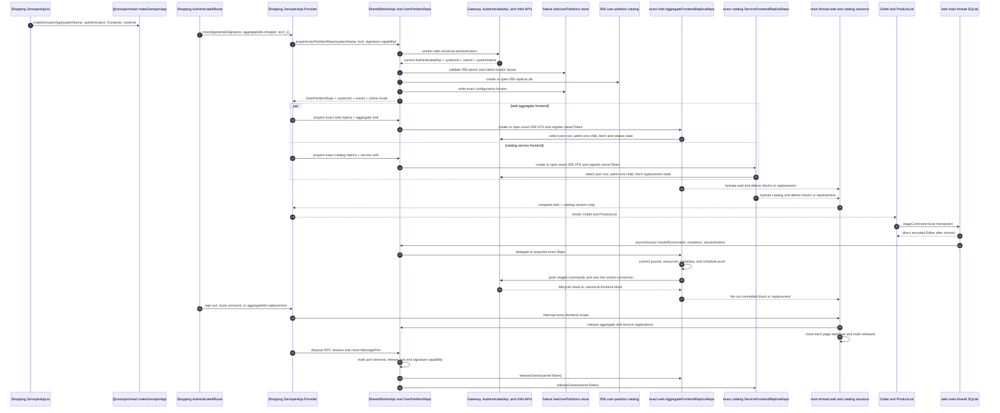
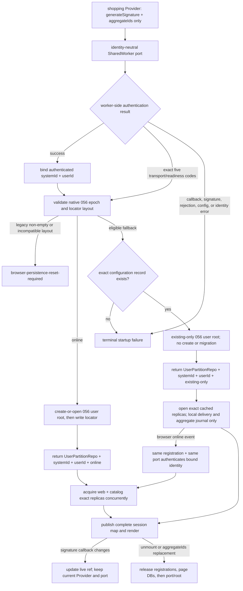

# Browser Frontend Lifecycle

The shopping example calls `makeZerospinApp` once for System `shopping`, the
aggregate frontend `web`, and the service frontend `catalog`.
`AuthenticatedRoute` mounts `ZerospinApp.Provider` with a Clerk-backed signature
capability and shopper aggregate `acct_1`; it does not pass `userId`. The
Provider opens one identity-neutral SharedWorker port, receives worker-resolved
`{ systemId, userId, mode }`, acquires both exact replicas, and renders route
children only after `web` and `catalog` are ready
([`shopping ZerospinApp.ts:34-51`](../../../examples/shopping/src/zerospin/ZerospinApp.ts#L34-L51),
[`AuthenticatedRoute.tsx:20-30`](../../../examples/shopping/src/routes/AuthenticatedRoute.tsx#L20-L30),
[`makeZerospinApp.tsx:227-267`](../../../packages/react/src/makeZerospinApp.tsx#L227-L267),
[`makeZerospinApp.tsx:422-458`](../../../packages/react/src/makeZerospinApp.tsx#L422-L458)).

The sequence shows the online path. The SharedWorker performs authentication,
validates the native 056 persistence epoch, writes the native locator only
after the user root is valid, and returns `mode: 'online'`. The page performs no
Zerospin authentication and has no `localStorage` fallback
([`makeZerospinApp.tsx:206-242`](../../../packages/react/src/makeZerospinApp.tsx#L206-L242),
[`getUserPartitionRepo.ts:381-469`](../../../packages/shared-worker/src/SharedWorker/SharedWorkerApi/getUserPartitionRepo/getUserPartitionRepo.ts#L381-L469),
[`getUserPartitionRepo.ts:517-634`](../../../packages/shared-worker/src/SharedWorker/SharedWorkerApi/getUserPartitionRepo/getUserPartitionRepo.ts#L517-L634)).

## Annotated workflow steps

1. **Define the shopping application root.** `makeZerospinApp` accepts exact
   `{ systemName, authentication, frontends, runtime }`, resolves source-selected
   definitions, and returns `{ frontends, Provider }`. Shopping supplies System
   `shopping`, `web`, `catalog`, and its session runtime
   ([`makeZerospinApp.tsx:61-142`](../../../packages/react/src/makeZerospinApp.tsx#L61-L142),
   [`shopping ZerospinApp.ts:34-51`](../../../examples/shopping/src/zerospin/ZerospinApp.ts#L34-L51)).
2. **Mount the production Provider.** `AuthenticatedRoute` supplies
   `aggregateIds.shopper = 'acct_1'` and a Clerk-backed signature Effect. The
   production Provider has no `userId` prop
   ([`AuthenticatedRoute.tsx:20-30`](../../../examples/shopping/src/routes/AuthenticatedRoute.tsx#L20-L30),
   [`makeZerospinApp.tsx:144-166`](../../../packages/react/src/makeZerospinApp.tsx#L144-L166)).
3. **Open an identity-neutral port.** The Provider passes exact
   `{ systemName, authenticationLock, generateSignature }`; the SharedWorker URL
   contains only `apiUrl`, `publishableKey`, and `wasmUrl`
   ([`makeZerospinApp.tsx:206-237`](../../../packages/react/src/makeZerospinApp.tsx#L206-L237),
   [`acquireUserPartitionRepo.ts:223-246`](../../../packages/shared-worker/src/acquireUserPartitionRepo.ts#L223-L246)).
4. **Authenticate in the worker.** The port binds its authentication
   configuration, invokes the current page signature capability, and calls
   universal authentication from its SharedWorker runtime
   ([`getUserPartitionRepo.ts:117-162`](../../../packages/shared-worker/src/SharedWorker/SharedWorkerApi/getUserPartitionRepo/getUserPartitionRepo.ts#L117-L162),
   [`getUserPartitionRepo.ts:164-260`](../../../packages/shared-worker/src/SharedWorker/SharedWorkerApi/getUserPartitionRepo/getUserPartitionRepo.ts#L164-L260)).
5. **Bind the authenticated identity.** Success must match requested System
   `shopping`; the port binds exact `{ systemId, userId, systemName }`, installs
   the returned root, and releases any prior same-identity root afterward
   ([`getUserPartitionRepo.ts:296-349`](../../../packages/shared-worker/src/SharedWorker/SharedWorkerApi/getUserPartitionRepo/getUserPartitionRepo.ts#L296-L349)).
6. **Validate the persistence epoch.** After authentication succeeds and before
   any user VFS opens, the worker opens the native locator store. Its layout and
   every non-empty pre-056 `zerospin/` database are validated without an upgrade
   or deletion
   ([`getUserPartitionRepo.ts:409-415`](../../../packages/shared-worker/src/SharedWorker/SharedWorkerApi/getUserPartitionRepo/getUserPartitionRepo.ts#L409-L415),
   [`lastUserPartitionStore.ts:19-168`](../../../packages/shared-worker/src/SharedWorker/lastUserPartitionStore.ts#L19-L168),
   [`lastUserPartitionStore.ts:171-303`](../../../packages/shared-worker/src/SharedWorker/lastUserPartitionStore.ts#L171-L303)).
7. **Open the online user root.** The worker derives
   `zerospin/056/${systemId}/users/${userId}`, opens `replicas.db` in
   `create-or-open`, and accepts only an empty database or the exact current
   catalog baseline
   ([`makeVfsName.ts:3-10`](../../../packages/shared-worker/src/SharedWorker/makeVfsName.ts#L3-L10),
   [`getUserPartitionRepo.ts:517-566`](../../../packages/shared-worker/src/SharedWorker/SharedWorkerApi/getUserPartitionRepo/getUserPartitionRepo.ts#L517-L566),
   [`migrateUserReplicaDbAsync.ts:214-308`](../../../packages/shared-worker/src/SharedWorker/migrateUserReplicaDbAsync.ts#L214-L308)).
8. **Publish the locator before the handle.** The worker writes strict
   `{ key, systemId, userId }` only after the user root is valid and before a new
   handle enters the global map. Write failure closes the unpublished SQLite
   database and VFS
   ([`getUserPartitionRepo.ts:568-657`](../../../packages/shared-worker/src/SharedWorker/SharedWorkerApi/getUserPartitionRepo/getUserPartitionRepo.ts#L568-L657),
   [`lastUserPartitionStore.ts:395-465`](../../../packages/shared-worker/src/SharedWorker/lastUserPartitionStore.ts#L395-L465)).
9. **Return worker-resolved acquisition data.** The inner RPC returns
   `{ api, systemId, userId, mode }`; the main-thread boundary adds only its local
   release Effect, and the Provider uses the returned identity and mode for
   diagnostics and every frontend bootstrap
   ([`getUserPartitionRepo.ts:717-737`](../../../packages/shared-worker/src/SharedWorker/SharedWorkerApi/getUserPartitionRepo/getUserPartitionRepo.ts#L717-L737),
   [`acquireUserPartitionRepo.ts:328-372`](../../../packages/shared-worker/src/acquireUserPartitionRepo.ts#L328-L372),
   [`makeZerospinApp.tsx:238-267`](../../../packages/react/src/makeZerospinApp.tsx#L238-L267)).
10. **Request the exact `web` aggregate replica.** React supplies selected
    `aggregateId`, names, complete lock and key, frontend spec, returned mode,
    and aggregate sink through the bound `UserPartitionRepo`
    ([`makeZerospinApp.tsx:279-334`](../../../packages/react/src/makeZerospinApp.tsx#L279-L334),
    [`bootstrapBrowserSession.ts:235-254`](../../../packages/react/src/bootstrapBrowserSession.ts#L235-L254)).
11. **Open or reuse the aggregate exact Repo.** The worker validates the exact
    catalog identity and bytes, opens the exact aggregate VFS under the 056 root,
    and registers this port's `ownerToken`. `online` permits creation;
    `existing-only` does not
    ([`acquireAggregateFrontendReplica.ts:154-277`](../../../packages/shared-worker/src/SharedWorker/UserPartitionRepo/acquireAggregateFrontendReplica/acquireAggregateFrontendReplica.ts#L154-L277),
    [`acquireAggregateFrontendReplica.ts:319-420`](../../../packages/shared-worker/src/SharedWorker/UserPartitionRepo/acquireAggregateFrontendReplica/acquireAggregateFrontendReplica.ts#L319-L420),
    [`acquireAggregateFrontendReplica.ts:537-565`](../../../packages/shared-worker/src/SharedWorker/UserPartitionRepo/acquireAggregateFrontendReplica/acquireAggregateFrontendReplica.ts#L537-L565)).
12. **Install aggregate authority and state.** The exact Repo selects one
    online registration, requires its current root to match exact
    `{ systemId, userId, systemName }`, acquires and validates one child, and
    commits authoritative state or intent rebase before publication
    ([`AggregateFrontendReplicaRepo.ts:1601-1809`](../../../packages/shared-worker/src/SharedWorker/AggregateFrontendReplicaRepo/AggregateFrontendReplicaRepo.ts#L1601-L1809),
    [`acquireAggregateFrontendReplica.ts:566-594`](../../../packages/shared-worker/src/SharedWorker/UserPartitionRepo/acquireAggregateFrontendReplica/acquireAggregateFrontendReplica.ts#L566-L594)).
13. **Request the exact `catalog` service replica.** React supplies service and
    frontend names, complete lock and key, frontend spec, returned mode, and
    service sink through the same user root
    ([`makeZerospinApp.tsx:360-387`](../../../packages/react/src/makeZerospinApp.tsx#L360-L387),
    [`bootstrapBrowserServiceSession.ts:215-233`](../../../packages/react/src/bootstrapBrowserServiceSession.ts#L215-L233)).
14. **Open or reuse the service exact Repo.** The worker validates its exact
    catalog row, opens the service VFS beneath the 056 user root, and registers
    the same port owner without creating missing state in `existing-only`
    ([`acquireServiceFrontendReplica.ts:159-269`](../../../packages/shared-worker/src/SharedWorker/UserPartitionRepo/acquireServiceFrontendReplica/acquireServiceFrontendReplica.ts#L159-L269),
    [`acquireServiceFrontendReplica.ts:316-430`](../../../packages/shared-worker/src/SharedWorker/UserPartitionRepo/acquireServiceFrontendReplica/acquireServiceFrontendReplica.ts#L316-L430),
    [`acquireServiceFrontendReplica.ts:498-523`](../../../packages/shared-worker/src/SharedWorker/UserPartitionRepo/acquireServiceFrontendReplica/acquireServiceFrontendReplica.ts#L498-L523)).
15. **Install service authority and state.** The exact service Repo selects one
    online registration, validates one child against the bound partition and
    persisted target, and installs authoritative replacement before publishing
    the Repo
    ([`ServiceFrontendReplicaRepo.ts:641-830`](../../../packages/shared-worker/src/SharedWorker/ServiceFrontendReplicaRepo/ServiceFrontendReplicaRepo.ts#L641-L830),
    [`acquireServiceFrontendReplica.ts:524-546`](../../../packages/shared-worker/src/SharedWorker/UserPartitionRepo/acquireServiceFrontendReplica/acquireServiceFrontendReplica.ts#L524-L546)).
16. **Hydrate `web`.** Aggregate bootstrap reads the acquired snapshot into its
    main-thread database, publishes initialized session state, and leaves later
    blocks, replacements, or failures to the registered sink
    ([`bootstrapBrowserSession.ts:255-316`](../../../packages/react/src/bootstrapBrowserSession.ts#L255-L316),
    [`bootstrapBrowserSession.ts:123-233`](../../../packages/react/src/bootstrapBrowserSession.ts#L123-L233)).
17. **Hydrate `catalog`.** Service bootstrap performs the journal-free parallel
    snapshot application and sink delivery path
    ([`bootstrapBrowserServiceSession.ts:234-290`](../../../packages/react/src/bootstrapBrowserServiceSession.ts#L234-L290),
    [`bootstrapBrowserServiceSession.ts:95-213`](../../../packages/react/src/bootstrapBrowserServiceSession.ts#L95-L213)).
18. **Publish the complete session map.** The Provider acquires configured
    frontends concurrently and publishes one selector-to-session map only after
    all acquisitions complete
    ([`makeZerospinApp.tsx:269-427`](../../../packages/react/src/makeZerospinApp.tsx#L269-L427)).
19. **Render atomically.** Children appear only when the session-map size equals
    the configured frontend count
    ([`makeZerospinApp.tsx:447-458`](../../../packages/react/src/makeZerospinApp.tsx#L447-L458)).
20. **Commit the local command synchronously.** Aggregate `stageCommand` builds
    the complete command, inserts it, applies optimistic mutations, and stores
    encoded inverses in one main-thread SQLite transaction
    ([`makeSession.ts:250-337`](../../../packages/core/src/session/makeSession.ts#L250-L337)).
21. **Return the local result.** The public method returns its encoded Either
    after the local commit and notification; UI handlers do not await
    SharedWorker or server work
    ([`makeSession.ts:340-369`](../../../packages/core/src/session/makeSession.ts#L340-L369),
    [`makeBrowserSession.ts:14-25`](../../../packages/react/src/makeBrowserSession.ts#L14-L25)).
22. **Start the asynchronous handoff.** A successful local commit sends the
    complete command, complete encoded mutations, and session-local
    `sessionIndex` through the bound `UserPartitionRepo`
    ([`makeSession.ts:371-480`](../../../packages/core/src/session/makeSession.ts#L371-L480),
    [`bootstrapBrowserSession.ts:383-401`](../../../packages/react/src/bootstrapBrowserSession.ts#L383-L401)).
23. **Resolve the acquired exact aggregate Repo.** `UserPartitionRepo` requires
    the exact catalog row and live owner registration, then delegates the
    complete handoff without rebuilding the command
    ([`stageAggregateFrontendCommand.ts:43-108`](../../../packages/shared-worker/src/SharedWorker/UserPartitionRepo/stageAggregateFrontendCommand/stageAggregateFrontendCommand.ts#L43-L108)).
24. **Commit exact-replica optimism.** One exact database transaction validates
    the command and mutation bytes, assigns the next replica command index,
    applies resources, stores the journal row and inverses, advances metadata,
    fans out the local block, and schedules push after commit
    ([`AggregateFrontendReplicaRepo.ts:3515-3780`](../../../packages/shared-worker/src/SharedWorker/AggregateFrontendReplicaRepo/AggregateFrontendReplicaRepo.ts#L3515-L3780)).
25. **Run exact-Repo network work.** The aggregate Repo owns its ticket/socket
    lifecycle and pushes complete staged commands from its journal through the
    selected four-field authority
    ([`AggregateFrontendReplicaRepo.ts:2082-2812`](../../../packages/shared-worker/src/SharedWorker/AggregateFrontendReplicaRepo/AggregateFrontendReplicaRepo.ts#L2082-L2812),
    [`AggregateFrontendReplicaRepo.ts:2816-3115`](../../../packages/shared-worker/src/SharedWorker/AggregateFrontendReplicaRepo/AggregateFrontendReplicaRepo.ts#L2816-L3115)).
26. **Reconcile server results.** Push returns pending, pushed, executed,
    failed-staged, and failed-pushed command arrays; socket work supplies
    canonical blocks or a state-required replacement path
    ([`AggregateFrontendApi.ts:86-105`](../../../packages/system-worker/src/AggregateFrontendApi/AggregateFrontendApi.ts#L86-L105),
    [`AggregateFrontendReplicaRepo.ts:3147-3440`](../../../packages/shared-worker/src/SharedWorker/AggregateFrontendReplicaRepo/AggregateFrontendReplicaRepo.ts#L3147-L3440)).
27. **Fan out committed convergence.** The exact Repo delivers each committed
    canonical block or replacement to every live registration sink
    ([`AggregateFrontendReplicaRepo.ts:1409-1477`](../../../packages/shared-worker/src/SharedWorker/AggregateFrontendReplicaRepo/AggregateFrontendReplicaRepo.ts#L1409-L1477)).
28. **Interrupt the Provider lifecycle.** Sign-out or route unmount removes the
    Provider; a changed serialized aggregate-ID map replaces its Effect scope.
    Updating only `generateSignature` updates the live callback ref and does not
    restart the scope
    ([`AuthenticatedRoute.tsx:9-30`](../../../examples/shopping/src/routes/AuthenticatedRoute.tsx#L9-L30),
    [`makeZerospinApp.tsx:174-177`](../../../packages/react/src/makeZerospinApp.tsx#L174-L177),
    [`makeZerospinApp.tsx:438-445`](../../../packages/react/src/makeZerospinApp.tsx#L438-L445)).
29. **Release every frontend scope before the port.** Effect scope interruption
    runs every completed aggregate/service bootstrap finalizer before the
    parent SharedWorker-client finalizer, including partial bootstrap failure
    ([`makeZerospinAppDevtools.react.spec.tsx:372-436`](../../../packages/react/src/makeZerospinAppDevtools.react.spec.tsx#L372-L436),
    [`makeZerospinAppDevtools.react.spec.tsx:558-612`](../../../packages/react/src/makeZerospinAppDevtools.react.spec.tsx#L558-L612)).
30. **Release exact registrations first.** Each aggregate or service browser
    session removes its transport-regain listener and calls the acquired
    exact-replica capability's idempotent `release`
    ([`bootstrapBrowserSession.ts:402-410`](../../../packages/react/src/bootstrapBrowserSession.ts#L402-L410),
    [`bootstrapBrowserServiceSession.ts:357-366`](../../../packages/react/src/bootstrapBrowserServiceSession.ts#L357-L366)).
31. **Close page databases second.** After its exact registration release, each
    browser session closes its main-thread SQLite database and publishes
    `status: 'released'`
    ([`bootstrapBrowserSession.ts:409-435`](../../../packages/react/src/bootstrapBrowserSession.ts#L409-L435),
    [`bootstrapBrowserServiceSession.ts:365-389`](../../../packages/react/src/bootstrapBrowserServiceSession.ts#L365-L389)).
32. **Close the port after all sessions.** The parent client finalizer disposes
    its capnweb session and closes the MessagePort through one idempotent local
    release path
    ([`acquireUserPartitionRepo.ts:299-325`](../../../packages/shared-worker/src/acquireUserPartitionRepo.ts#L299-L325),
    [`acquireUserPartitionRepo.ts:360-371`](../../../packages/shared-worker/src/acquireUserPartitionRepo.ts#L360-L371)).
33. **Eject the port once.** `SharedWorkerApi.dispose` synchronously stores the
    terminal error, clears current/pending/bound/configuration state, releases
    the current `AuthenticatedApi`, and disposes the retained signature
    capability
    ([`SharedWorkerApi.ts:121-131`](../../../packages/shared-worker/src/SharedWorker/SharedWorkerApi/SharedWorkerApi.ts#L121-L131),
    [`dispose.ts:26-39`](../../../packages/shared-worker/src/SharedWorker/SharedWorkerApi/dispose/dispose.ts#L26-L39)).
34. **Release aggregate ownership.** The same ejection iterates aggregate exact
    Repos and releases every registration carrying the port's `ownerToken`
    ([`dispose.ts:40-42`](../../../packages/shared-worker/src/SharedWorker/SharedWorkerApi/dispose/dispose.ts#L40-L42),
    [`AggregateFrontendReplicaRepo.ts:1332-1407`](../../../packages/shared-worker/src/SharedWorker/AggregateFrontendReplicaRepo/AggregateFrontendReplicaRepo.ts#L1332-L1407)).
35. **Release service ownership.** It then performs the parallel owner-token
    cleanup across service exact Repos; persistent worker-hosted stores remain
    open for later ports
    ([`dispose.ts:43-45`](../../../packages/shared-worker/src/SharedWorker/SharedWorkerApi/dispose/dispose.ts#L43-L45),
    [`ServiceFrontendReplicaRepo.ts:1636-1728`](../../../packages/shared-worker/src/SharedWorker/ServiceFrontendReplicaRepo/ServiceFrontendReplicaRepo.ts#L1636-L1728)).

The runtime never consults legacy `localStorage`. Operator cleanup is external
to this lifecycle: close old Zerospin pages/workers, delete only IndexedDB names
prefixed `zerospin/` and `localStorage` keys prefixed `zerospin:`, and preserve
unrelated origin and remote state
([`lastUserPartitionStore.playwright.spec.ts:600-725`](../../../examples/shopping/tests/browser/lastUserPartitionStore.playwright.spec.ts#L600-L725)).

## Related pages

- [Universal Authentication](../../architecture/Authentication.md)
- [Browser Session Bootstrap](../../architecture/bootstrapBrowserSession.md)
- [Source-Selected Frontends](../../architecture/SourceSelectedFrontends.md)
- [SharedWorker Session](../../api/SharedWorkerSession.md)
