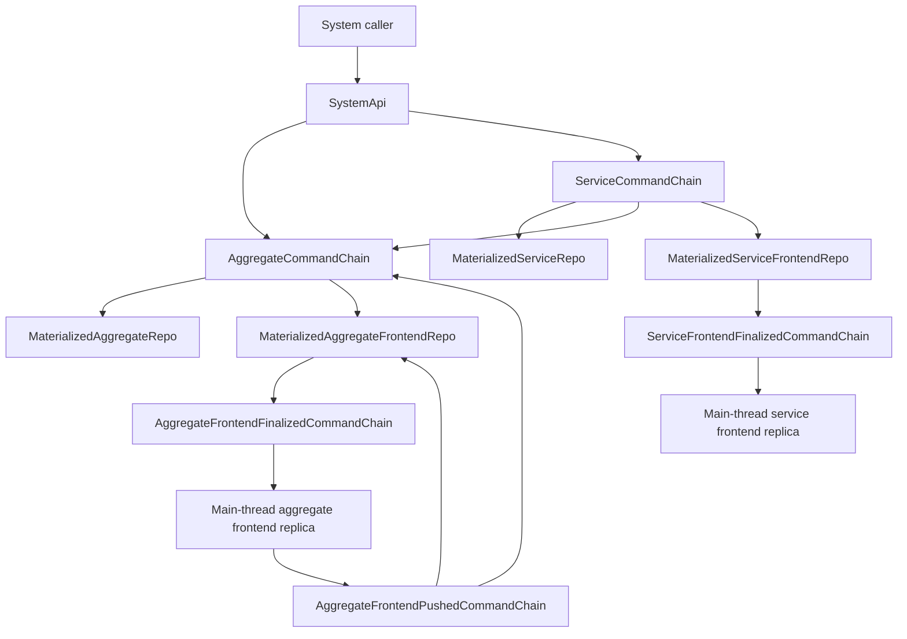
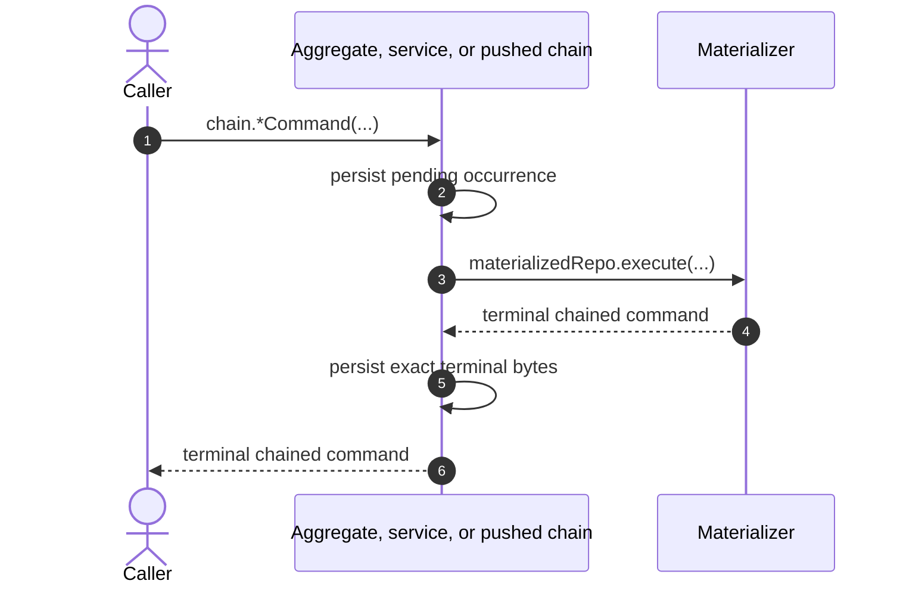
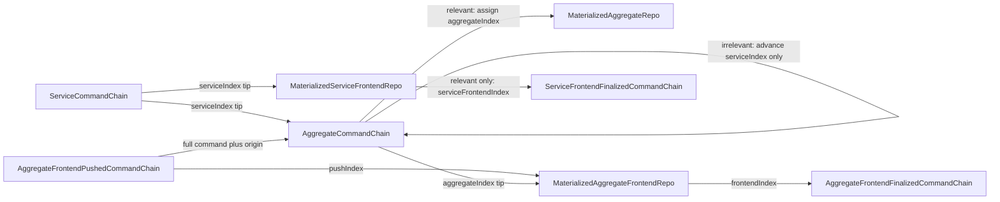
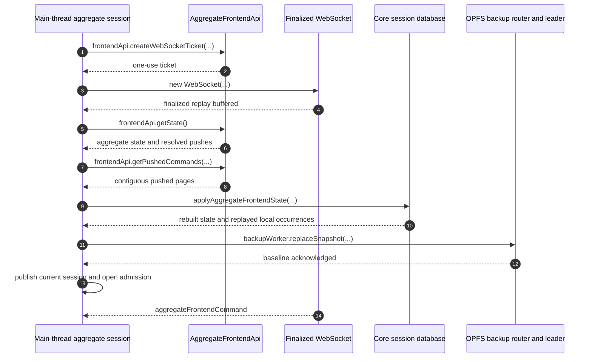

# Kappa Architecture: Singular Command Chains

One complete encoded command is one ordered chain occurrence. The five chains
own their respective `aggregateIndex`, `serviceIndex`, `pushIndex`,
`frontendIndex`, or `serviceFrontendIndex`, terminal history, and coalesced
subscriber tips. The four materialized Repos own current state,
source catch-up, and durable output outboxes. Only the aggregate, service, and
pushed materializers execute authored command code.

- [`types.ts:36-71`](../../../packages/core/src/system/types.ts#L36-L71) — enumerates the five command-chain and four materializer Repo kinds.
- [`index.ts:1-12`](../../../packages/system-worker/src/index.ts#L1-L12) — exports the complete static chain and materializer topology.

Every chain-to-materializer or chain-to-chain delivery is singular. A queued
notification may be coalesced to the latest terminal tip because the receiver
pulls and validates every missing terminal occurrence before applying the
notified occurrence.

- [`runScheduledWork.ts:247-425`](../../../packages/system-worker/src/AggregateCommandChain/runScheduledWork/runScheduledWork.ts#L247-L425) — coalesces aggregate subscriber tips while retaining ordered catch-up and acknowledgements.
- [`runScheduledWork.ts:223-480`](../../../packages/system-worker/src/ServiceCommandChain/runScheduledWork/runScheduledWork.ts#L223-L480) — applies the same durable subscriber-lane discipline to service history.

## Command execution

## Annotated workflow steps

1. The public boundary submits one complete command to its owning source chain.
   - [`finalizeAggregateCommand.ts:27-39`](../../../packages/system-worker/src/SystemApi/finalizeAggregateCommand/finalizeAggregateCommand.ts#L27-L39) — resolves the exact aggregate chain and forwards the complete command.
   - [`finalizeServiceCommand.ts:25-36`](../../../packages/system-worker/src/SystemApi/finalizeServiceCommand/finalizeServiceCommand.ts#L25-L36) — performs the equivalent singular service dispatch.
2. Under its admission semaphore, the chain durably retains the complete
   encoded command, its `aggregateIndex`, `serviceIndex`, or `pushIndex`, the
   materialized Repo name, and `chainedAt`. Exact bytes are idempotent and
   changed bytes conflict.
   - [`finalizeAggregateCommand.ts:64-177`](../../../packages/system-worker/src/AggregateCommandChain/finalizeAggregateCommand/finalizeAggregateCommand.ts#L64-L177) — commits one indexed pending aggregate occurrence without consulting SystemRepo.
3. Head-at-a-time dispatch invokes the retained materialized Repo.
   - [`runScheduledWork.ts:51-117`](../../../packages/system-worker/src/AggregateCommandChain/runScheduledWork/runScheduledWork.ts#L51-L117) — selects the lowest pending occurrence and invokes its retained materializer.
4. The materializer returns a terminal success or authored failure occurrence.
   - [`runScheduledWork.ts:118-174`](../../../packages/system-worker/src/AggregateCommandChain/runScheduledWork/runScheduledWork.ts#L118-L174) — validates exact terminal identity and bytes and halts on an indeterminate result.
5. The chain retains the canonical terminal bytes and queues subscriber tips.
   - [`runScheduledWork.ts:175-228`](../../../packages/system-worker/src/AggregateCommandChain/runScheduledWork/runScheduledWork.ts#L175-L228) — atomically stores the terminal occurrence and downstream tips.
6. The caller receives the terminal chained command; transport or unresolved
   infrastructure failures stay in the RPC error channel.
   - [`finalizeAggregateCommand.ts:184-214`](../../../packages/system-worker/src/AggregateCommandChain/finalizeAggregateCommand/finalizeAggregateCommand.ts#L184-L214) — returns retained terminal bytes and rejects unresolved pending execution as infrastructure failure.

Deployment locking is deferred. The current CLI promotes the uploaded static
Worker immediately and then health-checks the preview and production URLs; it
does not close command admission or wait for command execution to drain.

- [`deployWranglerFn.ts:465-576`](../../../packages/cli/src/deploy/deployWranglerFn.ts#L465-L576) — deploys the exact version and health-checks both addresses directly.

## Service ordering and frontend output

`AggregateCommandChain` owns service-to-aggregate ordering. An irrelevant
service occurrence advances only its retained `serviceIndex`; a relevant one
becomes a full service-derived aggregate occurrence before later direct
aggregate work. Aggregate optimism is rewound before an authoritative delta is
applied, then unresolved optimism is replayed in `pushIndex` order. The emitted
finalized occurrence retains the authoritative base delta, including
empty-delta success and failure. Before authored aggregate-frontend projection,
the materializer commits an exact durable execution claim. A completed claim
reuses retained terminal bytes, while an unfinished
`{ completedAt: null, result: null }` claim halts in-doubt. A known projection
failure completes as a failed finalized occurrence with empty delta; its result,
materialized state, frontiers, and outbox commit atomically.

- [`receiveServiceCommand.ts:40-180`](../../../packages/system-worker/src/AggregateCommandChain/receiveServiceCommand/receiveServiceCommand.ts#L40-L180) — advances the service frontier for every occurrence and appends a derived aggregate occurrence only when relevant.
- [`MaterializedAggregateFrontendRepoDbConfig.ts:37-51`](../../../packages/system-worker/src/MaterializedAggregateFrontendRepo/MaterializedAggregateFrontendRepoDbConfig.ts#L37-L51) — defines the execution claim's exact source identity, canonical bytes, claim/completion timestamps, and nullable retained result.
- [`catchup.ts:284-390`](../../../packages/system-worker/src/MaterializedAggregateFrontendRepo/catchup/catchup.ts#L284-L390) — reuses an exact completed claim, halts an unfinished claim, or commits a new claim before authored projection.
- [`catchup.ts:392-917`](../../../packages/system-worker/src/MaterializedAggregateFrontendRepo/catchup/catchup.ts#L392-L917) — wraps authoritative state changes, projection, optimistic replay, known-failure terminal output, outbox, claim completion, and frontier updates in one transaction.
- [`execute.ts:305-516`](../../../packages/system-worker/src/MaterializedServiceFrontendRepo/execute/execute.ts#L305-L516) — commits service projection state and sparse relevant frontend output atomically.

## Aggregate browser recovery

## Annotated workflow steps

1. The main-thread session requests one exact aggregate finalized-stream ticket.
   - [`bootstrapAggregateFrontendSession.ts:440-459`](../../../packages/frontend/src/bootstrapAggregateFrontendSession.ts#L440-L459) — starts serialized recovery and requests the bound ticket.
2. The gateway returns the opaque one-use ticket for that exact frontend target.
   - [`createWebSocketTicket.ts:18-69`](../../../packages/system-worker/src/AggregateFrontendApi/createWebSocketTicket/createWebSocketTicket.ts#L18-L69) — validates the empty request and issues the ticket from the exact bound aggregate frontend identity.
3. The session opens the finalized socket and subscribes from index zero before
   fetching state.
   - [`bootstrapAggregateFrontendSession.ts:460-479`](../../../packages/frontend/src/bootstrapAggregateFrontendSession.ts#L460-L479) — constructs the socket and sends the initial zero frontier.
4. Replay occurrences are buffered until the socket publishes its watermark.
   - [`bootstrapAggregateFrontendSession.ts:480-504`](../../../packages/frontend/src/bootstrapAggregateFrontendSession.ts#L480-L504) — buffers singular commands and resolves only the replay-complete message.
5. After subscription, the session fetches the current aggregate state.
   - [`bootstrapAggregateFrontendSession.ts:506-533`](../../../packages/frontend/src/bootstrapAggregateFrontendSession.ts#L506-L533) — pushes recoverable old-session commands, then fetches authoritative state.
6. The state includes the finalized frontier and exact resolved-push membership.
   - [`getState.ts:56-80`](../../../packages/system-worker/src/AggregateFrontendApi/getState/getState.ts#L56-L80) — retrieves the exact materialized aggregate frontend state through the bound capability.
7. The session separately pulls pushed history after its retained frontier.
   - [`bootstrapAggregateFrontendSession.ts:534-566`](../../../packages/frontend/src/bootstrapAggregateFrontendSession.ts#L534-L566) — pages the pushed chain and disposes each fresh RPC session.
8. Each pushed page is contiguous through its reported chain tip.
   - [`getPushedCommands.ts:63-84`](../../../packages/system-worker/src/AggregateFrontendApi/getPushedCommands/getPushedCommands.ts#L63-L84) — retrieves one bounded pushed-history page from the exact chain.
9. Core reconstructs the authoritative base, resolved pushes, pending successful
   pushes, and surviving local occurrences in exact source order.
   - [`applyAggregateFrontendState.ts:153-266`](../../../packages/core/src/session/applyAggregateFrontendState.ts#L153-L266) — orders retained local and pushed occurrences and reconstructs unresolved successful pushes transactionally.
10. Core returns only after resources, journals, and all distinct frontiers are
    committed in the in-memory database.
    - [`applyAggregateFrontendState.ts:267-371`](../../../packages/core/src/session/applyAggregateFrontendState.ts#L267-L371) — replaces resources and frontiers, then reapplies surviving optimism before commit.
11. The page serializes the recovered database to the claimant-owned OPFS file.
    - [`bootstrapAggregateFrontendSession.ts:748-765`](../../../packages/frontend/src/bootstrapAggregateFrontendSession.ts#L748-L765) — enables SQL capture and sends the acknowledged baseline.
12. The backup worker acknowledges only after its serialized replace completes.
    - [`replaceSnapshot.ts:17-145`](../../../packages/opfs-backup-worker/src/OpfsBackupLeader/replaceSnapshot/replaceSnapshot.ts#L17-L145) — restores into a temporary database and backs it into the OPFS destination while retaining its file claim.
13. Only the acknowledged session becomes current and begins admission and push.
    - [`bootstrapAggregateFrontendSession.ts:823-936`](../../../packages/frontend/src/bootstrapAggregateFrontendSession.ts#L823-L936) — publishes current state, removes resolved old files, and drives the ordered push lane.
14. Live finalized commands apply directly to the same main-thread Core session.
    - [`bootstrapAggregateFrontendSession.ts:649-700`](../../../packages/frontend/src/bootstrapAggregateFrontendSession.ts#L649-L700) — validates, applies, backs up, and publishes each live occurrence.

The aggregate socket carries one `aggregateFrontendCommand` message at a time;
the service socket carries one `serviceFrontendCommand` message at a time.
Exact duplicate bytes are idempotent, changed duplicates conflict, and index
gaps enter paginated repair.

- [`onMessage.ts:77-110`](../../../packages/system-worker/src/AggregateFrontendFinalizedCommandChain/onMessage/onMessage.ts#L77-L110) — emits one aggregate command per message followed by a replay watermark.
- [`onMessage.ts:73-109`](../../../packages/system-worker/src/ServiceFrontendFinalizedCommandChain/onMessage/onMessage.ts#L73-L109) — uses the singular service discriminant and completion message.
