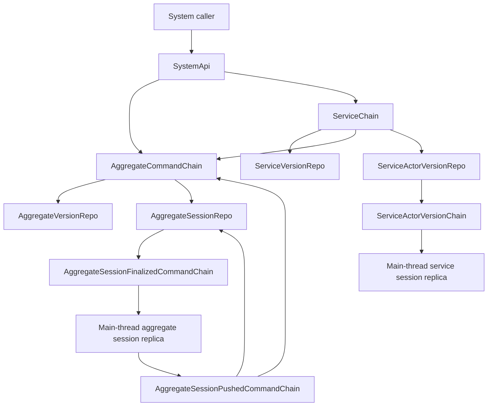
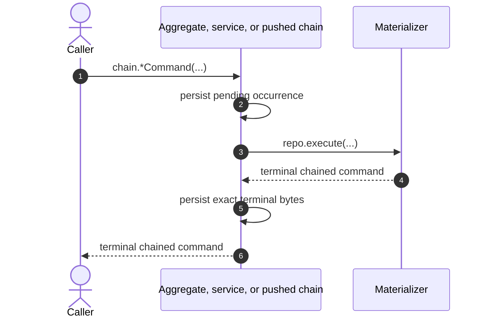
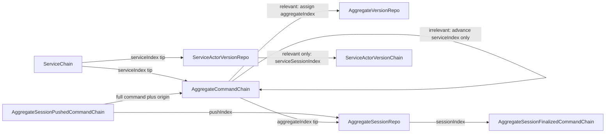
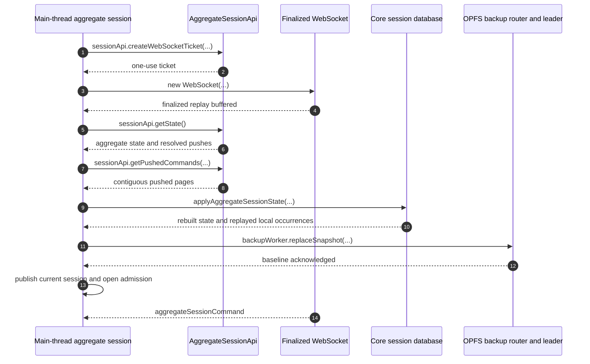

# Kappa Architecture: Singular Command Chains

One complete encoded command is one ordered chain occurrence. The five chains
own their respective `aggregateIndex`, `serviceIndex`, `pushIndex`,
`sessionIndex`, or `serviceSessionIndex`, terminal history, and coalesced
subscriber tips. AggregateVersionRepo executes a Chain-supplied suffix
against a singleton `head`. The other three Repos still own
current state, source catch-up, and durable output outboxes. Only the
aggregate, service, and pushed materializers execute authored command code.

- [`types.ts:36-71`](../../../packages/core/src/system/types.ts#L36-L71) — enumerates the five command-chain and four materializer Repo kinds.
- [`index.ts:1-12`](../../../packages/system-worker/src/index.ts#L1-L12) — exports the complete static chain and materializer topology.

```mermaid
flowchart TB
  SystemCaller[System caller] --> SystemApi
  SystemApi --> AggregateCommandChain
  SystemApi --> ServiceChain

  AggregateCommandChain --> AggregateVersionRepo
  ServiceChain --> ServiceVersionRepo
  ServiceChain --> AggregateCommandChain

  AggregateBrowser[Main-thread aggregate session replica] --> AggregateSessionPushedCommandChain
  AggregateSessionPushedCommandChain --> AggregateSessionRepo
  AggregateSessionPushedCommandChain --> AggregateCommandChain
  AggregateCommandChain --> AggregateSessionRepo
  AggregateSessionRepo --> AggregateSessionFinalizedCommandChain
  AggregateSessionFinalizedCommandChain --> AggregateBrowser

  ServiceChain --> ServiceActorVersionRepo
  ServiceActorVersionRepo --> ServiceActorVersionChain
  ServiceActorVersionChain --> ServiceBrowser[Main-thread service session replica]
```

Every chain-to-materializer or chain-to-chain delivery is singular. A queued
notification may be coalesced to the latest terminal tip because the receiver
pulls and validates every missing terminal occurrence before applying the
notified occurrence.

- [`AggregateCommandChain.ts`](../../../packages/system-worker/src/AggregateCommandChain/AggregateCommandChain.ts) — delivers each canonical aggregate result to session subscribers after the base suffix commits.
- [`ServiceChain.ts`](../../../packages/system-worker/src/ServiceChain/ServiceChain.ts) — table-driven `finalizedServiceCommandFanoutQueue` delivers contiguous terminal service suffix to ACC.

## Command execution

```mermaid
sequenceDiagram
  actor Caller
  participant Chain as Aggregate, service, or pushed chain
  participant Materializer

  autonumber 1
  Caller->>Chain: chain.*Command(...)
  autonumber 2
  Chain->>Chain: persist pending occurrence
  autonumber 3
  Chain->>Materializer: repo.execute(...)
  autonumber 4
  Materializer-->>Chain: terminal chained command
  autonumber 5
  Chain->>Chain: persist exact terminal bytes
  autonumber 6
  Chain-->>Caller: terminal chained command
```

## Annotated workflow steps

1. The public boundary submits one complete command to its owning source chain.
   - [`executeAggregateCommand.ts:27-42`](../../../packages/system-worker/src/SystemApi/executeAggregateCommand/executeAggregateCommand.ts#L27-L42) — resolves the exact aggregate chain and forwards the complete command.
   - [`admitServiceCommand.ts:25-38`](../../../packages/system-worker/src/SystemApi/admitServiceCommand/admitServiceCommand.ts#L25-L38) — performs the equivalent singular service dispatch.
2. In its admission transaction, the chain durably retains the complete
   encoded command, its `aggregateIndex`, `serviceIndex`, or `pushIndex`, and
   `chainedAt`. Exact bytes are idempotent and changed bytes conflict.
   Aggregate admission does not store a materializer name.
   - [`executeAggregateCommand.ts:202-214`](../../../packages/system-worker/src/AggregateCommandChain/executeAggregateCommand/executeAggregateCommand.ts#L202-L214) — commits one indexed pending aggregate occurrence with filled replicate `mutations`.
3. Head-at-a-time dispatch executes the lowest unresolved aggregate suffix
   against the current base AggregateVersionRepo.
   - [`executePendingBase.ts:463-559`](../../../packages/system-worker/src/AggregateCommandChain/executePendingBase/executePendingBase.ts#L463-L559) — captures inputs if needed, then awaits only the base suffix execution.
4. The materializer returns the final executed command.
   - [`execute.ts:65-81`](../../../packages/system-worker/src/AggregateVersionRepo/execute/execute.ts#L65-L81) — accepts a nonempty execution suffix and returns only the final executed command.
5. The chain retains the canonical terminal bytes and advances the base cursor.
   - [`executePendingBase.ts:364-450`](../../../packages/system-worker/src/AggregateCommandChain/executePendingBase/executePendingBase.ts#L364-L450) — atomically stores the terminal occurrence and advances only the base `currentIndex`.
6. The caller receives the terminal chained command; transport or unresolved
   infrastructure failures stay in the RPC error channel.
   - [`executeAggregateCommand.ts:171-199`](../../../packages/system-worker/src/AggregateCommandChain/executeAggregateCommand/executeAggregateCommand.ts#L171-L199) — returns retained terminal bytes and rejects unresolved pending execution as infrastructure failure.

Deployment locking is deferred. The current CLI promotes the uploaded static
Worker immediately and then health-checks the preview and production URLs; it
does not close command admission or wait for command execution to drain.

- [`deployWranglerFn.ts:465-510`](../../../packages/cli/src/deploy/deployWranglerFn.ts#L465-L510) — deploys the exact version, health-checks both addresses, then calls `systemApi.initialize()`.

## Service ordering and session output

```mermaid
flowchart LR
  ServiceChain -->|serviceIndex tip| AggregateCommandChain
  AggregateCommandChain -->|irrelevant: advance serviceIndex only| AggregateCommandChain
  AggregateCommandChain -->|relevant: assign aggregateIndex| AggregateVersionRepo

  AggregateSessionPushedCommandChain -->|pushIndex| AggregateSessionRepo
  AggregateSessionPushedCommandChain -->|full command plus origin| AggregateCommandChain
  AggregateCommandChain -->|aggregateIndex tip| AggregateSessionRepo
  AggregateSessionRepo -->|sessionIndex| AggregateSessionFinalizedCommandChain

  ServiceChain -->|serviceIndex tip| ServiceActorVersionRepo
  ServiceActorVersionRepo -->|relevant only: serviceSessionIndex| ServiceActorVersionChain
```

`AggregateCommandChain` owns service-to-aggregate ordering. An irrelevant
service occurrence advances only its retained `serviceIndex`; a relevant one
becomes a full service-derived aggregate occurrence before later direct
aggregate work. Aggregate optimism is rewound before an authoritative delta is
applied, then unresolved optimism is replayed in `pushIndex` order. The emitted
finalized occurrence retains the authoritative base delta, including
empty-delta success and failure. Before authored aggregate-session projection,
the materializer commits an exact durable execution claim. A completed claim
reuses retained terminal bytes, while an unfinished
`{ completedAt: null, result: null }` claim halts in-doubt. A known projection
failure completes as a failed finalized occurrence with empty delta; its result,
resource state, frontiers, and outbox commit atomically.

- [`receiveServiceCommand.ts`](../../../packages/system-worker/src/AggregateCommandChain/receiveServiceCommand/receiveServiceCommand.ts) — admits every terminal SCC suffix occurrence; VAR skips missing replica rows.
- [`AggregateSessionRepoDbConfig.ts:37-51`](../../../packages/system-worker/src/AggregateSessionRepo/AggregateSessionRepoDbConfig.ts#L37-L51) — defines the execution claim's exact source identity, canonical bytes, claim/completion timestamps, and nullable retained result.
- [`catchup.ts:284-390`](../../../packages/system-worker/src/AggregateSessionRepo/catchup/catchup.ts#L284-L390) — reuses an exact completed claim, halts an unfinished claim, or commits a new claim before authored projection.
- [`catchup.ts:392-917`](../../../packages/system-worker/src/AggregateSessionRepo/catchup/catchup.ts#L392-L917) — wraps authoritative state changes, projection, optimistic replay, known-failure terminal output, outbox, claim completion, and frontier updates in one transaction.
- [`execute.ts`](../../../packages/system-worker/src/ServiceActorVersionRepo/execute/execute.ts) — commits service projection state and sparse relevant session output atomically.

## Aggregate browser recovery

```mermaid
sequenceDiagram
  participant Session as Main-thread aggregate session
  participant Gateway as AggregateSessionApi
  participant Socket as Finalized WebSocket
  participant Core as Core session database
  participant Backup as OPFS backup router and leader

  autonumber 1
  Session->>Gateway: sessionApi.createWebSocketTicket(...)
  autonumber 2
  Gateway-->>Session: one-use ticket
  autonumber 3
  Session->>Socket: new WebSocket(...)
  autonumber 4
  Socket-->>Session: finalized replay buffered
  autonumber 5
  Session->>Gateway: sessionApi.getState()
  autonumber 6
  Gateway-->>Session: aggregate state and resolved pushes
  autonumber 7
  Session->>Gateway: sessionApi.getPushedCommands(...)
  autonumber 8
  Gateway-->>Session: contiguous pushed pages
  autonumber 9
  Session->>Core: applyAggregateSessionState(...)
  autonumber 10
  Core-->>Session: rebuilt state and replayed local occurrences
  autonumber 11
  Session->>Backup: backupWorker.replaceSnapshot(...)
  autonumber 12
  Backup-->>Session: baseline acknowledged
  autonumber 13
  Session->>Session: publish current session and open admission
  autonumber 14
  Socket-->>Session: aggregateSessionCommand
```

## Annotated workflow steps

1. The main-thread session requests one exact aggregate finalized-stream ticket.
   - [`bootstrapAggregateSession.ts:440-459`](../../../packages/browser/src/bootstrapAggregateSession.ts#L440-L459) — starts serialized recovery and requests the bound ticket.
2. The gateway returns the opaque one-use ticket for that exact session target.
   - [`createWebSocketTicket.ts:18-71`](../../../packages/system-worker/src/AggregateSessionApi/createWebSocketTicket/createWebSocketTicket.ts#L18-L71) — validates the empty request and issues the ticket from the exact bound aggregate session identity.
3. The session opens the finalized socket and subscribes from index zero before
   fetching state.
   - [`bootstrapAggregateSession.ts:460-479`](../../../packages/browser/src/bootstrapAggregateSession.ts#L460-L479) — constructs the socket and sends the initial zero frontier.
4. Replay occurrences are buffered until the socket publishes its watermark.
   - [`bootstrapAggregateSession.ts:480-504`](../../../packages/browser/src/bootstrapAggregateSession.ts#L480-L504) — buffers singular commands and resolves only the replay-complete message.
5. After subscription, the session fetches the current aggregate state.
   - [`bootstrapAggregateSession.ts:506-533`](../../../packages/browser/src/bootstrapAggregateSession.ts#L506-L533) — pushes recoverable old-session commands, then fetches authoritative state.
6. The state includes the finalized frontier and exact resolved-push membership.
   - [`getState.ts:57-82`](../../../packages/system-worker/src/AggregateSessionApi/getState/getState.ts#L57-L82) — retrieves the exact aggregate session state through the bound capability.
7. The session separately pulls pushed history after its retained frontier.
   - [`bootstrapAggregateSession.ts:534-566`](../../../packages/browser/src/bootstrapAggregateSession.ts#L534-L566) — pages the pushed chain and disposes each fresh RPC session.
8. Each pushed page is contiguous through its reported chain tip.
   - [`getPushedCommands.ts:63-84`](../../../packages/system-worker/src/AggregateSessionApi/getPushedCommands/getPushedCommands.ts#L63-L84) — retrieves one bounded pushed-history page from the exact chain.
9. Core reconstructs the authoritative base, resolved pushes, pending successful
   pushes, and surviving local occurrences in exact source order.
   - [`applyAggregateSessionState.ts:153-266`](../../../packages/core/src/aggregateSession/applyAggregateSessionState.ts#L153-L266) — orders retained local and pushed occurrences and reconstructs unresolved successful pushes transactionally.
10. Core returns only after resources, journals, and all distinct frontiers are
    committed in the in-memory database.
    - [`applyAggregateSessionState.ts:267-371`](../../../packages/core/src/aggregateSession/applyAggregateSessionState.ts#L267-L371) — replaces resources and frontiers, then reapplies surviving optimism before commit.
11. The page serializes the recovered database to the claimant-owned OPFS file.
    - [`bootstrapAggregateSession.ts:748-765`](../../../packages/browser/src/bootstrapAggregateSession.ts#L748-L765) — enables SQL capture and sends the acknowledged baseline.
12. The backup worker acknowledges only after its serialized replace completes.
    - [`replaceSnapshot.ts:17-145`](../../../packages/opfs-backup-worker/src/OpfsBackupLeader/replaceSnapshot/replaceSnapshot.ts#L17-L145) — restores into a temporary database and backs it into the OPFS destination while retaining its file claim.
13. Only the acknowledged session becomes current and begins admission and push.
    - [`bootstrapAggregateSession.ts:823-936`](../../../packages/browser/src/bootstrapAggregateSession.ts#L823-L936) — publishes current state, removes resolved old files, and drives the ordered push lane.
14. Live finalized commands apply directly to the same main-thread Core session.
    - [`bootstrapAggregateSession.ts:649-700`](../../../packages/browser/src/bootstrapAggregateSession.ts#L649-L700) — validates, applies, backs up, and publishes each live occurrence.

The aggregate socket carries one `aggregateSessionCommand` message at a time;
the service socket carries one `serviceSessionCommand` message at a time.
Exact duplicate bytes are idempotent, changed duplicates conflict, and index
gaps enter paginated repair.

- [`onMessage.ts:77-110`](../../../packages/system-worker/src/AggregateSessionFinalizedCommandChain/onMessage/onMessage.ts#L77-L110) — emits one aggregate command per message followed by a replay watermark.
- [`onMessage.ts:63-108`](../../../packages/system-worker/src/ServiceActorVersionChain/onMessage/onMessage.ts#L63-L108) — uses the singular service discriminant and completion message.
