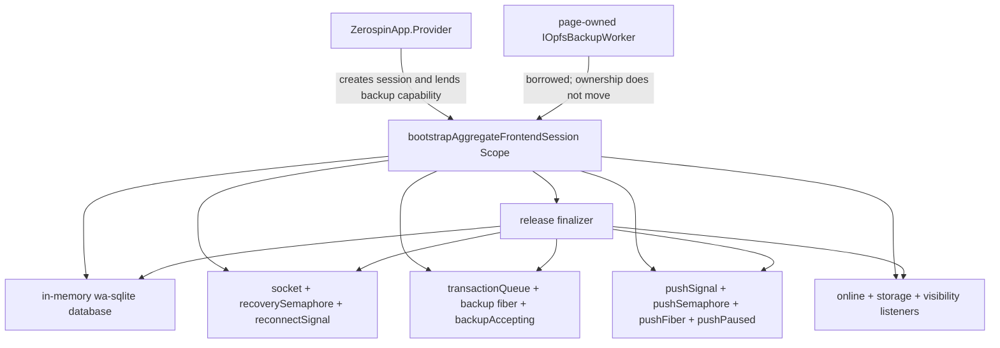
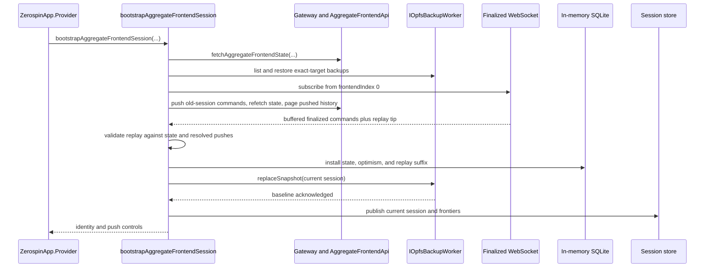

# Plan 068: Make `bootstrapAggregateFrontendSession` Obvious

Status: active; proposal only, not implementation authorization.

## Summary

1. This plan owns only
   [`bootstrapAggregateFrontendSession.ts`](../../../packages/frontend/src/bootstrapAggregateFrontendSession.ts)
   and modules extracted directly from that file.
2. It replaces Plan 064's proposed shared aggregate/service authentication
   helper with an aggregate-only pass. It does not edit
   `bootstrapServiceFrontendSession.ts` or introduce a common browser-session
   abstraction.
3. The refactor preserves the public export, errors, command bytes, database
   state, localStorage keys, retry policy, ordering, cleanup, interruption,
   socket behavior, OPFS behavior, and store observations.
4. The browser main thread remains the sole live owner of the aggregate
   session. The OPFS backup worker remains a page-owned external capability;
   no validation, RPC, or ownership moves to another runtime.
5. The pass extracts four complete invariants and stops. It does not create a
   lifecycle class, service, helper bag, shared aggregate/service base, or
   mutable runtime-state parameter object.

## Public promise and exact boundary

1. `bootstrapAggregateFrontendSession(props)` returns a current or valid
   offline aggregate frontend session whose in-memory database, optimistic
   command journal, finalized replay, pushed history, and OPFS backup agree at
   publication time.
2. Its aggregate browser-session target is
   `{ systemId, aggregateId, aggregateName, userId, frontendName, aggregateFrontendLockKey, sessionId }`.
   1. Online authentication supplies `systemId` and `userId`; transient
      offline startup may recover only those two fields from the exact
      persisted authentication locator.
   2. Provider supplies `aggregateId` and the Core-created `sessionId`.
   3. The selected frontend controller supplies `aggregateName` and
      `frontendName`.
   4. The validated aggregate frontend lock bytes derive
      `aggregateFrontendLockKey`.
3. Inputs remain the existing `session`, `aggregateId`, API location and key,
   authored system name, authentication lock, signature producer, and
   page-owned `IOpfsBackupWorker`.
4. Output remains
   `{ systemId, userId, aggregateFrontendLockKey, executeAggregateFrontendCommand, getPushPaused, setPushPaused, pushNow }`.
5. Typed failures remain `IAnyError`. Defects and interruption keep their
   current Effect semantics; the enclosing Scope still owns finalization.

## Ownership view



1. The extracted modules may read or transform startup values, but they do not
   own `socket`, `released`, `online`, `backupAccepting`, `pushPaused`,
   `pushFiber`, a Queue, a Semaphore, a Fiber, or a browser listener.
2. `bootstrapAggregateFrontendSession` retains the only finalizer and every
   mutable lifetime decision.

## Execution view



1. The socket-before-state race remains:
   1. Subscribe from zero and start buffering.
   2. Push recoverable old-session commands.
   3. Fetch authoritative state and complete pushed history.
   4. Receive the replay watermark.
   5. Validate and apply the state plus only the newer replay suffix.
   6. Replace buffering with the live message handler.
2. The baseline-publication race remains:
   1. Enable committed-SQL capture.
   2. Serialize the current database.
   3. Wait for `replaceSnapshot` acknowledgement while later commits queue.
   4. Publish the current session locator and store state.
3. A failed incremental OPFS apply still diverts new commits, replaces one
   current snapshot, and requeues every transaction captured during repair.
   That concurrency stays inline.

## Complexity judgment

| Current region | Responsibility                                                      | Judgment                                                          | Planned disposition                                                                    |
| -------------- | ------------------------------------------------------------------- | ----------------------------------------------------------------- | -------------------------------------------------------------------------------------- |
| `193-281`      | Online identity or transient offline locator                        | Complete failure and persistence policy obscured inside bootstrap | Extract one Effect boundary                                                            |
| `282-471`      | Selected backup restoration and old-session command recovery        | Complete startup invariant with its own decode and cleanup rules  | Extract one Effect boundary                                                            |
| `474-741`      | Socket-first online recovery                                        | Mostly essential lifecycle and ordering complexity                | Keep orchestration inline; extract only pushed-history retrieval and replay validation |
| `743-935`      | Baseline, incremental backup, repair, publication, old-file cleanup | Essential queue and capture race                                  | Keep inline                                                                            |
| `937-1021`     | Ordered local-command push                                          | Cohesive and coupled to pause/release admission                   | Keep inline                                                                            |
| `1023-1160`    | Reconnect, online promotion, and rebaseline                         | Essential socket and backup lifetime coordination                 | Keep inline                                                                            |
| `1165-1225`    | Supersession, visibility reload, and returned controls              | Essential browser ownership boundary                              | Keep inline                                                                            |

## Proposed boundaries

### 1. `resolveAggregateFrontendAuthenticationIdentity`

1. Add
   `packages/frontend/src/resolveAggregateFrontendAuthenticationIdentity.ts`.
2. Export the actual named `Effect.fn`; add no `*Effect` wrapper, named props
   type, named result type, package export, or re-export.
3. Its exact proposed boundary is:

```ts
export const resolveAggregateFrontendAuthenticationIdentity = Effect.fn(
  'resolveAggregateFrontendAuthenticationIdentity',
)(function* (props: {
  authenticationLocatorKey: string;
  transientCodes: ReadonlySet<string>;
  fetchInitialState: Effect.Effect<
    IAggregateFrontendSyncState,
    IAnyError,
    Async | TelemetryCollector
  >;
}): Effect.fn.Return<
  Readonly<{
    online: boolean;
    systemId: ISystemId;
    userId: string;
  }>,
  IAnyError,
  Async | TelemetryCollector
> {
  // Existing online write and transient-only offline decode move here unchanged.
});
```

4. `fetchInitialState` is the concrete Effect value, not a new service or
   callback abstraction. The parent still states the exact aggregate target at
   the call site.
5. The parent call becomes:

```ts
const identity =
  yield *
  resolveAggregateFrontendAuthenticationIdentity({
    authenticationLocatorKey,
    transientCodes,
    fetchInitialState: fetchAggregateFrontendState({
      apiUrl: props.apiUrl,
      publishableKey: props.publishableKey,
      systemName: props.systemName,
      authenticationLock: props.authenticationLock,
      generateSignature: props.generateSignature,
      aggregateId,
      aggregateName: frontend.aggregateName,
      frontendName: frontend.frontendName,
      aggregateFrontendLock: frontendSpec.aggregateFrontendLock,
    }),
  });
let online = identity.online;
const { systemId, userId } = identity;
```

6. The module owns exactly these outcomes:
   1. Online success writes `{ systemId, userId }` and returns `online: true`.
   2. Non-transient failure is returned unchanged.
   3. Transient failure with no locator returns
      `offline-user-locator-unavailable`.
   4. Storage, JSON, schema, or excess-property failure returns
      `browser-persistence-reset-required` with the current message.
   5. Valid offline identity returns `online: false`.

### 2. `restoreAggregateFrontendSessionBackups`

1. Add `packages/frontend/src/restoreAggregateFrontendSessionBackups.ts`.
2. This is the deepest safe extraction: it owns selection, restoration,
   inspection, decoding, and offline admissibility together.
3. Its exact proposed boundary is:

```ts
export const restoreAggregateFrontendSessionBackups = Effect.fn(
  'restoreAggregateFrontendSessionBackups',
)(function* <
  MODELS extends IModels,
  CONFIG extends IResourceDbConfig<MODELS, typeof sessionRepoTables>,
>(props: {
  backupWorker: IOpfsBackupWorker;
  backupKey: string;
  sessionLocatorKey: string;
  sessionId: ISessionId;
  db: IWaSqliteDrizzleDb<CONFIG>;
  dbConfig: CONFIG;
  online: boolean;
}): Effect.fn.Return<
  Readonly<{
    selectedSessionId: ISessionId | null;
    hasSelectedSnapshot: boolean;
    oldSessionFiles: readonly Readonly<{
      sessionId: ISessionId;
      commands: readonly IEncodedCommand<
        IChainedCommand<ISessionCommand, IFrontendDelta> &
          Readonly<{ sessionIndex: number; pushIndex: null }>
      >[];
    }>[];
  }>,
  IAnyError,
  Async
> {
  // Existing locator, snapshot restore, and old-journal inspection move here.
});
```

4. `CONFIG` keeps the database and provisioning configuration coupled. The
   implementation must compile without a cast or erased database type.
5. The parent call becomes:

```ts
const sessionLocatorKey = `zerospin:frontend-session:${backupKey}`;
const backups =
  yield *
  restoreAggregateFrontendSessionBackups({
    backupWorker,
    backupKey,
    sessionLocatorKey,
    sessionId: session.sessionId,
    db,
    dbConfig,
    online,
  });
const { selectedSessionId, hasSelectedSnapshot, oldSessionFiles } = backups;
```

6. The module preserves all current rules:
   1. Strict `sesn_` locator validation.
   2. One retry only for `opfs-backup-request-uncertain` list/export calls.
   3. Offline startup requires the locator-selected snapshot.
   4. Restoring the selected snapshot rewrites metadata and resolved-push rows
      to the new `sessionId`.
   5. Every non-selected snapshot is opened in an independently provisioned
      database and closed after inspection.
   6. Only complete unresolved commands with `pushIndex: null` are retained,
      ordered by `sessionIndex`, and kept grouped by old `sessionId`.
   7. Offline startup rejects any retained old-session command.
7. Later online recovery still checks `hasSelectedSnapshot` and
   `oldSessionFiles` before accepting a transient recovery failure. Cleanup of
   old backup files remains in the parent after current-session publication.

### 3. `fetchAggregateFrontendPushedCommandHistory`

1. Add
   `packages/frontend/src/fetchAggregateFrontendPushedCommandHistory.ts`.
2. It owns the complete `afterPushIndex` pagination loop, fresh signature and
   Gateway session per page, error normalization, and guaranteed disposal.
3. Its exact result is
   `readonly IEncodedCommand<IAggregateFrontendPushedCommand>[]`; it does not
   rebuild or narrow commands.
4. Its props repeat the exact target fields used by the current inline call.
   Do not add a shared target type solely for this function.
5. The online recovery call becomes:

```ts
const pushedCommands =
  yield *
  fetchAggregateFrontendPushedCommandHistory({
    apiUrl: props.apiUrl,
    publishableKey: props.publishableKey,
    systemName: props.systemName,
    authenticationLock: props.authenticationLock,
    generateSignature: props.generateSignature,
    aggregateId,
    aggregateName: frontend.aggregateName,
    frontendName: frontend.frontendName,
    aggregateFrontendLock: frontendSpec.aggregateFrontendLock,
  });
```

6. Stop when `afterPushIndex === page.tip` or the page is empty, exactly as
   today. Advance from the last returned command otherwise.

### 4. `validateAggregateFrontendFinalizedReplay`

1. Add
   `packages/frontend/src/validateAggregateFrontendFinalizedReplay.ts`.
2. Change the socket replay buffer from a falsely trusted encoded-command
   array to `unknown[]`; this module is the decode boundary.
3. Its exact proposed boundary is:

```ts
export const validateAggregateFrontendFinalizedReplay = Effect.fn(
  'validateAggregateFrontendFinalizedReplay',
)(function* (props: {
  bufferedCommands: readonly unknown[];
  replayTip: number;
  recoveryState: Pick<
    IAggregateFrontendSyncState,
    'frontendIndex' | 'resolvedPushIndexes'
  >;
}): Effect.fn.Return<readonly IAggregateFrontendFinalizedCommand[], IAnyError> {
  // Decode, sort, verify 1..replayTip, cover state, and check push membership.
});
```

4. The module owns schema decoding, ascending `frontendIndex` sorting, exact
   replay length, contiguous indexes `1..replayTip`, state-frontier coverage,
   and resolved-push membership conflict detection.
5. The recovery call becomes:

```ts
const replayTip = yield * awaitReplayComplete;
const decodedFinalized =
  yield *
  validateAggregateFrontendFinalizedReplay({
    bufferedCommands,
    replayTip,
    recoveryState,
  });
```

6. `awaitReplayComplete` above is illustrative only. Do not introduce that
   helper; retain the current inline `Effect.tryPromise` because it is one
   obvious call with one caller.

## Parent shape after extraction

1. `bootstrapAggregateFrontendSession` should read in this order:

```ts
// 1. Construct the exact target and live database; register release.
const identity = yield* resolveAggregateFrontendAuthenticationIdentity(...);

// 2. Restore the selected backup and discover old-session commands.
const backups = yield* restoreAggregateFrontendSessionBackups(...);

// 3. Recover online or retain the valid offline database.
const recoverOnline = recoverySemaphore.withPermits(1)(
  Effect.gen(function* () {
    // Socket construction and buffering stay visible here.
    // Old-session pushes stay visible here.
    const recoveryState = yield* fetchAggregateFrontendState(...);
    const pushedCommands =
      yield* fetchAggregateFrontendPushedCommandHistory(...);
    const replayTip = yield* Effect.tryPromise(...);
    const decodedFinalized =
      yield* validateAggregateFrontendFinalizedReplay(...);
    // State install, suffix apply, and live-handler installation stay here.
  }),
);

// 4. Start committed-SQL capture, acknowledge the baseline, and publish.
// 5. Start push and reconnect lanes.
// 6. Install supersession listeners and return the controls.
```

2. Add the six numbered phase comments shown above with matching inline
   checkpoints. Do not annotate every branch or repeat the architecture docs.

## Invariant table

| Event or state                             | Required observable result                                                                                  |
| ------------------------------------------ | ----------------------------------------------------------------------------------------------------------- |
| Initial online fetch succeeds              | Persist exact identity and continue online                                                                  |
| Initial fetch fails terminally             | Fail bootstrap with the same error                                                                          |
| Initial fetch fails transiently            | Continue only with a strict persisted identity and selected snapshot                                        |
| Old backup contains unresolved commands    | Push them before the recovery-state refetch; reject offline startup                                         |
| Socket replay races state fetch            | Buffer from zero, validate the watermark, then apply only the suffix newer than state                       |
| Pushed history spans pages                 | Read every page through its observed tip and dispose every fresh RPC session                                |
| Baseline serialization races commits       | Queue committed SQL before serialization and publish only after baseline acknowledgement                    |
| Incremental backup apply fails             | Divert commits, replace a full snapshot once, then requeue captured transactions                            |
| Socket closes while current                | Mark offline and signal serialized reconnect                                                                |
| Newer exact-target session locator appears | Mark superseded, close socket, stop admission, and reload when visible                                      |
| Scope releases                             | Stop acceptance, interrupt push, close socket/backup/database, remove listeners, and publish released state |

## Tests before and after movement

1. Add
   `resolveAggregateFrontendAuthenticationIdentity.node.spec.ts` with cases for
   online persistence, transient valid fallback, missing locator, malformed
   JSON, schema/excess-property rejection, storage failure, and unchanged
   terminal failure.
2. Add `restoreAggregateFrontendSessionBackups.node.spec.ts` with cases for an
   absent online snapshot, absent offline snapshot, invalid selected locator,
   uncertain list/export retry, selected snapshot restoration, session-ID
   rebinding, ordered old-session commands, invalid old command bytes, and
   offline unresolved-command rejection.
3. Add `fetchAggregateFrontendPushedCommandHistory.node.spec.ts` with empty,
   single-page, and multi-page histories; assert every Gateway session is
   disposed on success and failure.
4. Add `validateAggregateFrontendFinalizedReplay.node.spec.ts` with out-of-order
   valid input, invalid schema, replay-tip lag, missing index, extra command,
   and resolved-push conflict.
5. Preserve the existing browser tests as cross-owner evidence:
   1. `mainThreadFrontendFlow.playwright.spec.ts` protects current-session
      publication, pushing, live finalized apply, and backup repair.
   2. `mainThreadOpfsAdverse.playwright.spec.ts` protects authentication
      failure, offline hydration, reconnect promotion, supersession, and OPFS
      worker restart.
6. Do not replace deterministic Effect barriers or existing browser polling
   with sleeps. New unit concurrency tests must use `Deferred` or Effect test
   time when scheduling itself is asserted.

## Ordered implementation sequence

1. Recheck the source hash, worktree diff, and focused frontend/browser test
   baseline without touching the active Plan 067/Core WIP.
2. Add the identity tests, then extract
   `resolveAggregateFrontendAuthenticationIdentity` unchanged.
3. Add the backup tests, then extract
   `restoreAggregateFrontendSessionBackups` unchanged.
4. Add pushed-history tests, then extract
   `fetchAggregateFrontendPushedCommandHistory` unchanged.
5. Add replay tests, type the buffer as `unknown[]`, then extract
   `validateAggregateFrontendFinalizedReplay` unchanged.
6. Add the phase overview to the parent and audit the remaining local names.
   Do not extract the remaining lifecycle blocks merely to shorten the file.
7. Update all source citations moved by the extraction in browser bootstrap,
   authentication, WebSocket, push, OPFS coordination, aggregate finalization,
   and `wiki/dev/diagrams/KappaArchitecture.md`.
8. Update Plan 064's aggregate-bootstrap entry to point to Plan 068. Leave its
   service bootstrap and other remaining hotspots unchanged.
9. Re-run the source-only SCC measurement. Judge success by removed decisions
   in the parent, not by a target line count.
10. Archive Plan 068 only after implementation and every required gate pass.

## Verification

1. Run `nx run @zerospin/frontend:test --skipNxCache`.
2. Run `nx run @zerospin/frontend:ts --skipNxCache`.
3. Run `nx run @zerospin/frontend:lint --skipNxCache`.
4. Run `nx run @zerospin/frontend:lib --skipNxCache`.
5. Run
   `nx run shopping:test:playwright --skipNxCache -- tests/browser/mainThreadFrontendFlow.playwright.spec.ts tests/browser/mainThreadOpfsAdverse.playwright.spec.ts`.
6. Run `nx run shopping:ts --skipNxCache`.
7. Run `nx run shopping:build --skipNxCache`.
8. Run the Plan 064 tracked-source SCC command.
9. Run `git diff --check` and inspect only the coherent Plan 068 implementation
   diff before committing directly to `main` under the temporary repository
   policy.

## Acceptance criteria

1. Public and encoded interfaces remain unchanged.
2. The parent visibly states six ordered phases and keeps all mutable lifetime
   ownership.
3. Each extracted module owns one complete invariant, exports one same-named
   function, and uses inline props and result shapes.
4. No shared aggregate/service abstraction, runtime-state bag, class, service,
   package export, re-export, compatibility path, `*Effect` name, `as const`,
   or new named type is introduced.
5. Error codes and messages, retries, cleanup, cancellation, socket order,
   OPFS order, command identity, store transitions, and browser reload behavior
   remain byte-for-byte or observably unchanged as applicable.
6. Focused unit coverage teaches the four extracted invariants; existing
   browser coverage remains green for the full lifecycle.
7. Architecture and development-document citations resolve to the new defining
   modules and current parent line ranges.
