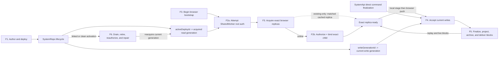

# Distributed Architecture Overview

Zerospin is a local-first command, projection, and synchronization runtime split
across authored System source, browser main-thread sessions, a browser
SharedWorker, stable Cloudflare Worker ingress, one `SystemRepo(systemId)`, and
generation-keyed Durable Object Repos. One `makeSystem` value defines the
authentication, models, contracts, queries, frontend bindings, and owner logic;
the CLI bundles that source into the whole Worker script. The exported
`SystemWorker` is a `WorkerEntrypoint` RPC boundary for authored Effects, while
`SystemRepo` and generation-keyed Repos also import the authored System module
directly
([`makeSystem.ts:460-551`](../packages/core/src/system/makeSystem.ts#L460-L551),
[`compileWorkerBundleFn.ts:17-95`](../packages/cli/src/deploy/compileWorkerBundleFn.ts#L17-L95),
[`SystemWorker.ts:76-84`](../packages/system-worker/src/SystemWorker.ts#L76-L84),
[`SystemRepo.ts:413-439`](../packages/system-worker/src/SystemRepo/SystemRepo.ts#L413-L439)).

This page is the routing map between the specialized architecture pages. It owns
the cross-flow invariants; the linked architecture pages own method-level
mechanics.

## Mental model

| Runtime region                                  | What it owns                                                                                                                                                                                                                                 | Executed by                                                                                                                                                                                                                                                                                                                                                                                                                                                                                                                                                         |
| ----------------------------------------------- | -------------------------------------------------------------------------------------------------------------------------------------------------------------------------------------------------------------------------------------------- | ------------------------------------------------------------------------------------------------------------------------------------------------------------------------------------------------------------------------------------------------------------------------------------------------------------------------------------------------------------------------------------------------------------------------------------------------------------------------------------------------------------------------------------------------------------------- |
| Authoring and operations                        | `makeSystem`, frontend controllers, source-selected locks, compilation, and deployment input                                                                                                                                                 | [`compileWorkerBundleFn.ts:27-95`](../packages/cli/src/deploy/compileWorkerBundleFn.ts#L27-L95) resolves the authored System entry and bundles it into the Worker script.                                                                                                                                                                                                                                                                                                                                                                                           |
| Browser main thread                             | One `ZerospinApp.Provider` whose props supply signature generation and aggregate IDs, not `userId` or a page-owned `AuthenticatedApi`; in-memory session SQLite, synchronous local command staging, and the atomically published session map | [`makeZerospinApp.tsx:144-166`](../packages/react/src/makeZerospinApp.tsx#L144-L166) defines the Provider props; [`makeZerospinApp.tsx:206-242`](../packages/react/src/makeZerospinApp.tsx#L206-L242) passes the signature capability and consumes worker-returned identity/mode; [`makeZerospinApp.tsx:269-459`](../packages/react/src/makeZerospinApp.tsx#L269-L459) owns session publication and release.                                                                                                                                                        |
| Browser SharedWorker                            | An identity-neutral host whose ports own authentication and bind one `{ systemId, userId, systemName }` root; native locator and 056-prefixed VFS persistence; exact replica runtimes, command journal, sockets, push, and repair            | [`startSharedWorker.ts:35-123`](../packages/shared-worker/src/SharedWorker/startSharedWorker.ts#L35-L123) configures the neutral host and one owner token/API per port; [`getUserPartitionRepo.ts:115-210`](../packages/shared-worker/src/SharedWorker/SharedWorkerApi/getUserPartitionRepo/getUserPartitionRepo.ts#L115-L210) binds port authentication; [`getUserPartitionRepo.ts:381-634`](../packages/shared-worker/src/SharedWorker/SharedWorkerApi/getUserPartitionRepo/getUserPartitionRepo.ts#L381-L634) selects mode and opens the bound persistence root. |
| Stable Worker ingress plus authored System code | `DevWorker`/`ProductionWorker` routing, `GatewayApi` capability acquisition, the `SystemWorker` RPC boundary, and the statically imported authored System module                                                                             | [`DevWorker.ts:31-49`](../packages/dev-worker/src/DevWorker.ts#L31-L49) routes development fetches; [`GatewayApi.ts:51-97`](../packages/system-worker/src/GatewayApi/GatewayApi.ts#L51-L97) exposes acquisition leaves; [`SystemWorker.ts:79-216`](../packages/system-worker/src/SystemWorker.ts#L79-L216) executes authored authentication and owner RPC entrypoints.                                                                                                                                                                                              |
| Durable Object graph                            | Singleton deployment/current-write coordination plus generation-keyed authority, immutable block archives, projections, frontend archives, and socket delivery                                                                               | [`SystemRepo.ts:93-205`](../packages/system-worker/src/SystemRepo/SystemRepo.ts#L93-L205) defines singleton lifecycle/current-write persistence; [`makeBoundDORepo.ts:74-104`](../packages/system-worker/src/makeBoundDORepo/makeBoundDORepo.ts#L74-L104) resolves generation-qualified child Repos.                                                                                                                                                                                                                                                                |

## Flow of flows

### Flow routing index

| Flow                             | Executed here                                                                                                                                                                                                                                                                                                                                                                                                                                                                                                                                                                                                                                                                                                                                                                                                                                                                                                                                                                                                                                                                                                                                                                                                                                                                                                                                                                                                                                                                                                                                                                                               | Broken down here                                                                                                                                                                                                                                                                                                                                                                                                                                                           |
| -------------------------------- | ----------------------------------------------------------------------------------------------------------------------------------------------------------------------------------------------------------------------------------------------------------------------------------------------------------------------------------------------------------------------------------------------------------------------------------------------------------------------------------------------------------------------------------------------------------------------------------------------------------------------------------------------------------------------------------------------------------------------------------------------------------------------------------------------------------------------------------------------------------------------------------------------------------------------------------------------------------------------------------------------------------------------------------------------------------------------------------------------------------------------------------------------------------------------------------------------------------------------------------------------------------------------------------------------------------------------------------------------------------------------------------------------------------------------------------------------------------------------------------------------------------------------------------------------------------------------------------------------------------- | -------------------------------------------------------------------------------------------------------------------------------------------------------------------------------------------------------------------------------------------------------------------------------------------------------------------------------------------------------------------------------------------------------------------------------------------------------------------------- |
| **F1. Author and deploy**        | This is three mutually exclusive entries. [`devFn.ts:143-205`](../packages/cli/src/dev/devFn.ts#L143-L205) configures authored aliases and [`devFn.ts:226-455`](../packages/cli/src/dev/devFn.ts#L226-L455) launches/drives `DevWorker`; [`compileWorkerBundleFn.ts:27-95`](../packages/cli/src/deploy/compileWorkerBundleFn.ts#L27-L95) plus [`deploySystemFn.ts:25-78`](../packages/cli/src/deploy/deploySystemFn.ts#L25-L78) execute hosted deployment; [`deployWranglerFn.ts:257-294`](../packages/cli/src/deploy/deployWranglerFn.ts#L257-L294) configures the direct `ProductionWorker` aliases and [`deployWranglerFn.ts:363-525`](../packages/cli/src/deploy/deployWranglerFn.ts#L363-L525) deploys/polls readiness. All three converge on the lifecycle bound in [`SystemRepo.ts:413-496`](../packages/system-worker/src/SystemRepo/SystemRepo.ts#L413-L496).                                                                                                                                                                                                                                                                                                                                                                                                                                                                                                                                                                                                                                                                                                                                      | No single page owns all three entry branches. [Static System Worker](./architecture/StaticSystemWorker.md) breaks down authored-code execution; [Development Lifecycle](./architecture/DevLifecycle.md) breaks down dev readiness and reload; [System Lifecycle](./architecture/SystemLifecycle.md) breaks down durable allocation, preparation, activation, and resume.                                                                                                   |
| **F2. Authenticate and admit**   | Browser root authentication executes inside [`getUserPartitionRepo.ts:164-379`](../packages/shared-worker/src/SharedWorker/SharedWorkerApi/getUserPartitionRepo/getUserPartitionRepo.ts#L164-L379). In the online F3 branch, exact child authorization and binding execute in [`AggregateFrontendReplicaRepo.ts:1601-1809`](../packages/shared-worker/src/SharedWorker/AggregateFrontendReplicaRepo/AggregateFrontendReplicaRepo.ts#L1601-L1809) or [`ServiceFrontendReplicaRepo.ts:641-830`](../packages/shared-worker/src/SharedWorker/ServiceFrontendReplicaRepo/ServiceFrontendReplicaRepo.ts#L641-L830), through the server leaves in `AuthenticatedApi`; `existing-only` skips that child work.                                                                                                                                                                                                                                                                                                                                                                                                                                                                                                                                                                                                                                                                                                                                                                                                                                                                                                       | [Universal Authentication](./architecture/Authentication.md) breaks down signature identity, fallback, and owner authorization; [Source-selected Frontends](./architecture/SourceSelectedFrontends.md) breaks down selected definitions and locks; [Aggregate Frontend API](./architecture/AggregateFrontendApi.md) and [Service Frontend API](./architecture/ServiceFrontendApi.md) break down the bound child capabilities.                                              |
| **F3. Bootstrap exact replicas** | [`makeZerospinApp.tsx:206-459`](../packages/react/src/makeZerospinApp.tsx#L206-L459) supplies signature capability, consumes the returned root identity/mode, acquires every session, and publishes once complete. [`acquireUserPartitionRepo.ts:223-372`](../packages/shared-worker/src/acquireUserPartitionRepo.ts#L223-L372) opens the neutral port and returns `{ api, release, systemId, userId, mode }`. [`acquireAggregateFrontendReplica.ts:101-610`](../packages/shared-worker/src/SharedWorker/UserPartitionRepo/acquireAggregateFrontendReplica/acquireAggregateFrontendReplica.ts#L101-L610) and [`acquireServiceFrontendReplica.ts:99-560`](../packages/shared-worker/src/SharedWorker/UserPartitionRepo/acquireServiceFrontendReplica/acquireServiceFrontendReplica.ts#L99-L560) admit online or validate cached exact replicas.                                                                                                                                                                                                                                                                                                                                                                                                                                                                                                                                                                                                                                                                                                                                                              | [Browser Session Bootstrap](./architecture/bootstrapBrowserSession.md) breaks down Provider, root, session, publication, and release order; [SharedWorker User Partition Session](./api/SharedWorkerSession.md) breaks down the neutral host, port-bound root, exact replica authority, and persistence; [Universal Authentication](./architecture/Authentication.md#sharedworker-ownership) breaks down the F2 root work nested inside this flow.                         |
| **F4. Stage and accept a write** | [`makeSession.ts:250-480`](../packages/core/src/session/makeSession.ts#L250-L480) commits to main-thread memory; [`bootstrapBrowserSession.ts:383-401`](../packages/react/src/bootstrapBrowserSession.ts#L383-L401) crosses the MessagePort; [`stageAggregateFrontendCommand.ts:15-109`](../packages/shared-worker/src/SharedWorker/UserPartitionRepo/stageAggregateFrontendCommand/stageAggregateFrontendCommand.ts#L15-L109) resolves the exact runtime; [`AggregateFrontendReplicaRepo.ts:3515-3786`](../packages/shared-worker/src/SharedWorker/AggregateFrontendReplicaRepo/AggregateFrontendReplicaRepo.ts#L3515-L3786) commits persistent browser intent; [`AggregateFrontendReplicaRepo.ts:2816-3429`](../packages/shared-worker/src/SharedWorker/AggregateFrontendReplicaRepo/AggregateFrontendReplicaRepo.ts#L2816-L3429) pushes the journal; [`SystemRepo/pushCommands.ts:81-260`](../packages/system-worker/src/SystemRepo/pushCommands/pushCommands.ts#L81-L260) selects and journals the current write generation.                                                                                                                                                                                                                                                                                                                                                                                                                                                                                                                                                                            | No single page owns both browser and direct entries. [Browser Session Bootstrap](./architecture/bootstrapBrowserSession.md) breaks down local commit and handoff; [SharedWorker User Partition Session](./api/SharedWorkerSession.md) breaks down exact replica/journal authority; [Aggregate Frontend API](./architecture/AggregateFrontendApi.md) breaks down browser push admission; [System API](./architecture/SystemApi.md) breaks down the direct non-browser path. |
| **F5. Finalize and deliver**     | [`drainPushBlockOutbox.ts:43-176`](../packages/system-worker/src/AggregateFrontendRepo/drainPushBlockOutbox/drainPushBlockOutbox.ts#L43-L176) crosses browser intake into aggregate authority. [`publishAggregateBlock.ts:19-38`](../packages/system-worker/src/AggregateRepo/finalizeAggregateCommands/publishAggregateBlock.ts#L19-L38) commits the aggregate-block handoff; [`processSubscriber.ts:204-253`](../packages/system-worker/src/AggregateBlockRepo/processSubscriber/processSubscriber.ts#L204-L253) advances projection subscribers; [`handleAggregateBlocks.ts:934-1042`](../packages/system-worker/src/AggregateFrontendRepo/handleAggregateBlocks/handleAggregateBlocks.ts#L934-L1042) commits projection/outbox progress; [`storeAggregateFrontendBlocks.ts:312-461`](../packages/system-worker/src/AggregateFrontendBlockRepo/storeAggregateFrontendBlocks/storeAggregateFrontendBlocks.ts#L312-L461) commits the archive before its live broadcast.                                                                                                                                                                                                                                                                                                                                                                                                                                                                                                                                                                                                                                    | [Blockchain and Projection Delivery](./architecture/Blockchain.md) breaks down the authority-to-block-to-projection-to-archive graph and exact-lock delivery; [Service Frontend Projection](./architecture/ServiceFrontendProjection.md) breaks down the mirrored read-only service branch; [Frontend WebSocket](./architecture/FrontendWebSocket.md) breaks down ticket consumption, replay, and live transition.                                                         |
| **F6. Drain and repair**         | [`prepareGeneration.ts:305-660`](../packages/system-worker/src/SystemRepo/prepareGeneration/prepareGeneration.ts#L305-L660) prepares and replays the target; [`activateDeploy.ts:977-1535`](../packages/system-worker/src/SystemRepo/activateDeploy/activateDeploy.ts#L977-L1535) performs linked or clean activation; [`retireGeneration.ts:54-113`](../packages/system-worker/src/SystemRepo/retireGeneration/retireGeneration.ts#L54-L113) drains archive sockets after retirement. Aggregate repair reauthorizes in [`AggregateFrontendReplicaRepo.ts:1651-1801`](../packages/shared-worker/src/SharedWorker/AggregateFrontendReplicaRepo/AggregateFrontendReplicaRepo.ts#L1651-L1801), replaces in [`AggregateFrontendReplicaRepo.ts:961-1195`](../packages/shared-worker/src/SharedWorker/AggregateFrontendReplicaRepo/AggregateFrontendReplicaRepo.ts#L961-L1195), and handles the close in [`AggregateFrontendReplicaRepo.ts:2386-2422`](../packages/shared-worker/src/SharedWorker/AggregateFrontendReplicaRepo/AggregateFrontendReplicaRepo.ts#L2386-L2422); service repair executes the analogous steps in [`ServiceFrontendReplicaRepo.ts:675-830`](../packages/shared-worker/src/SharedWorker/ServiceFrontendReplicaRepo/ServiceFrontendReplicaRepo.ts#L675-L830), [`ServiceFrontendReplicaRepo.ts:190-341`](../packages/shared-worker/src/SharedWorker/ServiceFrontendReplicaRepo/ServiceFrontendReplicaRepo.ts#L190-L341), and [`ServiceFrontendReplicaRepo.ts:1436-1474`](../packages/shared-worker/src/SharedWorker/ServiceFrontendReplicaRepo/ServiceFrontendReplicaRepo.ts#L1436-L1474). | [System Lifecycle](./architecture/SystemLifecycle.md) breaks down drain, freeze, replay, promotion, and durable resume; [Frontend WebSocket](./architecture/FrontendWebSocket.md) breaks down socket drain and browser repair; [Service Frontend Projection](./architecture/ServiceFrontendProjection.md) breaks down service replacement and generation continuity.                                                                                                       |

`Replica -> F4 -> F5 -> Replica` is steady state. In the browser path, F2 root
authentication and child admission execute inside F3 rather than entirely
before it; `existing-only` bypasses child admission until online promotion.
`SystemApi` direct command finalization bypasses browser bootstrap.
`SystemRepo` resolves active/read and current/write generations independently.
At a linked ownership cut it moves `writeGenerationId` before `activeDeployId`,
so old capabilities can keep reading their acquired generation while new writes
belong to the target. That temporary split is why browser repair returns to
authentication and admission instead of merely reconnecting the old socket
([`activateDeploy.ts:1018-1061`](../packages/system-worker/src/SystemRepo/activateDeploy/activateDeploy.ts#L1018-L1061),
[`activateDeploy.ts:1381-1524`](../packages/system-worker/src/SystemRepo/activateDeploy/activateDeploy.ts#L1381-L1524)).

## Runtime topology

```mermaid
flowchart LR
  subgraph Authoring["Authoring and operations"]
    direction TB
    Source["makeSystem + frontend controllers"]
    Tooling["CLI / deployment tooling"]
  end

  subgraph Main["Browser main thread"]
    direction TB
    Provider["ZerospinApp.Provider"]
    Sessions["aggregate + service sessions<br/>in-memory SQLite"]
  end

  subgraph Shared["Browser SharedWorker"]
    direction TB
    Partition["shared UserPartition root<br/>{systemId, userId}"]
    AggregateReplica["exact aggregate replica<br/>persistent SQLite + command journal"]
    ServiceReplica["exact service replica<br/>persistent read-only state"]
  end

  subgraph Worker["Stable Worker ingress and authored execution"]
    direction TB
    Entry["DevWorker / ProductionWorker"]
    Gateway["GatewayApi"]
    DeployApi["DevDeployApi / production readiness"]
    AuthenticatedApi["AuthenticatedApi"]
    AggregateApi["AggregateFrontendApi"]
    ServiceApi["ServiceFrontendApi"]
    SystemApi["SystemApi"]
    StaticWorker["SystemWorker RPC boundary<br/>auth + owner entrypoints"]
    AuthoredSystem["bundled authored System module"]
  end

  subgraph Durable["Cloudflare Durable Objects"]
    direction TB
    Control["SystemRepo(systemId)<br/>lifecycle + current writes + tickets"]

    subgraph AggregateBranch["generation-keyed aggregate branch"]
      direction LR
      AggregateRepo["AggregateRepo"]
      AggregateBlockRepo["AggregateBlockRepo"]
      AggregateFrontendRepo["AggregateFrontendRepo"]
      AggregateFrontendBlockRepo["AggregateFrontendBlockRepo"]
    end

    subgraph ServiceBranch["generation-keyed service branch"]
      direction LR
      ServiceRepo["ServiceRepo"]
      ServiceBlockRepo["ServiceBlockRepo"]
      ServiceFrontendRepo["ServiceFrontendRepo"]
      ServiceFrontendBlockRepo["ServiceFrontendBlockRepo"]
    end
  end

  Source -.->|"compile input"| Tooling
  Source -.->|"bundled authored System"| AuthoredSystem
  Source -.->|"selected frontend definitions"| Provider
  Tooling -.->|"bundles + deploys"| Entry

  Provider -->|"identity-neutral port; worker-bound root"| Partition
  Provider -->|"publish after all bootstraps"| Sessions
  Sessions -->|"local commit; async stage RPC"| Partition
  Partition -->|"acquire / attach"| AggregateReplica
  Partition -->|"acquire / attach"| ServiceReplica
  Partition ==>|"first persistent browser command commit"| AggregateReplica
  AggregateReplica -->|"committed state fanout"| Sessions
  ServiceReplica -->|"committed state fanout"| Sessions

  Entry --> Gateway
  Entry -.->|"reserved ticket WebSockets"| Control
  Gateway --> DeployApi
  Gateway --> AuthenticatedApi
  Gateway --> SystemApi
  Gateway -->|"active-generation lookup"| Control
  Gateway -->|"authenticate"| StaticWorker
  DeployApi -->|"lifecycle / readiness"| Control
  AuthenticatedApi --> AggregateApi
  AuthenticatedApi --> ServiceApi
  AuthenticatedApi -->|"authorize exact target"| StaticWorker

  AggregateReplica -->|"state, ticket, push"| AggregateApi
  ServiceReplica -->|"state and ticket"| ServiceApi
  AggregateReplica -.->|"ticket WebSocket"| Entry
  ServiceReplica -.->|"ticket WebSocket"| Entry

  AggregateApi -->|"generation-pinned reads / ticket"| StaticWorker
  ServiceApi -->|"generation-pinned reads / ticket"| StaticWorker
  SystemApi -->|"generation-pinned reads"| StaticWorker
  StaticWorker -.->|"runs authored Effects"| AuthoredSystem
  AuthoredSystem -.->|"system spec"| Control
  AuthoredSystem -.->|"aggregate logic"| AggregateRepo
  AuthoredSystem -.->|"service logic"| ServiceRepo
  AuthoredSystem -.->|"projection logic"| AggregateFrontendRepo
  AuthoredSystem -.->|"projection logic"| ServiceFrontendRepo
  StaticWorker -->|"read admission / ticket mint"| Control
  StaticWorker -->|"aggregate authorization / queries"| AggregateRepo
  StaticWorker -->|"service authorization / queries"| ServiceRepo
  StaticWorker -->|"frontend state / readiness"| AggregateFrontendRepo
  StaticWorker -->|"frontend state / readiness"| ServiceFrontendRepo
  StaticWorker -->|"ticket archive readiness"| AggregateFrontendBlockRepo
  StaticWorker -->|"ticket archive readiness"| ServiceFrontendBlockRepo

  AggregateApi ==>|"current browser write"| Control
  SystemApi ==>|"current aggregate / service finalization"| Control
  Control ==>|"browser push delivery"| AggregateFrontendRepo
  Control ==>|"direct aggregate finalization"| AggregateRepo
  Control ==>|"direct service finalization"| ServiceRepo

  AggregateFrontendRepo ==>|"durable PushBlock finalization outbox"| AggregateRepo
  AggregateRepo ==>|"durable block outbox"| AggregateBlockRepo
  AggregateBlockRepo ==>|"registered subscriber fanout"| AggregateFrontendRepo
  AggregateFrontendRepo ==>|"durable frontend-block outbox"| AggregateFrontendBlockRepo
  ServiceRepo ==>|"durable block outbox"| ServiceBlockRepo
  ServiceBlockRepo ==>|"registered subscriber fanout"| ServiceFrontendRepo
  ServiceFrontendRepo ==>|"durable frontend-block outbox"| ServiceFrontendBlockRepo
  ServiceBlockRepo ==>|"subscribed aggregate fanout"| AggregateRepo

  Control -.->|"forward admitted WebSocket"| AggregateFrontendBlockRepo
  Control -.->|"forward admitted WebSocket"| ServiceFrontendBlockRepo
  Control -.->|"after retirement: drainGeneration"| AggregateFrontendBlockRepo
  Control -.->|"after retirement: drainGeneration"| ServiceFrontendBlockRepo
  AggregateFrontendBlockRepo -.->|"archive replay + best-effort live"| AggregateReplica
  ServiceFrontendBlockRepo -.->|"archive replay + best-effort live"| ServiceReplica
  AggregateFrontendBlockRepo -.->|"state-required + 4003 close"| AggregateReplica
  ServiceFrontendBlockRepo -.->|"state-required + 4003 close"| ServiceReplica
  AggregateFrontendBlockRepo -.->|"1012 generation-drained"| AggregateReplica
  ServiceFrontendBlockRepo -.->|"1012 generation-drained"| ServiceReplica
```

Thin solid arrows are capability or control calls. Thick arrows are independently
durable write, outbox, or block-delivery boundaries. Dotted arrows are packaging,
WebSocket, or lifecycle/recovery paths. The browser replicas call their child
APIs; the APIs do not own or call into the SharedWorker. Frontend WebSocket
upgrades also bypass `GatewayApi`: the Worker entrypoint sends only the reserved
routes to `SystemRepo.fetch`
([`DevWorker.ts:31-49`](../packages/dev-worker/src/DevWorker.ts#L31-L49),
[`ProductionWorker.ts:67-114`](../packages/production-worker/src/ProductionWorker.ts#L67-L114),
[`SystemRepo/fetch.ts:68-161`](../packages/system-worker/src/SystemRepo/fetch/fetch.ts#L68-L161)).

## Routing invariants

1. **`SystemRepo` and `SystemWorker` are different authorities.**
   `SystemRepo(systemId)` is the singleton deployment lifecycle, active/read
   selection, current-write journal, and WebSocket-ticket router. The exported
   `SystemWorker` is a `WorkerEntrypoint` RPC boundary for authored
   authentication, authorization, and query Effects. The authored System module
   is bundled static code also imported by `SystemRepo` and generation-keyed
   Repos; `SystemWorker` neither owns canonical durable state nor chooses the
   current write generation
   ([`SystemRepo.ts:393-439`](../packages/system-worker/src/SystemRepo/SystemRepo.ts#L393-L439),
   [`SystemWorker.ts:76-216`](../packages/system-worker/src/SystemWorker.ts#L76-L216),
   [`compileWorkerBundleFn.ts:17-95`](../packages/cli/src/deploy/compileWorkerBundleFn.ts#L17-L95)).

2. **Read generation and write generation are separate.** `GatewayApi` calls
   `SystemRepo.getActiveGenerationId`; `SystemRepo` dereferences
   `activeDeployId` to a succeeded deploy and returns its `generationId`.
   `AuthenticatedApi` and `SystemApi` retain that acquired generation for reads,
   authorization, state, queries, and tickets. `AggregateFrontendApi.pushCommands`
   and the two `SystemApi.finalize*Commands` methods omit that generation, so
   `SystemRepo` reads the current `writeGenerationId`, reserves the next
   `writeIndex`, and persists the generation-tagged full write before delivery
   ([`getAuthenticatedApi.ts:48-57`](../packages/system-worker/src/GatewayApi/getAuthenticatedApi/getAuthenticatedApi.ts#L48-L57),
   [`getActiveGenerationId.ts:129-190`](../packages/system-worker/src/SystemRepo/getActiveGenerationId/getActiveGenerationId.ts#L129-L190),
   [`AuthenticatedApi.ts:24-53`](../packages/system-worker/src/AuthenticatedApi/AuthenticatedApi.ts#L24-L53),
   [`AggregateFrontendApi/pushCommands.ts:52-64`](../packages/system-worker/src/AggregateFrontendApi/pushCommands/pushCommands.ts#L52-L64),
   [`SystemRepo/pushCommands.ts:81-202`](../packages/system-worker/src/SystemRepo/pushCommands/pushCommands.ts#L81-L202)).

3. **Every frontend capability is admitted for an exact target.** The aggregate
   target is `{ aggregateName, aggregateId, userId, frontendName }` plus one
   complete aggregate lock: source selection supplies both names and the lock,
   the Provider supplies `aggregateId`, and authentication supplies `userId`.
   The service target is `{ serviceName, userId, frontendName }` plus one
   complete service lock: source selection supplies both names and the lock,
   while authentication supplies `userId`. Gateway key resolution supplies
   `systemId`; `SystemRepo` supplies the acquisition generation
   ([`makeZerospinApp.tsx:269-416`](../packages/react/src/makeZerospinApp.tsx#L269-L416),
   [`getAggregateFrontendApi.ts:61-119`](../packages/system-worker/src/AuthenticatedApi/getAggregateFrontendApi/getAggregateFrontendApi.ts#L61-L119),
   [`getServiceFrontendApi.ts:53-108`](../packages/system-worker/src/AuthenticatedApi/getServiceFrontendApi/getServiceFrontendApi.ts#L53-L108)).

4. **Browser persistence and exact replica authority are more exact still.** The
   native IndexedDB configuration locator is
   `zerospin/056/last-user-partition-store`; its key encodes
   `{ apiUrl, publishableKey, systemName, authenticationLock }` and its strict
   record is `{ key, systemId, userId }`. The user-root VFS prefix is
   `zerospin/056/${systemId}/users/${userId}`. Non-empty pre-056 databases and
   incompatible locator, VFS, or current-schema layouts fail with
   `browser-persistence-reset-required` without translation or byte deletion
   ([`lastUserPartitionStore.ts:7-15`](../packages/shared-worker/src/SharedWorker/lastUserPartitionStore.ts#L7-L15),
   [`lastUserPartitionStore.ts:29-168`](../packages/shared-worker/src/SharedWorker/lastUserPartitionStore.ts#L29-L168),
   [`getUserPartitionRepo.ts:381-469`](../packages/shared-worker/src/SharedWorker/SharedWorkerApi/getUserPartitionRepo/getUserPartitionRepo.ts#L381-L469),
   [`makeVfsName.ts:3-10`](../packages/shared-worker/src/SharedWorker/makeVfsName.ts#L3-L10),
   [`makeIdbSQLite3.ts:30-155`](../packages/shared-worker/src/drizzle/makeIdbSQLite3.ts#L30-L155),
   [`migrateUserReplicaDbAsync.ts:193-251`](../packages/shared-worker/src/SharedWorker/migrateUserReplicaDbAsync.ts#L193-L251)).

   The exact aggregate replica key contains `systemId`, `userId`, `aggregateId`,
   `aggregateName`, `frontendName`, and `aggregateFrontendLockKey`; the exact
   service replica key contains `systemId`, `userId`, `serviceName`,
   `frontendName`, and `serviceFrontendLockKey`. Each exact Repo owns one sticky
   inline `{ registrationId, ownerToken, authenticatedApi, frontendApi }`, chosen
   from the oldest usable online registration in allocation order. Authority
   selection and socket callbacks recheck the exact socket, selection attempt,
   registration, `ownerToken`, and current-root `AuthenticatedApi`. Exact target,
   lock, or admission denial terminally fences only that Repo
   ([`acquireAggregateFrontendReplica.ts:154-228`](../packages/shared-worker/src/SharedWorker/UserPartitionRepo/acquireAggregateFrontendReplica/acquireAggregateFrontendReplica.ts#L154-L228),
   [`acquireServiceFrontendReplica.ts:154-224`](../packages/shared-worker/src/SharedWorker/UserPartitionRepo/acquireServiceFrontendReplica/acquireServiceFrontendReplica.ts#L154-L224),
   [`AggregateFrontendReplicaRepo.ts:198-243`](../packages/shared-worker/src/SharedWorker/AggregateFrontendReplicaRepo/AggregateFrontendReplicaRepo.ts#L198-L243),
   [`AggregateFrontendReplicaRepo.ts:1560-1822`](../packages/shared-worker/src/SharedWorker/AggregateFrontendReplicaRepo/AggregateFrontendReplicaRepo.ts#L1560-L1822),
   [`AggregateFrontendReplicaRepo.ts:1992-2025`](../packages/shared-worker/src/SharedWorker/AggregateFrontendReplicaRepo/AggregateFrontendReplicaRepo.ts#L1992-L2025),
   [`AggregateFrontendReplicaRepo.ts:2082-2407`](../packages/shared-worker/src/SharedWorker/AggregateFrontendReplicaRepo/AggregateFrontendReplicaRepo.ts#L2082-L2407),
   [`ServiceFrontendReplicaRepo.ts:97-133`](../packages/shared-worker/src/SharedWorker/ServiceFrontendReplicaRepo/ServiceFrontendReplicaRepo.ts#L97-L133),
   [`ServiceFrontendReplicaRepo.ts:579-855`](../packages/shared-worker/src/SharedWorker/ServiceFrontendReplicaRepo/ServiceFrontendReplicaRepo.ts#L579-L855),
   [`ServiceFrontendReplicaRepo.ts:1043-1077`](../packages/shared-worker/src/SharedWorker/ServiceFrontendReplicaRepo/ServiceFrontendReplicaRepo.ts#L1043-L1077),
   [`ServiceFrontendReplicaRepo.ts:1150-1455`](../packages/shared-worker/src/SharedWorker/ServiceFrontendReplicaRepo/ServiceFrontendReplicaRepo.ts#L1150-L1455)).

5. **Aggregate and service browser replicas are intentionally asymmetric.**
   Aggregate replicas own a persistent command journal, optimistic application,
   push, replacement/rebase, and a socket. The server `AggregateFrontendApi`
   also exposes remote query leaves, but the exact replica runtime does not call
   them. Service replicas own read-only projected state, replacement, and a
   socket; there is no service staging, journal, or push path, and
   `ServiceFrontendApi` exposes no remote query leaf
   ([`acquireUserPartitionRepo.ts:59-190`](../packages/shared-worker/src/acquireUserPartitionRepo.ts#L59-L190),
   [`AggregateFrontendReplicaRepo.ts:87-129`](../packages/shared-worker/src/SharedWorker/AggregateFrontendReplicaRepo/AggregateFrontendReplicaRepo.ts#L87-L129),
   [`ServiceFrontendReplicaRepo.ts:53-69`](../packages/shared-worker/src/SharedWorker/ServiceFrontendReplicaRepo/ServiceFrontendReplicaRepo.ts#L53-L69),
   [`AggregateFrontendApi.ts:83-133`](../packages/system-worker/src/AggregateFrontendApi/AggregateFrontendApi.ts#L83-L133),
   [`ServiceFrontendApi.ts:77-99`](../packages/system-worker/src/ServiceFrontendApi/ServiceFrontendApi.ts#L77-L99)).

6. **No arrow across the durable graph is a distributed transaction.** Each
   authority, block archive, projection, and frontend archive commits locally,
   then advances the next retryable outbox or subscriber boundary. A successful
   SystemRepo browser push proves durable delivery to `AggregateFrontendRepo`
   and a returned `PushBlock`; it does not yet prove aggregate execution,
   projection/archive convergence, WebSocket delivery, or browser convergence
   ([`AggregateFrontendRepo.ts:529-559`](../packages/system-worker/src/AggregateFrontendRepo/AggregateFrontendRepo.ts#L529-L559),
   [`drainPushBlockOutbox.ts:43-125`](../packages/system-worker/src/AggregateFrontendRepo/drainPushBlockOutbox/drainPushBlockOutbox.ts#L43-L125)).

## How the six flows interact

### F1. Author and deploy

F1 is three entry branches, not a serial call chain. Development generates a
Wrangler configuration that aliases authored `system` and `seeds` into
`DevWorker`, then drives `DevDeployApi.startDeploy/getDeploy` across reloads.
Hosted deployment compiles the authored entry into a complete Worker bundle and
sends it through `CliApi.deployWorkerBundle`. Direct `--wrangler` deployment
instead aliases authored `system` into `ProductionWorker`, deploys with Wrangler,
and polls production readiness
([`devFn.ts:143-205`](../packages/cli/src/dev/devFn.ts#L143-L205),
[`devFn.ts:321-430`](../packages/cli/src/dev/devFn.ts#L321-L430),
[`commands/deploy.tsx:35-74`](../packages/cli/src/commands/deploy.tsx#L35-L74),
[`compileWorkerBundleFn.ts:27-95`](../packages/cli/src/deploy/compileWorkerBundleFn.ts#L27-L95),
[`deploySystemFn.ts:25-78`](../packages/cli/src/deploy/deploySystemFn.ts#L25-L78),
[`deployWranglerFn.ts:257-294`](../packages/cli/src/deploy/deployWranglerFn.ts#L257-L294),
[`deployWranglerFn.ts:475-525`](../packages/cli/src/deploy/deployWranglerFn.ts#L475-L525)).

The branches converge on `SystemRepo(systemId)`: development enters through the
explicit deploy API, while production allocates from the Worker/Repo constructor
and exposes readiness. [Static System Worker](./architecture/StaticSystemWorker.md)
breaks down authored execution, [Development Lifecycle](./architecture/DevLifecycle.md)
breaks down the dev branch, and [System Lifecycle](./architecture/SystemLifecycle.md)
breaks down the shared persistent lifecycle
([`GatewayApi.ts:57-75`](../packages/system-worker/src/GatewayApi/GatewayApi.ts#L57-L75),
[`SystemRepo.ts:413-496`](../packages/system-worker/src/SystemRepo/SystemRepo.ts#L413-L496)).

### F2. Authenticate and admit exact targets

F2 executes twice inside an online browser bootstrap. First, the port-bound
SharedWorker root obtains the current generation-pinned `AuthenticatedApi` by
calling the Worker-hosted gateway; the page supplies a current signature
capability but never owns a temporary `AuthenticatedApi`. Second, each exact
replica authority asks that current parent for one aggregate or service child.
The child leaf invokes authored owner authorization, verifies the complete
source-selected lock, and returns a capability bound to that exact target
([`makeZerospinApp.tsx:206-237`](../packages/react/src/makeZerospinApp.tsx#L206-L237),
[`getUserPartitionRepo.ts:164-379`](../packages/shared-worker/src/SharedWorker/SharedWorkerApi/getUserPartitionRepo/getUserPartitionRepo.ts#L164-L379),
[`getAuthenticatedApi.ts:48-118`](../packages/system-worker/src/GatewayApi/getAuthenticatedApi/getAuthenticatedApi.ts#L48-L118),
[`AggregateFrontendReplicaRepo.ts:1601-1809`](../packages/shared-worker/src/SharedWorker/AggregateFrontendReplicaRepo/AggregateFrontendReplicaRepo.ts#L1601-L1809),
[`ServiceFrontendReplicaRepo.ts:641-830`](../packages/shared-worker/src/SharedWorker/ServiceFrontendReplicaRepo/ServiceFrontendReplicaRepo.ts#L641-L830),
[`getAggregateFrontendApi.ts:61-119`](../packages/system-worker/src/AuthenticatedApi/getAggregateFrontendApi/getAggregateFrontendApi.ts#L61-L119),
[`getServiceFrontendApi.ts:53-108`](../packages/system-worker/src/AuthenticatedApi/getServiceFrontendApi/getServiceFrontendApi.ts#L53-L108)).

The `existing-only` branch exists only when the initial worker-owned root
authentication attempt fails with `user-authentication-transport-failed`,
`gateway-infrastructure-failure`, `system-deploy-activating`,
`system-deploy-failed`, or `system-not-ready`; it retains no current server
parent and performs no child admission until an online promotion
([`getUserPartitionRepo.ts:381-407`](../packages/shared-worker/src/SharedWorker/SharedWorkerApi/getUserPartitionRepo/getUserPartitionRepo.ts#L381-L407)). [Universal Authentication](./architecture/Authentication.md)
breaks down both authentication phases and that exact fallback,
[Source-selected Frontends](./architecture/SourceSelectedFrontends.md)
breaks down the locks, and [Aggregate Frontend API](./architecture/AggregateFrontendApi.md)
plus [Service Frontend API](./architecture/ServiceFrontendApi.md) break down the
two child boundaries.

### F3. Bootstrap exact browser replicas

The Provider props contain `generateSignature` and `aggregateIds`, not `userId`
or a page-owned `AuthenticatedApi`. The Provider passes
`{ systemName, authenticationLock, generateSignature }` to
`acquireUserPartitionRepo`; that boundary starts a host whose URL contains only
`{ apiUrl, publishableKey, wasmUrl }`. Each connection receives its own
`ownerToken` and `SharedWorkerApi`, which binds the port authentication
configuration and resolves `{ systemId, userId, systemName }`. The inner RPC
returns exact `{ api, systemId, userId, mode }`; the main-thread boundary adds
only a local idempotent `release`
([`makeZerospinApp.tsx:144-166`](../packages/react/src/makeZerospinApp.tsx#L144-L166),
[`makeZerospinApp.tsx:206-242`](../packages/react/src/makeZerospinApp.tsx#L206-L242),
[`acquireUserPartitionRepo.ts:193-208`](../packages/shared-worker/src/acquireUserPartitionRepo.ts#L193-L208),
[`acquireUserPartitionRepo.ts:223-372`](../packages/shared-worker/src/acquireUserPartitionRepo.ts#L223-L372),
[`startSharedWorker.ts:35-123`](../packages/shared-worker/src/SharedWorker/startSharedWorker.ts#L35-L123),
[`getUserPartitionRepo.ts:115-210`](../packages/shared-worker/src/SharedWorker/SharedWorkerApi/getUserPartitionRepo/getUserPartitionRepo.ts#L115-L210),
[`getUserPartitionRepo.ts:717-737`](../packages/shared-worker/src/SharedWorker/SharedWorkerApi/getUserPartitionRepo/getUserPartitionRepo.ts#L717-L737)).

The Provider then concurrently builds each aggregate and service session and
acquires its exact replica through the one user root. Online acquisition verifies
and installs one Repo-owned inline
`{ registrationId, ownerToken, authenticatedApi, frontendApi }` before publishing
the replica. `existing-only` opens only existing local persistence, requires a
matching ready receipt, and skips server work. A later same-port acquisition with
the same sink promotes that registration in place instead of allocating and
releasing a second registration. The complete session map becomes visible in one
state update only after every acquisition succeeds, and the Provider scope owns
all releases
([`makeZerospinApp.tsx:269-459`](../packages/react/src/makeZerospinApp.tsx#L269-L459),
[`AggregateFrontendReplicaRepo.ts:1198-1249`](../packages/shared-worker/src/SharedWorker/AggregateFrontendReplicaRepo/AggregateFrontendReplicaRepo.ts#L1198-L1249),
[`AggregateFrontendReplicaRepo.ts:1560-1800`](../packages/shared-worker/src/SharedWorker/AggregateFrontendReplicaRepo/AggregateFrontendReplicaRepo.ts#L1560-L1800),
[`ServiceFrontendReplicaRepo.ts:346-389`](../packages/shared-worker/src/SharedWorker/ServiceFrontendReplicaRepo/ServiceFrontendReplicaRepo.ts#L346-L389),
[`ServiceFrontendReplicaRepo.ts:641-830`](../packages/shared-worker/src/SharedWorker/ServiceFrontendReplicaRepo/ServiceFrontendReplicaRepo.ts#L641-L830),
[`acquireAggregateFrontendReplica.ts:228-276`](../packages/shared-worker/src/SharedWorker/UserPartitionRepo/acquireAggregateFrontendReplica/acquireAggregateFrontendReplica.ts#L228-L276),
[`acquireServiceFrontendReplica.ts:225-277`](../packages/shared-worker/src/SharedWorker/UserPartitionRepo/acquireServiceFrontendReplica/acquireServiceFrontendReplica.ts#L225-L277)).

[Browser Session Bootstrap](./architecture/bootstrapBrowserSession.md) breaks
down Provider/root/session/release order, [Universal Authentication](./architecture/Authentication.md#sharedworker-ownership)
breaks down the nested F2 work, and [SharedWorker User Partition Session](./api/SharedWorkerSession.md)
breaks down the port-bound root, shared runtime maps, exact replica authority,
persistence, and release lifecycle.

### F4. Stage locally and accept the current write

An aggregate session commits a command and optimistic mutations synchronously
to its in-memory main-thread SQLite, then forks the MessagePort call to
`stageAggregateFrontendCommand`. The first persistent browser command boundary
is the SharedWorker exact-replica transaction; only after that commit does the
replica fan out the staged result and schedule push
([`makeSession.ts:250-337`](../packages/core/src/session/makeSession.ts#L250-L337),
[`makeSession.ts:340-480`](../packages/core/src/session/makeSession.ts#L340-L480),
[`bootstrapBrowserSession.ts:383-401`](../packages/react/src/bootstrapBrowserSession.ts#L383-L401),
[`stageAggregateFrontendCommand.ts:15-109`](../packages/shared-worker/src/SharedWorker/UserPartitionRepo/stageAggregateFrontendCommand/stageAggregateFrontendCommand.ts#L15-L109),
[`AggregateFrontendReplicaRepo.ts:3515-3786`](../packages/shared-worker/src/SharedWorker/AggregateFrontendReplicaRepo/AggregateFrontendReplicaRepo.ts#L3515-L3786)).

The replica calls its admitted `AggregateFrontendApi`. That API deliberately
omits the acquired generation and enters `SystemRepo`, which atomically reads
the selected `writeGenerationId`, reserves the next `writeIndex`, persists the
generation-tagged full write, and then delivers it to the exact generation-keyed
`AggregateFrontendRepo`. Secret-key
`SystemApi` aggregate/service finalization enters the same current-write journal
without moving authored owner logic out of the bundled System module
([`AggregateFrontendApi/pushCommands.ts:52-72`](../packages/system-worker/src/AggregateFrontendApi/pushCommands/pushCommands.ts#L52-L72),
[`AggregateFrontendReplicaRepo.ts:2816-3429`](../packages/shared-worker/src/SharedWorker/AggregateFrontendReplicaRepo/AggregateFrontendReplicaRepo.ts#L2816-L3429),
[`SystemRepo/pushCommands.ts:81-260`](../packages/system-worker/src/SystemRepo/pushCommands/pushCommands.ts#L81-L260),
[`SystemApi/finalizeAggregateCommands.ts:25-49`](../packages/system-worker/src/SystemApi/finalizeAggregateCommands/finalizeAggregateCommands.ts#L25-L49),
[`SystemApi/finalizeServiceCommands.ts:24-46`](../packages/system-worker/src/SystemApi/finalizeServiceCommands/finalizeServiceCommands.ts#L24-L46)).
[Browser Session Bootstrap](./architecture/bootstrapBrowserSession.md) breaks
down the local commit and asynchronous handoff; [SharedWorker User Partition Session](./api/SharedWorkerSession.md)
breaks down exact-replica journal ownership; [Aggregate Frontend API](./architecture/AggregateFrontendApi.md)
breaks down browser push admission; and [System API](./architecture/SystemApi.md)
breaks down direct finalization.

### F5. Finalize, project, archive, and deliver blocks

Browser-originated commands enter `AggregateFrontendRepo` first; its committed
`PushBlock` outbox asynchronously invokes `AggregateRepo` finalization. From
aggregate authority onward, the path crosses `AggregateRepo`,
`AggregateBlockRepo`, `AggregateFrontendRepo`, then
`AggregateFrontendBlockRepo`. The service path crosses `ServiceRepo`,
`ServiceBlockRepo`, `ServiceFrontendRepo`, then `ServiceFrontendBlockRepo`.
`ServiceBlockRepo` additionally fans service blocks to registered
`AggregateRepo` subscribers; it is not a universal broadcast
([`AggregateFrontendRepo.ts:529-559`](../packages/system-worker/src/AggregateFrontendRepo/AggregateFrontendRepo.ts#L529-L559),
[`drainPushBlockOutbox.ts:43-125`](../packages/system-worker/src/AggregateFrontendRepo/drainPushBlockOutbox/drainPushBlockOutbox.ts#L43-L125),
[`publishAggregateBlock.ts:19-38`](../packages/system-worker/src/AggregateRepo/finalizeAggregateCommands/publishAggregateBlock.ts#L19-L38),
[`processSubscriber.ts:204-253`](../packages/system-worker/src/AggregateBlockRepo/processSubscriber/processSubscriber.ts#L204-L253),
[`drainServiceBlockOutbox.ts:47-76`](../packages/system-worker/src/ServiceRepo/drainServiceBlockOutbox/drainServiceBlockOutbox.ts#L47-L76),
[`drainAggregateSubscribers.ts:64-108`](../packages/system-worker/src/ServiceBlockRepo/drainAggregateSubscribers/drainAggregateSubscribers.ts#L64-L108)).

Each frontend Repo commits projection progress and, when its emission rules
produce a frontend block, commits that outbox in the same local transaction.
The corresponding frontend block Repo later commits the archive before its
best-effort live broadcast. Archive replay is the recovery contract, and both
replay and live delivery are shaped for the admitted exact lock rather than
broadcasting raw canonical block bytes
([`handleAggregateBlocks.ts:992-1042`](../packages/system-worker/src/AggregateFrontendRepo/handleAggregateBlocks/handleAggregateBlocks.ts#L992-L1042),
[`handleServiceBlocks.ts:468-557`](../packages/system-worker/src/ServiceFrontendRepo/handleServiceBlocks/handleServiceBlocks.ts#L468-L557),
[`storeAggregateFrontendBlocks.ts:312-461`](../packages/system-worker/src/AggregateFrontendBlockRepo/storeAggregateFrontendBlocks/storeAggregateFrontendBlocks.ts#L312-L461),
[`storeServiceFrontendBlocks.ts:311-459`](../packages/system-worker/src/ServiceFrontendBlockRepo/storeServiceFrontendBlocks/storeServiceFrontendBlocks.ts#L311-L459)).

In the SharedWorker, an exact replica accepts only the next `frontendIndex`,
commits locally, and then fans out to attached page sessions
([`AggregateFrontendReplicaRepo.ts:2477-2813`](../packages/shared-worker/src/SharedWorker/AggregateFrontendReplicaRepo/AggregateFrontendReplicaRepo.ts#L2477-L2813),
[`ServiceFrontendReplicaRepo.ts:1498-1633`](../packages/shared-worker/src/SharedWorker/ServiceFrontendReplicaRepo/ServiceFrontendReplicaRepo.ts#L1498-L1633)).

Each exact replica runtime owns its own socket. It asks its generation-pinned
child API for a generation-prefixed, single-use ticket. `SystemRepo` stores the
hash instead of the plaintext ticket, alongside admitted target/lock metadata
and expiry. The Worker sends the reserved route to `SystemRepo`, which consumes
the ticket and forwards the upgrade with the exact admitted target and lock to
the named frontend block Repo
([`AggregateFrontendApi/createWebSocketTicket.ts:19-70`](../packages/system-worker/src/AggregateFrontendApi/createWebSocketTicket/createWebSocketTicket.ts#L19-L70),
[`ServiceFrontendApi/createWebSocketTicket.ts:17-69`](../packages/system-worker/src/ServiceFrontendApi/createWebSocketTicket/createWebSocketTicket.ts#L17-L69),
[`SystemRepo/createAggregateFrontendWebSocketTicket.ts:50-176`](../packages/system-worker/src/SystemRepo/createAggregateFrontendWebSocketTicket/createAggregateFrontendWebSocketTicket.ts#L50-L176),
[`SystemRepo/createServiceFrontendWebSocketTicket.ts:50-174`](../packages/system-worker/src/SystemRepo/createServiceFrontendWebSocketTicket/createServiceFrontendWebSocketTicket.ts#L50-L174),
[`SystemRepo/fetch.ts:68-229`](../packages/system-worker/src/SystemRepo/fetch/fetch.ts#L68-L229)).
[Blockchain and Projection Delivery](./architecture/Blockchain.md) breaks down
the durable graph and exact-lock delivery; [Service Frontend Projection](./architecture/ServiceFrontendProjection.md)
breaks down the service branch; and [Frontend WebSocket](./architecture/FrontendWebSocket.md)
breaks down ticket consumption, replay, and live transition.

### F6. Drain, retire, reauthorize, and repair

For a linked successor, `SystemRepo` prepares and replays immutable service and
aggregate ledger histories, moves current-write ownership to the migrating
target, holds newly journaled target writes until promotion, drains and freezes
the source authoritative write and service-to-aggregate consequence graph,
proves final replay, then atomically retires the source and opens/promotes the
target
([`prepareGeneration.ts:305-365`](../packages/system-worker/src/SystemRepo/prepareGeneration/prepareGeneration.ts#L305-L365),
[`prepareGeneration.ts:417-657`](../packages/system-worker/src/SystemRepo/prepareGeneration/prepareGeneration.ts#L417-L657),
[`activateDeploy.ts:977-1061`](../packages/system-worker/src/SystemRepo/activateDeploy/activateDeploy.ts#L977-L1061),
[`drainSystemWrites.ts:140-154`](../packages/system-worker/src/SystemRepo/drainSystemWrites/drainSystemWrites.ts#L140-L154),
[`freezeGeneration.ts:88-337`](../packages/system-worker/src/SystemRepo/freezeGeneration/freezeGeneration.ts#L88-L337),
[`activateDeploy.ts:690-701`](../packages/system-worker/src/SystemRepo/activateDeploy/activateDeploy.ts#L690-L701),
[`activateDeploy.ts:1324-1530`](../packages/system-worker/src/SystemRepo/activateDeploy/activateDeploy.ts#L1324-L1530)).

Frontend projections rebuild from the destination immutable ledgers. Frontend
archives are not copied as generation replay authority, and current lineage
resolves with no predecessor
([`resolveFrontendProjectionLineage.ts:1-5`](../packages/system-worker/src/SystemRepo/resolveFrontendProjectionLineage/resolveFrontendProjectionLineage.ts#L1-L5),
[`resolveFrontendProjectionLineage.ts:83-99`](../packages/system-worker/src/SystemRepo/resolveFrontendProjectionLineage/resolveFrontendProjectionLineage.ts#L83-L99)).

A clean takeover is a different branch: it marks every open branch draining
without moving `writeGenerationId`; ordinary current-write admission therefore
closes until the clean target promotes
([`activateDeploy.ts:1071-1158`](../packages/system-worker/src/SystemRepo/activateDeploy/activateDeploy.ts#L1071-L1158),
[`SystemRepo/pushCommands.ts:131-153`](../packages/system-worker/src/SystemRepo/pushCommands/pushCommands.ts#L131-L153)).

Old capabilities remain read-admitted while their generation is `draining`;
the durable `retired` phase is the read and ticket fence
([`assertGenerationAdmission.ts:86-111`](../packages/system-worker/src/SystemRepo/assertGenerationAdmission/assertGenerationAdmission.ts#L86-L111),
[`consumeAggregateFrontendWebSocketTicket.ts:160-199`](../packages/system-worker/src/SystemRepo/consumeAggregateFrontendWebSocketTicket/consumeAggregateFrontendWebSocketTicket.ts#L160-L199)).

Only after retirement does cleanup close registered frontend archive sockets
with `1012 / generation-drained`. The aggregate and service replica runtimes
special-case that exact code and reason, reacquire current parent/child
capabilities, fetch authoritative state through `getState`, commit replacement,
and mint a new ticket. `state-required` is only a socket marker; full replacement
state travels through `getState`. A new socket starts in replay from the
committed frontend index and becomes online only after a matching
`replay-complete`. Aggregate repair reconciles surviving staged/pushed command
intent; service repair replaces read-only state
([`retireGeneration.ts:54-113`](../packages/system-worker/src/SystemRepo/retireGeneration/retireGeneration.ts#L54-L113),
[`AggregateFrontendBlockRepo/drainGeneration.ts:3-8`](../packages/system-worker/src/AggregateFrontendBlockRepo/drainGeneration/drainGeneration.ts#L3-L8),
[`ServiceFrontendBlockRepo/drainGeneration.ts:3-8`](../packages/system-worker/src/ServiceFrontendBlockRepo/drainGeneration/drainGeneration.ts#L3-L8),
[`AggregateFrontendReplicaRepo.ts:1651-1801`](../packages/shared-worker/src/SharedWorker/AggregateFrontendReplicaRepo/AggregateFrontendReplicaRepo.ts#L1651-L1801),
[`AggregateFrontendReplicaRepo.ts:961-1195`](../packages/shared-worker/src/SharedWorker/AggregateFrontendReplicaRepo/AggregateFrontendReplicaRepo.ts#L961-L1195),
[`AggregateFrontendReplicaRepo.ts:1856-1979`](../packages/shared-worker/src/SharedWorker/AggregateFrontendReplicaRepo/AggregateFrontendReplicaRepo.ts#L1856-L1979),
[`AggregateFrontendReplicaRepo.ts:2191-2424`](../packages/shared-worker/src/SharedWorker/AggregateFrontendReplicaRepo/AggregateFrontendReplicaRepo.ts#L2191-L2424),
[`ServiceFrontendReplicaRepo.ts:675-830`](../packages/shared-worker/src/SharedWorker/ServiceFrontendReplicaRepo/ServiceFrontendReplicaRepo.ts#L675-L830),
[`ServiceFrontendReplicaRepo.ts:190-341`](../packages/shared-worker/src/SharedWorker/ServiceFrontendReplicaRepo/ServiceFrontendReplicaRepo.ts#L190-L341),
[`ServiceFrontendReplicaRepo.ts:862-1007`](../packages/shared-worker/src/SharedWorker/ServiceFrontendReplicaRepo/ServiceFrontendReplicaRepo.ts#L862-L1007),
[`ServiceFrontendReplicaRepo.ts:1245-1477`](../packages/shared-worker/src/SharedWorker/ServiceFrontendReplicaRepo/ServiceFrontendReplicaRepo.ts#L1245-L1477)).
[System Lifecycle](./architecture/SystemLifecycle.md) breaks down the generation
cut and durable resume; [Blockchain and Projection Delivery](./architecture/Blockchain.md)
breaks down destination replay and projection rebuild; and [Frontend WebSocket](./architecture/FrontendWebSocket.md)
breaks down drain, replacement, and reconnect.

## Durable ownership and identity

Generation is durable storage lineage. The complete frontend lock is admitted
capability/representation identity, while the following path fields determine
Durable Object names
([`types.ts:51-61`](../packages/core/src/system/types.ts#L51-L61),
[`makeBoundDORepo.ts:74-104`](../packages/system-worker/src/makeBoundDORepo/makeBoundDORepo.ts#L74-L104)).

| Durable owner                | Durable Object name fields                                                                                                                                                                                         | Primary responsibility                                                                                                                                                                                                                                                                                                                                                                                                                                                                                                                                                               |
| ---------------------------- | ------------------------------------------------------------------------------------------------------------------------------------------------------------------------------------------------------------------ | ------------------------------------------------------------------------------------------------------------------------------------------------------------------------------------------------------------------------------------------------------------------------------------------------------------------------------------------------------------------------------------------------------------------------------------------------------------------------------------------------------------------------------------------------------------------------------------ |
| `SystemRepo`                 | `{ systemId }` ([`SystemRepo.ts:393-423`](../packages/system-worker/src/SystemRepo/SystemRepo.ts#L393-L423))                                                                                                       | Singleton deploy, generation/selection, current-write, drain-bound, replay-completion, Repo-registration, and one-use-ticket rows ([`SystemRepo.ts:93-262`](../packages/system-worker/src/SystemRepo/SystemRepo.ts#L93-L262), [`SystemRepo.ts:263-387`](../packages/system-worker/src/SystemRepo/SystemRepo.ts#L263-L387))                                                                                                                                                                                                                                                           |
| `AggregateRepo`              | `{ generationId, aggregateId, aggregateName }` ([`AggregateRepo.ts:212-216`](../packages/system-worker/src/AggregateRepo/AggregateRepo.ts#L212-L216))                                                              | Aggregate command authority, service-input projection, and aggregate-block outbox ([`finalizeAggregateCommands.ts:169-203`](../packages/system-worker/src/AggregateRepo/finalizeAggregateCommands/finalizeAggregateCommands.ts#L169-L203), [`AggregateRepo.ts:498-525`](../packages/system-worker/src/AggregateRepo/AggregateRepo.ts#L498-L525))                                                                                                                                                                                                                                     |
| `AggregateBlockRepo`         | `{ generationId, aggregateId, aggregateName }` ([`AggregateBlockRepo.ts:49-53`](../packages/system-worker/src/AggregateBlockRepo/AggregateBlockRepo.ts#L49-L53))                                                   | Immutable aggregate block archive and registered aggregate-frontend subscriber watermarks ([`publish.ts:70-150`](../packages/system-worker/src/AggregateBlockRepo/publish/publish.ts#L70-L150), [`processSubscriber.ts:204-253`](../packages/system-worker/src/AggregateBlockRepo/processSubscriber/processSubscriber.ts#L204-L253))                                                                                                                                                                                                                                                 |
| `AggregateFrontendRepo`      | `{ generationId, aggregateId, aggregateName, userId, frontendName }` ([`AggregateFrontendRepo.ts:275-280`](../packages/system-worker/src/AggregateFrontendRepo/AggregateFrontendRepo.ts#L275-L280))                | Exact-user aggregate projection, browser command intake, `PushBlock` construction/finalization outbox, and frontend-block outbox ([`pushCommands.ts:590-624`](../packages/system-worker/src/AggregateFrontendRepo/pushCommands/pushCommands.ts#L590-L624), [`drainPushBlockOutbox.ts:43-125`](../packages/system-worker/src/AggregateFrontendRepo/drainPushBlockOutbox/drainPushBlockOutbox.ts#L43-L125), [`handleAggregateBlocks.ts:934-1042`](../packages/system-worker/src/AggregateFrontendRepo/handleAggregateBlocks/handleAggregateBlocks.ts#L934-L1042))                      |
| `AggregateFrontendBlockRepo` | `{ generationId, aggregateId, aggregateName, userId, frontendName }` ([`AggregateFrontendBlockRepo.ts:125-137`](../packages/system-worker/src/AggregateFrontendBlockRepo/AggregateFrontendBlockRepo.ts#L125-L137)) | Aggregate frontend archive, replay, live socket delivery, and generation-local lineage/replay-floor metadata ([`storeAggregateFrontendBlocks.ts:312-461`](../packages/system-worker/src/AggregateFrontendBlockRepo/storeAggregateFrontendBlocks/storeAggregateFrontendBlocks.ts#L312-L461), [`onMessage.ts:70-307`](../packages/system-worker/src/AggregateFrontendBlockRepo/onMessage/onMessage.ts#L70-L307), [`resolveFrontendProjectionLineage.ts:83-99`](../packages/system-worker/src/SystemRepo/resolveFrontendProjectionLineage/resolveFrontendProjectionLineage.ts#L83-L99)) |
| `ServiceRepo`                | `{ generationId, serviceName }` ([`ServiceRepo.ts:226-230`](../packages/system-worker/src/ServiceRepo/ServiceRepo.ts#L226-L230))                                                                                   | Service command authority and service-block outbox ([`finalizeServiceCommands.ts:300-419`](../packages/system-worker/src/ServiceRepo/finalizeServiceCommands/finalizeServiceCommands.ts#L300-L419))                                                                                                                                                                                                                                                                                                                                                                                  |
| `ServiceBlockRepo`           | `{ generationId, serviceName }` ([`ServiceBlockRepo.ts:93-102`](../packages/system-worker/src/ServiceBlockRepo/ServiceBlockRepo.ts#L93-L102))                                                                      | Immutable service block archive plus registered service-frontend and aggregate subscriber watermarks ([`publish.ts:11-69`](../packages/system-worker/src/ServiceBlockRepo/publish/publish.ts#L11-L69), [`drainAggregateSubscribers.ts:35-126`](../packages/system-worker/src/ServiceBlockRepo/drainAggregateSubscribers/drainAggregateSubscribers.ts#L35-L126))                                                                                                                                                                                                                      |
| `ServiceFrontendRepo`        | `{ generationId, serviceName, userId, frontendName }` ([`ServiceFrontendRepo.ts:158-163`](../packages/system-worker/src/ServiceFrontendRepo/ServiceFrontendRepo.ts#L158-L163))                                     | Exact-user service projection and frontend-block outbox ([`handleServiceBlocks.ts:468-557`](../packages/system-worker/src/ServiceFrontendRepo/handleServiceBlocks/handleServiceBlocks.ts#L468-L557))                                                                                                                                                                                                                                                                                                                                                                                 |
| `ServiceFrontendBlockRepo`   | `{ generationId, serviceName, userId, frontendName }` ([`ServiceFrontendBlockRepo.ts:124-134`](../packages/system-worker/src/ServiceFrontendBlockRepo/ServiceFrontendBlockRepo.ts#L124-L134))                      | Service frontend archive, replay, live socket delivery, and generation-local lineage/replay-floor metadata ([`storeServiceFrontendBlocks.ts:311-459`](../packages/system-worker/src/ServiceFrontendBlockRepo/storeServiceFrontendBlocks/storeServiceFrontendBlocks.ts#L311-L459), [`onMessage.ts:68-306`](../packages/system-worker/src/ServiceFrontendBlockRepo/onMessage/onMessage.ts#L68-L306), [`resolveFrontendProjectionLineage.ts:83-99`](../packages/system-worker/src/SystemRepo/resolveFrontendProjectionLineage/resolveFrontendProjectionLineage.ts#L83-L99))             |

## Failure and resume boundaries

These mechanisms cooperate but must not be collapsed into one retry story.

| Boundary                                                                                     | Who records or resumes it                                                                                                                                                                      | Canonical page                                                         |
| -------------------------------------------------------------------------------------------- | ---------------------------------------------------------------------------------------------------------------------------------------------------------------------------------------------- | ---------------------------------------------------------------------- |
| Encoded domain failures versus transport/runtime throws                                      | Gateway/API boundary and matching failure target                                                                                                                                               | [RPC Error Boundaries](./architecture/RpcErrorBoundaries.md)           |
| Deployment checkpoints, write capture, replay proof, alarms, and durable activation resume   | `SystemRepo(systemId)`                                                                                                                                                                         | [System Lifecycle](./architecture/SystemLifecycle.md)                  |
| Ticket consumption, archive replay, `state-required`, and `1012 / generation-drained` repair | `SystemRepo`, frontend block Repo, and exact SharedWorker replica                                                                                                                              | [Frontend WebSocket](./architecture/FrontendWebSocket.md)              |
| Main-thread local commit followed by asynchronous SharedWorker staging                       | Session marks a failed handoff locally; the exact replica is the first persistent browser command boundary ([`makeSession.ts:340-480`](../packages/core/src/session/makeSession.ts#L340-L480)) | [Browser Session Bootstrap](./architecture/bootstrapBrowserSession.md) |

## Canonical drill-down map

| Question                                                                                  | Canonical page                                                             |
| ----------------------------------------------------------------------------------------- | -------------------------------------------------------------------------- |
| How is the authored System compiled and executed?                                         | [Static System Worker](./architecture/StaticSystemWorker.md)               |
| How are user identity and owner authorization separated?                                  | [Universal Authentication](./architecture/Authentication.md)               |
| How do source-selected locks and retained representations work?                           | [Source-selected Frontends](./architecture/SourceSelectedFrontends.md)     |
| How does development readiness and reload interact with deployment?                       | [Development Lifecycle](./architecture/DevLifecycle.md)                    |
| How does `SystemRepo` prepare, cut, drain, replay, promote, and resume?                   | [System Lifecycle](./architecture/SystemLifecycle.md)                      |
| What does the secret-key capability read or mutate?                                       | [System API](./architecture/SystemApi.md)                                  |
| Where are RPC/domain/transport failures converted?                                        | [RPC Error Boundaries](./architecture/RpcErrorBoundaries.md)               |
| How does the Provider acquire one user root and publish sessions atomically?              | [Browser Session Bootstrap](./architecture/bootstrapBrowserSession.md)     |
| How do ticket sockets replay, go live, and repair?                                        | [Frontend WebSocket](./architecture/FrontendWebSocket.md)                  |
| What does the aggregate child capability own?                                             | [Aggregate Frontend API](./architecture/AggregateFrontendApi.md)           |
| What does the read-only service child capability own?                                     | [Service Frontend API](./architecture/ServiceFrontendApi.md)               |
| How do authoritative commands become blocks, projections, archives, and browser delivery? | [Blockchain and Projection Delivery](./architecture/Blockchain.md)         |
| How does a service projection retain generation continuity?                               | [Service Frontend Projection](./architecture/ServiceFrontendProjection.md) |
| How does a concrete browser application exercise the generic flow?                        | [Browser Frontend Lifecycle](./dev/diagrams/BrowserFrontendLifecycle.md)   |

The optional `dispatch-worker` package supplies hosted claim and script-key
policy but is not a separate public ingress loop at HEAD; the deployed runtime
still enters through the conventional Worker entrypoint
([`makeSystemWorkerName.ts:7-27`](../packages/dispatch-worker/src/makeSystemWorkerName.ts#L7-L27),
[`package.json:11-27`](../packages/dispatch-worker/package.json#L11-L27)).
