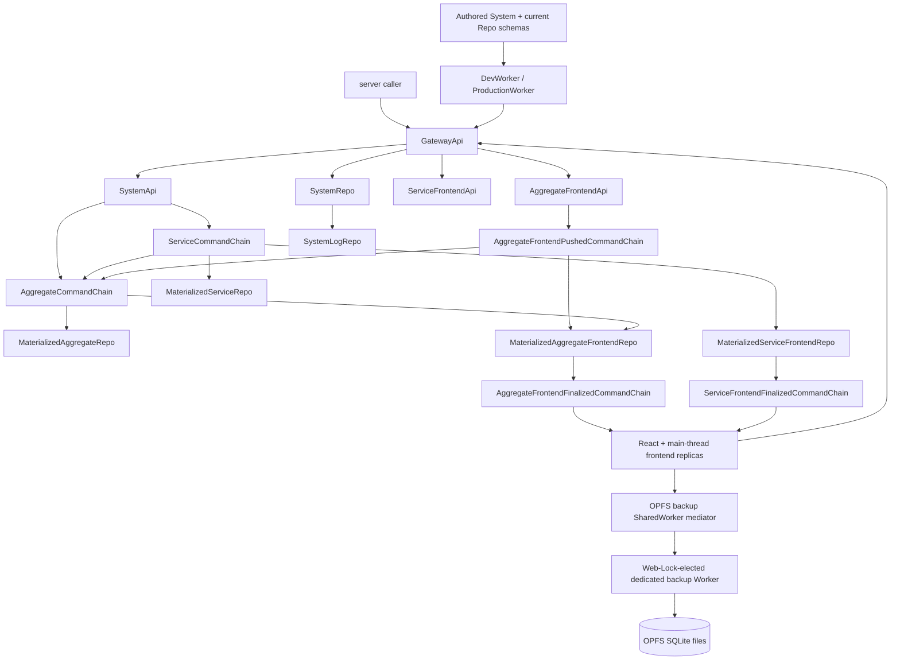

# SystemRepo Durable Architecture

Zerospin runs one static Worker bundle containing the authored System,
GatewayApi, SystemApi, five command chains, four materialized domain Repos,
SystemRepo, and logging. Each command boundary carries one complete encoded
occurrence; command history and materialized state are separate durable owners.

- [`index.ts:1-12`](../packages/system-worker/src/index.ts#L1-L12) — exports the complete static Durable Object topology.
- [`Worker.ts:8-40`](../examples/shopping/src/Worker.ts#L8-L40) — exports those classes from the consumer Worker and separates Gateway RPC from singular WebSocket routes.

## Runtime topology

Gateway exposes SystemApi to secret-key callers and independently acquired
aggregate or service frontend capabilities to publishable-key callers.

- [`GatewayApi.ts:27-74`](../packages/system-worker/src/GatewayApi/GatewayApi.ts#L27-L74) — defines the three root capability getters.
- [`getSystemApi.ts:17-32`](../packages/system-worker/src/GatewayApi/getSystemApi/getSystemApi.ts#L17-L32) — validates the secret key and binds SystemApi to configured `systemId`.

## Durable identity and fixed schemas

Durable Object identity includes `systemId` plus the logical instance fields.
Every instance provisions its current schema once and reopens that same schema
on later cold activations. Authored materializers derive their one fixed
database configuration from the aggregate, service, and frontend names in the
instance identity; there is no separate schema target or history.

| Repo                                   | Durable identity                                                 |
| -------------------------------------- | ---------------------------------------------------------------- |
| AggregateCommandChain                  | `{ systemId, aggregateId, aggregateName }`                       |
| ServiceCommandChain                    | `{ systemId, serviceName }`                                      |
| AggregateFrontendPushedCommandChain    | `{ systemId, aggregateId, aggregateName, userId, frontendName }` |
| AggregateFrontendFinalizedCommandChain | `{ systemId, aggregateId, aggregateName, userId, frontendName }` |
| ServiceFrontendFinalizedCommandChain   | `{ systemId, serviceName, userId, frontendName }`                |
| MaterializedAggregateRepo              | `{ systemId, aggregateId, aggregateName }`                       |
| MaterializedServiceRepo                | `{ systemId, serviceName }`                                      |
| MaterializedAggregateFrontendRepo      | `{ systemId, aggregateId, aggregateName, userId, frontendName }` |
| MaterializedServiceFrontendRepo        | `{ systemId, serviceName, userId, frontendName }`                |
| SystemRepo and SystemLogRepo           | `{ systemId }`                                                   |

- [`types.ts:35-52`](../packages/core/src/system/types.ts#L35-L52) — defines the current Repo kinds and registration shape without schema targets.
- [`AggregateCommandChain.ts:32-47`](../packages/system-worker/src/AggregateCommandChain/AggregateCommandChain.ts#L32-L47) — configures the aggregate chain through `makeFixedDORepoConfig`.
- [`MaterializedAggregateFrontendRepo.ts:48-81`](../packages/system-worker/src/MaterializedAggregateFrontendRepo/MaterializedAggregateFrontendRepo.ts#L48-L81) — derives the frontend materializer's fixed database config from its exact identity.
- [`makeFixedDORepo.ts:69-94`](../packages/system-worker/src/makeFixedDORepo/makeFixedDORepo.ts#L69-L94) — skips provisioning after the durable bootstrap marker is present.

## SystemRepo boundary and command execution

SystemRepo is the singleton keyed by `{ systemId }`. It owns aggregate IDs,
Repo registrations, one-time frontend WebSocket tickets, and WebSocket routing.
It does not choose or proxy materializer code.

- [`SystemRepo.ts:65-119`](../packages/system-worker/src/SystemRepo/SystemRepo.ts#L65-L119) — validates singleton identity and provisions its current schema once.
- [`SystemRepo.ts:185-339`](../packages/system-worker/src/SystemRepo/SystemRepo.ts#L185-L339) — exposes aggregate lookup, one-time tickets, and Repo-catalog operations.
- [`SystemRepoDbConfig.ts:8-89`](../packages/system-worker/src/SystemRepo/SystemRepoDbConfig.ts#L8-L89) — defines only frontend-ticket, aggregate, and Repo-registration tables.

Aggregate, service, and pushed chains admit complete commands independently,
enforce canonical-byte idempotency, execute their lowest pending occurrence,
retain terminal results, and fan out durable tips. For one `systemId`, the
application and physical schemas are immutable after the initial deployment.
The CLI therefore uploads and promotes the static Worker directly, then
health-checks preview and production without any redeployment lock, drain,
fence, reopen, or compatibility path.

- [`finalizeAggregateCommand.ts:64-214`](../packages/system-worker/src/AggregateCommandChain/finalizeAggregateCommand/finalizeAggregateCommand.ts#L64-L214) — performs durable aggregate admission, scheduled execution, and terminal return without consulting SystemRepo.
- [`deployWranglerFn.ts:395-505`](../packages/cli/src/deploy/deployWranglerFn.ts#L395-L505) — promotes the uploaded version and then health-checks preview and production directly.

## Browser convergence and backup

Each selected frontend owns an in-memory wa-sqlite replica, finalized-command
socket, and recovery loop on the page main thread. Aggregate recovery
subscribes from zero before fetching current state, then validates complete
pushed history and the socket replay before reconstructing authoritative,
`pushIndex`, and local `sessionIndex` layers. Service recovery uses the same
socket-before-state boundary without aggregate optimism.

- [`bootstrapAggregateFrontendSession.ts:458-662`](../packages/frontend/src/bootstrapAggregateFrontendSession.ts#L458-L662) — subscribes before state, pulls pushed history, validates replay, and reconstructs the aggregate session.
- [`bootstrapServiceFrontendSession.ts:292-429`](../packages/frontend/src/bootstrapServiceFrontendSession.ts#L292-L429) — performs service socket-first recovery and state installation.

The page owns one narrow connection to an OPFS backup SharedWorker mediator.
The mediator never owns SQLite, authentication, Gateway capabilities, live
sockets, command execution, or replica state. One Web-Lock-elected dedicated
Worker runs synchronous wa-sqlite with `OPFSCoopSyncVFS`, stores per-session
SQLite backup files, and accepts routed full baselines or FIFO committed SQL
from every page in that emitted worker graph.

- [`acquireOpfsBackupWorker.ts:59-78`](../packages/opfs-backup-worker/src/acquireOpfsBackupWorker/acquireOpfsBackupWorker.ts#L59-L78) — derives the graph-qualified router, leader, WASM, and Web Lock identities.
- [`opfsBackupWorker.entry.ts:45-106`](../packages/opfs-backup-worker/src/opfsBackupWorker.entry.ts#L45-L106) — assigns per-client router targets and distinguishes pending from dispatched requests.
- [`opfsBackupLeader.entry.ts:14-37`](../packages/opfs-backup-worker/src/opfsBackupLeader.entry.ts#L14-L37) — initializes the synchronous VFS and leader-local operation turn and claim map.
- [`bootstrapAggregateFrontendSession.ts:771-869`](../packages/frontend/src/bootstrapAggregateFrontendSession.ts#L771-L869) — acknowledges a baseline before publication and repairs only the affected backup from a current snapshot.

See [Authored System](./architecture/AuthoredSystem.md),
[System API](./architecture/SystemApi.md),
[Command Chains](./architecture/CommandChains.md),
[OPFS Backup Coordination](./architecture/browser/OpfsBackupCoordination.md), and the browser/server
workflow pages for method-level paths.
