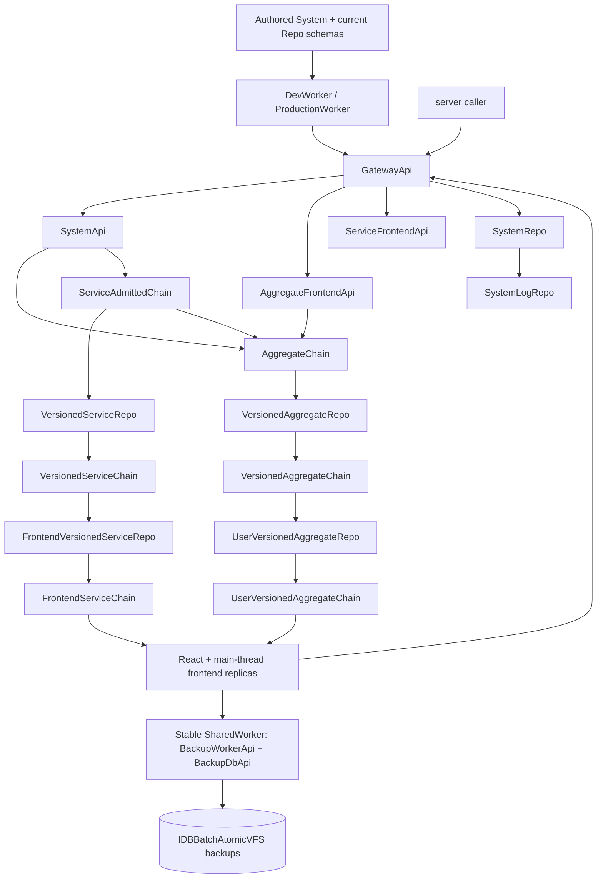

# SystemRepo Durable Architecture

Zerospin runs one static Worker bundle containing the authored System,
GatewayApi, SystemApi, six command chains, four domain Repos,
SystemRepo, and logging. Each command boundary carries one complete encoded
occurrence; command history and resource state are separate durable owners.

- [`index.ts`](../packages/system-worker/src/index.ts) — exports the complete static Durable Object topology.
- [`DevWorker.ts`](../packages/dev-worker/src/DevWorker.ts) — exports those classes from the framework Worker and separates Gateway RPC from singular WebSocket routes.

## Runtime topology

Gateway exposes SystemApi to secret-key callers and independently acquired
aggregate or service frontend capabilities to publishable-key callers.

- [`GatewayApi.ts`](../packages/system-worker/src/GatewayApi/GatewayApi.ts) — defines the three root capability getters.
- [`getSystemApi.ts`](../packages/system-worker/src/GatewayApi/getSystemApi/getSystemApi.ts) — validates the secret key and binds SystemApi to configured `systemId`.

## Durable identity and fixed schemas

Durable Object identity includes `systemId` plus the logical instance fields.
Every instance provisions its current schema once and reopens that same schema
on later cold activations. Authored materializers derive their one fixed
database configuration from the aggregate, service, and frontend names in the
instance identity; there is no separate schema target or history.

| Repo                         | Durable identity                                                                   |
| ---------------------------- | ---------------------------------------------------------------------------------- |
| AggregateChain               | `{ systemId, aggregateId, aggregateName }`                                         |
| ServiceAdmittedChain         | `{ systemId, serviceName }`                                                        |
| VersionedAggregateChain      | `{ systemId, aggregateId, aggregateName, aggregateVersion }`                       |
| UserVersionedAggregateChain  | `{ systemId, aggregateId, aggregateName, aggregateVersion, userId, frontendName }` |
| FrontendServiceChain         | `{ systemId, serviceName, serviceVersion, userId, frontendName }`                  |
| VersionedAggregateRepo       | `{ systemId, aggregateId, aggregateName, aggregateVersion }`                       |
| VersionedServiceRepo         | `{ systemId, serviceName, serviceVersion }`                                        |
| UserVersionedAggregateRepo   | `{ systemId, aggregateId, aggregateName, aggregateVersion, userId, frontendName }` |
| FrontendVersionedServiceRepo | `{ systemId, serviceName, serviceVersion, userId, frontendName }`                  |
| VersionedServiceChain        | `{ systemId, serviceName, serviceVersion }`                                        |
| SystemRepo and SystemLogRepo | `{ systemId }`                                                                     |

- [`types.ts`](../packages/core/src/system/types.ts) — defines the current Repo kinds and registration shape without schema targets.
- [`aggregateChainFixedDORepoConfig.ts`](../packages/system-worker/src/AggregateChain/aggregateChainFixedDORepoConfig.ts) — keeps AggregateChain on the unversioned `{ systemId, aggregateId, aggregateName }` name.
- [`VersionedAggregateRepo.ts`](../packages/system-worker/src/VersionedAggregateRepo/VersionedAggregateRepo.ts) — binds each aggregate implementation to `{ systemId, aggregateId, aggregateName, aggregateVersion }`.
- [`UserVersionedAggregateRepo.ts`](../packages/system-worker/src/UserVersionedAggregateRepo/UserVersionedAggregateRepo.ts) — derives the frontend materializer's fixed database config from its exact identity.
- [`makeFixedDORepo.ts`](../packages/system-worker/src/makeFixedDORepo/makeFixedDORepo.ts) — skips provisioning after the durable bootstrap marker is present.

## SystemRepo boundary and command execution

SystemRepo is the singleton keyed by `{ systemId }`. It owns Repo inspection, one-time frontend
WebSocket tickets, and WebSocket routing. AC reconciles its VAR destinations
from deployed aggregate definitions during activation. Commands and direct RPCs
activate VARs.

- [`SystemRepo.ts`](../packages/system-worker/src/SystemRepo/SystemRepo.ts) — Owns Repo registration, inspection, and singleton ticket routing.
- [`systemRepoDbConfig.ts`](../packages/system-worker/src/SystemRepo/systemRepoDbConfig.ts) — Persists tickets and Repo registrations.
- [`onDOActivation.ts`](../packages/system-worker/src/AggregateChain/onDOActivation/onDOActivation.ts) — Reconciles supported destinations while preserving retained command progress.
- [`onDOActivation.ts`](../packages/system-worker/src/VersionedAggregateRepo/onDOActivation/onDOActivation.ts) — Initializes declared service pins and subscribes during activation; the registered outbox independently resumes publication.

AC admits complete aggregate inputs with exact-byte idempotency. Each VAR
prepares inputs for its own aggregateVersion and commits terminal execution
entries to an outbox; VAC retains those entries. Direct requests and retries
use the current base VAR. Manual cutover compares parallel base/candidate
flushes through one sampled admitted position. Additive authored aggregate versions retain the same systemId and command
history. Existing physical schemas remain immutable; changing one requires
empty storage.
The CLI therefore uploads and promotes the static Worker directly, then
health-checks preview and production without any redeployment lock, drain,
fence, reopen, or compatibility path.

- [`onDOActivation.ts`](../packages/system-worker/src/SystemRepo/onDOActivation/onDOActivation.ts) — Adds current and historical supported aggregate versions without deleting retained catalog rows.
- [`makeFixedDORepo.ts`](../packages/system-worker/src/makeFixedDORepo/makeFixedDORepo.ts) — Provisions fresh storage once and performs no schema migration after bootstrap.
- [`executeAggregateCommand.ts`](../packages/system-worker/src/AggregateChain/executeAggregateCommand/executeAggregateCommand.ts) — admits once and recovers the current base VAR result.
- [`deployWranglerFn.ts`](../packages/cli/src/deploy/deployWranglerFn.ts) — promotes the uploaded version and then health-checks preview and production directly.

## Browser convergence and backup

Each selected frontend owns an in-memory wa-sqlite replica, finalized-output
socket, and recovery loop on the page main thread. Aggregate recovery fetches
a published UVAR snapshot, pins its aggregateVersion in the ticket, and replays
UVAC outputs strictly after the captured frontend cursor. Snapshot resolved
command IDs and per-command originating resolutions reconcile local optimism.
Service recovery captures a published FVSR snapshot, pins its serviceVersion,
and replays FSC strictly after its serviceIndex.

- [`getState.ts`](../packages/system-worker/src/UserVersionedAggregateRepo/getState/getState.ts) — captures state and cursor together and awaits bounded UVAC publication.
- [`bootstrapAggregateFrontendSession.ts`](../packages/frontend/src/bootstrapAggregateFrontendSession.ts) — installs published state, validates contiguous replay, and retains the live socket.
- [`bootstrapServiceFrontendSession.ts`](../packages/frontend/src/bootstrapServiceFrontendSession.ts) — captures the service snapshot before obtaining its version-pinned ticket.

The page shares one connection to `/__zerospin/backup-worker.js`, named
`zerospin-backups`, across its selected frontends. That SharedWorker owns
asynchronous backup SQLite and `IDBBatchAtomicVFS`. Each exact frontend backup
key selects one database independently of the app build and execution session
ID. A takeover revokes the previous database capability before waiting for its
in-flight SQLite operation and returns the committed baseline to the new owner.

- [`backupWorker.entry.ts`](../packages/backup-worker/src/backupWorker.entry.ts) — initializes the package-owned IndexedDB namespace and one semaphore for asynchronous SQLite.
- [`acquireDb.ts`](../packages/backup-worker/src/BackupWorkerApi/acquireDb/acquireDb.ts) — reuses current ownership or revokes the prior target and returns its successor's committed snapshot.
- [`applyStatements.ts`](../packages/backup-worker/src/BackupDbApi/applyStatements/applyStatements.ts) — rechecks ownership inside the SQLite turn and applies each batch atomically.

The mounted page keeps its synchronous live SQLite, session, and store across
ownership changes. Reacquisition restores committed backup contents and renews
execution identity; commands already retained in the journal preserve their
original occurrence bytes. Revocation pauses only the affected frontend.

- [`makeAggregateSession.ts`](../packages/core/src/session/makeAggregateSession.ts) — reads the current execution identity from session state and captures it for synchronous command construction and metadata writes.
- [`makeZerospinApp.tsx`](../packages/react/src/makeZerospinApp.tsx) — shares the page connection and moves DevTools registrations when the retained session's ID changes.
- [`bootstrapAggregateFrontendSession.ts`](../packages/frontend/src/bootstrapAggregateFrontendSession.ts) — owns acquisition, in-place restoration, per-period sockets, pushes, and ordered backup capture.
- [`bootstrapServiceFrontendSession.ts`](../packages/frontend/src/bootstrapServiceFrontendSession.ts) — owns equivalent service acquisition and delivery independently of aggregate frontends.

See [Authored System](./architecture/AuthoredSystem.md),
[System API](./architecture/SystemApi.md),
[Command Chains](./architecture/server/admitCommands.md),
[IndexedDB Backup Coordination](./architecture/browser/IndexedDbBackupCoordination.md), and the browser/server
workflow pages for method-level paths.

The complete service path is described in [Versioned Service Execution and Delivery](./architecture/server/serviceExecution.md).
