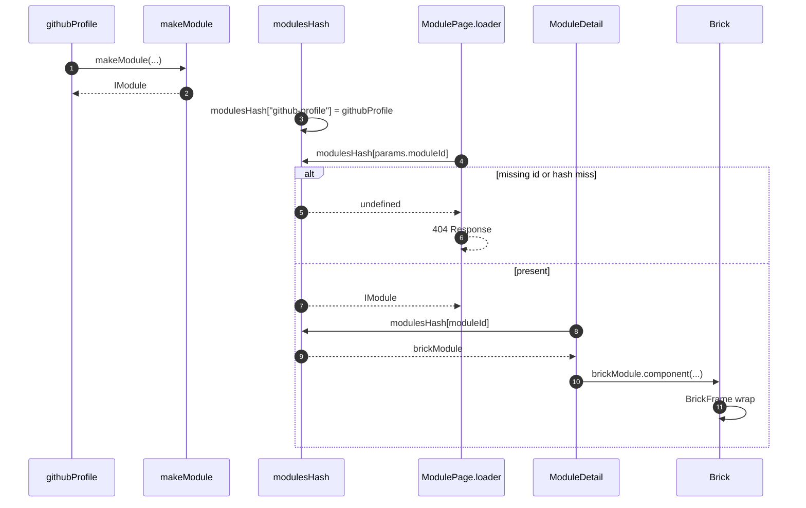

# Brick module identity and lookup

Each assembler calls [`makeModule`](../../apps/library/make/makeModule.tsx). The result is an [`IModule`](../../apps/library/lib/types.ts) keyed in [`modulesHash`](../../apps/library/lib/modulesHash.ts). Routes bind that value as `brickModule`. Preview and drag are [`LibrarySandboxBrickDrop`](./browser/LibrarySandboxBrickDrop.md) and [`SiteEditorBrickDrop`](./browser/SiteEditorBrickDrop.md).

## Trigger

1. The library bundle evaluates each `modules/<camelCase>/` assembler, then [`modulesHash.ts`](../../apps/library/lib/modulesHash.ts).
2. [`@qrk.sh/library`](../../apps/library/lib/index.ts) re-exports `modulesHash` for studio.
3. Workbench navigation hits TanStack file routes under `modules`, `modules/:moduleId`, and `modules/:moduleId/:brickId`.
4. Studio group detail hits [`BrickGroupRoute`](../../apps/studio/app/routes/BrickGroupRoute.tsx) with `groupName`.

## Annotated workflow steps

1. An assembler passes kebab-case `id`, presentations, and data/configuration into the factory.
   - [`githubProfile.ts:8-12`](../../apps/library/modules/githubProfile/githubProfile.ts#L8-L12) — `githubProfile` is `makeModule({ id: "github-profile", ... })`. (`apps/library/modules/githubProfile/githubProfile.ts:8-12`)
2. The factory rejects non-kebab ids, fills omitted breakpoints from the nearest smaller slot, builds serializable `def`, decodes `defaultData` when `dataShape` is set, and returns `id` / `component` (`Brick`).
   - [`makeModule.tsx:59-68`](../../apps/library/make/makeModule.tsx#L59-L68) — kebab-case `id` check and `sm`/`md`/`lg`/`xl` resolution. (`apps/library/make/makeModule.tsx:59-68`)
   - [`makeModule.tsx:96-123`](../../apps/library/make/makeModule.tsx#L96-L123) — null vs shaped return including `def` and `Brick`. (`apps/library/make/makeModule.tsx:96-123`)
3. The hash is a `Record<string, IModule>` keyed by kebab `id`.
   - [`modulesHash.ts:14-26`](../../apps/library/lib/modulesHash.ts#L14-L26) — `"github-profile": githubProfile` and the other assemblers. (`apps/library/lib/modulesHash.ts:14-26`)
   - [`index.ts:1-2`](../../apps/library/lib/index.ts#L1-L2) — package export of `modulesHash` and `IModule`. (`apps/library/lib/index.ts:1-2`)
4. The module parent `beforeLoad` admits only registered `params.moduleId`.
   - [`$moduleId.tsx:5-11`](../../apps/library/app/routes/modules/$moduleId.tsx#L5-L11) — 404 when `params.moduleId` is not in `modulesHash`. (`apps/library/app/routes/modules/$moduleId.tsx:5-11`)
5. A miss on that lookup is `undefined`.
   - [`$moduleId.tsx:7-8`](../../apps/library/app/routes/modules/$moduleId.tsx#L7-L8) — `if (modulesHash[params.moduleId] === undefined)`. (`apps/library/app/routes/modules/$moduleId.tsx:7-8`)
6. The parent throws `notFound()`.
   - [`$moduleId.tsx:8-8`](../../apps/library/app/routes/modules/$moduleId.tsx#L8) — `throw notFound()`. (`apps/library/app/routes/modules/$moduleId.tsx:8`)
7. A hit means the child index route renders.
   - [`$moduleId.tsx:14-16`](../../apps/library/app/routes/modules/$moduleId.tsx#L14-L16) — parent renders `<Outlet />`. (`apps/library/app/routes/modules/$moduleId.tsx:14-16`)
8. The module detail pane looks up the same key as `brickModule`.
   - [`index.tsx:28-34`](../../apps/library/app/routes/modules/$moduleId/index.tsx#L28-L34) — `brickModule = modulesHash[moduleId]`, then pane 404 on miss. (`apps/library/app/routes/modules/$moduleId/index.tsx:28-34`)
   - [`index.tsx:58-110`](../../apps/library/app/routes/modules/$moduleId/index.tsx#L58-L110) — stacked sm/md/lg/xl gallery binds `brickModule.component` with live `moduleData`. (`apps/library/app/routes/modules/$moduleId/index.tsx:58-110`)
   - [`BrickGroupRoute.tsx:20-22`](../../apps/studio/app/routes/BrickGroupRoute.tsx#L20-L22) — studio detail uses `Object.values(modulesHash).find((candidate) => candidate.id === groupName)` as `brickModule`. (`apps/studio/app/routes/BrickGroupRoute.tsx:20-22`)
9. The hash returns that `IModule`.
   - [`index.tsx:30`](../../apps/library/app/routes/modules/$moduleId/index.tsx#L30) — `const brickModule = modulesHash[moduleId]`. (`apps/library/app/routes/modules/$moduleId/index.tsx:30`)
10. Render uses `brickModule.component` as `Brick`.
    - [`index.tsx:42-43`](../../apps/library/app/routes/modules/$moduleId/index.tsx#L42-L43) — `const brick = brickModule` then `BrickComponent = brick.component`. (`apps/library/app/routes/modules/$moduleId/index.tsx:42-43`)
    - [`BrickGroupRoute.tsx:39-41`](../../apps/studio/app/routes/BrickGroupRoute.tsx#L39-L41) — `BrickComponent = brickModule.component` and `def[breakpoint]` size. (`apps/studio/app/routes/BrickGroupRoute.tsx:39-41`)
11. `Brick` selects the breakpoint presentation and wraps it in `BrickFrame`.
    - [`makeModule.tsx:71-85`](../../apps/library/make/makeModule.tsx#L71-L85) — `presentations[breakpoint].component` inside `BrickFrame`. (`apps/library/make/makeModule.tsx:71-85`)
    - [`BrickFrame.tsx:3-8`](../../apps/library/brick/BrickFrame.tsx#L3-L8) — `qrk-bricks` fill wrapper. (`apps/library/brick/BrickFrame.tsx:3-8`)
