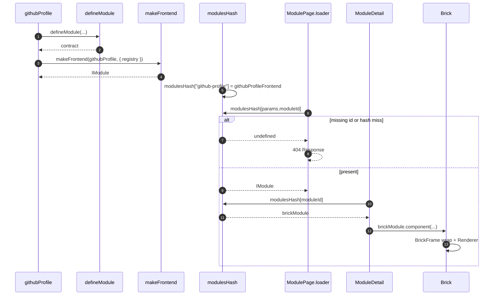

# Brick module identity and lookup

Each assembler calls [`defineModule`](../../apps/library/make/defineModule.ts) for the worker-safe contract and [`makeFrontend`](../../apps/library/make/makeFrontend.tsx) for registry/forms. [`makeBackendLibrary`](../../apps/library/backendLibrary.ts) keys the contracts by id. [`modulesHash`](../../apps/library/lib/modulesHash.ts) is the matching `makeFrontend` map. Routes bind that value as `brickModule`. Preview and drag are [`LibrarySandboxBrickDrop`](./browser/LibrarySandboxBrickDrop.md) and [`SiteEditorBrickDrop`](./browser/SiteEditorBrickDrop.md).

## Trigger

1. The library bundle evaluates each `modules/<camelCase>/` definition, then [`backendLibrary.ts`](../../apps/library/backendLibrary.ts) and [`modulesHash.ts`](../../apps/library/lib/modulesHash.ts).
2. [`@qrk.sh/library`](../../apps/library/lib/index.ts) re-exports `modulesHash` for studio.
3. Workbench navigation hits TanStack file routes under `modules`, `modules/:moduleId`, and `modules/:moduleId/:brickId`.
4. Studio group detail hits [`BrickGroupRoute`](../../apps/studio/app/routes/BrickGroupRoute.tsx) with `groupName`.

## Annotated workflow steps

1. An assembler passes kebab-case `id`, Zerospin `abbreviation`, `label`, and `description` into `defineModule`.
   - [`githubProfile.ts:3-8`](../../apps/library/modules/githubProfile/githubProfile.ts#L3-L8) — `githubProfile` is `defineModule({ id: "github-profile", abbreviation: "ghp", ... })`. (`apps/library/modules/githubProfile/githubProfile.ts:3-8`)
2. The factory rejects non-kebab ids and returns the identity fields including `abbreviation`.
   - [`defineModule.ts:7-21`](../../apps/library/make/defineModule.ts#L7-L21) — kebab-case `id` check and identity return. (`apps/library/make/defineModule.ts:7-21`)
3. `makeFrontend` attaches the registry and stock Renderer brick.
   - [`githubProfileFrontend.tsx:7-11`](../../apps/library/modules/githubProfile/githubProfileFrontend.tsx#L7-L11) — `makeFrontend(githubProfileV1, { registry })`. (`apps/library/modules/githubProfile/githubProfileFrontend.tsx:7-11`)
4. The returned value is an [`IModule`](../../apps/library/lib/types.ts) with `component`.
   - [`types.ts:14-28`](../../apps/library/lib/types.ts#L14-L28) — `IModule` identity including `abbreviation`, catalog, registry. (`apps/library/lib/types.ts:14-28`)
5. The hash is a `Record<string, IModule>` keyed by kebab `id`, checked against the backend map.
   - [`modulesHash.ts:14-25`](../../apps/library/lib/modulesHash.ts#L14-L25) — `"github-profile": githubProfileFrontend` and the other assemblers. (`apps/library/lib/modulesHash.ts:14-25`)
   - [`backendLibrary.ts:13-24`](../../apps/library/backendLibrary.ts#L13-L24) — `defineModule` results keyed by id. (`apps/library/backendLibrary.ts:13-24`)
   - [`index.ts:1-2`](../../apps/library/lib/index.ts#L1-L2) — package export of `modulesHash` and `IModule`. (`apps/library/lib/index.ts:1-2`)
6. The module parent `beforeLoad` admits only registered `params.moduleId`.
   - [`$moduleId.tsx:8-12`](../../apps/library/app/routes/modules/$moduleId.tsx#L8-L12) — 404 when `params.moduleId` is not in `modulesHash`. (`apps/library/app/routes/modules/$moduleId.tsx:8-12`)
7. A miss on that lookup is `undefined`.
   - [`$moduleId.tsx:10-11`](../../apps/library/app/routes/modules/$moduleId.tsx#L10-L11) — `if (modulesHash[params.moduleId] === undefined)`. (`apps/library/app/routes/modules/$moduleId.tsx:10-11`)
8. The parent throws `notFound()`.
   - [`$moduleId.tsx:11-11`](../../apps/library/app/routes/modules/$moduleId.tsx#L11) — `throw notFound()`. (`apps/library/app/routes/modules/$moduleId.tsx:11`)
9. A hit means the child index route renders.
   - [`$moduleId.tsx:14-16`](../../apps/library/app/routes/modules/$moduleId.tsx#L14-L16) — parent renders `<Outlet />`. (`apps/library/app/routes/modules/$moduleId.tsx:14-16`)
10. The module detail pane looks up the same key as `brickModule`.
    - [`index.tsx:193-197`](../../apps/library/app/routes/modules/$moduleId/index.tsx#L193-L197) — `brickModule = modulesHash[moduleId]`, then pane 404 on miss. (`apps/library/app/routes/modules/$moduleId/index.tsx:193-197`)
    - [`BrickGroupRoute.tsx:22-22`](../../apps/studio/app/routes/BrickGroupRoute.tsx#L22) — studio detail uses `Object.values(modulesHash).find((candidate) => candidate.id === groupName)` as `brickModule`. (`apps/studio/app/routes/BrickGroupRoute.tsx:22`)
11. The hash returns that `IModule`.
    - [`index.tsx:194`](../../apps/library/app/routes/modules/$moduleId/index.tsx#L194) — `const brickModule = modulesHash[moduleId]`. (`apps/library/app/routes/modules/$moduleId/index.tsx:194`)
12. Render uses `brickModule.component` as `Brick`.
    - [`index.tsx:207-208`](../../apps/library/app/routes/modules/$moduleId/index.tsx#L207-L208) — `const brick = brickModule` then `BrickComponent = brick.component`. (`apps/library/app/routes/modules/$moduleId/index.tsx:207-208`)
    - [`BrickGroupRoute.tsx:41-43`](../../apps/studio/app/routes/BrickGroupRoute.tsx#L41-L43) — `BrickComponent = brickModule.component` and `def[breakpoint]` size. (`apps/studio/app/routes/BrickGroupRoute.tsx:41-43`)
13. `Brick` selects the breakpoint spec/options and wraps Renderer in `BrickFrame`.
    - [`makeFrontend.tsx:365-384`](../../apps/library/make/makeFrontend.tsx#L365-L384) — resolved breakpoint `defaultSpec` and options decode inside `BrickFrame`. (`apps/library/make/makeFrontend.tsx:365-384`)
    - [`BrickFrame.tsx:3-8`](../../apps/library/components/brick/BrickFrame.tsx#L3-L8) — `qrk-bricks` fill wrapper. (`apps/library/components/brick/BrickFrame.tsx:3-8`)
