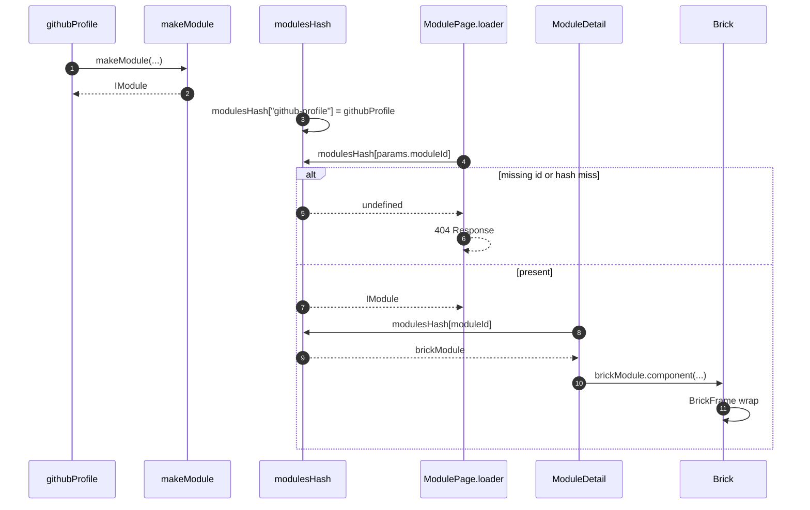

# Brick module identity and lookup

Each assembler calls [`makeModule`](../../apps/library/make/makeModule.tsx). The result is an [`IModule`](../../apps/library/types.ts) keyed in [`modulesHash`](../../apps/library/modulesHash.ts). Routes bind that value as `brickModule`. Preview and drag are [`LibrarySandboxBrickDrop`](./browser/LibrarySandboxBrickDrop.md) and [`SiteEditorBrickDrop`](./browser/SiteEditorBrickDrop.md).

## Trigger

1. The library bundle evaluates each `modules/<camelCase>/` assembler, then [`modulesHash.ts`](../../apps/library/modulesHash.ts).
2. [`@qrk.sh/library`](../../apps/library/index.ts) re-exports `modulesHash` for studio.
3. Workbench navigation hits [`routes.ts`](../../apps/library/app/routes.ts) `modules`, `modules/:moduleId`, `modules/:moduleId/:brickId`, or `bricks/:moduleId`.
4. Studio group detail hits [`BrickGroupRoute`](../../apps/studio/app/routes/BrickGroupRoute.tsx) with `groupName`.

## Annotated workflow steps

1. An assembler passes kebab-case `id`, presentations, and data/configuration into the factory.
   - [`githubProfile.ts:8-12`](../../apps/library/modules/githubProfile/githubProfile.ts#L8-L12) — `githubProfile` is `makeModule({ id: "github-profile", ... })`. (`apps/library/modules/githubProfile/githubProfile.ts:8-12`)
2. The factory rejects non-kebab ids, fills omitted breakpoints from the nearest smaller slot, builds serializable `def`, decodes `defaultData` when `dataShape` is set, and returns `id` / `component` (`Brick`).
   - [`makeModule.tsx:59-68`](../../apps/library/make/makeModule.tsx#L59-L68) — kebab-case `id` check and `sm`/`md`/`lg`/`xl` resolution. (`apps/library/make/makeModule.tsx:59-68`)
   - [`makeModule.tsx:96-123`](../../apps/library/make/makeModule.tsx#L96-L123) — null vs shaped return including `def` and `Brick`. (`apps/library/make/makeModule.tsx:96-123`)
3. The hash is a `Record<string, IModule>` keyed by kebab `id`.
   - [`modulesHash.ts:14-26`](../../apps/library/modulesHash.ts#L14-L26) — `"github-profile": githubProfile` and the other assemblers. (`apps/library/modulesHash.ts:14-26`)
   - [`index.ts:1-2`](../../apps/library/index.ts#L1-L2) — package export of `modulesHash` and `IModule`. (`apps/library/index.ts:1-2`)
4. The module parent loader admits only registered `params.moduleId`.
   - [`routes.ts:21-58`](../../apps/library/app/routes.ts#L21-L58) — `path: "modules"` with nested `:moduleId` lazy `ModulePage` plus nested `ModuleDetail` and `:brickId`. (`apps/library/app/routes.ts:21-58`)
   - [`ModulePage.tsx:10-13`](../../apps/library/app/routes/modules/$moduleId/ModulePage.tsx#L10-L13) — 404 when `params.moduleId` is missing or not in `modulesHash`. (`apps/library/app/routes/modules/$moduleId/ModulePage.tsx:10-13`)
5. A miss on that lookup is `undefined`.
   - [`ModulePage.tsx:12-12`](../../apps/library/app/routes/modules/$moduleId/ModulePage.tsx#L12) — `if (!modulesHash[params.moduleId])`. (`apps/library/app/routes/modules/$moduleId/ModulePage.tsx:12-12`)
6. The loader throws a 404 `Response`.
   - [`ModulePage.tsx:11-12`](../../apps/library/app/routes/modules/$moduleId/ModulePage.tsx#L11-L12) — `throw new Response("Not found", { status: 404 })`. (`apps/library/app/routes/modules/$moduleId/ModulePage.tsx:11-12`)
   - [`BrickPage.tsx:13-16`](../../apps/library/app/routes/bricks/$moduleId/BrickPage.tsx#L13-L16) — the same hash check on `bricks/:moduleId`. (`apps/library/app/routes/bricks/$moduleId/BrickPage.tsx:13-16`)
7. A hit means the loader returns `null` and the child route renders.
   - [`ModulePage.tsx:13-13`](../../apps/library/app/routes/modules/$moduleId/ModulePage.tsx#L13) — `return null` after the hash hit. (`apps/library/app/routes/modules/$moduleId/ModulePage.tsx:13-13`)
8. The module detail pane looks up the same key as `brickModule`.
   - [`ModuleDetail.tsx:31-34`](../../apps/library/app/routes/modules/$moduleId/ModuleDetail.tsx#L31-L34) — 404 without `params.moduleId`, then `brickModule = modulesHash[moduleId]`. (`apps/library/app/routes/modules/$moduleId/ModuleDetail.tsx:31-34`)
   - [`ModuleDetail.tsx:36-38`](../../apps/library/app/routes/modules/$moduleId/ModuleDetail.tsx#L36-L38) — pane 404 when the hash miss still happens after the loader. (`apps/library/app/routes/modules/$moduleId/ModuleDetail.tsx:36-38`)
   - [`BrickPage.tsx:19-23`](../../apps/library/app/routes/bricks/$moduleId/BrickPage.tsx#L19-L23) — standalone preview binds `brickModule = modulesHash[params.moduleId]`. (`apps/library/app/routes/bricks/$moduleId/BrickPage.tsx:19-23`)
   - [`BrickGroupRoute.tsx:20-22`](../../apps/studio/app/routes/BrickGroupRoute.tsx#L20-L22) — studio detail uses `Object.values(modulesHash).find((candidate) => candidate.id === groupName)` as `brickModule`. (`apps/studio/app/routes/BrickGroupRoute.tsx:20-22`)
9. The hash returns that `IModule`.
   - [`ModuleDetail.tsx:34`](../../apps/library/app/routes/modules/$moduleId/ModuleDetail.tsx#L34) — `const brickModule = modulesHash[moduleId]`. (`apps/library/app/routes/modules/$moduleId/ModuleDetail.tsx:34`)
10. Render uses `brickModule.component` as `Brick`.
    - [`ModuleDetail.tsx:41-42`](../../apps/library/app/routes/modules/$moduleId/ModuleDetail.tsx#L41-L42) — `const brick = brickModule` then `BrickComponent = brick.component`. (`apps/library/app/routes/modules/$moduleId/ModuleDetail.tsx:41-42`)
    - [`BrickGroupRoute.tsx:39-41`](../../apps/studio/app/routes/BrickGroupRoute.tsx#L39-L41) — `BrickComponent = brickModule.component` and `def[breakpoint]` size. (`apps/studio/app/routes/BrickGroupRoute.tsx:39-41`)
11. `Brick` selects the breakpoint presentation and wraps it in `BrickFrame`.
    - [`makeModule.tsx:71-85`](../../apps/library/make/makeModule.tsx#L71-L85) — `presentations[breakpoint].component` inside `BrickFrame`. (`apps/library/make/makeModule.tsx:71-85`)
    - [`BrickFrame.tsx:3-8`](../../apps/library/brick/BrickFrame.tsx#L3-L8) — `qrk-bricks` fill wrapper. (`apps/library/brick/BrickFrame.tsx:3-8`)
