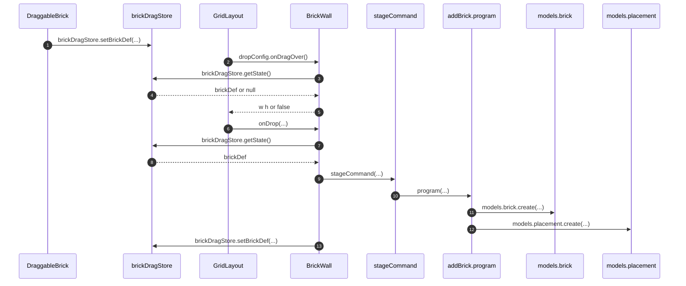

# Library brick drop

Catalog tiles place a brick onto `BrickWall` through an in-memory
`LibraryFrontend` mock session and `addBrick`. HTML5 `dragover` cannot read
custom MIME, so the live payload is the module-level Zustand singleton
`brickDragStore` (`brickDef` / `setBrickDef` only). Placement column shape is
[LibraryGridItem](LibraryGridItem.md).

## Trigger

1. Each app layout owns a mock session for hardcoded `wal_library`, then
   gates children on `isInitialized`.
   1. Library workbench: `createLibraryMockSession({ wallId })` +
      `useInitializeMockSession`, then `LibrarySessionContext`.
   2. Studio site editor: the same pair in `LibraryEditorSession`. Studio's
      live `ZerospinUser` session is unrelated to this wall.
2. A catalog tile starts an HTML5 drag and writes `brickDragStore` before
   RGL sees `dragover`.
   1. Library filmstrip: `DraggableBrick`.
   2. Library module breakpoint preview: `-BreakpointPreviewRow`.
   3. Studio drawer: `BrickGroup` / `BrickGroupRoute`.

## Annotated workflow steps

1. Drag start clones the catalog def into the singleton. Nested `<a>` / ``
   inside `.brick-drag-content` cannot start a native drag.
   - [`DraggableBrick.tsx:21-22`](../../../apps/library/app/DraggableBrick.tsx#L21-L22) — `brickDragStore.getState().setBrickDef(structuredClone(brickDef))`. (`apps/library/app/DraggableBrick.tsx:21-22`)
   - [`-BreakpointPreviewRow.tsx:63-70`](../../../apps/library/app/routes/modules/$moduleId/-BreakpointPreviewRow.tsx#L63-L70) — same store write with measured or declared `w` / `h`. (`apps/library/app/routes/modules/$moduleId/-BreakpointPreviewRow.tsx:63-70`)
   - [`BrickGroup.tsx:75-76`](../../../apps/studio/app/[username]/site/[siteId]/page/[pageId]/BrickGroup/BrickGroup.tsx#L75-L76) — Studio drawer `setBrickDef(structuredClone(brickDefForDrag))`. (`apps/studio/app/[username]/site/[siteId]/page/[pageId]/BrickGroup/BrickGroup.tsx:75-76`)
   - [`BrickGroupRoute.tsx:107`](../../../apps/studio/app/routes/BrickGroupRoute.tsx#L107) — full-view drawer route writes the same singleton. (`apps/studio/app/routes/BrickGroupRoute.tsx:107`)
   - [`bricks.css:78-82`](../../../apps/library/bricks.css#L78-L82) — `[draggable="true"] .brick-drag-content` gets `pointer-events: none` and `-webkit-user-drag: none`. (`apps/library/bricks.css:78-82`)
2. RGL drop targeting calls the wall's `onDragOver`; a React hook snapshot
   closed over at render time is stale.
   - [`BrickWall.tsx:174-184`](../../../apps/library/lib/BrickWall.tsx#L174-L184) — `dropConfig.onDragOver` reads `brickDragStore.getState().brickDef`. (`apps/library/lib/BrickWall.tsx:174-184`)
3. Hover reads the singleton; `dataTransfer` is not consulted.
   - [`BrickWall.tsx:178`](../../../apps/library/lib/BrickWall.tsx#L178) — `brickDragStore.getState().brickDef` inside `onDragOver`. (`apps/library/lib/BrickWall.tsx:178`)
   - [`GridStore.ts:6-15`](../../../apps/library/lib/GridStore.ts#L6-L15) — store holds `brickDef` or `null`; `setBrickDef` replaces that field. (`apps/library/lib/GridStore.ts:6-15`)
4. `getState()` is the live `brickDef` field, not a render-time hook snapshot.
   - [`GridStore.ts:12-14`](../../../apps/library/lib/GridStore.ts#L12-L14) — `setBrickDef` writes `{ brickDef }` that `getState()` returns. (`apps/library/lib/GridStore.ts:12-14`)
5. Missing payload returns `false` (RGL ignores the drag); otherwise the
   placeholder uses catalog `w` / `h`.
   - [`BrickWall.tsx:178-181`](../../../apps/library/lib/BrickWall.tsx#L178-L181) — `if (!brickDef) return false`. (`apps/library/lib/BrickWall.tsx:178-181`)
   - [`BrickWall.tsx:183`](../../../apps/library/lib/BrickWall.tsx#L183) — `return { w: brickDef.w, h: brickDef.h }`. (`apps/library/lib/BrickWall.tsx:183`)
6. Drop delivers `nextLayout` plus the placeholder `item`.
   - [`BrickWall.tsx:186-190`](../../../apps/library/lib/BrickWall.tsx#L186-L190) — `onDrop` returns immediately when `item` or `brickDef` is missing. (`apps/library/lib/BrickWall.tsx:186-190`)
7. `onDrop` re-reads the store; the `onDragOver` value is not reused.
   - [`BrickWall.tsx:187`](../../../apps/library/lib/BrickWall.tsx#L187) — `brickDragStore.getState().brickDef` at drop time. (`apps/library/lib/BrickWall.tsx:187`)
8. Drop uses that `brickDef` for `moduleId`, `state`, `spec`, `w`, and `h`.
   - [`BrickWall.tsx:187`](../../../apps/library/lib/BrickWall.tsx#L187) — same `getState().brickDef` object returned to `onDrop`. (`apps/library/lib/BrickWall.tsx:187`)
9. Unknown `moduleId` reports and returns; otherwise the wall stages `addBrick`
   on the layout-owned mock session.
   - [`BrickWall.tsx:192-198`](../../../apps/library/lib/BrickWall.tsx#L192-L198) — `modulesHash` + `isLibraryModuleId`; else `reportCommandError`. (`apps/library/lib/BrickWall.tsx:192-198`)
   - [`BrickWall.tsx:201-221`](../../../apps/library/lib/BrickWall.tsx#L201-L221) — new `brickId`, `droppedItem`, `resolvedActiveLayout` via `toGridItem`, and `otherBreakpointVisibleLayouts` via `visibleLayoutAt`. (`apps/library/lib/BrickWall.tsx:201-221`)
   - [`BrickWall.tsx:62-64`](../../../apps/library/lib/BrickWall.tsx#L62-L64) — props are `session` + `wallId`. (`apps/library/lib/BrickWall.tsx:62-64`)
   - [`BrickWall.tsx:223-236`](../../../apps/library/lib/BrickWall.tsx#L223-L236) — `stageCommand({ contractName: "addBrick", payload })`. (`apps/library/lib/BrickWall.tsx:223-236`)
   - [`Layout.tsx:31`](../../../apps/library/app/Layout.tsx#L31) — `WALL_ID = prefixId(wall, "library")`. (`apps/library/app/Layout.tsx:31`)
   - [`Layout.tsx:181-193`](../../../apps/library/app/Layout.tsx#L181-L193) — workbench `createLibraryMockSession` + `LibrarySessionContext`. (`apps/library/app/Layout.tsx:181-193`)
   - [`EditorLayout.tsx:26`](../../../apps/studio/app/[username]/site/[siteId]/page/[pageId]/EditorLayout.tsx#L26) — Studio hardcodes the same `wal_library`. (`apps/studio/app/[username]/site/[siteId]/page/[pageId]/EditorLayout.tsx:26`)
   - [`EditorLayout.tsx:47-54`](../../../apps/studio/app/[username]/site/[siteId]/page/[pageId]/EditorLayout.tsx#L47-L54) — `LibraryEditorSession` initializes a separate in-memory db. (`apps/studio/app/[username]/site/[siteId]/page/[pageId]/EditorLayout.tsx:47-54`)
10. `makeMutations` runs the `addBrick` contract program.
    - [`AddBrickContractV1.ts:360-361`](../../../apps/library/makeLibraryFrontend/contracts/addBrick/AddBrickContractV1.ts#L360-L361) — `program: ({ payload, models }) => Effect.gen`. (`apps/library/makeLibraryFrontend/contracts/addBrick/AddBrickContractV1.ts:360-361`)
11. One brick row is created with cloned module state.
    - [`AddBrickContractV1.ts:366-374`](../../../apps/library/makeLibraryFrontend/contracts/addBrick/AddBrickContractV1.ts#L366-L374) — `models.brick.create` with `wallId`, `moduleId`, `state`. (`apps/library/makeLibraryFrontend/contracts/addBrick/AddBrickContractV1.ts:366-374`)
12. Four placements are created (one per breakpoint); writes strip to
    `{ i, x, y, w, h }`.
    - [`AddBrickContractV1.ts:377-407`](../../../apps/library/makeLibraryFrontend/contracts/addBrick/AddBrickContractV1.ts#L377-L407) — active layout from payload; others `resolveVisibleCollisions`; `models.placement.create` with `toStoredGridItem`. (`apps/library/makeLibraryFrontend/contracts/addBrick/AddBrickContractV1.ts:377-407`)
13. Drop clears the singleton even when staging reports a failure.
    - [`BrickWall.tsx:253`](../../../apps/library/lib/BrickWall.tsx#L253) — `brickDragStore.getState().setBrickDef(null)` after the command result. (`apps/library/lib/BrickWall.tsx:253`)
    - [`DraggableBrick.tsx:35-37`](../../../apps/library/app/DraggableBrick.tsx#L35-L37) — `onDragEnd` also clears if the drag never dropped. (`apps/library/app/DraggableBrick.tsx:35-37`)
