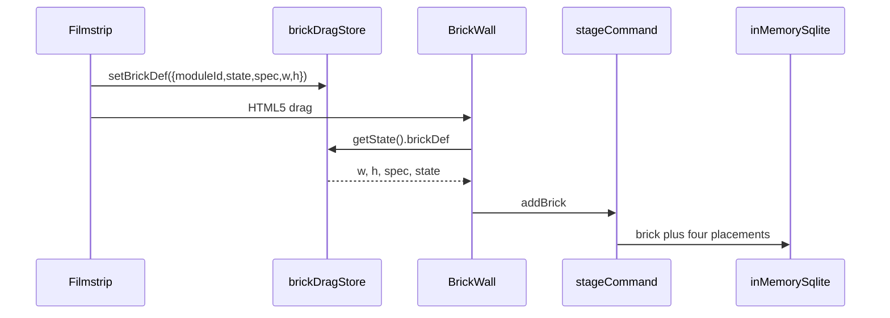

# Library brick drop

**updated:** 2026-09-19

Catalog tiles (library filmstrip, Studio brick drawer) place bricks onto
`BrickWall` through an in-memory `LibraryFrontend` mock session and the
`addBrick` aggregate contract. There is no `LibrarySandboxProvider`; each app
layout owns `createLibraryMockSession({ wallId })` + `useInitializeMockSession`.

## Owners

| Surface | Session owner | Wall id |
| --- | --- | --- |
| Library workbench | [`Layout.tsx`](../../../apps/library/app/Layout.tsx) | `prefixId(wall, "library")` → `wal_library` |
| Studio site editor | [`EditorLayout.tsx`](../../../apps/studio/app/[username]/site/[siteId]/page/[pageId]/EditorLayout.tsx) | same hardcoded `wal_library` (separate in-memory db) |

`LibrarySessionContext` (next to `createLibraryMockSession`, not a `*Provider.tsx`)
passes the session to drawer routes / BrickDetail. Studio keeps live
`ZerospinUser` for the user aggregate; the library mock session is only for the
ephemeral wall.

## Sequence

## Drag payload

HTML5 `dragover` cannot read custom MIME, so the live payload lives in the
module-level Zustand singleton [`brickDragStore`](../../../apps/library/lib/GridStore.ts)
(`brickDef` / `setBrickDef` only). `onDragOver` / `onDrop` must call
`brickDragStore.getState().brickDef` — not a React hook snapshot closed over at
render time.

Nested `<a>` / `` inside `[draggable="true"] .brick-drag-content` are
disabled via `pointer-events: none` and `-webkit-user-drag: none` in
[`bricks.css`](../../../apps/library/bricks.css).

## Wall behavior

[`BrickWall`](../../../apps/library/lib/BrickWall.tsx) requires `session` +
`wallId`. Layout / resize / remove / compact use contracts. Compactor is
`noCompactor`; explicit **Compact layout** runs `compactLayoutAtBreakpoint`.
Placed cells expose `data-brick="{moduleId}"` and `data-brick-id="{brickId}"`.
