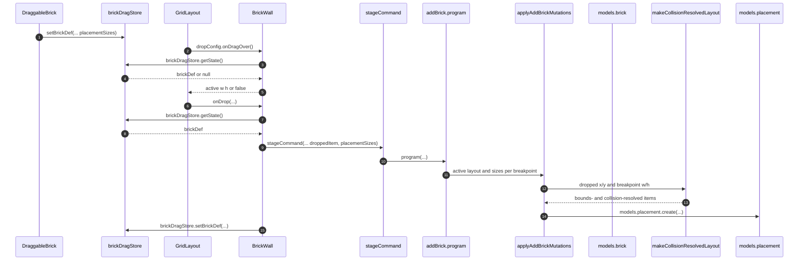

# Library brick drop

Catalog tiles place a brick onto `BrickWall` through a library session (mock in the showcase, persisted standalone in Studio) and `addBrick`. HTML5 `dragover` cannot read
custom MIME, so the live payload is the module-level Zustand singleton
`brickDragStore` (`brickDef` / `setBrickDef` only). Placement column shape is
[LibraryGridItem](LibraryGridItem.md).

## Trigger

1. Each app layout gates children on an initialized session seeded with `wal_library`.
   1. Library workbench: module-level `librarySession` + `useInitializeMockSession`,
      then `LibrarySessionContext`; reset recreates the in-memory fixture.
   2. Studio: `createLibraryStandaloneSession({ key, wallId })` +
      `useInitializeStandaloneSession` in `LibraryEditorSession`. Its document key is
      `JSON.stringify(["studio", user.id, siteId, pageId])`. Studio's live
      `userSession` owns the remote user/site/page data separately.
2. A catalog tile starts an HTML5 drag and writes `brickDragStore` before
   RGL sees `dragover`. Each source first resolves the declared or measured
   default `{ w, h }` for all four breakpoints using its current state and spec.
   Measured widths are limited to the wall's eight columns.
   Dragging remains disabled until every size is available.
   1. Library filmstrip: `DraggableBrick`.
   2. Library module breakpoint preview: `-BreakpointPreviewRow`.
   3. Studio drawer: `BrickGroup` / `BrickGroupRoute`.

## Annotated workflow steps

1. Each source selects declared or measured defaults for all four breakpoints.
   Drag start waits for those sizes and writes `placementSizes` into the singleton.
   Nested `<a>` / `` inside `.brick-drag-content` cannot start a native drag.
   - [`-ModulePreview.tsx:46-69`](../../../apps/library/app/routes/modules/-ModulePreview.tsx#L46-L69) — filmstrip resolves all four sizes. (`apps/library/app/routes/modules/-ModulePreview.tsx:46-69`)
   - [`DraggableBrick.tsx:27-33`](../../../apps/library/app/DraggableBrick.tsx#L27-L33) — disabled until ready, then writes the drag def. (`apps/library/app/DraggableBrick.tsx:27-33`)
   - [`-BreakpointPreviewRow.tsx:73-110`](../../../apps/library/app/routes/modules/$moduleId/-BreakpointPreviewRow.tsx#L73-L110) — module detail resolves four sizes using its current state and specs. (`apps/library/app/routes/modules/$moduleId/-BreakpointPreviewRow.tsx:73-110`)
   - [`BrickGroup.tsx:60-91`](../../../apps/studio/app/[username]/site/[siteId]/page/[pageId]/BrickGroup/BrickGroup.tsx#L60-L91) — Studio drawer resolves all sizes and enables drag. (`apps/studio/app/[username]/site/[siteId]/page/[pageId]/BrickGroup/BrickGroup.tsx:60-91`)
   - [`BrickGroupRoute.tsx:90-120`](../../../apps/studio/app/routes/BrickGroupRoute.tsx#L90-L120) — full-view drawer follows the same rule. (`apps/studio/app/routes/BrickGroupRoute.tsx:90-120`)
   - [`bricks.css:78-82`](../../../apps/library/bricks.css#L78-L82) — `[draggable="true"] .brick-drag-content` gets `pointer-events: none` and `-webkit-user-drag: none`. (`apps/library/bricks.css:78-82`)
2. RGL drop targeting calls the wall's `onDragOver`; a React hook snapshot
   closed over at render time is stale.
   - [`BrickWall.tsx:174-184`](../../../apps/library/lib/BrickWall.tsx#L174-L184) — `dropConfig.onDragOver` reads `brickDragStore.getState().brickDef`. (`apps/library/lib/BrickWall.tsx:174-184`)
3. Hover reads the singleton; `dataTransfer` is not consulted.
   - [`BrickWall.tsx:178`](../../../apps/library/lib/BrickWall.tsx#L178) — `brickDragStore.getState().brickDef` inside `onDragOver`. (`apps/library/lib/BrickWall.tsx:178`)
   - [`GridStore.ts:6-15`](../../../apps/library/lib/GridStore.ts#L6-L15) — store holds `brickDef` or `null`; `setBrickDef` replaces that field. (`apps/library/lib/GridStore.ts:6-15`)
4. `getState()` is the live `brickDef` field, not a render-time hook snapshot.
   - [`GridStore.ts:12-14`](../../../apps/library/lib/GridStore.ts#L12-L14) — `setBrickDef` writes `{ brickDef }` that `getState()` returns. (`apps/library/lib/GridStore.ts:12-14`)
5. Missing payload returns `false` (RGL ignores the drag); otherwise the
   placeholder uses catalog `w` / `h`.
   - [`BrickWall.tsx:178-181`](../../../apps/library/lib/BrickWall.tsx#L178-L181) — `if (!brickDef) return false`. (`apps/library/lib/BrickWall.tsx:178-181`)
   - [`BrickWall.tsx:183`](../../../apps/library/lib/BrickWall.tsx#L183) — `return { w: brickDef.w, h: brickDef.h }`. (`apps/library/lib/BrickWall.tsx:183`)
6. Drop delivers `nextLayout` plus the placeholder `item`.
   - [`BrickWall.tsx:186-190`](../../../apps/library/lib/BrickWall.tsx#L186-L190) — `onDrop` returns immediately when `item` or `brickDef` is missing. (`apps/library/lib/BrickWall.tsx:186-190`)
7. `onDrop` re-reads the store; the `onDragOver` value is not reused.
   - [`BrickWall.tsx:187`](../../../apps/library/lib/BrickWall.tsx#L187) — `brickDragStore.getState().brickDef` at drop time. (`apps/library/lib/BrickWall.tsx:187`)
8. Drop uses that `brickDef` for `moduleId`, `state`, `spec`, active `w` / `h`, and four `placementSizes`.
   - [`BrickWall.tsx:187`](../../../apps/library/lib/BrickWall.tsx#L187) — same `getState().brickDef` object returned to `onDrop`. (`apps/library/lib/BrickWall.tsx:187`)
9. Unknown `moduleId` reports and returns; otherwise the wall stages `addBrick`
   on the layout-owned standalone session.
   - [`BrickWall.tsx:192-198`](../../../apps/library/lib/BrickWall.tsx#L192-L198) — `modulesHash` + `isLibraryModuleId`; else `reportCommandError`. (`apps/library/lib/BrickWall.tsx:192-198`)
   - [`BrickWall.tsx:200-220`](../../../apps/library/lib/BrickWall.tsx#L200-L220) — new `brickId`, `droppedItem` with starting X/Y, resolved active layout, and other visible layouts. (`apps/library/lib/BrickWall.tsx:200-220`)
   - [`BrickWall.tsx:62-64`](../../../apps/library/lib/BrickWall.tsx#L62-L64) — props are `session` + `wallId`. (`apps/library/lib/BrickWall.tsx:62-64`)
   - [`BrickWall.tsx:222-236`](../../../apps/library/lib/BrickWall.tsx#L222-L236) — `stageCommand({ contractName: "addBrick", payload })` includes `placementSizes`. (`apps/library/lib/BrickWall.tsx:222-236`)
   - [`Layout.tsx:31`](../../../apps/library/app/Layout.tsx#L31) — `WALL_ID = prefixId(wall, "library")`. (`apps/library/app/Layout.tsx:31`)
   - [`Layout.tsx:181-193`](../../../apps/library/app/Layout.tsx#L181-L193) — workbench `createLibraryStandaloneSession` + `LibrarySessionContext`. (`apps/library/app/Layout.tsx:181-193`)
   - [`EditorLayout.tsx:26`](../../../apps/studio/app/[username]/site/[siteId]/page/[pageId]/EditorLayout.tsx#L26) — Studio hardcodes the same `wal_library`. (`apps/studio/app/[username]/site/[siteId]/page/[pageId]/EditorLayout.tsx:26`)
   - [`EditorLayout.tsx:47-54`](../../../apps/studio/app/[username]/site/[siteId]/page/[pageId]/EditorLayout.tsx:47-54) — `LibraryEditorSession` initializes a separately keyed durable document. (`apps/studio/app/[username]/site/[siteId]/page/[pageId]/EditorLayout.tsx:47-54`)
10. `addBrick` version `1.1.0` calls the local mutation program. The upgrade
    adapter maps historical `1.0.0` commands to their original dropped size at
    every breakpoint.
    - [`AddBrickContractV1.ts:430-470`](../../../apps/library/libraryModule/contracts/addBrick/AddBrickContractV1.ts#L430-L470) — both version programs and historical adapter. (`apps/library/libraryModule/contracts/addBrick/AddBrickContractV1.ts:430-470`)
11. The local mutation program creates one brick row with cloned module state.
    - [`AddBrickContractV1.ts:100-114`](../../../apps/library/libraryModule/contracts/addBrick/AddBrickContractV1.ts#L100-L114) — `models.brick.create` with `wallId`, `moduleId`, `state`. (`apps/library/libraryModule/contracts/addBrick/AddBrickContractV1.ts:100-114`)
12. Other breakpoints start with the dropped numeric X/Y and their own default
    size, then resolve bounds and collisions. The active breakpoint keeps the
    UI-supplied layout, which the guard has already validated.
    - [`AddBrickContractV1.ts:116-128`](../../../apps/library/libraryModule/contracts/addBrick/AddBrickContractV1.ts#L116-L128) — active layout from payload; other layouts use breakpoint width and height. (`apps/library/libraryModule/contracts/addBrick/AddBrickContractV1.ts:116-128`)
    - [`resolveVisibleCollisions.ts:21-50`](../../../apps/library/libraryModule/resolveVisibleCollisions.ts#L21-L50) — clones inputs, corrects bounds, and displaces collisions. (`apps/library/libraryModule/resolveVisibleCollisions.ts:21-50`)
13. The constructor returns fresh five-field objects for other-breakpoint layouts.
    - [`resolveVisibleCollisions.ts:52`](../../../apps/library/libraryModule/resolveVisibleCollisions.ts#L52) — maps the completed working layout into fresh five-field objects. (`apps/library/libraryModule/resolveVisibleCollisions.ts:52`)
14. Four placements are created (one per breakpoint) using five-field items
    directly.
    - [`AddBrickContractV1.ts:130-146`](../../../apps/library/libraryModule/contracts/addBrick/AddBrickContractV1.ts#L130-L146) — `models.placement.create` with `gridItem: item`. (`apps/library/libraryModule/contracts/addBrick/AddBrickContractV1.ts:130-146`)
15. Drop clears the singleton even when staging reports a failure.
    - [`BrickWall.tsx:248`](../../../apps/library/lib/BrickWall.tsx#L248) — `brickDragStore.getState().setBrickDef(null)` after the command result. (`apps/library/lib/BrickWall.tsx:248`)
    - [`DraggableBrick.tsx:46-48`](../../../apps/library/app/DraggableBrick.tsx#L46-L48) — `onDragEnd` also clears if the drag never dropped. (`apps/library/app/DraggableBrick.tsx:46-48`)
