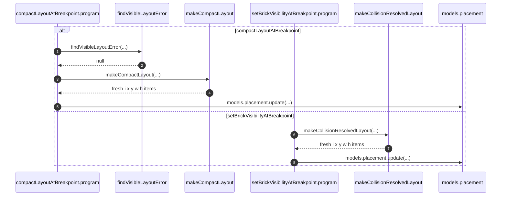
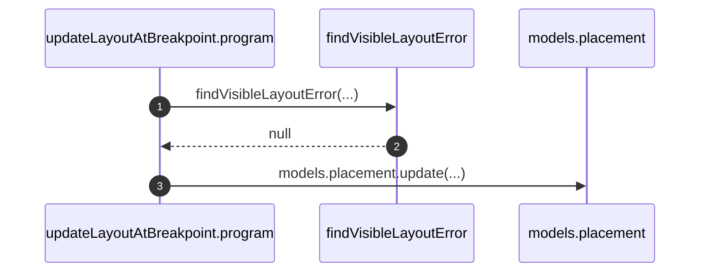

# Library placement gridItem

`placement.gridItem` is JSON `{ i, x, y, w, h }`. Session live queries decode
these values before rendering. RGL working objects may include additional fields;
`makeGridItem`, `makeCollisionResolvedLayout`, and `makeCompactLayout` return only
the five persisted geometry fields. See [LibraryBrickDrop](LibraryBrickDrop.md)
for the full drag lifecycle and fresh contract baseline.

## Trigger

1. `BrickWall.visibleLayoutAt` filters decoded session placements by wall,
   visibility, and breakpoint, then picks the five fields for rendering and
   `addBrick.visibleLayouts` snapshots.
2. `addBrick.program` resolves all four layouts from `dropPosition`,
   `placementSizes`, and validated snapshots before creating placements.
3. Show and compact commands use the existing layout constructors; drag/resize
   commands retain their existing layout payload interface.

```mermaid
sequenceDiagram
  participant BrickWall
  participant guard as addBrick.guard
  participant program as addBrick.program
  participant makeCollisionResolvedLayout
  participant findVisibleLayoutError
  participant placementModel as models.placement
  autonumber
  BrickWall->>guard: dropPosition, placementSizes, visibleLayouts
  guard->>guard: compare snapshots with stored visible geometry
  program->>makeCollisionResolvedLayout: incoming brick plus visible snapshot, for each breakpoint
  makeCollisionResolvedLayout-->>program: fresh i x y w h items
  program->>findVisibleLayoutError: validate all four resolved outputs
  program->>placementModel: create incoming placements; update displaced neighbors
```

## Annotated workflow steps

1. The caller picks decoded visible placements from the session. It ignores the grid's proposed neighbor positions.
   - [`BrickWall.tsx:102-117`](../../../apps/library/lib/BrickWall.tsx#L102-L117) — filters and picks stored geometry. (`apps/library/lib/BrickWall.tsx:102-117`)
2. The guard requires exact membership and geometry, independent of array order; stale snapshots fail with conflict 409.
   - [`AddBrickContractV1.ts:192-225`](../../../apps/library/libraryModule/contracts/addBrick/AddBrickContractV1.ts#L192-L225) — compares every stored item against the snapshot. (`apps/library/libraryModule/contracts/addBrick/AddBrickContractV1.ts:192-225`)
3. The program uses the same drop coordinates with each breakpoint's own measured or declared size.
   - [`AddBrickContractV1.ts:249-258`](../../../apps/library/libraryModule/contracts/addBrick/AddBrickContractV1.ts#L249-L258) — constructs four incoming items. (`apps/library/libraryModule/contracts/addBrick/AddBrickContractV1.ts:249-258`)
4. The resolver corrects eight-column bounds and settles downward cascades without compacting gaps. It returns fresh five-field objects.
   - [`resolveVisibleCollisions.ts:20-43`](../../../apps/library/libraryModule/resolveVisibleCollisions.ts#L20-L43) — clones inputs and projects geometry. (`apps/library/libraryModule/resolveVisibleCollisions.ts:20-43`)
5. The program validates every resolved layout before constructing mutations.
   - [`AddBrickContractV1.ts:259-271`](../../../apps/library/libraryModule/contracts/addBrick/AddBrickContractV1.ts#L259-L271) — checks all four outputs. (`apps/library/libraryModule/contracts/addBrick/AddBrickContractV1.ts:259-271`)
6. New placements receive the resolved items directly. Only displaced visible neighbors are updated; hidden placements stay untouched.
   - [`AddBrickContractV1.ts:288-330`](../../../apps/library/libraryModule/contracts/addBrick/AddBrickContractV1.ts#L288-L330) — skips unchanged neighbors. (`apps/library/libraryModule/contracts/addBrick/AddBrickContractV1.ts:288-330`)



## Annotated workflow steps

1. Compact validate rejects an overlapping or out-of-bounds visible layout.
   - [`CompactLayoutAtBreakpointContractV1.ts:142-152`](../../../apps/library/libraryModule/contracts/compactLayoutAtBreakpoint/CompactLayoutAtBreakpointContractV1.ts#L142-L152) — `findVisibleLayoutError` on `payload.visibleLayout`. (`apps/library/libraryModule/contracts/compactLayoutAtBreakpoint/CompactLayoutAtBreakpointContractV1.ts:142-152`)
2. Validate returns `null` when the visible layout is clear.
   - [`CompactLayoutAtBreakpointContractV1.ts:146-152`](../../../apps/library/libraryModule/contracts/compactLayoutAtBreakpoint/CompactLayoutAtBreakpointContractV1.ts#L146-L152) — non-null message becomes `compact-layout-invalid`. (`apps/library/libraryModule/contracts/compactLayoutAtBreakpoint/CompactLayoutAtBreakpointContractV1.ts:146-152`)
3. Compact runs RGL's vertical compactor on a cloned layout.
   - [`CompactLayoutAtBreakpointContractV1.ts:156`](../../../apps/library/libraryModule/contracts/compactLayoutAtBreakpoint/CompactLayoutAtBreakpointContractV1.ts#L156) — `makeCompactLayout(payload.visibleLayout)`. (`apps/library/libraryModule/contracts/compactLayoutAtBreakpoint/CompactLayoutAtBreakpointContractV1.ts:156`)
   - [`resolveVisibleCollisions.ts:76`](../../../apps/library/libraryModule/resolveVisibleCollisions.ts#L76) — `verticalCompactor.compact(cloneLayout(layout), GRID_COLS)`. (`apps/library/libraryModule/resolveVisibleCollisions.ts:76`)
4. The constructor returns fresh five-field objects in compacted order.
   - [`resolveVisibleCollisions.ts:77`](../../../apps/library/libraryModule/resolveVisibleCollisions.ts#L77) — projects each compacted item; an empty result maps to a fresh empty array. (`apps/library/libraryModule/resolveVisibleCollisions.ts:77`)
5. Compact writes each constructed item directly.
   - [`CompactLayoutAtBreakpointContractV1.ts:158-170`](../../../apps/library/libraryModule/contracts/compactLayoutAtBreakpoint/CompactLayoutAtBreakpointContractV1.ts#L158-L170) — `gridItem: item` on each visible placement. (`apps/library/libraryModule/contracts/compactLayoutAtBreakpoint/CompactLayoutAtBreakpointContractV1.ts:158-170`)
6. Showing a hidden brick resolves collisions the same way `addBrick` does
   at every breakpoint.
   - [`SetBrickVisibilityAtBreakpointContractV1.ts:241-244`](../../../apps/library/libraryModule/contracts/setBrickVisibilityAtBreakpoint/SetBrickVisibilityAtBreakpointContractV1.ts#L241-L244) — `incoming: cloneLayoutItem(payload.savedGridItem)`. (`apps/library/libraryModule/contracts/setBrickVisibilityAtBreakpoint/SetBrickVisibilityAtBreakpointContractV1.ts:241-244`)
   - [`SetBrickVisibilityAtBreakpointContractV1.ts:204-217`](../../../apps/library/libraryModule/contracts/setBrickVisibilityAtBreakpoint/SetBrickVisibilityAtBreakpointContractV1.ts#L204-L217) — validate also constructs then `findVisibleLayoutError` on the resolved layout. (`apps/library/libraryModule/contracts/setBrickVisibilityAtBreakpoint/SetBrickVisibilityAtBreakpointContractV1.ts:204-217`)
7. The constructor returns five-field geometry for the shown brick and its
   visible neighbors.
   - [`resolveVisibleCollisions.ts:43`](../../../apps/library/libraryModule/resolveVisibleCollisions.ts#L43) — projects all resolved items before returning. (`apps/library/libraryModule/resolveVisibleCollisions.ts:43`)
8. Visibility writes each constructed item directly.
   - [`SetBrickVisibilityAtBreakpointContractV1.ts:247-278`](../../../apps/library/libraryModule/contracts/setBrickVisibilityAtBreakpoint/SetBrickVisibilityAtBreakpointContractV1.ts#L247-L278) — show-path updates use `gridItem: item`; the shown brick also becomes visible. (`apps/library/libraryModule/contracts/setBrickVisibilityAtBreakpoint/SetBrickVisibilityAtBreakpointContractV1.ts:247-278`)



## Annotated workflow steps

1. Update validate rejects an overlapping or out-of-bounds drag/resize layout.
   - [`UpdateLayoutAtBreakpointContractV1.ts:139-149`](../../../apps/library/libraryModule/contracts/updateLayoutAtBreakpoint/UpdateLayoutAtBreakpointContractV1.ts#L139-L149) — `findVisibleLayoutError` on `payload.layout`. (`apps/library/libraryModule/contracts/updateLayoutAtBreakpoint/UpdateLayoutAtBreakpointContractV1.ts:139-149`)
2. Validate returns `null` when the payload layout is clear.
   - [`UpdateLayoutAtBreakpointContractV1.ts:143-149`](../../../apps/library/libraryModule/contracts/updateLayoutAtBreakpoint/UpdateLayoutAtBreakpointContractV1.ts#L143-L149) — non-null message becomes `update-layout-invalid`. (`apps/library/libraryModule/contracts/updateLayoutAtBreakpoint/UpdateLayoutAtBreakpointContractV1.ts:143-149`)
3. Program writes each already-picked payload item with a clone; it does not call
   the layout constructors.
   - [`UpdateLayoutAtBreakpointContractV1.ts:154-168`](../../../apps/library/libraryModule/contracts/updateLayoutAtBreakpoint/UpdateLayoutAtBreakpointContractV1.ts#L154-L168) — `gridItem: structuredClone(item)` on each layout entry. (`apps/library/libraryModule/contracts/updateLayoutAtBreakpoint/UpdateLayoutAtBreakpointContractV1.ts:154-168`)

## Callers

| Direction                                | Symbol                        | Owner                                                                                                                                                    |
| ---------------------------------------- | ----------------------------- | -------------------------------------------------------------------------------------------------------------------------------------------------------- |
| column → five fields                     | `decodeGridItem`              | [`lib/decodeGridItem.ts`](../../../apps/library/lib/decodeGridItem.ts); re-export [`app/decodeGridItem.ts`](../../../apps/library/app/decodeGridItem.ts) |
| RGL item → five fields (UI payload)      | `makeGridItem`                | local in [`BrickWall.tsx`](../../../apps/library/lib/BrickWall.tsx)                                                                                      |
| collision resolution → five-field layout | `makeCollisionResolvedLayout` | [`resolveVisibleCollisions.ts`](../../../apps/library/libraryModule/resolveVisibleCollisions.ts)                                                         |
| compaction → five-field layout           | `makeCompactLayout`           | [`resolveVisibleCollisions.ts`](../../../apps/library/libraryModule/resolveVisibleCollisions.ts)                                                         |
| visible layout → error or null           | `findVisibleLayoutError`      | [`resolveVisibleCollisions.ts`](../../../apps/library/libraryModule/resolveVisibleCollisions.ts)                                                         |

`updateLayoutAtBreakpoint` payload items are already `makeGridItem`'d by
BrickWall. Add, compact, and show persist constructor items directly.
`updateLayoutAtBreakpoint` still clones its already-picked payload items and
does not call the layout constructors.

## Model validation and encoding

Create validates attributes strictly but keeps the original input; update does
not perform the same validation. Row encoding uses the model schema with default
excess-property handling, while JSON mutation-operation encoding uses
`Schema.Unknown`. Cleaning constructor outputs makes mutation attributes clean
before either encoding path; this change does not alter Zerospin policy.

- [`makeModelMutations.ts:20-40`](../../../vendor/zerospin/packages/core/src/contracts/makeModelMutations.ts#L20-L40) — create rejects extras, discards the decoded value, and returns original attributes. (`vendor/zerospin/packages/core/src/contracts/makeModelMutations.ts:20-40`)
- [`makeModelMutations.ts:44-67`](../../../vendor/zerospin/packages/core/src/contracts/makeModelMutations.ts#L44-L67) — update retains supplied attributes, optionally filtered by a mask. (`vendor/zerospin/packages/core/src/contracts/makeModelMutations.ts:44-67`)
- [`applyMutationTx.ts:85-87`](../../../vendor/zerospin/packages/core/src/contracts/applyMutationTx.ts#L76-L87) — create encodes attributes through the model schema with default options. (`vendor/zerospin/packages/core/src/contracts/applyMutationTx.ts:85-87`)
- [`applyMutationTx.ts:164-168`](../../../vendor/zerospin/packages/core/src/contracts/applyMutationTx.ts#L164-L168) — update encodes attributes through the optional model fields. (`vendor/zerospin/packages/core/src/contracts/applyMutationTx.ts:164-168`)
- [`encodeAppliedMutation.ts:105-107`](../../../vendor/zerospin/packages/core/src/contracts/encodeAppliedMutation.ts#L105-L107) — JSON operation attributes use `Schema.fromJsonString(Schema.Unknown)`, retaining extras if supplied. (`vendor/zerospin/packages/core/src/contracts/encodeAppliedMutation.ts:105-107`)
