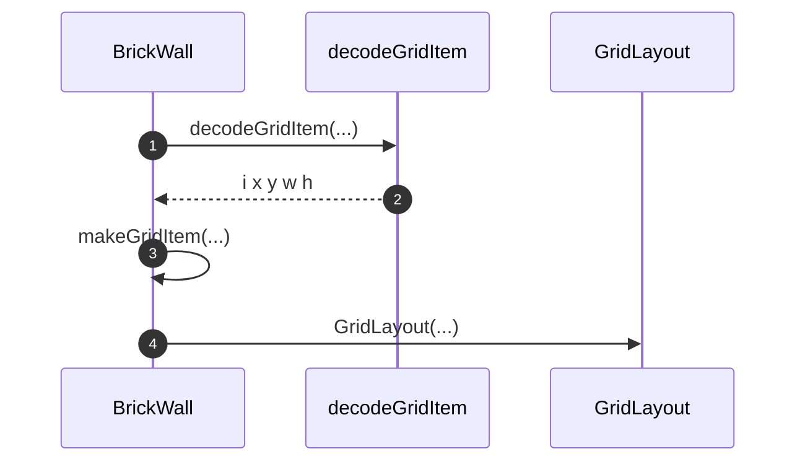
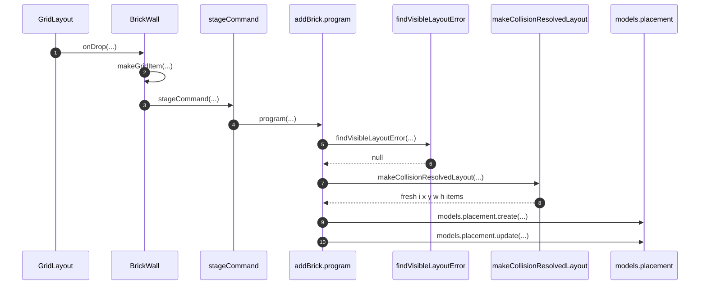
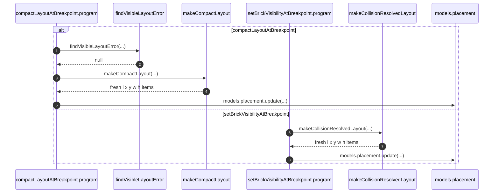
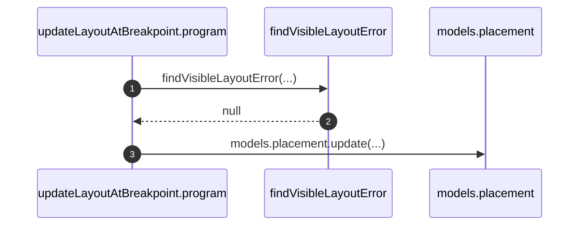

# Library placement gridItem

`placement.gridItem` is JSON `{ i, x, y, w, h }`. react-grid-layout
`cloneLayoutItem` / `cloneLayout` add `minW` and other working properties.
[`decodeGridItem`](../../../apps/library/lib/decodeGridItem.ts) decodes the column.
[`makeCollisionResolvedLayout` and `makeCompactLayout`](../../../apps/library/makeLibraryFrontend/resolveVisibleCollisions.ts)
return fresh arrays of fresh five-field objects synchronously, without mutating
inputs. Contract writers use these items directly. Brick drop ownership is
[LibraryBrickDrop](LibraryBrickDrop.md).

## Trigger

1. Render and command-payload assembly decode `placement.gridItem` with
   `decodeGridItem`.
   1. [`BrickWall`](../../../apps/library/lib/BrickWall.tsx) builds the RGL
      `layout` and `otherBreakpointVisibleLayouts`.
   2. [`Layout.tsx`](../../../apps/library/app/Layout.tsx) builds
      `compactLayoutAtBreakpoint.visibleLayout`.
   3. [`$brickId.tsx`](../../../apps/library/app/routes/bricks/$brickId.tsx)
      builds `savedGridItem` and `otherVisibleLayout`.
2. Contract programs write `gridItem` on placement create/update.
   1. `addBrick` uses the active-breakpoint payload directly and
      `makeCollisionResolvedLayout` for other breakpoints.
   2. `setBrickVisibilityAtBreakpoint` uses `makeCollisionResolvedLayout` when
      showing a brick; `compactLayoutAtBreakpoint` uses `makeCompactLayout`.
   3. `updateLayoutAtBreakpoint` still clones its already-picked payload items.

## Annotated workflow steps

1. `visibleLayoutAt` decodes each visible placement column before the item
   reaches RGL or another command payload.
   - [`BrickWall.tsx:100-111`](../../../apps/library/lib/BrickWall.tsx#L100-L111) — `decodeGridItem(placement.gridItem)` for the current and other breakpoints. (`apps/library/lib/BrickWall.tsx:100-111`)
   - [`decodeGridItem.ts:11-15`](../../../apps/library/lib/decodeGridItem.ts#L11-L15) — JSON-parse a string column, then `Schema.decodeUnknownSync` of `{ i, x, y, w, h }`. (`apps/library/lib/decodeGridItem.ts:11-15`)
   - [`Layout.tsx:316-326`](../../../apps/library/app/Layout.tsx#L316-L326) — compact payload uses `decodeGridItem` without a second pick. (`apps/library/app/Layout.tsx:316-326`)
   - [`$brickId.tsx:112`](../../../apps/library/app/routes/bricks/$brickId.tsx#L112) — visibility payload `savedGridItem`. (`apps/library/app/routes/bricks/$brickId.tsx:112`)
   - [`$brickId.tsx:217-226`](../../../apps/library/app/routes/bricks/$brickId.tsx#L217-L226) — visibility payload `otherVisibleLayout`. (`apps/library/app/routes/bricks/$brickId.tsx:217-226`)
2. Decode output is the five stored fields; default Schema decoding strips
   extra properties while validating the declared fields.
   - [`decodeGridItem.ts:3-9`](../../../apps/library/lib/decodeGridItem.ts#L3-L9) — `GridItemSchema` matches the placement column schema. (`apps/library/lib/decodeGridItem.ts:3-9`)
   - [`placementModelV1.ts:8-14`](../../../apps/library/makeLibraryFrontend/models/placement/placementModelV1.ts#L8-L14) — stored `gridItem` schema is the same five fields. (`apps/library/makeLibraryFrontend/models/placement/placementModelV1.ts:8-14`)
   - [`placementModelV1.ts:36`](../../../apps/library/makeLibraryFrontend/models/placement/placementModelV1.ts#L36) — `primitives.json({ schema: gridItemSchema })` declares the column's object schema. (`apps/library/makeLibraryFrontend/models/placement/placementModelV1.ts:36`)
3. BrickWall picks the same five fields again so RGL `isDraggable` /
   `isResizable` spreads do not leak into command payloads.
   - [`BrickWall.tsx:15-23`](../../../apps/library/lib/BrickWall.tsx#L15-L23) — local `makeGridItem` returns `{ i, x, y, w, h }`. (`apps/library/lib/BrickWall.tsx:15-23`)
   - [`BrickWall.tsx:140-144`](../../../apps/library/lib/BrickWall.tsx#L140-L144) — render layout remaps `makeGridItem` results with drag/resize flags. (`apps/library/lib/BrickWall.tsx:140-144`)
   - [`BrickWall.tsx:167`](../../../apps/library/lib/BrickWall.tsx#L167) — resize payload `layout: nextLayout.map(makeGridItem)`. (`apps/library/lib/BrickWall.tsx:167`)
   - [`BrickWall.tsx:210-214`](../../../apps/library/lib/BrickWall.tsx#L210-L214) — drop payload strips neighbor RGL extras. (`apps/library/lib/BrickWall.tsx:210-214`)
   - [`BrickWall.tsx:319`](../../../apps/library/lib/BrickWall.tsx#L319) — drag-stop payload uses the same pick. (`apps/library/lib/BrickWall.tsx:319`)
4. RGL receives the picked items and later returns `LayoutItem`s that include
   library extras (`minW`, static flags).
   - [`BrickWall.tsx:137-154`](../../../apps/library/lib/BrickWall.tsx#L137-L154) — `GridLayout` with `noCompactor` and the decoded layout. (`apps/library/lib/BrickWall.tsx:137-154`)

## Annotated workflow steps

1. Drop supplies the placeholder item plus `nextLayout` from RGL.
   - [`BrickWall.tsx:186-209`](../../../apps/library/lib/BrickWall.tsx#L186-L209) — `droppedItem` is built from `item.x/y/w/h` and the new `brickId`. (`apps/library/lib/BrickWall.tsx:186-209`)
2. Neighbors in `resolvedActiveLayout` are picked before `stageCommand`; other
   breakpoint layouts come from `visibleLayoutAt` (already decoded).
   - [`BrickWall.tsx:210-221`](../../../apps/library/lib/BrickWall.tsx#L210-L221) — `makeGridItem` on `nextLayout` neighbors; `visibleLayoutAt` for `sm`/`md`/`lg`/`xl`. (`apps/library/lib/BrickWall.tsx:210-221`)
3. BrickWall stages the add command with five-field payload layouts.
   - [`BrickWall.tsx:223-236`](../../../apps/library/lib/BrickWall.tsx#L223-L236) — `stageCommand({ contractName: "addBrick", payload })`. (`apps/library/lib/BrickWall.tsx:223-236`)
4. The contract runs after staging; validate then program handle four breakpoints.
   - [`AddBrickContractV1.ts:350-351`](../../../apps/library/makeLibraryFrontend/contracts/addBrick/AddBrickContractV1.ts#L350-L351) — `program: ({ payload, models }) => Effect.gen`. (`apps/library/makeLibraryFrontend/contracts/addBrick/AddBrickContractV1.ts:350-351`)
5. Validate rejects an overlapping or out-of-bounds active layout before writes.
   - [`AddBrickContractV1.ts:167-177`](../../../apps/library/makeLibraryFrontend/contracts/addBrick/AddBrickContractV1.ts#L167-L177) — `findVisibleLayoutError` on `payload.resolvedActiveLayout`. (`apps/library/makeLibraryFrontend/contracts/addBrick/AddBrickContractV1.ts:167-177`)
   - [`resolveVisibleCollisions.ts:56-77`](../../../apps/library/makeLibraryFrontend/resolveVisibleCollisions.ts#L56-L77) — returns a context-prefixed message or `null`. (`apps/library/makeLibraryFrontend/resolveVisibleCollisions.ts:56-77`)
6. Validate returns `null` when the active layout has no duplicates, overlaps, or
   out-of-bounds items.
   - [`AddBrickContractV1.ts:171-177`](../../../apps/library/makeLibraryFrontend/contracts/addBrick/AddBrickContractV1.ts#L171-L177) — non-null message becomes `add-brick-resolved-active-invalid`. (`apps/library/makeLibraryFrontend/contracts/addBrick/AddBrickContractV1.ts:171-177`)
7. Other breakpoints resolve collisions on cloned RGL working objects; the active
   breakpoint keeps the UI-supplied layout.
   - [`AddBrickContractV1.ts:367-377`](../../../apps/library/makeLibraryFrontend/contracts/addBrick/AddBrickContractV1.ts#L367-L377) — active uses `payload.resolvedActiveLayout`; others call the constructor. (`apps/library/makeLibraryFrontend/contracts/addBrick/AddBrickContractV1.ts:367-377`)
   - [`AddBrickContractV1.ts:373-377`](../../../apps/library/makeLibraryFrontend/contracts/addBrick/AddBrickContractV1.ts#L373-L377) — constructor receives the visible layout and cloned incoming item. (`apps/library/makeLibraryFrontend/contracts/addBrick/AddBrickContractV1.ts:373-377`)
   - [`resolveVisibleCollisions.ts:21-50`](../../../apps/library/makeLibraryFrontend/resolveVisibleCollisions.ts#L21-L50) — clones inputs, corrects bounds, and displaces collisions with the existing 1,000-iteration cap. (`apps/library/makeLibraryFrontend/resolveVisibleCollisions.ts:21-50`)
8. The constructor returns only placement geometry for every item, including
   displaced neighbors; RGL working properties remain internal.
   - [`resolveVisibleCollisions.ts:52`](../../../apps/library/makeLibraryFrontend/resolveVisibleCollisions.ts#L52) — maps the completed working layout into fresh five-field objects. (`apps/library/makeLibraryFrontend/resolveVisibleCollisions.ts:52`)
9. The new brick's placement uses the item directly at each breakpoint.
   - [`AddBrickContractV1.ts:382-397`](../../../apps/library/makeLibraryFrontend/contracts/addBrick/AddBrickContractV1.ts#L382-L397) — `models.placement.create` receives `gridItem: item`. (`apps/library/makeLibraryFrontend/contracts/addBrick/AddBrickContractV1.ts:382-397`)
10. Neighbor placements use the same clean output directly.
    - [`AddBrickContractV1.ts:403-413`](../../../apps/library/makeLibraryFrontend/contracts/addBrick/AddBrickContractV1.ts#L403-L413) — `models.placement.update` receives `gridItem: item`. (`apps/library/makeLibraryFrontend/contracts/addBrick/AddBrickContractV1.ts:403-413`)

## Annotated workflow steps

1. Compact validate rejects an overlapping or out-of-bounds visible layout.
   - [`CompactLayoutAtBreakpointContractV1.ts:142-152`](../../../apps/library/makeLibraryFrontend/contracts/compactLayoutAtBreakpoint/CompactLayoutAtBreakpointContractV1.ts#L142-L152) — `findVisibleLayoutError` on `payload.visibleLayout`. (`apps/library/makeLibraryFrontend/contracts/compactLayoutAtBreakpoint/CompactLayoutAtBreakpointContractV1.ts:142-152`)
2. Validate returns `null` when the visible layout is clear.
   - [`CompactLayoutAtBreakpointContractV1.ts:146-152`](../../../apps/library/makeLibraryFrontend/contracts/compactLayoutAtBreakpoint/CompactLayoutAtBreakpointContractV1.ts#L146-L152) — non-null message becomes `compact-layout-invalid`. (`apps/library/makeLibraryFrontend/contracts/compactLayoutAtBreakpoint/CompactLayoutAtBreakpointContractV1.ts:146-152`)
3. Compact runs RGL's vertical compactor on a cloned layout.
   - [`CompactLayoutAtBreakpointContractV1.ts:156`](../../../apps/library/makeLibraryFrontend/contracts/compactLayoutAtBreakpoint/CompactLayoutAtBreakpointContractV1.ts#L156) — `makeCompactLayout(payload.visibleLayout)`. (`apps/library/makeLibraryFrontend/contracts/compactLayoutAtBreakpoint/CompactLayoutAtBreakpointContractV1.ts:156`)
   - [`resolveVisibleCollisions.ts:85`](../../../apps/library/makeLibraryFrontend/resolveVisibleCollisions.ts#L85) — `verticalCompactor.compact(cloneLayout(layout), GRID_COLS)`. (`apps/library/makeLibraryFrontend/resolveVisibleCollisions.ts:85`)
4. The constructor returns fresh five-field objects in compacted order.
   - [`resolveVisibleCollisions.ts:86`](../../../apps/library/makeLibraryFrontend/resolveVisibleCollisions.ts#L86) — projects each compacted item; an empty result maps to a fresh empty array. (`apps/library/makeLibraryFrontend/resolveVisibleCollisions.ts:86`)
5. Compact writes each constructed item directly.
   - [`CompactLayoutAtBreakpointContractV1.ts:158-170`](../../../apps/library/makeLibraryFrontend/contracts/compactLayoutAtBreakpoint/CompactLayoutAtBreakpointContractV1.ts#L158-L170) — `gridItem: item` on each visible placement. (`apps/library/makeLibraryFrontend/contracts/compactLayoutAtBreakpoint/CompactLayoutAtBreakpointContractV1.ts:158-170`)
6. Showing a hidden brick resolves collisions the same way `addBrick` does
   for other breakpoints.
   - [`SetBrickVisibilityAtBreakpointContractV1.ts:241-244`](../../../apps/library/makeLibraryFrontend/contracts/setBrickVisibilityAtBreakpoint/SetBrickVisibilityAtBreakpointContractV1.ts#L241-L244) — `incoming: cloneLayoutItem(payload.savedGridItem)`. (`apps/library/makeLibraryFrontend/contracts/setBrickVisibilityAtBreakpoint/SetBrickVisibilityAtBreakpointContractV1.ts:241-244`)
   - [`SetBrickVisibilityAtBreakpointContractV1.ts:204-217`](../../../apps/library/makeLibraryFrontend/contracts/setBrickVisibilityAtBreakpoint/SetBrickVisibilityAtBreakpointContractV1.ts#L204-L217) — validate also constructs then `findVisibleLayoutError` on the resolved layout. (`apps/library/makeLibraryFrontend/contracts/setBrickVisibilityAtBreakpoint/SetBrickVisibilityAtBreakpointContractV1.ts:204-217`)
7. The constructor returns five-field geometry for the shown brick and its
   visible neighbors.
   - [`resolveVisibleCollisions.ts:52`](../../../apps/library/makeLibraryFrontend/resolveVisibleCollisions.ts#L52) — projects all resolved items before returning. (`apps/library/makeLibraryFrontend/resolveVisibleCollisions.ts:52`)
8. Visibility writes each constructed item directly.
   - [`SetBrickVisibilityAtBreakpointContractV1.ts:247-278`](../../../apps/library/makeLibraryFrontend/contracts/setBrickVisibilityAtBreakpoint/SetBrickVisibilityAtBreakpointContractV1.ts#L247-L278) — show-path updates use `gridItem: item`; the shown brick also becomes visible. (`apps/library/makeLibraryFrontend/contracts/setBrickVisibilityAtBreakpoint/SetBrickVisibilityAtBreakpointContractV1.ts:247-278`)

## Annotated workflow steps

1. Update validate rejects an overlapping or out-of-bounds drag/resize layout.
   - [`UpdateLayoutAtBreakpointContractV1.ts:139-149`](../../../apps/library/makeLibraryFrontend/contracts/updateLayoutAtBreakpoint/UpdateLayoutAtBreakpointContractV1.ts#L139-L149) — `findVisibleLayoutError` on `payload.layout`. (`apps/library/makeLibraryFrontend/contracts/updateLayoutAtBreakpoint/UpdateLayoutAtBreakpointContractV1.ts:139-149`)
2. Validate returns `null` when the payload layout is clear.
   - [`UpdateLayoutAtBreakpointContractV1.ts:143-149`](../../../apps/library/makeLibraryFrontend/contracts/updateLayoutAtBreakpoint/UpdateLayoutAtBreakpointContractV1.ts#L143-L149) — non-null message becomes `update-layout-invalid`. (`apps/library/makeLibraryFrontend/contracts/updateLayoutAtBreakpoint/UpdateLayoutAtBreakpointContractV1.ts:143-149`)
3. Program writes each already-picked payload item with a clone; it does not call
   the layout constructors.
   - [`UpdateLayoutAtBreakpointContractV1.ts:154-168`](../../../apps/library/makeLibraryFrontend/contracts/updateLayoutAtBreakpoint/UpdateLayoutAtBreakpointContractV1.ts#L154-L168) — `gridItem: structuredClone(item)` on each layout entry. (`apps/library/makeLibraryFrontend/contracts/updateLayoutAtBreakpoint/UpdateLayoutAtBreakpointContractV1.ts:154-168`)

## Callers

| Direction | Symbol | Owner |
| --- | --- | --- |
| column → five fields | `decodeGridItem` | [`lib/decodeGridItem.ts`](../../../apps/library/lib/decodeGridItem.ts); re-export [`app/decodeGridItem.ts`](../../../apps/library/app/decodeGridItem.ts) |
| RGL item → five fields (UI payload) | `makeGridItem` | local in [`BrickWall.tsx`](../../../apps/library/lib/BrickWall.tsx) |
| collision resolution → five-field layout | `makeCollisionResolvedLayout` | [`resolveVisibleCollisions.ts`](../../../apps/library/makeLibraryFrontend/resolveVisibleCollisions.ts) |
| compaction → five-field layout | `makeCompactLayout` | [`resolveVisibleCollisions.ts`](../../../apps/library/makeLibraryFrontend/resolveVisibleCollisions.ts) |
| visible layout → error or null | `findVisibleLayoutError` | [`resolveVisibleCollisions.ts`](../../../apps/library/makeLibraryFrontend/resolveVisibleCollisions.ts) |

`updateLayoutAtBreakpoint` payload items are already `makeGridItem`'d by
BrickWall. Add, compact, and show persist constructor items directly.
`updateLayoutAtBreakpoint` still clones its already-picked payload items and
does not call the layout constructors.

## Model validation and encoding

Create validates attributes strictly but keeps the original input; update does
not perform the same validation. Row encoding uses the model schema with default
excess-property handling, while JSON mutation-operation encoding uses
`Schema.Unknown`. Cleaning constructor outputs makes mutation attributes clean
before either encoding path; this change does not alter Zerospin policy.

- [`makeModelMutations.ts:20-40`](../../../vendor/zerospin/packages/core/src/contracts/makeModelMutations.ts#L20-L40) — create rejects extras, discards the decoded value, and returns original attributes. (`vendor/zerospin/packages/core/src/contracts/makeModelMutations.ts:20-40`)
- [`makeModelMutations.ts:44-67`](../../../vendor/zerospin/packages/core/src/contracts/makeModelMutations.ts#L44-L67) — update retains supplied attributes, optionally filtered by a mask. (`vendor/zerospin/packages/core/src/contracts/makeModelMutations.ts:44-67`)
- [`applyMutationTx.ts:85-87`](../../../vendor/zerospin/packages/core/src/contracts/applyMutationTx.ts#L85-L87) — create encodes attributes through the model schema with default options. (`vendor/zerospin/packages/core/src/contracts/applyMutationTx.ts:85-87`)
- [`applyMutationTx.ts:164-168`](../../../vendor/zerospin/packages/core/src/contracts/applyMutationTx.ts#L164-L168) — update encodes attributes through the optional model fields. (`vendor/zerospin/packages/core/src/contracts/applyMutationTx.ts:164-168`)
- [`encodeAppliedMutation.ts:105-107`](../../../vendor/zerospin/packages/core/src/contracts/encodeAppliedMutation.ts#L105-L107) — JSON operation attributes use `Schema.fromJsonString(Schema.Unknown)`, retaining extras if supplied. (`vendor/zerospin/packages/core/src/contracts/encodeAppliedMutation.ts:105-107`)
