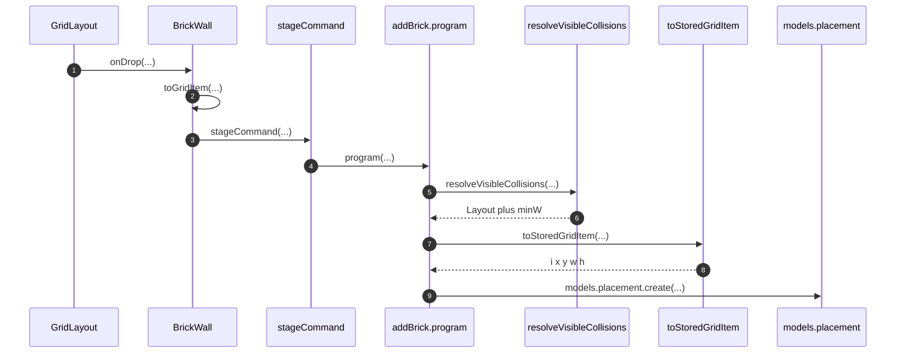
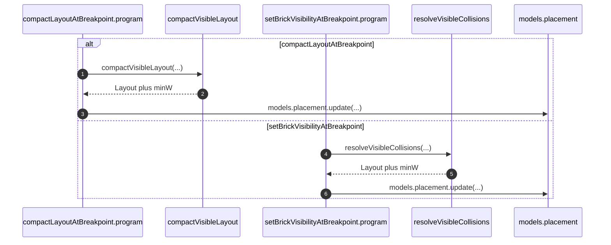

# Library placement gridItem

`placement.gridItem` is JSON `{ i, x, y, w, h }`. react-grid-layout
`cloneLayoutItem` / `cloneLayout` add `minW` and other extras that placement
create/update reject. [`readGridItem`](../../../apps/library/lib/readGridItem.ts)
decodes the column. [`toStoredGridItem`](../../../apps/library/makeLibraryFrontend/contracts/addBrick/AddBrickContractV1.ts)
picks the five stored fields before write. Brick drop ownership is
[LibraryBrickDrop](LibraryBrickDrop.md).

## Trigger

1. Render and command-payload assembly decode `placement.gridItem` with
   `readGridItem`.
   1. [`BrickWall`](../../../apps/library/lib/BrickWall.tsx) builds the RGL
      `layout` and `otherBreakpointVisibleLayouts`.
   2. [`Layout.tsx`](../../../apps/library/app/Layout.tsx) builds
      `compactLayoutAtBreakpoint.visibleLayout`.
   3. [`$brickId.tsx`](../../../apps/library/app/routes/bricks/$brickId.tsx)
      builds `savedGridItem` and `otherVisibleLayout`.
2. Contract programs write `gridItem` on placement create/update.
   1. `addBrick` strips with local `toStoredGridItem`.
   2. `updateLayoutAtBreakpoint`, `setBrickVisibilityAtBreakpoint`, and
      `compactLayoutAtBreakpoint` still `structuredClone` the layout item.

## Annotated workflow steps

1. `visibleLayoutAt` decodes each visible placement column before the item
   reaches RGL or another command payload.
   - [`BrickWall.tsx:100-111`](../../../apps/library/lib/BrickWall.tsx#L100-L111) — `readGridItem(placement.gridItem)` for the current and other breakpoints. (`apps/library/lib/BrickWall.tsx:100-111`)
   - [`readGridItem.ts:11-15`](../../../apps/library/lib/readGridItem.ts#L11-L15) — JSON-parse a string column, then `Schema.decodeUnknownSync` of `{ i, x, y, w, h }`. (`apps/library/lib/readGridItem.ts:11-15`)
   - [`Layout.tsx:316-326`](../../../apps/library/app/Layout.tsx#L316-L326) — compact payload uses `readGridItem` without a second pick. (`apps/library/app/Layout.tsx:316-326`)
   - [`$brickId.tsx:112`](../../../apps/library/app/routes/bricks/$brickId.tsx#L112) — visibility payload `savedGridItem`. (`apps/library/app/routes/bricks/$brickId.tsx:112`)
   - [`$brickId.tsx:217-226`](../../../apps/library/app/routes/bricks/$brickId.tsx#L217-L226) — visibility payload `otherVisibleLayout`. (`apps/library/app/routes/bricks/$brickId.tsx:217-226`)
2. Decode output is the five stored fields; extras on the column fail the
   schema.
   - [`readGridItem.ts:3-9`](../../../apps/library/lib/readGridItem.ts#L3-L9) — `GridItemSchema` matches the placement column schema. (`apps/library/lib/readGridItem.ts:3-9`)
   - [`placementModelV1.ts:8-14`](../../../apps/library/makeLibraryFrontend/models/placement/placementModelV1.ts#L8-L14) — stored `gridItem` schema is the same five fields. (`apps/library/makeLibraryFrontend/models/placement/placementModelV1.ts:8-14`)
   - [`placementModelV1.ts:36`](../../../apps/library/makeLibraryFrontend/models/placement/placementModelV1.ts#L36) — `primitives.json({ schema: gridItemSchema })` rejects excess properties. (`apps/library/makeLibraryFrontend/models/placement/placementModelV1.ts:36`)
3. BrickWall picks the same five fields again so RGL `isDraggable` /
   `isResizable` spreads do not leak into command payloads.
   - [`BrickWall.tsx:15-23`](../../../apps/library/lib/BrickWall.tsx#L15-L23) — local `toGridItem` returns `{ i, x, y, w, h }`. (`apps/library/lib/BrickWall.tsx:15-23`)
   - [`BrickWall.tsx:140-144`](../../../apps/library/lib/BrickWall.tsx#L140-L144) — render layout remaps `toGridItem` results with drag/resize flags. (`apps/library/lib/BrickWall.tsx:140-144`)
   - [`BrickWall.tsx:167`](../../../apps/library/lib/BrickWall.tsx#L167) — resize payload `layout: nextLayout.map(toGridItem)`. (`apps/library/lib/BrickWall.tsx:167`)
   - [`BrickWall.tsx:210-214`](../../../apps/library/lib/BrickWall.tsx#L210-L214) — drop payload strips neighbor RGL extras. (`apps/library/lib/BrickWall.tsx:210-214`)
   - [`BrickWall.tsx:319`](../../../apps/library/lib/BrickWall.tsx#L319) — drag-stop payload uses the same pick. (`apps/library/lib/BrickWall.tsx:319`)
4. RGL receives the picked items and later returns `LayoutItem`s that include
   library extras (`minW`, static flags).
   - [`BrickWall.tsx:137-154`](../../../apps/library/lib/BrickWall.tsx#L137-L154) — `GridLayout` with `noCompactor` and the decoded layout. (`apps/library/lib/BrickWall.tsx:137-154`)

## Annotated workflow steps

1. Drop supplies the placeholder item plus `nextLayout` from RGL.
   - [`BrickWall.tsx:186-209`](../../../apps/library/lib/BrickWall.tsx#L186-L209) — `droppedItem` is built from `item.x/y/w/h` and the new `brickId`. (`apps/library/lib/BrickWall.tsx:186-209`)
2. Neighbors in `resolvedActiveLayout` are picked before `stageCommand`; other
   breakpoint layouts come from `visibleLayoutAt` (already decoded).
   - [`BrickWall.tsx:210-221`](../../../apps/library/lib/BrickWall.tsx#L210-L221) — `toGridItem` on `nextLayout` neighbors; `visibleLayoutAt` for `sm`/`md`/`lg`/`xl`. (`apps/library/lib/BrickWall.tsx:210-221`)
3. `addBrick` is the only contract that currently strips on write.
   - [`BrickWall.tsx:223-236`](../../../apps/library/lib/BrickWall.tsx#L223-L236) — `stageCommand({ contractName: "addBrick", payload })`. (`apps/library/lib/BrickWall.tsx:223-236`)
4. The contract program writes four placements (one per breakpoint).
   - [`AddBrickContractV1.ts:377-388`](../../../apps/library/makeLibraryFrontend/contracts/addBrick/AddBrickContractV1.ts#L377-L388) — active breakpoint uses `payload.resolvedActiveLayout`; others call `resolveVisibleCollisions`. (`apps/library/makeLibraryFrontend/contracts/addBrick/AddBrickContractV1.ts:377-388`)
5. Collision resolve clones through RGL, which reintroduces extras on every
   item in that layout.
   - [`resolveVisibleCollisions.ts:18-21`](../../../apps/library/makeLibraryFrontend/resolveVisibleCollisions.ts#L18-L21) — `cloneLayout` of neighbors and `cloneLayoutItem` of the incoming item. (`apps/library/makeLibraryFrontend/resolveVisibleCollisions.ts:18-21`)
   - [`AddBrickContractV1.ts:383-387`](../../../apps/library/makeLibraryFrontend/contracts/addBrick/AddBrickContractV1.ts#L383-L387) — `incoming: cloneLayoutItem(payload.droppedItem)`. (`apps/library/makeLibraryFrontend/contracts/addBrick/AddBrickContractV1.ts:383-387`)
6. The cloned layout is the value that must not be written raw.
   - [`resolveVisibleCollisions.ts:26-49`](../../../apps/library/makeLibraryFrontend/resolveVisibleCollisions.ts#L26-L49) — `correctBounds` then `moveElementAwayFromCollision` until clear. (`apps/library/makeLibraryFrontend/resolveVisibleCollisions.ts:26-49`)
7. `toStoredGridItem` picks `{ i, x, y, w, h }` off each resolved item,
   including the active-breakpoint payload items.
   - [`AddBrickContractV1.ts:35-43`](../../../apps/library/makeLibraryFrontend/contracts/addBrick/AddBrickContractV1.ts#L35-L43) — local five-field return. (`apps/library/makeLibraryFrontend/contracts/addBrick/AddBrickContractV1.ts:35-43`)
8. Placement mutations receive only the stored shape.
   - [`AddBrickContractV1.ts:402`](../../../apps/library/makeLibraryFrontend/contracts/addBrick/AddBrickContractV1.ts#L402) — create `gridItem: toStoredGridItem(item)`. (`apps/library/makeLibraryFrontend/contracts/addBrick/AddBrickContractV1.ts:402`)
   - [`AddBrickContractV1.ts:419`](../../../apps/library/makeLibraryFrontend/contracts/addBrick/AddBrickContractV1.ts#L419) — neighbor update `gridItem: toStoredGridItem(item)`. (`apps/library/makeLibraryFrontend/contracts/addBrick/AddBrickContractV1.ts:419`)
9. Create/update decode `gridItem` with the placement schema; extras are a
   terminal mutation failure.
   - [`placementModelV1.ts:36`](../../../apps/library/makeLibraryFrontend/models/placement/placementModelV1.ts#L36) — JSON column schema is the five-field struct. (`apps/library/makeLibraryFrontend/models/placement/placementModelV1.ts:36`)
   - [`AddBrickContractV1.ts:391-407`](../../../apps/library/makeLibraryFrontend/contracts/addBrick/AddBrickContractV1.ts#L391-L407) — `models.placement.create` for the new brick at each breakpoint. (`apps/library/makeLibraryFrontend/contracts/addBrick/AddBrickContractV1.ts:391-407`)

## Annotated workflow steps

1. Compact runs RGL's vertical compactor on a cloned layout.
   - [`CompactLayoutAtBreakpointContractV1.ts:156`](../../../apps/library/makeLibraryFrontend/contracts/compactLayoutAtBreakpoint/CompactLayoutAtBreakpointContractV1.ts#L156) — `compactVisibleLayout(payload.visibleLayout)`. (`apps/library/makeLibraryFrontend/contracts/compactLayoutAtBreakpoint/CompactLayoutAtBreakpointContractV1.ts:156`)
   - [`resolveVisibleCollisions.ts:78-79`](../../../apps/library/makeLibraryFrontend/resolveVisibleCollisions.ts#L78-L79) — `verticalCompactor.compact(cloneLayout(layout), GRID_COLS)`. (`apps/library/makeLibraryFrontend/resolveVisibleCollisions.ts:78-79`)
2. `cloneLayout` copies RGL extras onto every compacted item.
   - [`resolveVisibleCollisions.ts:78-79`](../../../apps/library/makeLibraryFrontend/resolveVisibleCollisions.ts#L78-L79) — compact input is `cloneLayout(layout)`. (`apps/library/makeLibraryFrontend/resolveVisibleCollisions.ts:78-79`)
3. Compact writes `structuredClone(item)` — no `toStoredGridItem`.
   - [`CompactLayoutAtBreakpointContractV1.ts:158-170`](../../../apps/library/makeLibraryFrontend/contracts/compactLayoutAtBreakpoint/CompactLayoutAtBreakpointContractV1.ts#L158-L170) — `gridItem: structuredClone(item)` on each visible placement. (`apps/library/makeLibraryFrontend/contracts/compactLayoutAtBreakpoint/CompactLayoutAtBreakpointContractV1.ts:158-170`)
4. Showing a hidden brick resolves collisions the same way `addBrick` does
   for other breakpoints.
   - [`SetBrickVisibilityAtBreakpointContractV1.ts:241-244`](../../../apps/library/makeLibraryFrontend/contracts/setBrickVisibilityAtBreakpoint/SetBrickVisibilityAtBreakpointContractV1.ts#L241-L244) — `incoming: cloneLayoutItem(payload.savedGridItem)`. (`apps/library/makeLibraryFrontend/contracts/setBrickVisibilityAtBreakpoint/SetBrickVisibilityAtBreakpointContractV1.ts:241-244`)
5. That resolved layout again carries `minW`.
   - [`resolveVisibleCollisions.ts:18-21`](../../../apps/library/makeLibraryFrontend/resolveVisibleCollisions.ts#L18-L21) — `cloneLayoutItem` on the incoming item. (`apps/library/makeLibraryFrontend/resolveVisibleCollisions.ts:18-21`)
6. Visibility writes `structuredClone(item)` — no `toStoredGridItem`.
   - [`SetBrickVisibilityAtBreakpointContractV1.ts:247-278`](../../../apps/library/makeLibraryFrontend/contracts/setBrickVisibilityAtBreakpoint/SetBrickVisibilityAtBreakpointContractV1.ts#L247-L278) — show-path create/update `gridItem: structuredClone(item)`. (`apps/library/makeLibraryFrontend/contracts/setBrickVisibilityAtBreakpoint/SetBrickVisibilityAtBreakpointContractV1.ts:247-278`)
   - [`UpdateLayoutAtBreakpointContractV1.ts:154-167`](../../../apps/library/makeLibraryFrontend/contracts/updateLayoutAtBreakpoint/UpdateLayoutAtBreakpointContractV1.ts#L154-L167) — resize/drag also `structuredClone(item)` from `payload.layout`. (`apps/library/makeLibraryFrontend/contracts/updateLayoutAtBreakpoint/UpdateLayoutAtBreakpointContractV1.ts:154-167`)

## Callers

| Direction | Symbol | Owner |
| --- | --- | --- |
| column → five fields | `readGridItem` | [`lib/readGridItem.ts`](../../../apps/library/lib/readGridItem.ts); re-export [`app/readGridItem.ts`](../../../apps/library/app/readGridItem.ts) |
| RGL item → five fields (UI payload) | `toGridItem` | local in [`BrickWall.tsx`](../../../apps/library/lib/BrickWall.tsx) |
| RGL item → five fields (placement write) | `toStoredGridItem` | local in [`AddBrickContractV1.ts`](../../../apps/library/makeLibraryFrontend/contracts/addBrick/AddBrickContractV1.ts) only |

`updateLayoutAtBreakpoint` payload items are already `toGridItem`'d by
BrickWall. Compact and show-visibility reintroduce extras *after* payload
decode, so those writes are the ones that still need the same strip as
`addBrick`.
