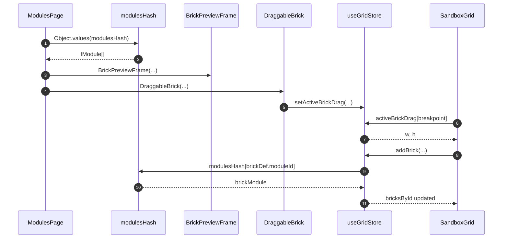

# Library sandbox brick preview and drop

Workbench `/` lists every [`IModule`](../../../apps/library/types.ts) from [`modulesHash`](../../../apps/library/modulesHash.ts), sizes a preview, and copies a def into [`useGridStore`](../../../apps/library/app/useGridStore.ts) on native drag. [`SandboxGrid`](../../../apps/library/app/SandboxGrid.tsx) sizes the drop placeholder from that store and calls `addBrick`. Identity lookup is [`BrickModule`](../BrickModule.md).

## Trigger

1. [`SandboxLayout`](../../../apps/library/app/routes/SandboxLayout.tsx) renders the drawer `Outlet` (index [`ModulesPage`](../../../apps/library/app/routes/ModulesPage.tsx)) beside [`SandboxGrid`](../../../apps/library/app/SandboxGrid.tsx).
2. The user drags a filmstrip preview onto the grid.

## Annotated workflow steps

1. The filmstrip reads the hash as an array of modules.
   - [`ModulesPage.tsx:10-17`](../../../apps/library/app/routes/ModulesPage.tsx#L10-L17) — `Object.values(modulesHash)` then `modules.map((brickModule) => ...)`. (`apps/library/app/routes/ModulesPage.tsx:10-17`)
2. Each entry is a full `IModule` (`def`, `component`, `defaultData`).
   - [`modulesHash.ts:14-26`](../../../apps/library/modulesHash.ts#L14-L26) — kebab keys to assembler results. (`apps/library/modulesHash.ts:14-26`)
3. Preview size is `round(gridWidth / 8 * w)` by `round(gridWidth / 8 * h)`.
   - [`ModulesPage.tsx:36`](../../../apps/library/app/routes/ModulesPage.tsx#L36) — `BrickPreviewFrame w={def[breakpoint].w} h={def[breakpoint].h}`. (`apps/library/app/routes/ModulesPage.tsx:36`)
   - [`BrickPreviewFrame.tsx:13-16`](../../../apps/library/components/brick/BrickPreviewFrame.tsx#L13-L16) — whole-pixel width/height from `useBrickBreakpoint().gridWidth`. (`apps/library/components/brick/BrickPreviewFrame.tsx:13-16`)
4. The preview surface is a native drag source carrying `brickModule.def`.
   - [`ModulesPage.tsx:37-43`](../../../apps/library/app/routes/ModulesPage.tsx#L37-L43) — `DraggableBrick brickDef={def}` wrapping `BrickComponent` with `data={def.data}`. (`apps/library/app/routes/ModulesPage.tsx:37-43`)
5. Drag start clones the def into Zustand and sets `text/plain` to `moduleId`.
   - [`DraggableBrick.tsx:22-35`](../../../apps/library/app/DraggableBrick.tsx#L22-L35) — `setActiveBrickDrag(structuredClone(brickDef))`, drag image, `effectAllowed = "copy"`. (`apps/library/app/DraggableBrick.tsx:22-35`)
6. Grid drop-over reads the in-flight def at the measured breakpoint.
   - [`SandboxGrid.tsx:88-93`](../../../apps/library/app/SandboxGrid.tsx#L88-L93) — `onDragOver` returns false without `activeBrickDrag`, else `{ w, h }` from `activeBrickDrag[breakpoint]`. (`apps/library/app/SandboxGrid.tsx:88-93`)
7. Those numbers are the placeholder size.
   - [`SandboxGrid.tsx:93`](../../../apps/library/app/SandboxGrid.tsx#L93) — `return { w: activeBrickDrag[breakpoint].w, h: activeBrickDrag[breakpoint].h }`. (`apps/library/app/SandboxGrid.tsx:93`)
8. Drop allocates a brick id and calls `addBrick`.
   - [`SandboxGrid.tsx:95-113`](../../../apps/library/app/SandboxGrid.tsx#L95-L113) — `crypto.randomUUID()`, rewrite dropped `i`/`w`/`h`, `addBrick(...)`, then `setActiveBrickDrag(null)`. (`apps/library/app/SandboxGrid.tsx:95-113`)
9. Persist looks up the module again for options defaults.
   - [`useGridStore.ts:70-78`](../../../apps/library/app/useGridStore.ts#L70-L78) — `brickModule = modulesHash[brickDef.moduleId]` then `brickModule?.component.options.decode(...)`. (`apps/library/app/useGridStore.ts:70-78`)
10. Missing hash yields empty options `{}`.
    - [`useGridStore.ts:74-78`](../../../apps/library/app/useGridStore.ts#L74-L78) — optional chain; no options config becomes `{}`. (`apps/library/app/useGridStore.ts:74-78`)
11. The store writes `bricksById[brickId]` (`moduleId`, `data`, `sm` placement, optional explicit breakpoint) and runs `setLayout`.
    - [`useGridStore.ts:79-101`](../../../apps/library/app/useGridStore.ts#L79-L101) — `set` of the placed brick then `useGridStore.getState().setLayout(layout, breakpoint)`. (`apps/library/app/useGridStore.ts:79-101`)
