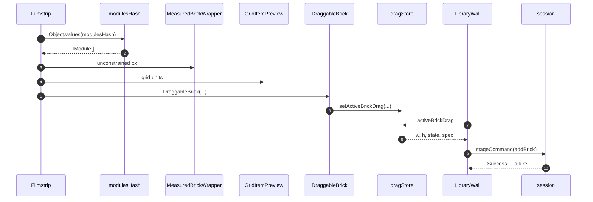

# Library sandbox brick preview and drop

Workbench filmstrip previews size bricks and copy a drag payload into Zustand
(`activeBrickDrag` only). [`LibraryWall`](../../../apps/library/app/LibraryWall.tsx)
reads committed wall data through Zerospin live queries and submits `addBrick`.
Studio continues to use exported [`BrickWall`](../../../apps/library/lib/BrickWall.tsx)
+ Zustand and is outside this path. Identity lookup is [`BrickModule`](../BrickModule.md).

## Trigger

1. [`Layout`](../../../apps/library/app/Layout.tsx) mounts `LibrarySandboxProvider`
   (mock session + seeded empty wall), then the drawer outlet beside `LibraryWall`.
2. The user drags a filmstrip preview onto the grid.

```mermaid
sequenceDiagram
  participant Filmstrip
  participant modulesHash
  participant MeasuredBrickWrapper
  participant GridItemPreview
  participant DraggableBrick
  participant dragStore
  participant LibraryWall
  participant session

  autonumber 1
  Filmstrip->>modulesHash: Object.values(modulesHash)
  autonumber 2
  modulesHash-->>Filmstrip: IModule[]
  autonumber 3
  Filmstrip->>MeasuredBrickWrapper: unconstrained px
  autonumber 4
  Filmstrip->>GridItemPreview: grid units
  autonumber 5
  Filmstrip->>DraggableBrick: DraggableBrick(...)
  autonumber 6
  DraggableBrick->>dragStore: setActiveBrickDrag(...)
  autonumber 7
  LibraryWall->>dragStore: activeBrickDrag
  autonumber 8
  dragStore-->>LibraryWall: w, h, state, spec
  autonumber 9
  LibraryWall->>session: stageCommand(addBrick)
  autonumber 10
  session-->>LibraryWall: Success | Failure
```

## Annotated workflow steps

1. The filmstrip reads the hash as an array of modules.
   - [`modulesHash.ts:14-26`](../../../apps/library/lib/modulesHash.ts#L14-L26) — kebab keys to assembler results.
2. Preview measurement uses unconstrained intrinsic px → grid units via `gridItemWidth`.
   - [`MeasuredBrickWrapper.tsx`](../../../apps/library/components/brick/MeasuredBrickWrapper.tsx) — max-content box, no `@container`, `onChange({ widthPx, heightPx })`.
   - [`GridItemPreview.tsx`](../../../apps/library/lib/GridItemPreview.tsx) — snapped px from `BREAKPOINTS[].gridItemWidth * w/h`, wraps `BrickWrapper`.
   - [`breakpoints.ts`](../../../apps/library/lib/breakpoints.ts) — `minGridUnits`.
3. Drag start clones `{ moduleId, state, spec, w, h }` into the drag store only.
   - [`DraggableBrick.tsx:22-35`](../../../apps/library/app/DraggableBrick.tsx#L22-L35) — `setActiveBrickDrag(structuredClone(brickDef))`.
4. Drop placeholder size comes from the flat drag payload `w` / `h`.
   - [`LibraryWall.tsx`](../../../apps/library/app/LibraryWall.tsx) — `onDragOver` returns `{ w, h }` from `activeBrickDrag`.
5. Drop allocates a `brickId`, then runs `addBrick`.
   - [`AddBrickContractV1.ts`](../../../apps/library/aggregates/library/contracts/addBrick/AddBrickContractV1.ts) — payload includes wall, brick, module id, state/spec, resolved active layout, and other-breakpoint visible layouts.
6. The command creates one brick and four visible placements; neighbors at other breakpoints are collision-resolved without compaction.
7. Live queries refresh `LibraryWall`; committed Zustand `bricksById` is not used on the sandbox path.
8. Reset remounts `LibrarySandboxProvider` with a fresh empty-wall seed; viewport preference may persist separately.

Studio’s `BrickWall` / `GridStore` exports and props are unchanged and still
auto-compact via `verticalCompactor`.
