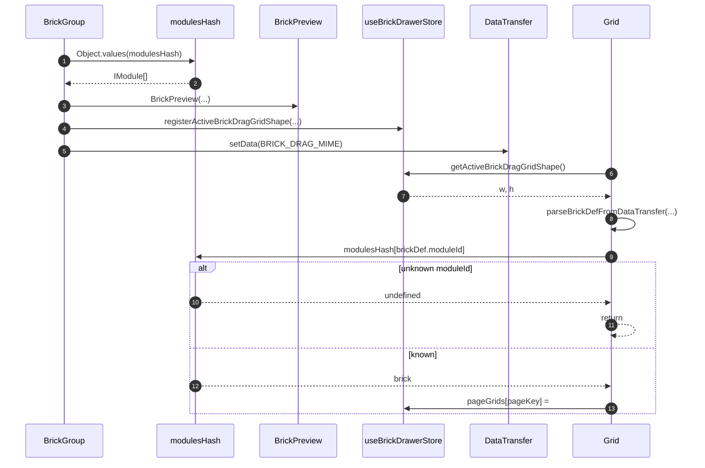

# Site editor brick preview and drop

The site-editor bricks drawer lists [`modulesHash`](../../../apps/library/lib/modulesHash.ts) and starts a native drag with [`BRICK_DRAG_MIME`](../../../apps/studio/components/home/useBrickDrawerStore.ts). [`Grid`](../../../apps/studio/app/[username]/site/[siteId]/page/[pageId]/Grid.tsx) sizes the placeholder from Zustand (custom MIME is often blank during `dragover`) and on drop decodes the def, looks up `modulesHash[moduleId]`, and writes `pageGrids`. Catalog lookup is [`BrickModule`](../BrickModule.md).

## Trigger

1. The editor page drawer renders [`BrickGroup`](../../../apps/studio/app/[username]/site/[siteId]/page/[pageId]/BrickGroup/BrickGroup.tsx).
2. The user drags a module preview onto [`Grid`](../../../apps/studio/app/[username]/site/[siteId]/page/[pageId]/Grid.tsx).

## Annotated workflow steps

1. The drawer enumerates every library module.
   - [`BrickGroup.tsx:26-56`](../../../apps/studio/app/[username]/site/[siteId]/page/[pageId]/BrickGroup/BrickGroup.tsx#L26-56) — `Object.values(modulesHash)` then `modules.map((brickModule) => ...)`. (`apps/studio/app/[username]/site/[siteId]/page/[pageId]/BrickGroup/BrickGroup.tsx:26-56`)
2. Each row is an `IModule` (`def`, `component`, `defaultData`).
   - [`modulesHash.ts:14-26`](../../../apps/library/lib/modulesHash.ts#L14-L26) — kebab keys imported by `@qrk.sh/library`. (`apps/library/lib/modulesHash.ts:14-26`)
3. Preview size uses `BREAKPOINTS[].gridItemWidth` and `brickModule.def[breakpoint]`.
   - [`BrickGroup.tsx:59-77`](../../../apps/studio/app/[username]/site/[siteId]/page/[pageId]/BrickGroup/BrickGroup.tsx#L59-77) — `w`/`h` from `selectedBrick.def[breakpoint]`, then `BrickPreview`. (`apps/studio/app/[username]/site/[siteId]/page/[pageId]/BrickGroup/BrickGroup.tsx:59-77`)
   - [`BrickPreview.tsx`](../../../apps/library/lib/BrickPreview.tsx) — `gridItemWidth * w|h`.
4. Drag start registers breakpoint `w`/`h` for drop-over (custom MIME is often empty until drop).
   - [`BrickGroup.tsx:84-85`](../../../apps/studio/app/[username]/site/[siteId]/page/[pageId]/BrickGroup/BrickGroup.tsx#L84-L85) — `registerActiveBrickDragGridShape(w, h)`. (`apps/studio/app/[username]/site/[siteId]/page/[pageId]/BrickGroup/BrickGroup.tsx:84-85`)
   - [`useBrickDrawerStore.ts:18-27`](../../../apps/studio/components/home/useBrickDrawerStore.ts#L18-L27) — store setter and `getActiveBrickDragGridShape()`. (`apps/studio/components/home/useBrickDrawerStore.ts:18-27`)
5. The same handler writes `application/x-qrk-brick-def` JSON of `selectedBrick.def`.
   - [`BrickGroup.tsx:86-91`](../../../apps/studio/app/[username]/site/[siteId]/page/[pageId]/BrickGroup/BrickGroup.tsx#L86-L91) — `setData(BRICK_DRAG_MIME, JSON.stringify(selectedBrick.def))`. (`apps/studio/app/[username]/site/[siteId]/page/[pageId]/BrickGroup/BrickGroup.tsx:86-91`)
6. Grid drop-over reads the registered shape, not `getData`.
   - [`Grid.tsx:107-110`](../../../apps/studio/app/[username]/site/[siteId]/page/[pageId]/Grid.tsx#L107-110) — `onDragOver: () => getActiveBrickDragGridShape() ?? false`. (`apps/studio/app/[username]/site/[siteId]/page/[pageId]/Grid.tsx:107-110`)
7. A missing registration disables the placeholder (`false`).
   - [`useBrickDrawerStore.ts:26-27`](../../../apps/studio/components/home/useBrickDrawerStore.ts#L26-27) — `getActiveBrickDragGridShape` returns the stored `{ w, h }` or `null`. (`apps/studio/components/home/useBrickDrawerStore.ts:26-27`)
8. Drop decodes the MIME payload as `IModuleBrickDef`.
   - [`Grid.tsx:112-117`](../../../apps/studio/app/[username]/site/[siteId]/page/[pageId]/Grid.tsx#L112-L117) — `parseBrickDefFromDataTransfer` then `unregisterActiveBrickDragGridShape()`. (`apps/studio/app/[username]/site/[siteId]/page/[pageId]/Grid.tsx:112-117`)
   - [`useBrickDrawerStore.ts:42-56`](../../../apps/studio/components/home/useBrickDrawerStore.ts#L42-L56) — `Schema.decodeUnknownResult`; failure returns `null`. (`apps/studio/components/home/useBrickDrawerStore.ts:42-56`)
9. Drop looks up `modulesHash[brickDef.moduleId]`.
   - [`Grid.tsx:117-119`](../../../apps/studio/app/[username]/site/[siteId]/page/[pageId]/Grid.tsx#L117-L119) — `if (!item || !brickDef) return` then `const brick = modulesHash[brickDef.moduleId]`. (`apps/studio/app/[username]/site/[siteId]/page/[pageId]/Grid.tsx:117-119`)
10. Unknown `moduleId` is `undefined`.
    - [`Grid.tsx:119`](../../../apps/studio/app/[username]/site/[siteId]/page/[pageId]/Grid.tsx#L119) — `if (!brick) return`. (`apps/studio/app/[username]/site/[siteId]/page/[pageId]/Grid.tsx:119`)
11. The handler returns without writing `pageGrids`.
    - [`Grid.tsx:119`](../../../apps/studio/app/[username]/site/[siteId]/page/[pageId]/Grid.tsx#L119) — early `return`. (`apps/studio/app/[username]/site/[siteId]/page/[pageId]/Grid.tsx:119`)
12. A hit is the live `IModule` (`def` + `component`).
    - [`Grid.tsx:118`](../../../apps/studio/app/[username]/site/[siteId]/page/[pageId]/Grid.tsx#L118) — `modulesHash[brickDef.moduleId]`. (`apps/studio/app/[username]/site/[siteId]/page/[pageId]/Grid.tsx:118`)
13. The grid stores layout plus `brick.def` under a new `brickId`.
    - [`Grid.tsx:120-142`](../../../apps/studio/app/[username]/site/[siteId]/page/[pageId]/Grid.tsx#L120-L142) — `crypto.randomUUID()`, size from `brick.def[breakpoint]`, `pageGrids[pageKey]`. (`apps/studio/app/[username]/site/[siteId]/page/[pageId]/Grid.tsx:120-142`)
    - [`Grid.tsx:162-192`](../../../apps/studio/app/[username]/site/[siteId]/page/[pageId]/Grid.tsx#L162-L192) — placed cells resolve `modulesHash[brickDef.moduleId]` again to render `BrickComponent`. (`apps/studio/app/[username]/site/[siteId]/page/[pageId]/Grid.tsx:162-192`)
